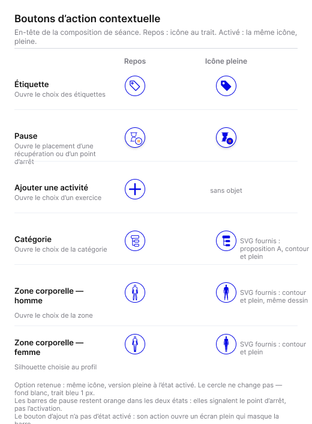
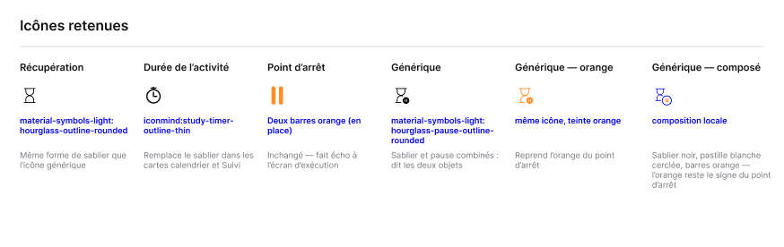

# DSF — Pauses, icônes et symboles — 07/10/2026

Complète [DSF Cadence](DSF-CADENCE-2026-10-06.md), avec priorité sur ses prescriptions incompatibles. Figma : G6RY5Ebhgwb4AHIOYDwwvg. Règles métier : [consolidation](Specifications-fonctionnelles/SPECIFICATION-PAUSES-SYMBOLES-2026-10-07.md). Les shells, Safe Areas, cibles tactiles et animations d’appui existants sont conservés.

## États des actions contextuelles

Repos : icône au trait bleu ; activé : même dessin plein bleu. Le cercle conserve fond blanc et contour fin ; ni fond bleu, ni contour épaissi, ni fond pâle. Activé signifie que le panneau/la fonction contextuelle correspondant est ouvert ; ce n’est ni l’état pressé de l’animation ni la simple existence d’une valeur métier. Les états désactivés restent distincts. Le + n’a pas d’état activé.

La planche 7245:13718 est la référence visuelle. Le prompt révisé confirme que les cellules repos utilisent les SVG fournis ; la réserve précédente est levée. Les FRAME de la planche ne prouvent pas l’existence de composants réutilisables : leur promotion et leur raccordement restent un lot Figma distinct.

## Familles et variantes cibles

| Famille | Variantes | Source |
|---|---|---|
| Étiquette | Repos/Activé | bi:tag / bi:tag-fill |
| Catégorie | Repos/Activé | PropositionA contour/plein fournie |
| Zone corporelle | Homme/Femme × Repos/Activé | Silhouettes fournies ; choix Profil, homme si non renseigné |
| Sablier | Repos/Activé | material-symbols-light:hourglass-outline-rounded / hourglass-rounded |
| Pause générique | Repos/Activé/Repos sur fond bleu | Composition sablier et pastille pause |
| Chronomètre | Rôle durée carte | iconmind:study-timer-outline-thin |
| Action contextuelle | Type icône × état applicable | Composant de bouton réutilisable à promouvoir |

Le set historique icon/zone-corporelle existe ; le faire évoluer plutôt que créer un doublon. Valeur modifiable6944:26423 a déjà4 variantes Texte13/14×Normal/Grisé ; Roulette5544:5146 a déjà4 variantes dont Secondes avec unité7130:13496 (330×150). Aucun de ces composants n’est à recréer.

[Planche des icônes — source Figma](https://www.figma.com/design/G6RY5Ebhgwb4AHIOYDwwvg?node-id=7174-13554)

Capture reprise lors du lot Bip :

Cette planche conserve des explorations et annotations anciennes (dont sablier noir) ; la composition bleue/orange de la planche des états et les règles suivantes définissent la cible.

## Géométrie et tokens par rôle

| Rôle | Prescription |
|---|---|
| Nature de carte | #14141A |
| Catégorie et chronomètre de carte | #9499A8, VariableID:6754:11533 |
| Texte de durée | #595E66 |
| Icône contextuelle | #0508E5 |
| Barres de la pause composée | #FF8D28 ; rôle dédié, ne remplace pas globalement breakpoint#ED7314 |
| Chronomètre |16×16, trait0,9 ; six instances7192:13800/13806/13812/13818/13824/13830 contrôlées |
| Récupération en Composition | Sablier13px |
| Silhouette contour | Stroke0,8 bleu, aucun fill ; silhouette pleine remplie |
| SVG source | viewBox0 0 24 24 ; préserver evenodd/nonzero ; nettoyer métadonnées à l’export |

Pause composée sur grille24 : sablier20×20 à(0,1), halo blanc14×14 centré(18,18), pastille blanche11×11 contour bleu1, deux barres orange1,4×4,6/r0,7/écart2,2. Halo maintient l’espace blanc entre traits ; centrage optique contrôlé. Effets du conteneur vides, pas de DROP_SHADOW orange. Traits blancs uniquement dans la variante de placement sur fond bleu.

Les SVG originaux ne sont pas joints au lot documentaire ; aucune disponibilité de nouveaux assets applicatifs ni mise à jour du manifeste runtime n’est déclarée. Inventaire, provenance, viewBox, variantes et mapping des rôles doivent accompagner le futur export.

## Layout de Composition et paramètres

Placement : deux blocs de même largeur et marges latérales alignées aux cartes ; mise en évidence des positions autorisées, trait de démarcation absent. Hors placement : trait conservé indépendamment du contenu récupération/point. Captures susceptibles d’écart sur ce trait explicitement qualifiées au chapitre06.

Les hiérarchies déjà définies restent : groupe36px, dépendance52px sur largeur402, valeurs à droite, séparateur314px à l’aplomb du texte suivant, barre au-dessus de Séries. Roulette dans le flux sous le champ ; bords des séries variables non masqués par steppers/séparateurs. Ne pas déduire une interaction d’un élément parasite retiré du dessin.

Phrase unique Inter13/20, largeur324 à402, hauteur adaptée ; valeurs en gras, pas de fond gris. Durée sur dernière ligne du bloc, sans espacement supplémentaire ; éviter virgule seule en début de ligne. Les comptes de caractères sont des témoins d’encombrement, jamais un maximum produit ni une hauteur fixe192px.

## Vérifications et dette restante

Boutons locaux à componentiser ; contrôler layoutMode, centrage et liaisons aux tokens. Carte séance, Carte exercice et Ressenti hors DSF ne sont pas déclarés promus par ce lot. Aucune obligation de trois nouvelles maquettes d’exécution : shell existant réutilisé. Le Bip de cadence est désactivé en ramenant son stepper à0, affiché Aucun ; aucune nouvelle commande inventée.

**Complément courant cartes :** [durée sans cadre, propriété Durée et géométrie](DSF-CARTES-DUREE-2026-10-07.md). Les276 textes v14 et les segments `{texte, gras}` sont définis dans [Phrase v1 actualisée](Specifications-fonctionnelles/SPECIFICATION-PHRASE-PARAMETRES-EXECUTION-v1.md).
