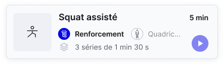
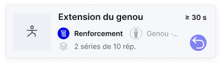
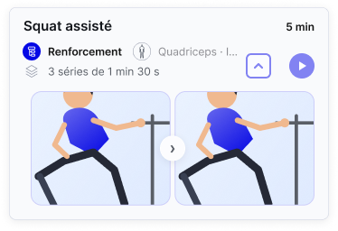
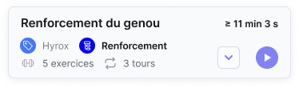
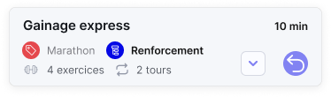
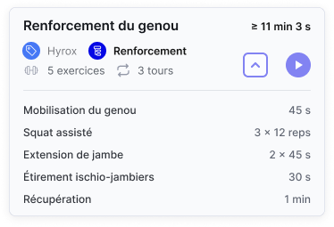

# Matrice de traçabilité — pauses, phrases v14 et cartes — 07/10/2026

Base contrôlée : PR323, commit37e372cd5b1b1ce73b7174449fbc2f3338d6347a ; main6d03f5be579f2d0e2e7602b6abf1c2b46f4c740b. Aucune fusion ni modification du code/Figma dans ce lot. Les sources originales sont [archivées](archives/cartes-phrases-v14-2026-10-07/README.md). Les décisions explicites du propriétaire priment sur les contradictions des prompts.

Références : **Bip**=[spécification](Specifications-fonctionnelles/SPECIFICATION-BIP-CADENCE-v2.md), **Paramètres**=[v13](Specifications-fonctionnelles/SPECIFICATION-PARAMETRES-MODALE-v13.md), **Phrase**=[v1 actualisée](Specifications-fonctionnelles/SPECIFICATION-PHRASE-PARAMETRES-EXECUTION-v1.md), **Cartes**=[DSF](DSF-CARTES-DUREE-2026-10-07.md), **Contrats**=[chapitre13](Specifications-fonctionnelles/13%20–%20Contrats%20d’écran.md), **Registre**=[chapitre07](Specifications-fonctionnelles/07%20–%20Registre%20des%20décisions%20de%20conception.md). « Traité » signifie documentation corrigée/recette prescrite, pas fonctionnalité développée.

## Exigences et traitement

| ID | Source / point | Report documentaire et contrôle | Statut |
|---|---|---|---|
| P01 | Utilisateur : pause après chaque série, même N1 | Bip§3 ; Paramètres§§4–5/9 ; modèles04/09, règles10, API11, exécution13 ; exemples45/315s | Traité |
| P02 | Utilisateur : dernière Pause retirée seulement si récupération suit | To=T−PN+R siR>0, sinonT ; composition, direct, API et progression ; retraitR rétablitPN | Traité |
| P03 | Utilisateur : pauses de série et de côté se cumulent | Bip§3 : frontière PN→PC ; paire selon ordre préexistant ; N1 normalisé | Traité |
| P04 | Utilisateur : terme pause après chaque série | Phrase§3 ; glossaire ; Paramètres ; Q-08 clos/D-315 | Traité |
| P05 | Utilisateur : Excelv14 et276 combinaisons | Corpus exact I4:I279 + gabarits : archives/cartes-phrases-v14-2026-10-07/phrases-276.json ; IDs1..276 contrôlés | Traité |
| P06 | Autorité des chiffres Figma | Bip / Phrase / Paramètres / Contrats : Figma layout seulement ; montants dessinés jamais oracles | Traité |
| P07 | Segments et gras | Phrase§2 ; API-PHRASE-01 ; modèles/architecture09/12 ; CE-T03-04 etCE-UI-10§5 ; valeurs identiques traitées séparément | Traité |
| P08 | Aucune phrase en base ; chaque affichage | Phrase§2 ;09/11/12 ; contrats§15 ; params seulement persistés, historique métier préservé | Traité |
| P09 | Internationalisation | Phrase§6 ; architecture 12 : français MVP, gabarits/pluriel/genre par locale, réécriture à planifier | Traité |
| B01 | Prompt Bip : champ transverse3 modes,0..10,Aucun | Bip§1 ; DSF Bip ; Paramètres§10 ; modales actuelles avec champ ;0/1/10 et invalides en recette | Conservé et vérifié |
| B02 | Bip ne pilote ni cadence réelle ni transition | Bip§4 : signal périodique ; Durée termine au minuteur, autres modes par action | Conservé |
| B03 | Durée exacte avec/sans bip | Bip§2 ; absence de symbole ; Carte/Contrats | Conservé |
| B04 | Répétitions :≈avec bip, omise sans bip | Bip§2 ; Phrase§4 ; Cartes ; captures 6419/7059 | Conservé |
| B05 | À l’échec : total omis avec/sans bip | Bip§2 ; Phrase§4 ; Cartes ; capture6419:10028 | Conservé ; libellé de carte corrigé et capture reprise |
| B06 | Séance exact/≈/≥ selon contenu | Bip§2–3 ; modèles/API et composition ; pauses connues incluses, aucune durée inventée | Conservé |
| B07 | Calcul pauses et récupération | Bip§3 ; Paramètres§5/9 ; répétitions4×15×4+4×15=300s | Corrigé |
| B08 | Inversion Durée et normalisation N1 | Paramètres§5 ; candidats sans+p artificiel ; recette bornes1..99 et égalitéhaut | Corrigé |
| B09 | Steppers tap/maintien/multiples et petites plages | Bip§6 ; DSF Bip ; ancienne grille de pas remplacée ; bornes horsBip conservées | Conservé et résidu corrigé |
| B10 | Hiérarchie/indentation/raccourcissement feuille | Bip§6 ; DSF Bip ; CE-UI-10 ; captures des modales renouvelées | Traité |
| B11 | Suppression ancienne rouletteCadence | 7061:13383 absente inventaire courant139 ; aucun nouveau chemin de navigation | Conservé |
| B12 | Propagation Figma annoncée19 écrans/15 steppers | Présence Bip confirmée sur24 frames ;19 manques du lot précédent désormais couverts ; captures reprises ; noms courants conservés | Vérifié sur fichier courant |
| B13 | Phrases modes 10/10b et longue 182 | 19 phrases corrigées par le propriétaire et relues ; vue longue renommée182 ; copies reprises ; aucun plafond de caractères | Captures actualisées |
| B14 | Persistance paramètre, migration et audio | Bip§§4/5/7 ; champs/migrationdéjàprescrits ; aucun numéroSQL inventé, qualification appareil non réalisée | Conservé |
| B15 | Contradictions internes du prompt Bip | n−1/v13 ignorés selon userv14 ; exemple3×90,p15,R30 corrigé330s ;≈4min45 statique nonnormatif | Traité explicitement |
| B16 | Phrases variables du prompt vs276 cas | Phrase§3 : pas de clausepause ajoutée auxvariables, ycompris À l’échec ; valeurs de calcul Excel exclues | Traité selon corpus |
| C01 | Durée sans fond/cadre/rayon/padding | Cartes§Durée ; six variantes inspectées, fills[]/padding0 ; captures composants | Traité et vérifié |
| C02 | Inter SemiBold12,#141414,alignementdroite | Cartes ; police/taille/RIGHT relus ; style prompt conservé | Traité |
| C03 | Position bordcarte16px, pas bordanciennecolonne | Cartes :354−338=16 ; variantes des2sets inspectées | Traité et vérifié |
| C04 | Portée replié/archivé/déployé | Cartes ;6 captures ; Exercice Déployé reste horsaccèsMVP | Traité |
| C05 | Propriété Durée sur2sets, défauttrue | 6214:7278 Durée#7344:0 et6214:7276 Durée#7344:11 relus ; champoptionnel, jamais0 de substitution | Traité et vérifié |
| C06 | Absence selon mode | Cartes/Bip/Contrats : omission Répétitions sans bip etÀ l’échec ; contexte sélection/Suivi conservé | Traité |
| C07 | Libellé à l’échec dans emplacement durée | Absence de libellé vérifiée sur3786:5093 ; nouvelle capture de la carte Étirement du quadriceps | Clos sur la référence contrôlée |
| C08 | Titre Exercice 250 / lignes basses 207 | Cartes, DSF antérieur RG6 etContrats ;x88, coupebas207 ; mesurer sur402 | Traité et vérifié |
| C09 | Coupes60/69/145 | Cartes : référenceligne basse 207, pas titre 250 ni carte354 ; contextepréservé | Traité |
| C10 | MargesSéance16/16,Exercice12/16 | Cartes ;asymétrieexplicitementconservée, aucun déplacementgouttière | Traité |
| C11 | Cinq composants obsolètes | Cartes liste5544:6324/6426/6430/6555/6954 ; pasderemiseàniveau ni suppression ; nombres d’instances du prompt datés | Traité, nettoyage séparé |
| C12 | Incidentcinq instances et méthode | Cartes§Méthode : propriété de composant, pas de reset global ; incidentobservé sans généralisation irréversibilité | Traité |
| C13 | Copiesécran/DSF/contrats | 66 écrans +6 composants exportés ; inventaire139 références ; contrôlesPNG/liens ; contrats21sections | Traité |
| T01 | Données/recette et identifiantsAPI | API-PHRASE-01 etAPI-PARAM-01 distinguent phrase/validation des anciensACT03/04 ; pas d’API applicative implémentée | Traité |
| T02 | Clôture / priorités et traçabilité | Registre D314–320 ;rapports précédents marqués historiques ; bilan/limites ci-dessous | Traité |

## Clôture des corrections signalées — 07/10, après retour du propriétaire

Le libellé « à l’échec » est désormais absent de l’emplacement de durée de la carte Étirement du quadriceps, Catalogue des Exercices — Liste3786:5093. Capture renouvelée. Les19 phrases de la liste fournie ont été relues dans Figma et leurs captures reprises, dont les deux résumés À l’échec variable. La vue7119:27855 s’appelle maintenant « Création activité — Phrase longue (182 caractères) » ; ce nom ne fixe aucune limite de longueur.

Les groupes « sans changement de côté », l’abréviation «15 rép. à4s» et l’énumération des pauses dans le scénario F/résumé17 ont été corrigés dans les phrases concernées. Ces constats rédactionnels sont clos. [Relevé précis des19 phrases et20 captures](CLOTURE-CAPTURES-PHRASES-2026-10-07.md).

La relecture ne transforme pas les chiffres illustratifs en tests de calcul. Les étiquettes distinctes du résumé, notamment « Durée » dans le parent derrière la modale6419:10028, restent visibles dans Figma ; leur harmonisation n’est pas incluse dans la correction des19 phrases. La capture les reproduit fidèlement sans créer de règle métier. Aucun audit global supplémentaire ni modification Figma par cet agent.

Les compteurs82/187 du prompt sont datés de sa rédaction ;38 frames du Prototype MVP portent des instances des sets actifs. Périmètres distincts.

## Contrats d’écran

30 contrats conservent chacun leurs21 rubriques renseignées. Tableau : rubriques retouchées spécifiquement dans ce lot ; les règles transverses et les formules propagées s’appliquent aussi aux autres contrats.

| Contrat | Rubriques amendées dans ce lot |
|---|---|
| CE-T03-01 | 9, 20, 21 |
| CE-T03-02 | 9, 20, 21 |
| CE-T03-03 | Relu structurellement ; aucune modification spécifique requise |
| CE-T03-04 | 5, 15, 20, 21 |
| CE-T03-05 | 9, 20, 21 |
| CE-T03-06 | Relu structurellement ; aucune modification spécifique requise |
| CE-T03-07 | 9, 21 |
| CE-T03-08 | 19, 21 |
| CE-T03-09 | 19, 21 |
| CE-T03-10 | 19, 21 |
| CE-T03-11 | 19, 21 |
| CE-T03-12 | 19, 21 |
| CE-T03-13 | 19, 21 |
| CE-T03-14 | Relu structurellement ; aucune modification spécifique requise |
| CE-T03-15 | 9, 21 |
| CE-T03-16 | Relu structurellement ; aucune modification spécifique requise |
| CE-T03-17 | Relu structurellement ; aucune modification spécifique requise |
| CE-MEDIA-EXEC-01 | Relu structurellement ; aucune modification spécifique requise |
| CE-MEDIA-EXEC-02 | Relu structurellement ; aucune modification spécifique requise |
| CE-UI-01 | Relu structurellement ; aucune modification spécifique requise |
| CE-UI-02 | 9, 21 |
| CE-UI-03 | 9, 21 |
| CE-UI-04 | 9, 21 |
| CE-UI-05 | 9, 21 |
| CE-UI-06 | Relu structurellement ; aucune modification spécifique requise |
| CE-UI-07 | Relu structurellement ; aucune modification spécifique requise |
| CE-EXEC-SESSION-01 | 19, 21 |
| CE-UI-08 | Relu structurellement ; aucune modification spécifique requise |
| CE-UI-09 | Relu structurellement ; aucune modification spécifique requise |
| CE-UI-10 | 5, 15, 20, 21 |

## Inventaire des copies d’écrans

139 références actives du Prototype MVP. Premier lot :66 réexportées,73 conservées ; ce complément renouvelle20 captures dont certaines déjà reprises. La provenance de chaque ligne ci-dessous fait foi. Chaque référence dispose d’un PNG décodable. Les six composants ci-dessous sont ajoutés hors de ce décompte. Capture ne signifie pas conformité métier.

| Référence Figma | Contrat/rôle | Provenance | Image et SHA Git |
|---|---|---|---|
| [1992:375 — Profil — Vue d'ensemble - Vibration désactivée](https://www.figma.com/design/G6RY5Ebhgwb4AHIOYDwwvg?node-id=1992-375) | Profil ; CE-UI-07 / CE-UI-01 | Lot antérieur conservé | [PNG](Specifications-fonctionnelles/images/ecran-1-profil.png) ; `beee2cb93b19d0da4d67c6b606e92c7020a71be5` |
| [1992:469 — Splash — Kodjo](https://www.figma.com/design/G6RY5Ebhgwb4AHIOYDwwvg?node-id=1992-469) | Splash KODJO ; CE-UI-06 | Lot antérieur conservé | [PNG](Specifications-fonctionnelles/images/ecran-0-splash-kodjo.png) ; `6b0730794fa14d507a89d728c3ccf32d91cdd4e4` |
| [1992:474 — Profil — Stepper Pause changement de côté](https://www.figma.com/design/G6RY5Ebhgwb4AHIOYDwwvg?node-id=1992-474) | Profil ; CE-UI-07 / CE-UI-01 | Lot antérieur conservé | [PNG](Specifications-fonctionnelles/images/ecran-1c-profil-compte-rebours-ouvert.png) ; `15c89716c17d87f3edbdd1eeab6e39b34322cc0f` |
| [1992:579 — Profil — Stepper Récupération après activité](https://www.figma.com/design/G6RY5Ebhgwb4AHIOYDwwvg?node-id=1992-579) | Profil ; CE-UI-07 / CE-UI-01 | Lot antérieur conservé | [PNG](Specifications-fonctionnelles/images/ecran-1d-profil-fin-seance-ouverte.png) ; `7fee858844b2d1623090fa4a05cc90dc549ec50c` |
| [1992:684 — Profil — Vue d'ensemble - Vibration activée](https://www.figma.com/design/G6RY5Ebhgwb4AHIOYDwwvg?node-id=1992-684) | Profil ; CE-UI-07 / CE-UI-01 | Lot antérieur conservé | [PNG](Specifications-fonctionnelles/images/ecran-1b-profil-vibration-activee.png) ; `6581b6be08381a2517032db678ea70a818ea668c` |
| [1992:778 — Profil — Modifier le profil — MVP](https://www.figma.com/design/G6RY5Ebhgwb4AHIOYDwwvg?node-id=1992-778) | Profil ; CE-UI-07 / CE-UI-01 | Lot antérieur conservé | [PNG](Specifications-fonctionnelles/images/ecran-1a-modifier-profil.png) ; `d360b0ec3b609db5d58034f447d3034d91dcf391` |
| [1992:5101 — Calendrier — Semaine](https://www.figma.com/design/G6RY5Ebhgwb4AHIOYDwwvg?node-id=1992-5101) | Calendrier ; CE-UI-03 | Réexport07/10 — cartes/phrases | [PNG](Specifications-fonctionnelles/images/ecran-7a-calendrier-semaine.png) ; `5630439e71d4795496ae8fe4fdbbaf67c0735225` |
| [1992:5237 — Calendrier — Mois](https://www.figma.com/design/G6RY5Ebhgwb4AHIOYDwwvg?node-id=1992-5237) | Calendrier ; CE-UI-03 | Lot antérieur conservé | [PNG](Specifications-fonctionnelles/images/ecran-7b-calendrier-mois.png) ; `7f8e6d9871af3157b77c4f935a6fbc0126778766` |
| [1992:5365 — Modal — Supprimer une planification unique — Calendrier](https://www.figma.com/design/G6RY5Ebhgwb4AHIOYDwwvg?node-id=1992-5365) | Calendrier ; CE-UI-03 | Réexport07/10 — cartes/phrases | [PNG](Specifications-fonctionnelles/images/modale-4-suppression-planification-unique.png) ; `b4574858d07db7320a8f5e2d29358cdf7c55b673` |
| [1992:5510 — Calendrier — Jour — MVP](https://www.figma.com/design/G6RY5Ebhgwb4AHIOYDwwvg?node-id=1992-5510) | Calendrier ; CE-UI-02 | Réexport07/10 — cartes/phrases | [PNG](Specifications-fonctionnelles/images/ecran-7-calendrier-jour.png) ; `26e4097b6c090e423d69de79274b75638532180e` |
| [1992:5602 — Calendrier — Jour — Appui long — MVP](https://www.figma.com/design/G6RY5Ebhgwb4AHIOYDwwvg?node-id=1992-5602) | Calendrier ; CE-UI-02 | Réexport07/10 — cartes/phrases | [PNG](Specifications-fonctionnelles/images/ecran-7c-calendrier-jour-appui-long.png) ; `aca1b7507796cc07ab759cbb206deac1b327b18a` |
| [1992:5697 — Calendrier — Jour — MAJ — MVP](https://www.figma.com/design/G6RY5Ebhgwb4AHIOYDwwvg?node-id=1992-5697) | Calendrier ; CE-UI-02 | Réexport07/10 — cartes/phrases | [PNG](Specifications-fonctionnelles/images/ecran-7f-calendrier-jour-apres-planification.png) ; `f4705215f942e82f2a97ea86b64f375eace61f35` |
| [1992:5794 — Calendrier — Jour — Créneau à planifier — MVP](https://www.figma.com/design/G6RY5Ebhgwb4AHIOYDwwvg?node-id=1992-5794) | Planifier une séance ou un exercice ; CE-UI-05 | Réexport07/10 — cartes/phrases | [PNG](Specifications-fonctionnelles/images/ecran-7e-calendrier-creneau-a-planifier.png) ; `d8ce47abeabde8b62f4a3f2d4f6e28e55a0525a8` |
| [1992:5962 — Calendrier — Semaine — Actions glissées](https://www.figma.com/design/G6RY5Ebhgwb4AHIOYDwwvg?node-id=1992-5962) | Calendrier ; CE-UI-03 | Réexport07/10 — cartes/phrases | [PNG](Specifications-fonctionnelles/images/ecran-7j-calendrier-semaine-actions.png) ; `b5d662616f66e4d8946c80e563b6eaee4b4f1e92` |
| [1992:6102 — Modal — Supprimer des occurrences — Calendrier](https://www.figma.com/design/G6RY5Ebhgwb4AHIOYDwwvg?node-id=1992-6102) | Calendrier ; CE-UI-03 | Réexport07/10 — cartes/phrases | [PNG](Specifications-fonctionnelles/images/modale-4a-suppression-occurrences.png) ; `c61fc9cff7c757dc3f0394a43f50bb28a6983fc2` |
| [1992:6249 — Modal — Choisir une séance — Planification — Liste longue](https://www.figma.com/design/G6RY5Ebhgwb4AHIOYDwwvg?node-id=1992-6249) | Planifier une séance ou un exercice ; CE-UI-04 | Réexport07/10 — cartes/phrases | [PNG](Specifications-fonctionnelles/images/ecran-7d-calendrier-choisir-seance.png) ; `850ba03cdf1171c3d478e657a990c94f7c51c1d8` |
| [1992:6389 — Calendrier — Semaine — Séance déployée](https://www.figma.com/design/G6RY5Ebhgwb4AHIOYDwwvg?node-id=1992-6389) | Calendrier ; CE-UI-03 | Réexport07/10 — cartes/phrases | [PNG](Specifications-fonctionnelles/images/ecran-7i-calendrier-semaine-deployee.png) ; `52462bb58bd72d453f631021bdf0fa818cf01053` |
| [1992:6622 — Planifier une séance — Test picker date ouvert](https://www.figma.com/design/G6RY5Ebhgwb4AHIOYDwwvg?node-id=1992-6622) | Planifier une séance ou un exercice ; CE-UI-05 | Lot antérieur conservé | [PNG](Specifications-fonctionnelles/images/ecran-8a-planifier-date-ouverte.png) ; `8adce2855d898c6aaddbbe821f5d01aef9a349a9` |
| [1992:6838 — Planifier une séance — Création](https://www.figma.com/design/G6RY5Ebhgwb4AHIOYDwwvg?node-id=1992-6838) | Planifier une séance ou un exercice ; CE-UI-05 | Lot antérieur conservé | [PNG](Specifications-fonctionnelles/images/ecran-8-planifier-seance.png) ; `302aa0fa790930b5ce2b1770d8c48410e3698bfa` |
| [1992:7187 — Planifier une séance — Test picker rappel personnalisé ouvert](https://www.figma.com/design/G6RY5Ebhgwb4AHIOYDwwvg?node-id=1992-7187) | Planifier une séance ou un exercice ; CE-UI-05 | Lot antérieur conservé | [PNG](Specifications-fonctionnelles/images/ecran-8c-planifier-rappel-ouvert.png) ; `19816f9b0ef60ac160e3661d23cbedfb132d53f4` |
| [1992:7369 — Planifier une séance — Test rappel personnalisé sélectionné](https://www.figma.com/design/G6RY5Ebhgwb4AHIOYDwwvg?node-id=1992-7369) | Planifier une séance ou un exercice ; CE-UI-05 | Lot antérieur conservé | [PNG](Specifications-fonctionnelles/images/ecran-8d-planifier-rappel-selectionne.png) ; `a3419dacd69809a94c6acecc9ebcfd7d325ebd77` |
| [1992:7537 — Planifier une séance — Stepper Nombre de semaines](https://www.figma.com/design/G6RY5Ebhgwb4AHIOYDwwvg?node-id=1992-7537) | Planifier une séance ou un exercice ; CE-UI-05 | Lot antérieur conservé | [PNG](Specifications-fonctionnelles/images/ecran-8e-planifier-semaines-ouvert.png) ; `c1e2d32d8aa3221c1d75fcdc6d80b3a39943afe6` |
| [1992:7716 — Planifier une séance — Aucune répétition](https://www.figma.com/design/G6RY5Ebhgwb4AHIOYDwwvg?node-id=1992-7716) | Planifier une séance ou un exercice ; CE-UI-05 | Lot antérieur conservé | [PNG](Specifications-fonctionnelles/images/ecran-8f-planifier-sans-repetition.png) ; `0d1070e6b5ab35de31324c34bf4754cffe4b715d` |
| [1992:7861 — Planifier une séance — Chioisir la séance](https://www.figma.com/design/G6RY5Ebhgwb4AHIOYDwwvg?node-id=1992-7861) | Planifier une séance ou un exercice ; CE-UI-05 | Réexport07/10 — cartes/phrases | [PNG](Specifications-fonctionnelles/images/ecran-8g-planifier-changer-seance.png) ; `5f39738c6add79f34ae24568332af0ad3b9bab87` |
| [1992:8132 — Exécution d'une séance — Démarrée](https://www.figma.com/design/G6RY5Ebhgwb4AHIOYDwwvg?node-id=1992-8132) | Exécution de séance ou d’exercice ; CE-EXEC-SESSION-01 / CE-T03-11 | Lot antérieur conservé | [PNG](Specifications-fonctionnelles/images/ecran-9-execution-seance.png) ; `5eeb294683f9afaa70ddd81d29e1e4e0c98a6299` |
| [4968:8188 — Exécution d'un exercice — Démarrée](https://www.figma.com/design/G6RY5Ebhgwb4AHIOYDwwvg?node-id=4968-8188) | Exécution de séance ou d’exercice ; CE-EXEC-SESSION-01 / CE-T03-11 | Lot antérieur conservé | [PNG](Specifications-fonctionnelles/images/figma-4968-8188.png) ; `98174593829e64b0258e473fe34037593fb0c92d` |
| [1992:8224 — Modal — Réinitialiser l’activité](https://www.figma.com/design/G6RY5Ebhgwb4AHIOYDwwvg?node-id=1992-8224) | Exécution de séance ou d’exercice ; CE-EXEC-SESSION-01 / CE-T03-11 | Lot antérieur conservé | [PNG](Specifications-fonctionnelles/images/modale-5-reinitialiser-activite.png) ; `0213edabfbf65ffd1052fdf3590ff6924d0293d4` |
| [1992:8326 — Modal — Passer à l’activité suivante](https://www.figma.com/design/G6RY5Ebhgwb4AHIOYDwwvg?node-id=1992-8326) | Exécution de séance ou d’exercice ; CE-EXEC-SESSION-01 / CE-T03-11 | Lot antérieur conservé | [PNG](Specifications-fonctionnelles/images/modale-6-activite-suivante.png) ; `0dc19b18cfcb82a3c5f0d1908775d6c393930bd4` |
| [1992:8428 — Modal — Séance en pause](https://www.figma.com/design/G6RY5Ebhgwb4AHIOYDwwvg?node-id=1992-8428) | Exécution de séance ou d’exercice ; CE-EXEC-SESSION-01 / CE-T03-11 | Lot antérieur conservé | [PNG](Specifications-fonctionnelles/images/modale-7-seance-en-pause.png) ; `84535d689c0f3a0aff49bdccd1943a5bc1b78ff3` |
| [1992:8530 — Exécution d'une séance — Démarrée — Bips et vocal désactivés](https://www.figma.com/design/G6RY5Ebhgwb4AHIOYDwwvg?node-id=1992-8530) | Exécution de séance ou d’exercice ; CE-EXEC-SESSION-01 / CE-T03-11 | Lot antérieur conservé | [PNG](Specifications-fonctionnelles/images/ecran-9b-execution-sons-annonces-desactives.png) ; `0af316b0dd3d2a0445b0a8e9fc78215aabebd5f0` |
| [1992:8626 — Exécution d'une séance — Initial](https://www.figma.com/design/G6RY5Ebhgwb4AHIOYDwwvg?node-id=1992-8626) | Exécution de séance ou d’exercice ; CE-EXEC-SESSION-01 / CE-T03-11 | Lot antérieur conservé | [PNG](Specifications-fonctionnelles/images/ecran-9a-execution-etat-initial.png) ; `17c0f96731ef1fd5d90ed5fee9ef4012c1c2bcc3` |
| [1992:8718 — Synthèse de séance — Terminée —  Évaluation initiale](https://www.figma.com/design/G6RY5Ebhgwb4AHIOYDwwvg?node-id=1992-8718) | Synthèse — séance ou exercice ; CE-UI-08 | Lot antérieur conservé | [PNG](Specifications-fonctionnelles/images/ecran-10a-synthese-evaluation-initiale.png) ; `acd4537229b30871ea744f1efa94d7c6b380ff9b` |
| [1992:8780 — Synthèse de séance — Terminée — Ressenti sélectionné](https://www.figma.com/design/G6RY5Ebhgwb4AHIOYDwwvg?node-id=1992-8780) | Synthèse — séance ou exercice ; CE-UI-08 | Lot antérieur conservé | [PNG](Specifications-fonctionnelles/images/ecran-10-synthese-seance.png) ; `14f1a23adef0605e6f076272ffe23210923d71f6` |
| [4968:8055 — Synthèse d'exécution — Exercice Terminé —  Évaluation initiale](https://www.figma.com/design/G6RY5Ebhgwb4AHIOYDwwvg?node-id=4968-8055) | Synthèse — séance ou exercice ; CE-T03-14 | Lot antérieur conservé | [PNG](Specifications-fonctionnelles/images/figma-4968-8055.png) ; `fdb84973ca606dc40ce943d8fbfb9717647b13e9` |
| [4968:8105 — Synthèse d'exécution — Exercice Terminé —  Ressenti sélectionné](https://www.figma.com/design/G6RY5Ebhgwb4AHIOYDwwvg?node-id=4968-8105) | Synthèse — séance ou exercice ; CE-T03-14 | Lot antérieur conservé | [PNG](Specifications-fonctionnelles/images/figma-4968-8105.png) ; `21ab9d76d83e3f97705f7029511a55063bc07857` |
| [4760:6448 — Synthèse de séance — Partielle — Évaluation initiale](https://www.figma.com/design/G6RY5Ebhgwb4AHIOYDwwvg?node-id=4760-6448) | Synthèse — séance ou exercice ; CE-UI-08 | Lot antérieur conservé | [PNG](Specifications-fonctionnelles/images/figma-4760-6448.png) ; `37e4732eb954f9a35c2dc157ecfee1ed8c3cb77c` |
| [4760:6500 — Synthèse de séance — Partielle — Ressenti sélectionné](https://www.figma.com/design/G6RY5Ebhgwb4AHIOYDwwvg?node-id=4760-6500) | Synthèse — séance ou exercice ; CE-UI-08 | Lot antérieur conservé | [PNG](Specifications-fonctionnelles/images/figma-4760-6500.png) ; `050f30933d6144e7a0fe568c7ce6d2a59dc315eb` |
| [1992:8843 — Suivi — Séances — Liste condensée](https://www.figma.com/design/G6RY5Ebhgwb4AHIOYDwwvg?node-id=1992-8843) | Suivi ; CE-T03-15 | Réexport07/10 — cartes/phrases | [PNG](Specifications-fonctionnelles/images/ecran-11-suivi-condense.png) ; `a3792a662ec2a726bd3bca04504c7edd4086065f` |
| [1992:8996 — Suivi — Séances — Vue déployée](https://www.figma.com/design/G6RY5Ebhgwb4AHIOYDwwvg?node-id=1992-8996) | Suivi ; CE-T03-15 | Réexport07/10 — cartes/phrases | [PNG](Specifications-fonctionnelles/images/ecran-11a-suivi-deploye.png) ; `ce7db5901b0c34ab14c01204acfa1e036bc5f8d3` |
| [1992:9910 — Catalogue des séances — Liste par défaut](https://www.figma.com/design/G6RY5Ebhgwb4AHIOYDwwvg?node-id=1992-9910) | Catalogue des séances ; CE-T03-01 | Réexport07/10 — cartes/phrases | [PNG](Specifications-fonctionnelles/images/ecran-2-catalogue-seances.png) ; `fe927d5afe430d8642a3ee261bcaf3a756418ef9` |
| [1992:10014 — Catalogue des séances — Séance déployée](https://www.figma.com/design/G6RY5Ebhgwb4AHIOYDwwvg?node-id=1992-10014) | Catalogue des séances ; CE-T03-01 | Réexport07/10 — cartes/phrases | [PNG](Specifications-fonctionnelles/images/ecran-2b-catalogue-seance-deployee.png) ; `fd9c4cdc5996e640ee1aa8768f49a0be42e90150` |
| [1992:10518 — Catalogue des séances — Liste condensée — actions glissées](https://www.figma.com/design/G6RY5Ebhgwb4AHIOYDwwvg?node-id=1992-10518) | Catalogue des séances ; CE-T03-01 | Réexport07/10 — cartes/phrases | [PNG](Specifications-fonctionnelles/images/ecran-2d-catalogue-condense-actions.png) ; `a5c892ebb4c7a4e927119e1e0251126043c112f4` |
| [1992:10628 — Catalogue des séances — Séance déployée — actions glissées](https://www.figma.com/design/G6RY5Ebhgwb4AHIOYDwwvg?node-id=1992-10628) | Catalogue des séances ; CE-T03-01 | Réexport07/10 — cartes/phrases | [PNG](Specifications-fonctionnelles/images/ecran-2e-catalogue-deployee-actions.png) ; `a75bec715d239acae3f262a2d7ed3b4dee2dd381` |
| [1992:10848 — Catalogue des séances — Archivées — Séance restaurée](https://www.figma.com/design/G6RY5Ebhgwb4AHIOYDwwvg?node-id=1992-10848) | Catalogue des séances ; CE-T03-01 | Réexport07/10 — cartes/phrases | [PNG](Specifications-fonctionnelles/images/ecran-2g-catalogue-seance-restauree.png) ; `0aae71b97fed14f5d5d01ed383e45aac16433e52` |
| [1992:10937 — Catalogue des séances — Liste sans Renforcement du genou](https://www.figma.com/design/G6RY5Ebhgwb4AHIOYDwwvg?node-id=1992-10937) | Catalogue des séances ; CE-T03-01 | Réexport07/10 — cartes/phrases | [PNG](Specifications-fonctionnelles/images/ecran-2h-catalogue-apres-archivage.png) ; `9b097152437b42fc9056026cac67a77834191451` |
| [2028:11137 — Composition séance — Initial](https://www.figma.com/design/G6RY5Ebhgwb4AHIOYDwwvg?node-id=2028-11137) | Composition d’une séance ; CE-T03-08 | Lot antérieur conservé | [PNG](Specifications-fonctionnelles/images/ecran-3b-composition-etat-initial.png) ; `829ab3ed74099e758689364a1e28f2cb2074d54d` |
| [2028:11204 — Composition séance — Étiquettes](https://www.figma.com/design/G6RY5Ebhgwb4AHIOYDwwvg?node-id=2028-11204) | Composition d’une séance — étiquettes ; CE-T03-16 | Lot antérieur conservé | [PNG](Specifications-fonctionnelles/images/figma-2028-11204.png) ; `b7d8886c1fc1c1ec604256e7f7330de540366e7f` |
| [2028:11298 — Composition séance — Abandon](https://www.figma.com/design/G6RY5Ebhgwb4AHIOYDwwvg?node-id=2028-11298) | Composition d’une séance ; CE-T03-08 | Lot antérieur conservé | [PNG](Specifications-fonctionnelles/images/modale-1-abandon-creation-seance.png) ; `92bcaf25ec1b7afb74a7abe1e5d1376140d9f128` |
| [2028:11375 — Composition séance — Compte à rebours](https://www.figma.com/design/G6RY5Ebhgwb4AHIOYDwwvg?node-id=2028-11375) | Composition d’une séance ; CE-T03-08 | Lot antérieur conservé | [PNG](Specifications-fonctionnelles/images/ecran-3e-composition-compte-rebours-ouvert.png) ; `9def35a86467370f923d1937dae3bb416d73bdab` |
| [2028:11457 — Composition séance — Fin](https://www.figma.com/design/G6RY5Ebhgwb4AHIOYDwwvg?node-id=2028-11457) | Composition d’une séance ; CE-T03-08 | Lot antérieur conservé | [PNG](Specifications-fonctionnelles/images/ecran-3f-composition-fin-seance-ouverte.png) ; `e1ad7bc522862876f64c0ce2d542655e0b9f7786` |
| [2028:11700 — Composition séance — Standard](https://www.figma.com/design/G6RY5Ebhgwb4AHIOYDwwvg?node-id=2028-11700) | Composition d’une séance ; CE-T03-08 | Lot antérieur conservé | [PNG](Specifications-fonctionnelles/images/ecran-3-composition-seance.png) ; `cac1a19a5e30695481ceb0a0570adc67e2ebdfac` |
| [2028:11808 — Composition séance — Actions glissées](https://www.figma.com/design/G6RY5Ebhgwb4AHIOYDwwvg?node-id=2028-11808) | Composition d’une séance ; CE-T03-08 | Lot antérieur conservé | [PNG](Specifications-fonctionnelles/images/ecran-3a-composition-actions-glissees.png) ; `317ade9a23c512d2570c7adbd94e90d7b9362ab8` |
| [2028:12003 — Composition séance — Nom saisi](https://www.figma.com/design/G6RY5Ebhgwb4AHIOYDwwvg?node-id=2028-12003) | Composition d’une séance ; CE-T03-08 | Lot antérieur conservé | [PNG](Specifications-fonctionnelles/images/ecran-3c-composition-nom-renseigne.png) ; `6da70e0f9fdf56a68344418eea0908be27ce6177` |
| [2059:267 — Calendrier — Jour suivant — Glissement gauche — MVP](https://www.figma.com/design/G6RY5Ebhgwb4AHIOYDwwvg?node-id=2059-267) | Calendrier ; CE-UI-02 | Réexport07/10 — cartes/phrases | [PNG](Specifications-fonctionnelles/images/ecran-7g-calendrier-jour-suivant.png) ; `6d5a05a91819196195c0dc524a9102ddf696d232` |
| [2074:86 — Calendrier — Semaine — Après suppression d’une planification](https://www.figma.com/design/G6RY5Ebhgwb4AHIOYDwwvg?node-id=2074-86) | Calendrier ; CE-UI-03 | Réexport07/10 — cartes/phrases | [PNG](Specifications-fonctionnelles/images/ecran-7l-calendrier-apres-suppression.png) ; `624e23a0aa085c5af00515e2f7bd059018bf9434` |
| [2094:86 — Calendrier — Semaine — Étirements — Actions glissées](https://www.figma.com/design/G6RY5Ebhgwb4AHIOYDwwvg?node-id=2094-86) | Calendrier ; CE-UI-03 | Réexport07/10 — cartes/phrases | [PNG](Specifications-fonctionnelles/images/ecran-7k-calendrier-etirements-actions.png) ; `1320d3c042455dc92980ca01147d32c2d6b4a6a8` |
| [2117:86 — Catalogue des séances — État vide](https://www.figma.com/design/G6RY5Ebhgwb4AHIOYDwwvg?node-id=2117-86) | Catalogue des séances ; CE-T03-01 | Lot antérieur conservé | [PNG](Specifications-fonctionnelles/images/ecran-2i-catalogue-vide.png) ; `a8fe7b1de030b71e9e5fd6151313536ea0d440b0` |
| [2117:190 — Suivi — Séances — État vide](https://www.figma.com/design/G6RY5Ebhgwb4AHIOYDwwvg?node-id=2117-190) | Suivi ; CE-T03-15 | Lot antérieur conservé | [PNG](Specifications-fonctionnelles/images/ecran-11b-suivi-vide.png) ; `614ad3f4b421ef19d35f0175d805858da800312c` |
| [2128:86 — Calendrier — Jour — État vide](https://www.figma.com/design/G6RY5Ebhgwb4AHIOYDwwvg?node-id=2128-86) | Calendrier ; CE-UI-02 | Lot antérieur conservé | [PNG](Specifications-fonctionnelles/images/ecran-7m-calendrier-vide.png) ; `b11cf4930b6b92779ecdcbf6fe2316f2e9e6bca1` |
| [2139:86 — Profil — Vue d'ensemble — Parcours vide](https://www.figma.com/design/G6RY5Ebhgwb4AHIOYDwwvg?node-id=2139-86) | Profil ; CE-UI-07 / CE-UI-01 | Lot antérieur conservé | [PNG](Specifications-fonctionnelles/images/ecran-1e-profil-parcours-vide.png) ; `6581b6be08381a2517032db678ea70a818ea668c` |
| [2234:88 — Catalogue des séances — Archivées — actions glissées](https://www.figma.com/design/G6RY5Ebhgwb4AHIOYDwwvg?node-id=2234-88) | Catalogue des séances ; CE-T03-01 | Réexport07/10 — cartes/phrases | [PNG](Specifications-fonctionnelles/images/modale-3-seance-archivee-action-supprimer.png) ; `6dcb221ed33834ec1442e8f6aa1086dbbadc7aa1` |
| [2234:189 — Modal — Confirmer la suppression d’une séance archivée](https://www.figma.com/design/G6RY5Ebhgwb4AHIOYDwwvg?node-id=2234-189) | Catalogue des séances — confirmations ; CE-T03-01 / CE-T03-05 | Réexport07/10 — cartes/phrases | [PNG](Specifications-fonctionnelles/images/modale-3a-confirmer-suppression-seance-archivee.png) ; `4987f268650c7c53104a5ea2efa88b2c12afe106` |
| [2252:86 — Calendrier — Semaine — Mardi sélectionné](https://www.figma.com/design/G6RY5Ebhgwb4AHIOYDwwvg?node-id=2252-86) | Calendrier ; CE-UI-03 | Réexport07/10 — cartes/phrases | [PNG](Specifications-fonctionnelles/images/ecran-7h-calendrier-semaine-mardi.png) ; `ee3a5878cd28c6e7d56c59dc62e89906acd679e1` |
| [3518:4576 — Composition séance — Déplacement](https://www.figma.com/design/G6RY5Ebhgwb4AHIOYDwwvg?node-id=3518-4576) | Composition d’une séance ; CE-T03-08 | Lot antérieur conservé | [PNG](Specifications-fonctionnelles/images/ecran-3h-composition-appui-long.png) ; `b816ce6f7ad3d2ccbec8d10141fc8190a97bc726` |
| [3542:4656 — Création activité — Avant Paramètres d'exécution](https://www.figma.com/design/G6RY5Ebhgwb4AHIOYDwwvg?node-id=3542-4656) | Exécution de séance ou d’exercice ; CE-EXEC-SESSION-01 / CE-T03-11 | Lot antérieur conservé | [PNG](Specifications-fonctionnelles/images/ecran-4-creation-activite-duree.png) ; `d743b00467d488e947e76145256ece54a6c3dbfe` |
| [3943:6064 — Ajouter un exercice — Initial](https://www.figma.com/design/G6RY5Ebhgwb4AHIOYDwwvg?node-id=3943-6064) | Créer ou modifier un exercice ; CE-T03-04 | Lot antérieur conservé | [PNG](Specifications-fonctionnelles/images/figma-3943-6064.png) ; `45be55048678f3f2e752c0aeb5ddfbb3332cbba0` |
| [3722:5061 — Composition séance — Point d’arrêt](https://www.figma.com/design/G6RY5Ebhgwb4AHIOYDwwvg?node-id=3722-5061) | Composition d’une séance ; CE-T03-08 | Lot antérieur conservé | [PNG](Specifications-fonctionnelles/images/figma-3722-5061.png) ; `708c106dec26c3aa0e28511e4c8e84b764436481` |
| [4581:6404 — Composition séance — Étiquette sélectionnée](https://www.figma.com/design/G6RY5Ebhgwb4AHIOYDwwvg?node-id=4581-6404) | Composition d’une séance — étiquettes ; CE-T03-16 | Lot antérieur conservé | [PNG](Specifications-fonctionnelles/images/figma-4581-6404.png) ; `1f6310ea83af24dd7eea8626288ac6c9b729ad3b` |
| [5271:5455 — Modification d'une séance](https://www.figma.com/design/G6RY5Ebhgwb4AHIOYDwwvg?node-id=5271-5455) | Créer ou modifier un exercice ; CE-T03-04 | Lot antérieur conservé | [PNG](Specifications-fonctionnelles/images/figma-5271-5455.png) ; `dd98d44832f35ed52a4ebffdc2d921e86d1e814c` |
| [3786:5093 — Catalogue des Exercices — Liste](https://www.figma.com/design/G6RY5Ebhgwb4AHIOYDwwvg?node-id=3786-5093) | Catalogue des exercices ; CE-T03-02 | Réexport07/10 — corrections des19 phrases / catalogue | [PNG](Specifications-fonctionnelles/images/ecran-12-catalogue-activites-liste.png) ; `4720546433d16e756c5b0157fda437fecd1b2df1` |
| [3789:5349 — Composition séance — Sélection exercices](https://www.figma.com/design/G6RY5Ebhgwb4AHIOYDwwvg?node-id=3789-5349) | Composition d’une séance — sélection ; CE-T03-07 | Réexport07/10 — cartes/phrases | [PNG](Specifications-fonctionnelles/images/ecran-14-selection-activites-existantes.png) ; `3c285ba4d42395fa20afbb6c7042fc8a917f2eb7` |
| [4168:11149 — Catalogue des séances — Filtrer — Panneau ouvert](https://www.figma.com/design/G6RY5Ebhgwb4AHIOYDwwvg?node-id=4168-11149) | Catalogue des séances ; CE-T03-01 | Réexport07/10 — cartes/phrases | [PNG](Specifications-fonctionnelles/images/figma-4168-11149.png) ; `9e56cfcc88d612b7993e51064bf4f380dc45876f` |
| [4168:11262 — Catalogue des Exercices — Filtrer — Panneau ouvert](https://www.figma.com/design/G6RY5Ebhgwb4AHIOYDwwvg?node-id=4168-11262) | Catalogue des exercices ; CE-T03-02 | Réexport07/10 — cartes/phrases | [PNG](Specifications-fonctionnelles/images/figma-4168-11262.png) ; `b702d35e05b947544503dd02cbc93ffdee6a280e` |
| [4593:6285 — Modal — Confirmer l’archivage d’une séance planifiée](https://www.figma.com/design/G6RY5Ebhgwb4AHIOYDwwvg?node-id=4593-6285) | Catalogue des séances — confirmations ; CE-T03-01 / CE-T03-05 | Réexport07/10 — cartes/phrases | [PNG](Specifications-fonctionnelles/images/figma-4593-6285.png) ; `d957ff4e1b4021625ccd5e5b6b0882008d7d27ff` |
| [4217:6980 — Ajouter un exercice — Nom Description Media](https://www.figma.com/design/G6RY5Ebhgwb4AHIOYDwwvg?node-id=4217-6980) | Créer ou modifier un exercice ; CE-T03-04 | Lot antérieur conservé | [PNG](Specifications-fonctionnelles/images/ecran-15-creation-activite-persistante.png) ; `d4878c8245eca8603c890cd0202ffcd5327fdd77` |
| [5088:6398 — Ajouter un exercice — Catégorie renseignée](https://www.figma.com/design/G6RY5Ebhgwb4AHIOYDwwvg?node-id=5088-6398) | Créer ou modifier un exercice ; CE-T03-04 | Lot antérieur conservé | [PNG](Specifications-fonctionnelles/images/figma-5088-6398.png) ; `686537cd11a30722bc34e96b6941b8c7f152b5c1` |
| [4734:6342 — Modifier un exercice](https://www.figma.com/design/G6RY5Ebhgwb4AHIOYDwwvg?node-id=4734-6342) | Créer ou modifier un exercice ; CE-T03-04 | Réexport07/10 — corrections des19 phrases / catalogue | [PNG](Specifications-fonctionnelles/images/ecran-15a-modification-activite-persistante.png) ; `e6a6ed759a0510ad83b228e2ef8396114e0c940f` |
| [4332:7095 — Ajouter un exercice — Catégories](https://www.figma.com/design/G6RY5Ebhgwb4AHIOYDwwvg?node-id=4332-7095) | Créer ou modifier un exercice — référentiels ; CE-UI-09 | Lot antérieur conservé | [PNG](Specifications-fonctionnelles/images/figma-4332-7095.png) ; `0db50716cc181801df84970e15b76031359cfd8c` |
| [4474:7157 — Ajouter un exercice — Nouvelle catégorie](https://www.figma.com/design/G6RY5Ebhgwb4AHIOYDwwvg?node-id=4474-7157) | Créer ou modifier un exercice — référentiels ; CE-UI-09 | Lot antérieur conservé | [PNG](Specifications-fonctionnelles/images/figma-4474-7157.png) ; `867a9a0037ea4ada0ea052819edfbc36a63f3943` |
| [4478:7209 — Ajouter un exercice — Zones corporelles](https://www.figma.com/design/G6RY5Ebhgwb4AHIOYDwwvg?node-id=4478-7209) | Créer ou modifier un exercice — référentiels ; CE-UI-09 | Lot antérieur conservé | [PNG](Specifications-fonctionnelles/images/ecran-4h-creation-activite-zone-corporelle.png) ; `5ed843464ffe811d38c5aa0c9caa7756d8ebed71` |
| [4521:6220 — Catalogue des exercices — État vide](https://www.figma.com/design/G6RY5Ebhgwb4AHIOYDwwvg?node-id=4521-6220) | Catalogue des exercices ; CE-T03-02 | Lot antérieur conservé | [PNG](Specifications-fonctionnelles/images/figma-4521-6220.png) ; `1a525c866628737c7ff951b1364dd132c85a2eac` |
| [4544:6344 — Catalogue des Exercices — Liste — Filtre inactif étendu](https://www.figma.com/design/G6RY5Ebhgwb4AHIOYDwwvg?node-id=4544-6344) | Catalogue des exercices ; CE-T03-02 | Réexport07/10 — cartes/phrases | [PNG](Specifications-fonctionnelles/images/figma-4544-6344.png) ; `f45fb4e6708e973707beef8a0662fd61e8f30bc9` |
| [4544:6651 — Catalogue des Exercices — Liste — Filtre actif étendu](https://www.figma.com/design/G6RY5Ebhgwb4AHIOYDwwvg?node-id=4544-6651) | Catalogue des exercices ; CE-T03-02 | Réexport07/10 — cartes/phrases | [PNG](Specifications-fonctionnelles/images/figma-4544-6651.png) ; `ecdba64f64c5ff78473bb86c98ff6e88169b31f2` |
| [4549:6382 — Catalogue des séances — Liste — Filtre inactif étendu](https://www.figma.com/design/G6RY5Ebhgwb4AHIOYDwwvg?node-id=4549-6382) | Catalogue des séances ; CE-T03-01 | Réexport07/10 — cartes/phrases | [PNG](Specifications-fonctionnelles/images/figma-4549-6382.png) ; `d45c5b6d8c03fcc59c88434736a5cb7330be9c1c` |
| [4549:6742 — Catalogue des séances — Filtre actif Archivé](https://www.figma.com/design/G6RY5Ebhgwb4AHIOYDwwvg?node-id=4549-6742) | Catalogue des séances ; CE-T03-01 | Réexport07/10 — cartes/phrases | [PNG](Specifications-fonctionnelles/images/ecran-2f-catalogue-archivees.png) ; `9742fbc86f1c3e05d933c29e47ecc7f9597b0004` |
| [4592:6217 — Catalogue des séances — Liste condensée — actions glissées — Dos et mobilité](https://www.figma.com/design/G6RY5Ebhgwb4AHIOYDwwvg?node-id=4592-6217) | Catalogue des séances ; CE-T03-01 | Réexport07/10 — cartes/phrases | [PNG](Specifications-fonctionnelles/images/figma-4592-6217.png) ; `53c164211da18eb55a60449710b6238041afa4fa` |
| [4640:6308 — Composition séance — Nouvelle étiquette](https://www.figma.com/design/G6RY5Ebhgwb4AHIOYDwwvg?node-id=4640-6308) | Composition d’une séance — étiquettes ; CE-T03-16 | Lot antérieur conservé | [PNG](Specifications-fonctionnelles/images/figma-4640-6308.png) ; `cc1079907f0920e5b78a6fac11af553fa2db9944` |
| [4683:6336 — Ajouter un exercice — Nouvelle zone corporelle](https://www.figma.com/design/G6RY5Ebhgwb4AHIOYDwwvg?node-id=4683-6336) | Créer ou modifier un exercice — référentiels ; CE-UI-09 | Lot antérieur conservé | [PNG](Specifications-fonctionnelles/images/figma-4683-6336.png) ; `2927f66b236a9abfc6c6599a37f4d5dc33a984c9` |
| [4714:6241 — Modal — Abandonner la création de l’activité](https://www.figma.com/design/G6RY5Ebhgwb4AHIOYDwwvg?node-id=4714-6241) | Créer ou modifier un exercice ; CE-T03-04 | Réexport07/10 — corrections des19 phrases / catalogue | [PNG](Specifications-fonctionnelles/images/figma-4714-6241.png) ; `69922d40dc7710ff772b87883ef841b3cdca3bfa` |
| [4738:6209 — Catalogue des Exercices — Liste — actions glissées](https://www.figma.com/design/G6RY5Ebhgwb4AHIOYDwwvg?node-id=4738-6209) | Catalogue des exercices ; CE-T03-02 | Réexport07/10 — cartes/phrases | [PNG](Specifications-fonctionnelles/images/figma-4738-6209.png) ; `144d6b39533d8901d9b0c947b554e6a340e8326d` |
| [4738:6355 — Catalogue des Exercices — Liste — Première carte déployée — Média](https://www.figma.com/design/G6RY5Ebhgwb4AHIOYDwwvg?node-id=4738-6355) | Catalogue des exercices ; CE-T03-02 | Réexport07/10 — cartes/phrases | [PNG](Specifications-fonctionnelles/images/figma-4738-6355.png) ; `96a3a919acc4ab6b1a2e8f7bbfe8e291377ada6f` |
| [4861:6145 — Composition séance — Étiquettes — Appui long — Confirmation suppression](https://www.figma.com/design/G6RY5Ebhgwb4AHIOYDwwvg?node-id=4861-6145) | Composition d’une séance — étiquettes ; CE-T03-16 | Lot antérieur conservé | [PNG](Specifications-fonctionnelles/images/figma-4861-6145.png) ; `3d9df06679e94ebb48ad515531c5a038204dd07a` |
| [4861:6259 — Ajouter un exercice — Catégorie — Appui long — Confirmation suppression](https://www.figma.com/design/G6RY5Ebhgwb4AHIOYDwwvg?node-id=4861-6259) | Créer ou modifier un exercice — référentiels ; CE-UI-09 | Lot antérieur conservé | [PNG](Specifications-fonctionnelles/images/figma-4861-6259.png) ; `10d9ae13959743cc36853ac6a1c55c5830f7a9e4` |
| [4861:6348 — Ajouter un exercice — Zones corporelles — Appui long — Confirmation suppression](https://www.figma.com/design/G6RY5Ebhgwb4AHIOYDwwvg?node-id=4861-6348) | Créer ou modifier un exercice — référentiels ; CE-UI-09 | Réexport07/10 — corrections des19 phrases / catalogue | [PNG](Specifications-fonctionnelles/images/figma-4861-6348.png) ; `3ee5c77de1d450c9f95c1f811154f73cf005acb7` |
| [4997:6113 — Exécution d'un exercice — Initial — Bascule basse (média) avec Cercle](https://www.figma.com/design/G6RY5Ebhgwb4AHIOYDwwvg?node-id=4997-6113) | Exécution — états média ; CE-MEDIA-EXEC-01 / CE-T03-11 | Lot antérieur conservé | [PNG](Specifications-fonctionnelles/images/figma-4997-6113.png) ; `8ae9b6c5077ad9ff3febc4285a21a78e58ea22ac` |
| [5588:4363 — Exécution d'un exercice — Initial — Bascule haute avec média](https://www.figma.com/design/G6RY5Ebhgwb4AHIOYDwwvg?node-id=5588-4363) | Exécution — états média ; CE-MEDIA-EXEC-01 / CE-T03-11 | Lot antérieur conservé | [PNG](Specifications-fonctionnelles/images/figma-5588-4363.png) ; `bf3377945c30216ac8cb189dbad7f3f3d203d5ec` |
| [5009:6069 — Exécution d'un exercice — Média plein écran](https://www.figma.com/design/G6RY5Ebhgwb4AHIOYDwwvg?node-id=5009-6069) | Exécution — média plein écran ; CE-MEDIA-EXEC-02 | Lot antérieur conservé | [PNG](Specifications-fonctionnelles/images/figma-5009-6069.png) ; `c9aaeb8139c50b50da895c1c7bd1a21f582003b2` |
| [5021:5994 — Exécution d'un exercice — Initial - Cercle avec Texte](https://www.figma.com/design/G6RY5Ebhgwb4AHIOYDwwvg?node-id=5021-5994) | Exécution — états média ; CE-MEDIA-EXEC-01 / CE-T03-11 | Lot antérieur conservé | [PNG](Specifications-fonctionnelles/images/figma-5021-5994.png) ; `5240c74c82ca75ccbb1368d1580599c6e90007d2` |
| [5581:4257 — Exécution d'un exercice — Démarré —  Bascule haute avec texte](https://www.figma.com/design/G6RY5Ebhgwb4AHIOYDwwvg?node-id=5581-4257) | Exécution — états média ; CE-MEDIA-EXEC-01 / CE-T03-11 | Lot antérieur conservé | [PNG](Specifications-fonctionnelles/images/figma-5581-4257.png) ; `1ee03564a4a711d072739ba3b6dff3b9aadd863a` |
| [5301:5443 — Composition séance — Retirer un point d’arrêt](https://www.figma.com/design/G6RY5Ebhgwb4AHIOYDwwvg?node-id=5301-5443) | Composition d’une séance ; CE-T03-08 | Lot antérieur conservé | [PNG](Specifications-fonctionnelles/images/figma-5301-5443.png) ; `1981cf9e5a5a03da065e3e6a3c793a353bda4836` |
| [5451:4272 — Modal — Choisir un exercice — Planification — Liste longue](https://www.figma.com/design/G6RY5Ebhgwb4AHIOYDwwvg?node-id=5451-4272) | Planifier une séance ou un exercice ; CE-UI-04 | Réexport07/10 — cartes/phrases | [PNG](Specifications-fonctionnelles/images/figma-5451-4272.png) ; `41cbf73f22d89c0c31562961c1dce00b00421ba9` |
| [6407:9458 — Création activité — Paramètres en modale — 1 Champ vide](https://www.figma.com/design/G6RY5Ebhgwb4AHIOYDwwvg?node-id=6407-9458) | Créer ou modifier un exercice — feuille Paramètres ; CE-T03-04 | Lot antérieur conservé | [PNG](Specifications-fonctionnelles/images/figma-6407-9458.png) ; `d743b00467d488e947e76145256ece54a6c3dbfe` |
| [6407:9551 — Création activité — Paramètres en modale — 2 Modale ouverte (champs vides)](https://www.figma.com/design/G6RY5Ebhgwb4AHIOYDwwvg?node-id=6407-9551) | Créer ou modifier un exercice — feuille Paramètres ; CE-UI-10 | Réexport07/10 — cartes/phrases | [PNG](Specifications-fonctionnelles/images/figma-6407-9551.png) ; `d7ce3373628ff8e8351b059bd3858f76a8bbf2e6` |
| [6407:9702 — Création activité — Paramètres en modale — 3 Texte affiché](https://www.figma.com/design/G6RY5Ebhgwb4AHIOYDwwvg?node-id=6407-9702) | Créer ou modifier un exercice — feuille Paramètres ; CE-T03-04 | Réexport07/10 — corrections des19 phrases / catalogue | [PNG](Specifications-fonctionnelles/images/figma-6407-9702.png) ; `03fd25415b941f9fa3a3b6bc226e6854d004397b` |
| [6407:9805 — Création activité — Paramètres en modale — 4 Modale complète — mode activé](https://www.figma.com/design/G6RY5Ebhgwb4AHIOYDwwvg?node-id=6407-9805) | Créer ou modifier un exercice — feuille Paramètres ; CE-UI-10 | Réexport07/10 — corrections des19 phrases / catalogue | [PNG](Specifications-fonctionnelles/images/figma-6407-9805.png) ; `cd7422bdebac746942198e22010d10bcf9a6c8a1` |
| [6407:9966 — Création activité — Paramètres en modale — 5 Modale complète — steppers (séries, pauses)](https://www.figma.com/design/G6RY5Ebhgwb4AHIOYDwwvg?node-id=6407-9966) | Créer ou modifier un exercice — feuille Paramètres ; CE-UI-10 | Réexport07/10 — corrections des19 phrases / catalogue | [PNG](Specifications-fonctionnelles/images/figma-6407-9966.png) ; `8465fe95bf4f9a2a05c30baa36d7f81b4fd2ce34` |
| [6407:10127 — Création activité — Paramètres en modale — 6 Durée activée (roulette ouverte)](https://www.figma.com/design/G6RY5Ebhgwb4AHIOYDwwvg?node-id=6407-10127) | Créer ou modifier un exercice — feuille Paramètres ; CE-UI-10 | Réexport07/10 — corrections des19 phrases / catalogue | [PNG](Specifications-fonctionnelles/images/figma-6407-10127.png) ; `424cacf2c95e5807bdce002fc16f7033641af0dc` |
| [6407:10481 — Création activité — Paramètres en modale — 8 Changement de côté activé (contrôle segmenté)](https://www.figma.com/design/G6RY5Ebhgwb4AHIOYDwwvg?node-id=6407-10481) | Créer ou modifier un exercice — feuille Paramètres ; CE-UI-10 | Réexport07/10 — corrections des19 phrases / catalogue | [PNG](Specifications-fonctionnelles/images/figma-6407-10481.png) ; `05b15381efef453c02e1f9a3531e81c43388d5f0` |
| [6411:9546 — Création activité — Paramètres en modale — 7 Durée totale activée (roulette ouverte)](https://www.figma.com/design/G6RY5Ebhgwb4AHIOYDwwvg?node-id=6411-9546) | Créer ou modifier un exercice — feuille Paramètres ; CE-UI-10 | Réexport07/10 — corrections des19 phrases / catalogue | [PNG](Specifications-fonctionnelles/images/figma-6411-9546.png) ; `301170fbf7d37a0ef807d76df880c9f119854bd6` |
| [6411:9649 — Création activité — Paramètres en modale — 9 Avec changement de côté (pause au changement de côté)](https://www.figma.com/design/G6RY5Ebhgwb4AHIOYDwwvg?node-id=6411-9649) | Créer ou modifier un exercice — feuille Paramètres ; CE-UI-10 | Réexport07/10 — corrections des19 phrases / catalogue | [PNG](Specifications-fonctionnelles/images/figma-6411-9649.png) ; `c5d6bdda603301d8ecbed8132a6db518e6bcf32a` |
| [6419:9847 — Création activité — Paramètres en modale — 10 Répétitions (mode activé)](https://www.figma.com/design/G6RY5Ebhgwb4AHIOYDwwvg?node-id=6419-9847) | Créer ou modifier un exercice — feuille Paramètres ; CE-UI-10 | Réexport07/10 — corrections des19 phrases / catalogue | [PNG](Specifications-fonctionnelles/images/figma-6419-9847.png) ; `e5edae04bc37f5a06310b12d1fbe3b5edcd81bc1` |
| [6419:10028 — Création activité — Paramètres en modale — 11 À l’échec (mode activé)](https://www.figma.com/design/G6RY5Ebhgwb4AHIOYDwwvg?node-id=6419-10028) | Créer ou modifier un exercice — feuille Paramètres ; CE-UI-10 | Réexport07/10 — corrections des19 phrases / catalogue | [PNG](Specifications-fonctionnelles/images/figma-6419-10028.png) ; `f92207890533658ba41528b44d313cb715b37bd1` |
| [6423:9953 — Création activité — Paramètres en modale — 12 Modale complète — steppers (séries, pauses) avec message de durée totale ajustée](https://www.figma.com/design/G6RY5Ebhgwb4AHIOYDwwvg?node-id=6423-9953) | Créer ou modifier un exercice — feuille Paramètres ; CE-UI-10 | Réexport07/10 — corrections des19 phrases / catalogue | [PNG](Specifications-fonctionnelles/images/figma-6423-9953.png) ; `e7cb1dc76a30a2dc45a5f7e27695fa8649678ff7` |
| [6426:10149 — Stepper — Séries (interactif)](https://www.figma.com/design/G6RY5Ebhgwb4AHIOYDwwvg?node-id=6426-10149) | Composition ; CE-T03-08 | Lot antérieur conservé | [PNG](Specifications-fonctionnelles/images/figma-6426-10149.png) ; `9103a5661147d72d9bdf9e872204f5cd736a0eea` |
| [6446:10103 — Cadre bas — retournement](https://www.figma.com/design/G6RY5Ebhgwb4AHIOYDwwvg?node-id=6446-10103) | Composition ; CE-T03-08 | Lot antérieur conservé | [PNG](Specifications-fonctionnelles/images/figma-6446-10103.png) ; `ac0359887e0fc9f7cc51a8af44de46958060410a` |
| [6451:10942 — Zone d’exécution — retournements](https://www.figma.com/design/G6RY5Ebhgwb4AHIOYDwwvg?node-id=6451-10942) | Composition ; CE-T03-08 | Lot antérieur conservé | [PNG](Specifications-fonctionnelles/images/figma-6451-10942.png) ; `d839754f71fb50df4899a1aef9dba4176622e937` |
| [6665:23973 — Composition séance — Standard — Séries variables](https://www.figma.com/design/G6RY5Ebhgwb4AHIOYDwwvg?node-id=6665-23973) | Composition d’une séance ; CE-T03-08 | Lot antérieur conservé | [PNG](Specifications-fonctionnelles/images/figma-6665-23973.png) ; `589ecc3c5bdab2ec2edcbe9b52fb5749700c226f` |
| [6665:24616 — Séries variables — 2 Durée variable (scénario A)](https://www.figma.com/design/G6RY5Ebhgwb4AHIOYDwwvg?node-id=6665-24616) | Créer ou modifier un exercice — feuille Paramètres ; CE-UI-10 | Réexport07/10 — cartes/phrases | [PNG](Specifications-fonctionnelles/images/figma-6665-24616.png) ; `523898662ebe22ced758176c0401e5acd23f2a99` |
| [6665:24844 — Séries variables — 3 Répétitions variables (scénario E)](https://www.figma.com/design/G6RY5Ebhgwb4AHIOYDwwvg?node-id=6665-24844) | Créer ou modifier un exercice — feuille Paramètres ; CE-UI-10 | Réexport07/10 — cartes/phrases | [PNG](Specifications-fonctionnelles/images/figma-6665-24844.png) ; `8dfeb4e9213c490bb79cd102c93ee4bfe569bdc7` |
| [6665:25072 — Séries variables — 4 À l’échec variable (scénario F)](https://www.figma.com/design/G6RY5Ebhgwb4AHIOYDwwvg?node-id=6665-25072) | Créer ou modifier un exercice — feuille Paramètres ; CE-UI-10 | Réexport07/10 — corrections des19 phrases / catalogue | [PNG](Specifications-fonctionnelles/images/figma-6665-25072.png) ; `216a35a5293d841c9b27ce1d00cd73e99001cb64` |
| [6665:25277 — Séries variables — 5 Douze séries (défilement — haut)](https://www.figma.com/design/G6RY5Ebhgwb4AHIOYDwwvg?node-id=6665-25277) | Créer ou modifier un exercice — feuille Paramètres ; CE-UI-10 | Réexport07/10 — cartes/phrases | [PNG](Specifications-fonctionnelles/images/figma-6665-25277.png) ; `f03ded85dd0ea315707fea2b2d3974298b81e740` |
| [6665:26185 — Ordre des côtés — 7 Sélection : Un côté après l’autre](https://www.figma.com/design/G6RY5Ebhgwb4AHIOYDwwvg?node-id=6665-26185) | Créer ou modifier un exercice — feuille Paramètres ; CE-UI-10 | Réexport07/10 — cartes/phrases | [PNG](Specifications-fonctionnelles/images/figma-6665-26185.png) ; `ed9b6e67b5ad9745cecd8d8a14004760577e801f` |
| [6665:26575 — Séries variables + Les deux côtés à chaque série — 9 (scénario D)](https://www.figma.com/design/G6RY5Ebhgwb4AHIOYDwwvg?node-id=6665-26575) | Créer ou modifier un exercice ; CE-T03-04 | Réexport07/10 — cartes/phrases | [PNG](Specifications-fonctionnelles/images/figma-6665-26575.png) ; `99411d13286fbbd2913333d344de6916b9aa6a82` |
| [6665:26822 — Une seule série — 10 Options sans effet](https://www.figma.com/design/G6RY5Ebhgwb4AHIOYDwwvg?node-id=6665-26822) | Créer ou modifier un exercice — feuille Paramètres ; CE-UI-10 | Réexport07/10 — cartes/phrases | [PNG](Specifications-fonctionnelles/images/figma-6665-26822.png) ; `1ec2b552594e9c7653acc22793693ad84cac82a6` |
| [6665:27008 — Changement de mode — 11 Cibles à renseigner](https://www.figma.com/design/G6RY5Ebhgwb4AHIOYDwwvg?node-id=6665-27008) | Créer ou modifier un exercice — feuille Paramètres ; CE-UI-10 | Réexport07/10 — cartes/phrases | [PNG](Specifications-fonctionnelles/images/figma-6665-27008.png) ; `60f30b86151a57382510679dc23b4890d4ebf721` |
| [6665:27232 — Validation impossible — 12 Série incomplète](https://www.figma.com/design/G6RY5Ebhgwb4AHIOYDwwvg?node-id=6665-27232) | Créer ou modifier un exercice — feuille Paramètres ; CE-UI-10 | Réexport07/10 — cartes/phrases | [PNG](Specifications-fonctionnelles/images/figma-6665-27232.png) ; `70c96fb6456de7379255809f5f789627b14cad33` |
| [6665:27458 — Séries variables — 13 Tableau masqué](https://www.figma.com/design/G6RY5Ebhgwb4AHIOYDwwvg?node-id=6665-27458) | Créer ou modifier un exercice — feuille Paramètres ; CE-UI-10 | Réexport07/10 — cartes/phrases | [PNG](Specifications-fonctionnelles/images/figma-6665-27458.png) ; `3f01b6b4a9dbfcdad18c4dba1dfff20edc1172ed` |
| [6665:27608 — Séries variables — 14 Déplacement d’une série](https://www.figma.com/design/G6RY5Ebhgwb4AHIOYDwwvg?node-id=6665-27608) | Créer ou modifier un exercice — feuille Paramètres ; CE-UI-10 | Réexport07/10 — cartes/phrases | [PNG](Specifications-fonctionnelles/images/figma-6665-27608.png) ; `761d088fb79831ed19f05ae09b230573bdf5fa52` |
| [6665:27862 — Résumé — 15 Durée variable bilatérale Par série](https://www.figma.com/design/G6RY5Ebhgwb4AHIOYDwwvg?node-id=6665-27862) | Créer ou modifier un exercice ; CE-T03-04 | Réexport07/10 — cartes/phrases | [PNG](Specifications-fonctionnelles/images/figma-6665-27862.png) ; `c5a486a6a67723ebd4cee6bc7be20cb0d5450dd2` |
| [6665:28050 — Résumé — 17 À l’échec variable](https://www.figma.com/design/G6RY5Ebhgwb4AHIOYDwwvg?node-id=6665-28050) | Créer ou modifier un exercice ; CE-T03-04 | Réexport07/10 — corrections des19 phrases / catalogue | [PNG](Specifications-fonctionnelles/images/figma-6665-28050.png) ; `2c345e70954e5c182954a9e71d8428f2dd119580` |
| [7059:13302 — Création activité — Paramètres en modale — 13 Répétitions avec cadence](https://www.figma.com/design/G6RY5Ebhgwb4AHIOYDwwvg?node-id=7059-13302) | Créer ou modifier un exercice — feuille Paramètres ; CE-UI-10 | Réexport07/10 — corrections des19 phrases / catalogue | [PNG](Specifications-fonctionnelles/images/figma-7059-13302.png) ; `eb6ee2cb2466ade4252f28199d7f38ee546b61ad` |
| [7069:13464 — Création activité — Paramètres en modale — 9b Avec changement de côté (copie)](https://www.figma.com/design/G6RY5Ebhgwb4AHIOYDwwvg?node-id=7069-13464) | Créer ou modifier un exercice — feuille Paramètres ; CE-UI-10 | Réexport07/10 — corrections des19 phrases / catalogue | [PNG](Specifications-fonctionnelles/images/figma-7069-13464.png) ; `82e899a6923af4b58c3638f81ff241776f73a84f` |
| [7069:13573 — Création activité — Paramètres en modale — 10b Répétitions (copie)](https://www.figma.com/design/G6RY5Ebhgwb4AHIOYDwwvg?node-id=7069-13573) | Créer ou modifier un exercice — feuille Paramètres ; CE-UI-10 | Réexport07/10 — corrections des19 phrases / catalogue | [PNG](Specifications-fonctionnelles/images/figma-7069-13573.png) ; `26cbb28a51473b4628fe951a5a56b8a1d8ed1edf` |
| [7119:27855 — Création activité — Phrase longue (182 caractères)](https://www.figma.com/design/G6RY5Ebhgwb4AHIOYDwwvg?node-id=7119-27855) | Créer ou modifier un exercice ; CE-T03-04 | Réexport07/10 — corrections des19 phrases / catalogue | [PNG](Specifications-fonctionnelles/images/figma-7119-27855.png) ; `a7b8c52b7e3b0a6c6e54f240c69abd2ab9e88c4b` |
| [7167:13503 — Composition d’une séance — Placement d’une pause](https://www.figma.com/design/G6RY5Ebhgwb4AHIOYDwwvg?node-id=7167-13503) | Composition ; CE-T03-08 | Lot antérieur conservé | [PNG](Specifications-fonctionnelles/images/figma-7167-13503.png) ; `4fcae1a93cbdf4b42aba0bc2cd0a53c09f13ad9e` |
| [7173:13521 — Composition d’une séance — Durée de récupération (modale)](https://www.figma.com/design/G6RY5Ebhgwb4AHIOYDwwvg?node-id=7173-13521) | Composition ; CE-T03-08 | Lot antérieur conservé | [PNG](Specifications-fonctionnelles/images/figma-7173-13521.png) ; `15a49ab18674d3faa878cd8e21d9412c34e0be31` |
| [7174:13554 — Icônes retenues — Récupération / Durée / Point d’arrêt / Générique](https://www.figma.com/design/G6RY5Ebhgwb4AHIOYDwwvg?node-id=7174-13554) | Référence DSF (pas un écran applicatif) | Lot antérieur conservé | [PNG](Specifications-fonctionnelles/images/figma-7174-13554.png) ; `dc839dc83562217be717955f4a3f5444fa23d975` |
| [7245:13718 — Boutons d’action contextuelle — repos et activé](https://www.figma.com/design/G6RY5Ebhgwb4AHIOYDwwvg?node-id=7245-13718) | Référence DSF (pas un écran applicatif) | Lot antérieur conservé | [PNG](Specifications-fonctionnelles/images/figma-7245-13718.png) ; `b98e1b9f2270d11777b4723f2cd7e2ab6c81043c` |
| [7296:13696 — Composition séance — Retirer une récupération](https://www.figma.com/design/G6RY5Ebhgwb4AHIOYDwwvg?node-id=7296-13696) | Composition ; CE-T03-08 | Lot antérieur conservé | [PNG](Specifications-fonctionnelles/images/figma-7296-13696.png) ; `12ff799817f251ae051f9a71583b6cc4659b6418` |

## Copies des composants actifs

### Exercice Catalogue replié — 6214:4111

### Exercice Catalogue archivé — 6214:4156

### Exercice Catalogue déployé, référence hors accès MVP — 6214:4237

### Séance Catalogue repliée — 6214:3572

### Séance Catalogue archivée — 6214:3625

### Séance Catalogue déployée — 6214:3696

## Bilan et limites

40 points tracés, traitement documentaire réalisé ou disposition conservée explicitement. Le libellé de carte et les phrases signalées sont corrigés par le propriétaire, vérifiés et recapturés ; les étiquettes distinctes du résumé restent hors de cette correction ciblée. Q-08 clos. Le corpus276 est complet ; aucun calcul Excel repris.Premier lot :66 captures d’écran et6 captures de composants. Complément présent :20 captures d’écran reprises (19 phrases et le catalogue). Les contrôles exécutés sont documentaires et arithmétiques ; aucune implémentation, recette mobile, qualification audio ou revue indépendante annoncée.
