# Écrans et navigation

## Organisation et lecture

Les familles sont identifiées par leur **titre**, sans numérotation d’écran. Les noms physiques des images sont conservés pour préserver les références existantes. Chaque famille rassemble ses règles et toutes ses captures :

- **Vues principales et états intégrés** : écran de base, variantes, déplacement, sélection ou valeur modifiée ;
- **Modales, panneaux et confirmations** : contenu superposé à l’écran parent, y compris sélection, création d’une valeur, roulette et confirmation ;
- **Bulle contextuelle** : action attachée à un élément précis, sans nouvelle page ;
- **Variantes Information et Média** : rangées dans Exécution, avec leur statut de livraison propre.

Une frame Figma de 402 × 874 peut représenter une modale et son arrière-plan ; sa taille n’en fait pas un écran autonome. Les captures sont intégrées en Markdown standard, affichables hors Obsidian. La [matrice de couverture](../MATRICE-COUVERTURE-FIGMA-CHAPITRE-06.md) sert d’inventaire ; les images se trouvent dans les familles ci-dessous, sans seconde galerie en fin de chapitre.

### Mise à jour Cadence et DSF du06/10/2026

Baseline documentaire6d03f5be579f2d0e2e7602b6abf1c2b46f4c740b ;133 frames courantes de Prototype MVP recensées et captures renouvelées sans retouche. [Matrice courante](../MATRICE-CADENCE-FIGMA-2026-10-06.md) : chaque frame, fichier et contrat hôte. Les références datées précédentes restent des preuves historiques, notamment les états retirés ou horsMVP.

Cadence et phrase relèvent de [paramètres v13](SPECIFICATION-PARAMETRES-MODALE-v13.md), [Cadence v1](SPECIFICATION-CADENCE-REPETITIONS-v1.md) et [Phrase v1](SPECIFICATION-PHRASE-PARAMETRES-EXECUTION-v1.md). Figma fournit le rendu ; Excel seulement les formulations. Aucun chiffre de capture ne constitue une règle de durée. DSF, couleurs, composants, police et Safe Areas : [référence courante](../DSF-CADENCE-2026-10-06.md).

## Objectif de conception
L’interface du produit fini doit être principalement visuelle, intuitive et utilisable avec le moins de touchers possible.

L’utilisateur doit notamment pouvoir ouvrir rapidement une séance, comprendre immédiatement l’action attendue pendant une Exécution et accéder facilement aux fonctions courantes.

Pendant l’Exécution, le guidage visuel est complété par des signaux sonores et des annonces vocales afin que l’utilisateur puisse suivre la séance sans regarder constamment l’écran.

La conception du MVP respecte les principes suivants :

- limiter le nombre d’écrans et d’étapes intermédiaires ;
- donner un accès direct aux actions les plus fréquentes ;
- privilégier les icônes et les indicateurs visuels ;
- limiter les textes affichés pendant l’Exécution ;
- hiérarchiser clairement les informations selon leur importance pendant l’effort ;
- enregistrer automatiquement les modifications lorsque la validation explicite d’un formulaire n’est pas nécessaire ;
- éviter les confirmations inutiles ;
- afficher clairement l’action principale de chaque écran ;
- rendre les commandes essentielles facilement accessibles avec le pouce ;
- placer les paramètres moins fréquents dans un niveau secondaire.

### Rapidité de création

La création d’une Séance ou d’un Exercice, y compris son éventuelle durée de Récupération, doit pouvoir être réalisée en quelques secondes, avec un minimum de saisies et de touchers.

L’application privilégie :

- des valeurs par défaut immédiatement utilisables ;
- l’affichage initial des seuls paramètres indispensables ;
- l’ajout direct d’un élément à l’endroit choisi dans la Séance ;
- la possibilité de modifier ou d’enrichir ultérieurement chaque élément ;
- une Description facultative et une sélection obligatoire d’au moins une Zone corporelle.

La création rapide constitue le parcours principal. La Description reste facultative ; un nouvel Exercice exige une Catégorie et au moins une Zone corporelle (D-211).

## Contrat d’affichage commun aux écrans du MVP
Les captures Figma définissent l’apparence de référence à une largeur de `402` points logiques. Elles ne doivent pas être reproduites avec des coordonnées absolues. Les valeurs partagées, les Screen Shells et les composants réutilisables sont centralisés dans le Design System décrit au chapitre 12 ; les règles ci-dessous définissent le comportement fonctionnel attendu lorsque la taille disponible change.

La spécification d’un écran suit la composition canonique suivante :

1. **Screen Shell** : structure les zones fixes et les slots disponibles ;
2. **composants et contrôles du Design System** : portent les règles visuelles et interactives communes ;
3. **règles spécifiques de l’écran** : définissent son contenu, ses états et son comportement fonctionnel.

Une règle déjà portée par le Screen Shell ou un composant commun n’est pas redéfinie localement. Une valeur ou un état propre au métier reste documenté dans l’écran ou la spécification fonctionnelle concernée, et non dans le composant générique.

### Contrats d’écran et conformité de l’implémentation

Chaque frame de production est complétée par un contrat d’écran dans le chapitre `13 – Contrats d’écran`. Le contrat constitue la checklist exécutable de développement et de recette de la frame concernée. Il identifie notamment :

- la frame Figma de référence et, lorsqu’elle est imposée, la ressource graphique exacte à utiliser ;
- les éléments obligatoires, leurs libellés exacts et leurs conditions de visibilité ;
- la source de chaque donnée affichée afin d’interdire les valeurs de démonstration codées en dur ;
- les contrôles, leurs zones tactiles, leurs états et leur résultat attendu ;
- les règles de layout propres à la frame, exprimées en relations adaptatives plutôt qu’en copie générale de coordonnées absolues ;
- les critères de conformité fonctionnelle, visuelle, technique et d’accessibilité ;
- les cas de recette qui doivent échouer lorsqu’un élément obligatoire manque, lorsqu’un contrôle ne produit pas son effet ou lorsque l’écran ne respecte pas sa structure.

Figma demeure la référence visuelle de la surface standard `402 × 874`. Le présent chapitre définit les comportements, la navigation et les règles adaptatives communes ; le chapitre 13 rend ces exigences vérifiables frame par frame. Les textes, noms, dates, durées et catégories visibles dans Figma sont des données de démonstration, sauf lorsqu’un contrat les déclare explicitement comme libellés statiques obligatoires.

Pour être déclaré conforme, un écran doit satisfaire simultanément son contrat, les règles communes du présent chapitre, les règles fonctionnelles et métier applicables, et les composants du Design System. Une simple ressemblance partielle avec la capture Figma ne suffit pas. À l’inverse, un choix d’implémentation peut différer des coordonnées absolues de la capture s’il respecte les relations de layout, les composants et le rendu attendu sur les largeurs de référence.

L’absence ou la substitution d’un logo, d’une icône, d’un texte ou d’un contrôle déclaré obligatoire est une non-conformité bloquante. Il en va de même pour une valeur métier codée en dur, une zone tactile inactive, une mauvaise destination de navigation, un chevauchement ou un contenu masqué par une zone fixe.

### Révision écran par écran — 30 septembre 2026

Les descriptions locales ci-dessous et les contrats CE-T03/CE-UI du chapitre13 intègrent les décisions closes D-233 à D-239. La [matrice courante des écrans](../MATRICE-ECRANS-CARTES-2026-09-30.md) relie chaque frame concernée à son contrat et à ses critères. Contrôle exhaustif du 30 septembre 2026 : 113 frames du prototype et les 6 références complémentaires du rapport utilisateur, soit 119 captures Figma. Les 84 écrans du rapport sont couverts (78 dans le prototype). 74 fichiers existants sont actualisés et 45 copies documentaires complètent des écrans déjà présents dans Figma ; aucun écran applicatif ou Figma créé. La [matrice exhaustive](../MATRICE-COUVERTURE-FIGMA-CHAPITRE-06.md) donne les sources et les empreintes ; les captures du chapitre 06 sont regroupées par famille, près de leurs règles.

Sur tous les écrans concernés, les appuis suivent D-237 : dilatation au contact, retour et action immédiate au relâchement ; sortie de cible sans action ; réduction des animations par opacité. Les contrôles désactivés ne deviennent pas actifs par l’animation. L’inventaire des 27 icônes de sélection ne recolore ni visages, ni statuts, ni boutons à fond coloré. Navigation présente : composant6298:12462, traits2, dessins≤24 ; état sélectionné bleu, autre gris.

### Unités et largeur utile

- Les dimensions de l’interface sont exprimées en points logiques React Native (`dp` côté Android, points côté iOS), jamais en pixels physiques.
- La largeur minimale cible du MVP est `360` points. Les trois modes de référence Figma sont `Compact 360`, `Standard 402` et `Grand téléphone 440`. Les largeurs intermédiaires, notamment `390` et `430`, restent couvertes par la matrice de contrôle d’implémentation du chapitre 12 sans constituer des modes Figma supplémentaires.
- Jusqu’à `389` points, l’écran est considéré comme **compact** : la marge horizontale standard peut passer de `24` à `16` points.
- À partir de `390` points, la marge horizontale standard est de `24` points.
- Au-delà de `440` points, le contenu principal est centré avec une largeur maximale de `440` points ; l’interface spécifique tablette reste hors MVP.
- Les cartes, champs et boutons principaux occupent la largeur utile disponible. La largeur Figma de `354` points correspond à `402 − 2 × 24` et ne doit pas être codée en dur.

### Structure verticale standard et Screen Shells

Un écran standard est composé de trois zones indépendantes :

1. un en-tête placé sous la Safe Area supérieure ;
2. un contenu central, défilant lorsqu’il ne tient pas dans la hauteur disponible ;
3. selon le parcours, une navigation basse fixe ou une zone d’action finale fixe, complétée par la Safe Area inférieure.

Le contenu central ne doit jamais passer sous la navigation ou l’action finale. Son espacement inférieur comprend la hauteur réelle de l’élément fixe, l’inset système et au moins `16` points de respiration.

À la référence Figma `402 × 874`, ces zones sont matérialisées par les Screen Shells suivants :

| Shell               | Variante                         | Zones de référence                                                              |
| ------------------- | -------------------------------- | ------------------------------------------------------------------------------- |
| `Shell / Screen`    | `Context=On, Bottom=Navigation`  | Header `0–92` ; Context `92–207` ; Body `207–797` ; Bottom Navigation `797–874` |
| `Shell / Screen`    | `Context=Off, Bottom=Navigation` | Header `0–92` ; Body `92–797` ; Bottom Navigation `797–874`                     |
| `Shell / Screen`    | `Context=On, Bottom=Action`      | Header `0–92` ; Context `92–207` ; Body `207–790` ; Bottom Action `790–874`     |
| `Shell / Screen`    | `Context=Off, Bottom=Action`     | Header `0–92` ; Body `92–790` ; Bottom Action `790–874`                         |
| `Shell / Execution` | `Mode=Run`                       | Header `0–92` ; Content `92–782` ; Footer `782–874`                             |
| `Shell / Execution` | `Mode=Summary`                   | Header `0–92` ; Content `92–874`                                                |

Le `Shell / Modal Fullscreen`, utilisé par le parcours de planification, possède un gabarit interne `378 × 822` : Header `0–60`, Content `60–752`, Bottom Action `752–822`. Ces coordonnées décrivent la composition de référence dans Figma ; l’implémentation adapte les insets et la hauteur disponible au système sans déformer ni redimensionner proportionnellement le gabarit.

Tous les écrans et états représentés dans la page Figma `Prototype MVP` utilisent l’un de ces Shells. Le Splash constitue l’unique exception explicite.

### En-têtes

- Dans le gabarit Figma de référence, la région d’en-tête fixe mesure `92` points. Elle contient une zone utile de `48` points et la place réservée à la zone système de référence. À l’exécution, cette seconde partie est remplacée par l’inset supérieur réel ; la hauteur système n’est jamais codée en dur.
- Le titre d’écran utilise le token `type.screenTitle`, reste aligné sur la grille horizontale et peut occuper deux lignes sur un écran compact.
- Lorsqu’un bouton Retour est présent, sa cible tactile reste distincte du titre et mesure au minimum `48 × 48` points logiques sur toutes les plateformes du MVP.
- Une action placée à droite de l’en-tête conserve la même cible tactile minimale.
- La ligne de démarcation reste attachée au bas de l’en-tête, quelle que soit la hauteur de la Safe Area.

### Textes et contenus longs

- Les textes utilisateur autorisent l’agrandissement système.
- Un titre d’écran ou de modale peut passer sur deux lignes ; il n’est jamais tronqué silencieusement.
- Les noms de Séance et d’Exercice utilisent au maximum deux lignes dans une carte. Au-delà, ils sont tronqués avec une ellipse et leur contenu complet reste disponible dans l’écran de détail ou d’édition.
- Les libellés d’action ne sont pas réduits pour tenir. Un bouton principal peut augmenter sa hauteur ou son libellé peut passer sur deux lignes si nécessaire.
- Les valeurs numériques et leurs unités restent regroupées autant que possible ; elles ne doivent pas être séparées sur deux lignes de manière ambiguë.

### Boutons et zones tactiles

- Un bouton principal occupe la largeur utile, possède une hauteur minimale de `48` points et un rayon de `24` points.
- Un bouton secondaire compact peut avoir une hauteur visuelle de `32` points et un rayon de `16` points, mais il est placé dans une cible tactile d’au moins `48 × 48` points logiques sur toutes les plateformes du MVP.
- Une icône seule possède la même cible tactile minimale, même si son dessin est plus petit.
- Un champ, un contrôle segmenté ou une autre commande visuelle de `32` à `42` points conserve sa hauteur visuelle lorsqu’elle est intentionnelle. Son composant interactif utilise néanmoins un conteneur tactile ou un `hitSlop` portant sa cible effective à `48 × 48` au minimum, sans chevauchement avec une cible voisine.
- Deux actions adjacentes conservent au moins `8` points entre leurs cibles. Si elles ne tiennent plus, elles passent verticalement plutôt que de réduire leur surface tactile.
- Les états actif, pressé, désactivé, sélectionné et destructif utilisent les tokens sémantiques ; leur signification ne repose jamais uniquement sur la couleur.

### Contrôles segmentés

- Chaque option occupe une fraction égale de la largeur intérieure du contrôle, y compris lorsqu’une option est désactivée dans le MVP.
- Le fond sélectionné occupe exactement une option ; il ne doit jamais dépasser la moitié disponible dans un contrôle à deux options.
- Le libellé de chaque option est centré horizontalement et verticalement dans sa propre zone, et non par rapport au gabarit d’écran ou au contrôle complet.
- Les segments utilisent une mise en page flexible. Les largeurs et positions observées dans le gabarit `402` ne sont pas codées en dur.

### Navigation basse

- La région de navigation du Screen Shell mesure `77` points dans le gabarit `402 × 874`. Elle contient la barre principale visuelle de `66` points et la place réservée à l’inset inférieur de référence. À l’exécution, la navigation est positionnée avec l’inset inférieur réel, qui n’est jamais codé en dur.
- Sa largeur s’adapte à la largeur disponible. Les positions horizontales des quatre destinations ne sont pas codées depuis le gabarit Figma.
- Les quatre destinations principales `Catalogues`, `Calendrier`, `Suivi`, `Profil` occupent les quatre emplacements du composant de navigation. Aucun contrôle Recherche n’est présent dans le MVP (D-221/D-225).
- L’onglet actif peut afficher son libellé ; les autres conservent uniquement leur pictogramme. Le libellé actif ne doit pas chevaucher les pictogrammes voisins avec l’agrandissement du texte.
- Le composant canonique est `Navigation / Bottom` (`6298:12462`). Les destinations utilisent les variantes `6298:11827` Catalogues, `6298:11988` Calendrier, `6298:12149` Suivi et `6298:12310` Profil. Chaque dessin reste ≤ `24 pt`, centré dans une boîte optique `32 × 32 pt`, avec cible tactile ≥ `48 × 48 pt`. Aucun glyphe, emoji ou pictogramme système ne remplace ces vecteurs DSF.

### Listes et cartes

- Les listes utilisent toute la largeur utile et défilent verticalement.
- Deux cartes successives d’une liste compacte utilisent un écart de `8` points. Un regroupement chronologique de plusieurs cartes, notamment dans le Suivi, sépare ses groupes de dates de `16` points.
- Les cartes grandissent verticalement lorsque leur contenu passe sur plusieurs lignes ; aucune hauteur de carte contenant du texte variable n’est considérée comme fixe.
- Un groupe d’actions placé à droite d’une carte est ancré au bord droit intérieur de cette carte, avec une marge de `6` points. L’écart entre ses actions reste constant lorsque la carte s’élargit ; les actions ne sont ni distribuées sur la largeur de la carte ni positionnées depuis le bord de l’écran.
- Lors d’un glissement gauche contextuel, la carte suit visiblement le geste et révèle progressivement les actions placées derrière ; au seuil d’ouverture elle se stabilise ouverte. Une seule carte peut exposer simultanément ses actions. Les autres contrôles restent actifs. Un tap sur le fond ne referme pas la carte et un tap sur la surface principale d’une carte ouverte, hors actions, n’exécute rien. Seul un glissement droit commencé sur la carte ouverte la referme.
- Les états condensé et déployé conservent les mêmes marges horizontales.
- Après ajout, restauration, archivage ou suppression, la position de défilement reste stable lorsque cela ne masque pas le résultat de l’action.

### Formulaires, roulettes et clavier

- Les champs occupent la largeur utile et leurs libellés restent visibles lorsque la valeur est saisie.
- L’ouverture du clavier déplace ou fait défiler le contenu afin que le champ actif et l’action finale restent accessibles.
- Les contrôles disposés côte à côte restent horizontaux tant que chacun conserve sa largeur minimale lisible ; en mode compact, ils peuvent passer sur plusieurs lignes.
- Un cadre de synthèse ou d’aide occupe la largeur utile de son formulaire. Son texte utilise la largeur intérieure après déduction de ses marges internes et augmente la hauteur du cadre si plusieurs lignes sont nécessaires ; il ne peut ni dépasser horizontalement ni être masqué par une hauteur fixe.
- Toute roulette numérique ouverte est rendue dans une **modale basse standardisée**, indépendante de la position du déclencheur et du défilement du contenu. Un voile atténue le fond et bloque ses interactions ainsi que son défilement jusqu’à `Annuler` ou `Confirmer`. Une action principale fixe inférieure (`Continuer`, `Terminer`, etc.) conserve son apparence visuelle normale sous le voile, mais devient fonctionnellement et accessibilité-inactive jusqu’à fermeture de la roulette.
- La variante canonique `Type=Duration` mesure `330 × 203` points : barre d’actions supérieure de `53` points et zone de roulette native de `150` points. Les sélecteurs d’heure de la Planification conservent la géométrie propre à leur référence Figma, d’environ `310 × 201`, sans modifier les dimensions canoniques de `Type=Duration`.
- La barre d’actions place Annuler à gauche et Confirmer à droite. Chaque action possède une cible tactile de `48 × 48` points ; sa représentation est un cercle de `38 × 38`, gris neutre avec une croix sombre pour Annuler, bleu primaire avec une coche blanche pour Confirmer, contenant une icône `24 × 24`. Le conteneur de mise en page peut mesurer `48 × 53` pour conserver `7,5` points de respiration verticale autour du cercle : cette hauteur ne redéfinit pas la cible tactile, qui reste `48 × 48`. La barre est placée en haut conformément aux usages iOS : les actions sont identifiées avant le défilement et restent éloignées de l’indicateur d’accueil.
- La roulette conserve deux zones de sélection grises distinctes, une par colonne numérique. Chaque zone mesure `56 × 34` points, avec un rayon de `17`, et couvre uniquement les chiffres centrés. Les unités `min`, `s` ou `h` restent hors de ces zones, en gras, rapprochées de leur colonne et alignées verticalement sur la valeur centrée. Aucun cadre gris continu ni cadre bleu supplémentaire ne doit apparaître.
- Toucher une valeur ou la zone de sélection ne ferme pas la roulette. Le défilement modifie uniquement un brouillon local. Annuler ferme sans enregistrer ; Confirmer enregistre exactement les valeurs centrées puis ferme. Toute carte ou synthèse liée reste inchangée pendant le défilement et n’est actualisée qu’après confirmation. Une réouverture restitue la dernière valeur confirmée.
- Les durées utilisent la variante de roulette en modale basse du DSF. Conformément à D-219, les entiers simples `Nombre de Séries`, `Nombre de répétitions` et `Nombre de Tours` utilisent un stepper inline et n’ouvrent aucune roulette.

### Modales basses / bottom sheets

Les modales basses utilisent le gabarit DSF commun : en-tête de `60` points, zone utile de `378` points dans une largeur de référence `402`, avec `12` points de marge latérale de chaque côté. Le premier élément fonctionnel visible du contenu est placé à `spacing/modal-content-top-inset = 16` points sous l’en-tête. Le dernier élément fonctionnel visible conserve `spacing/modal-bottom-inset = 22` points avant le bas de la modale.

Ces insets sont des règles de composition du contenu et ne doivent pas être recalculés depuis la taille des zones tactiles. Lorsqu’un contrôle compact possède une cible tactile `48 × 48` plus grande que sa représentation visible, l’espacement vertical ou horizontal avec le contrôle voisin est mesuré entre les boîtes visuelles ; la zone tactile transparente ne constitue pas une marge supplémentaire. La hauteur de la modale suit son contenu et n’ajoute pas de vide structurel au-delà de ces insets, sous réserve de la limite maximale de hauteur de la famille.

### Gestion des référentiels dans les modales de sélection

Les modales `Étiquettes`, `Catégorie` et `Zones corporelles` utilisent la même règle de gestion :

- appui court sur une option : sélectionner ou désélectionner selon le contexte ;
- appui long sur une option : ne pas modifier sa sélection et ouvrir une modale de confirmation de suppression ;
- toutes les options sont supprimables, y compris celles fournies initialement par KODJO ;
- la modale de confirmation affiche le nom de l’option et propose `Annuler` à gauche et `Supprimer` à droite dans le ton destructif ;
- si l’option est utilisée, le message indique qu’elle disparaît des nouveaux choix mais reste attachée aux objets existants, avec son nom et sa dernière couleur éventuelle ; l’historique reste inchangé ;
- `Annuler` ferme la confirmation et restitue la modale de sélection sans changement ;
- `Supprimer` retire la valeur des nouveaux choix, conserve les affectations existantes ainsi que son nom et sa dernière couleur, puis restitue la modale de sélection actualisée ;
- aucune restauration automatique d’une valeur initiale supprimée n’est effectuée.

### Dialogues d’action et modales plein écran

- Une décision contextuelle s’affiche dans un dialogue flottant centré, jamais dans une feuille ancrée au bas de l’écran. Le dialogue mesure `354` points de large, possède un rayon de `18` et une ombre ; le voile laisse le contexte visible mais non interactif.
- Sa hauteur est déterminée par son contenu. Le dernier paragraphe est séparé de la première ligne d’actions par `spacing/16`, soit `16` points, et la dernière action conserve un inset inférieur de `24` points.
- Une action destructrice et son action d’annulation ne doivent jamais être masquées par l’indicateur d’accueil ou le clavier.
- Avec deux choix, les boutons `147 × 48` sont alignés sur une ligne et séparés de `12` points. Avec trois choix, les deux décisions destructives occupent la première ligne ; `Annuler`, neutre, occupe seul la seconde ligne en pleine largeur `306 × 48`, avec `12` points d’écart vertical.
- Les libellés sont centrés horizontalement et verticalement dans leur cadre. Une action principale est bleue, une action destructive est rouge avec texte blanc et une action neutre est grise avec texte sombre.
- Le fond de contexte reste visible selon l’état Figma de référence, mais n’est pas interactif tant que la modale est ouverte.

### Exceptions adaptatives par famille d’écran

| Famille d’écran | Règle adaptative spécifique |
| --- | --- |
| Splash | Logo et textes sont centrés dans la zone sûre ; le logo conserve ses proportions et ne doit jamais être étiré. Aucun défilement n’est prévu. |
| Catalogue, Calendrier, Suivi, Profil | En-tête et navigation basse fixes ; seule la zone centrale défile. Les listes conservent un espace final d’au moins `16` points avant la séparation ou la navigation, en plus de l’inset inférieur applicable. |
| Composition, Exercice, Planification | En-tête et action finale fixes ; le formulaire central défile. Avec le clavier ouvert, l’action reste atteignable sans recouvrir le champ actif. |
| Exercice | Aucun contrôle de type n’est affiché. Les accès `Catégorie` et `Zones corporelles`, le `Mode d’exécution` et la zone Média suivent le Figma courant. Le segment `Durée / Répétitions / À l’échec` utilise trois zones égales. Le résumé et la feuille de paramètres suivent D-247 à D-255/v13 et CE-T03-04/CE-UI-10 ; aucune ancienne double rangée fixe de synthèse. L’action `Terminer` reste accessible avec le clavier et le texte agrandi. |
| Planification | `Aucun` et `Autre` restent fixes aux extrémités du contrôle de rappel. Les raccourcis intermédiaires occupent une zone horizontale défilante et extensible. Le récapitulatif de planification reste contenu dans son cadre avec ses marges internes. |
| Calendrier Semaine | La barre des jours reste lisible sur la largeur compacte ; les sept jours se répartissent la largeur disponible sans défilement horizontal. La liste journalière défile verticalement, utilise `8` points entre ses cartes et s’arrête `16` points avant la séparation de navigation. |
| Calendrier Mois | Les sept colonnes se répartissent la largeur disponible ; une cellule peut grandir verticalement mais ne défile pas horizontalement. |
| Exécution | Les commandes essentielles restent visibles sans défilement à la taille de texte standard. Le libellé du temps écoulé est séparé de la progression par Tours de `24` points. Avec agrandissement accessible, le contenu peut défiler, mais l’Exercice courant, le temps et les commandes restent atteignables. |
| Synthèse | Le choix du ressenti reste composé de trois options de largeur égale. Les séparations verticales structurantes utilisent `16` points entre statut et date, `32` points avant la section Ressenti et `24` points avant la section Commentaire. Sur écran compact ou texte agrandi, les libellés explicatifs se placent sous les icônes sans réduire leur cible tactile. |
| Suivi | `Séances` et `Vue d’ensemble` occupent deux segments égaux. Le groupe `Filtrer / Trier` est centré comme un ensemble et précède la liste de `32` points. Les groupes de dates sont séparés de `16` points. Les actions de chaque carte restent ancrées à droite et la liste défile dans une zone arrêtée au moins `16` points avant la navigation basse. |
| Modales d’Exécution ou de suppression | Les actions passent en pile verticale si elles ne tiennent pas horizontalement ; l’ordre fonctionnel défini par le Figma est conservé. |

Ces règles communes prévalent sur les coordonnées des captures. Une exception non décrite doit être résolue avec les mêmes tokens et principes, puis ajoutée à ce chapitre si elle affecte le comportement utilisateur.

## Navigation principale et articulation des écrans
### Navigation principale

La navigation principale donne accès à quatre destinations :

- `Catalogues` ;
- `Calendrier` ;
- `Suivi` ;
- `Profil`.

`Catalogues` est le libellé permanent du premier onglet. Dans cet espace, les titres contextuels sont `Catalogue des séances`, `Catalogue des exercices` et `Catalogue des parcours`. Après le splash et après une relance complète, le Catalogue s’ouvre sur le segment `Séances`; le dernier segment utilisé n’est pas persisté entre deux lancements complets.

L’onglet `Calendrier` permet de visualiser les **Séances et Exercices planifiés** et d’accéder à la création et à la gestion des Routines.  
L’onglet `Suivi` permet de consulter les Exécutions enregistrées.  
L’onglet `Profil` permet d’accéder aux informations utilisateur et aux Préférences globales de l’application.

La barre de navigation principale utilise le composant DSF canonique décrit plus haut. L’onglet actif est matérialisé par la variante active correspondante ; aucune substitution par glyphe ou emoji système n’est autorisée.

### Parcours de création d’une Séance

Depuis `Catalogues`, segment `Séances`, l’utilisateur peut créer une Séance.

La création suit le parcours suivant :

1. saisie du nom et construction de la Composition dans l’écran unique `Composition d’une séance` ;
2. sélection facultative de l’Étiquette de Séance dans la modale intégrée ; la couleur de l’Étiquette devient la couleur de la Séance ;
3. ajout d’au moins un Exercice valide ;
4. action `Continuer` pour valider et enregistrer ;
5. retour au `Catalogue des séances`, segment `Séances`.

Aucune Routine n’est créée automatiquement. La transition canonique d’avancement fait entrer l’écran cible depuis la droite et sortir l’écran courant vers la gauche.

### Parcours du Catalogue des Exercices — MVP T03

Depuis le Catalogue, l’utilisateur sélectionne `Exercices` pour consulter la bibliothèque persistante. La surface d’une carte ouvre l’Exercice en consultation ou modification ; son bouton Lecture lance l’Exécution directe. L’action `Créer` est contextuelle : dans le Catalogue des Exercices, elle ouvre directement la création d’un Exercice persistant, sans écran ni arbre intermédiaire.

La rangée commune de commandes d’entrée est `Créer / Filtrer / Trier`. Le contrôle Filtrer démarre replié et blanc sans filtre. Un appui l’étend et affiche `Filtres / Aucun` sans modifier la liste ; un filtre sélectionné est conservé pendant la session courante, puis réinitialisé à `Aucun` au relaunch. La référence courante utilise des boutons contextuels visibles de `34 pt`, pictogrammes `20 pt`, gaps `12 pt` et cibles d’au moins `44 × 44 pt` sans chevauchement ; les pilules étendues ont une hauteur de `34 pt`. Pour `Exercices`, les critères contextuels sont statut (`Actives` / `Archivées`), Catégories et Zones corporelles. Pour `Séances`, le filtre couvre le statut et les Étiquettes. `Trier` reste visible mais désactivé et le tri appliqué reste `updatedAt DESC`. Filtre appliqué, tri implicite et scroll sont conservés pendant la session courante ; au relaunch, le filtre revient à `Aucun`.

Aucune recherche globale ou locale de Catalogue n’est active au MVP (D-221).

Depuis la Composition d’une Séance, `Ajouter un exercice` ouvre directement la sélection multiple du Catalogue des Exercices. La validation copie les Exercices dans leur ordre visible et restaure la Composition. La capacité historique de création directe d’un Exercice local à la Séance reste conservée fonctionnellement et techniquement mais n’est pas exposée dans ce parcours courant.

### Parcours d’ouverture et de modification d’une Séance

Dans le `Catalogue des séances`, toucher la zone principale d’une carte active ouvre directement la Séance en mode modification dans `Composition d’une séance`. Cette action est disponible que la carte soit condensée ou déployée.

Le déploiement de la carte est facultatif et sert uniquement à consulter rapidement son contenu.

Le chevron déploie ou replie la carte. La zone `Démarrer` lance le parcours d’Exécution. Ces zones tactiles conservent chacune leur comportement propre.

### Parcours d’Exécution

Le bouton `Démarrer` d’une Séance dans le Catalogue, ou celui d’une occurrence de Routine, ouvre l’écran d’Exécution. La surface principale d’une carte Catalogue ouvre la Composition en modification.

L’ouverture de cet écran ne démarre pas immédiatement le premier Exercice.

L’utilisateur déclenche l’Exécution depuis l’écran lui-même. Le Compte à rebours initial est alors exécuté, s’il est configuré avec une durée supérieure à zéro, puis le premier Exercice commence.

Lorsque la Séance se termine, l’écran de synthèse est affiché. L’action `Enregistrer` finalise le Ressenti et le Commentaire puis ouvre le `Suivi` (CE-UI-08).

### Parcours de consultation du Suivi

Dans le MVP, le `Suivi` affiche la liste des Exécutions enregistrées.

La future `Vue d’ensemble` reste visible dans le sélecteur mais elle est grisée et inactive. Elle est prévue pour une version ultérieure.

Chaque carte peut être déployée individuellement pour consulter le détail de l’Exécution directement dans la liste.

Les commandes `Filtrer` et `Trier` restent visibles mais désactivées dans le MVP ; la Vue d’ensemble est abandonnée pour le MVP et ne constitue plus un écran à développer. Cette règle du Suivi est distincte du Catalogue T03, où `Filtrer` est fonctionnel pour `Archivées` sur Exercices.

### Familles de vues

Les familles sont identifiées par leur titre : Profil, Catalogues, Composition, éditeur d’exercice, Calendrier, Planification, Exécution, Synthèse et Suivi. Les sélections, confirmations et réglages ouverts restent rattachés à leur famille ; ils ne reçoivent pas de numéro d’écran autonome. L’exécution directe est une variante de l’Exécution.

### Retour et fermeture

En dehors d’une Exécution en cours, revenir à l’écran précédent ne nécessite pas de confirmation lorsque les modifications ont déjà été enregistrées ou lorsqu’aucune donnée temporaire ne risque d’être perdue.

La modale `Abandonner la création d’une séance` concerne la création en cours dans l’écran `Composition d’une séance`.

Pendant une Exécution, aucune sortie directe vers la navigation principale n’est proposée. L’arrêt de la Séance est accessible uniquement après mise en pause.

### Conservation du contexte

L’application conserve autant que possible le contexte de l’utilisateur :

- la Séance précédemment consultée ;
- l’état déployé ou replié d’une carte tant que l’utilisateur reste dans la vue concernée ;
- l’Exercice et la Série en cours pendant une Exécution ;
- la position dans le Suivi.

Après la fermeture d’une modale, l’utilisateur retrouve le contexte depuis lequel elle a été ouverte.

### Enregistrement automatique

Les modifications d’objets existants sont enregistrées automatiquement lorsque l’écran ne prévoit pas explicitement une action `Continuer`, `Valider`, `Terminer` ou `Enregistrer` ; la Composition conserve toujours un brouillon jusqu’à `Continuer` (CE-T03-08).

Les écrans de création ou les modales comportant une action explicite ne valident les données qu’après cette action.

### Navigation pendant une Exécution

Pendant l’Exécution, la navigation principale n’est pas affichée.

L’utilisateur dispose de trois commandes principales :

- `Réinitialiser l’exercice` ;
- `Pause` ;
- `Exercice suivant`.

Il n’existe pas de bouton `Quitter` ou `Arrêter` directement sur l’écran d’Exécution. L’action `Arrêter la séance` est accessible uniquement depuis la modale de pause.

L’utilisateur ne peut pas revenir à un Exercice déjà exécuté.

### Cohérence des libellés

Les mêmes termes sont utilisés dans toute l’application :

- `Séance` : contenu complet d’un entraînement ;
- `Routine` : planification d’une Séance ou d’un Exercice persistant ;
- `Exercice` : action élémentaire exécutée en mode Durée, Répétitions ou À l’échec, avec Pause après chaque série et, en bilatéral, Pause entre les côtés éventuelle ;
- `Pause entre les côtés` : durée intrinsèque facultative d’un Exercice bilatéral, exécutée selon l’Ordre des côtés ;
- `Récupération après exercice` : durée contextuelle portée par chaque occurrence d’Exercice dans une Séance/Parcours, non affichée sur les cartes (D-238) et exécutée après l’occurrence lorsqu’elle est positive ;
- `Série` : répétition propre à un Exercice ;
- `Circuit` : groupe ordonné d’Exercices exécuté intégralement un nombre défini de fois ;
- `Cycle` : structure technique unique, fixée à une répétition et jamais affichée dans le MVP ; elle ordonne les Exercices placés avant le Circuit, le Circuit et les Exercices placés après le Circuit ;
- `Exécution de séance` : réalisation effective d’une Séance.

## Splash KODJO

Le splash affiche exactement `KODJO`, `Keep On. Do Just One.` et `Votre assistant du quotidien`. Il reste affiché 2,5 secondes puis ouvre automatiquement le `Catalogue des séances` avec une transition `DISSOLVE` de 0,3 seconde. Le type `Séances` est sélectionné ; le Catalogue présente l’état vide lorsqu’aucune Séance non archivée n’existe, sinon la liste par défaut alimentée par les données locales.

### Vues principales et états intégrés

#### Splash — Kodjo

[Source Figma — `1992:469`](https://www.figma.com/design/G6RY5Ebhgwb4AHIOYDwwvg?node-id=1992-469)

## Profil

### Objectif

Permettre à l’utilisateur de consulter les informations générales de son compte et de définir les préférences globales de l’application.

### Contenu

L’écran comporte notamment :

- l’avatar ou les initiales, le nom d’affichage et l’action `Modifier` ;
- `Sons` ;
- `Annonces vocales` ;
- `Vibration` ;
- la durée par défaut du `Compte à rebours initial` ;
- la durée par défaut de la `Fin de séance` ;
- le `Compte à rebours d’exercice` ;
- la `Fin d’exercice` ;
- `Notifications` et rappels.

Les préférences de Compte à rebours initial et de Fin de séance servent de valeurs proposées lors de la création d’une nouvelle Séance. Elles restent modifiables au niveau de chaque Séance. Les lignes `Compte à rebours d’exercice` (`4179:9550`) et `Fin d’exercice` (`4179:9556`) sont des contrôles intégrés à cet écran Profil, pas des écrans distincts ; leurs valeurs sont proposées à la création d’un Exercice et restent modifiables dans chaque Exercice.

Les valeurs initiales de l’application sont `10 s` pour le Compte à rebours initial, `5 s` pour la Fin de séance et `activée` pour Vibration. L’état désactivé montré dans le parcours Figma illustre une modification utilisateur et ne définit pas la valeur initiale.

Le feedback haptique des roulettes est systématique dans le MVP et reste indépendant de la préférence `Vibration`, réservée aux vibrations fonctionnelles de séance.

Le MVP est disponible uniquement en français et n’affiche aucun sélecteur de langue. Tous les textes destinés à l’utilisateur sont référencés par des clés de traduction centralisées, sans texte fonctionnel codé directement dans les écrans. Les traductions futures peuvent ainsi être ajoutées sans modifier les composants. Les pluriels, variables, dates, heures, nombres, notifications et libellés d’accessibilité utilisent également ce mécanisme d’internationalisation.

### Comportement

Les préférences sont enregistrées immédiatement. L’écran `Modifier le profil — MVP` permet de modifier la photo, le nom d’affichage et la préférence facultative `silhouette`, puis demande une action explicite `Enregistrer`. La préférence est enregistrée avec le Profil. Valeurs : homme/femme ; non renseignée = silhouette homme. Elle ne modifie que l’icône de zone corporelle, sans filtre ni effet sur les données d’exercice.

Les préférences ne modifient pas rétroactivement les Séances existantes ni une Exécution déjà en cours.

Les notifications ne sont pas autorisées par défaut. La demande d’autorisation du système d’exploitation est présentée lorsque l’utilisateur active pour la première fois un rappel lors d’une planification. En cas de refus, le rappel n’est pas activé et l’application indique que l’autorisation peut être modifiée dans les réglages du système.

### Choix de silhouette

Sous l’aide du Nom d’affichage, deux cercles de 64 px espacés de 24 px portent des silhouettes de 44 px. Sélection : contour bleu 2 px, dessin #0508E5 ; non sélection : contour #CCD1E0 1 px, dessin #9499A8. Libellés accessibles : `Silhouette homme` et `Silhouette femme`. Une seule préférence ; absence de saisie autorisée. Vérifier l’effet sur toutes les icônes de zone corporelle après enregistrement et après relance. Les autres états Profil héritent de la navigation et des animations communes. Contrat CE-UI-01.

### Navigation

L’écran est accessible depuis l’onglet **Profil** de la barre de navigation inférieure.

Il s’agit d’un onglet principal : aucun bouton `Retour` spécifique n’est nécessaire pour revenir à un autre onglet.

### Vues principales et états intégrés

#### Profil — Vue d'ensemble - Vibration désactivée

[Source Figma — `1992:375`](https://www.figma.com/design/G6RY5Ebhgwb4AHIOYDwwvg?node-id=1992-375)

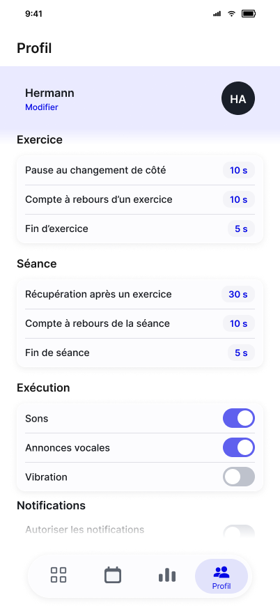

#### Profil — Stepper Pause changement de côté

[Source Figma — `1992:474`](https://www.figma.com/design/G6RY5Ebhgwb4AHIOYDwwvg?node-id=1992-474)

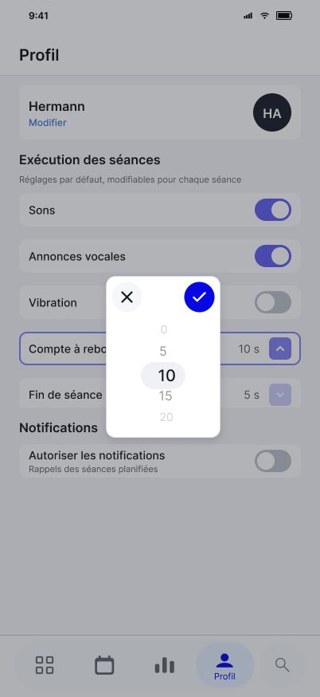

État courant du stepper Pause changement de côté

#### Profil — Stepper Récupération après activité

[Source Figma — `1992:579`](https://www.figma.com/design/G6RY5Ebhgwb4AHIOYDwwvg?node-id=1992-579)

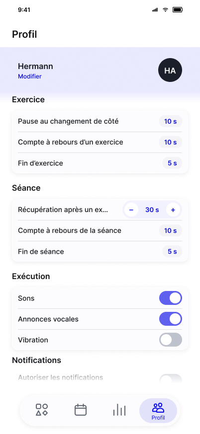

État courant du stepper Récupération après exercice

#### Profil — Vue d'ensemble - Vibration activée

[Source Figma — `1992:684`](https://www.figma.com/design/G6RY5Ebhgwb4AHIOYDwwvg?node-id=1992-684)

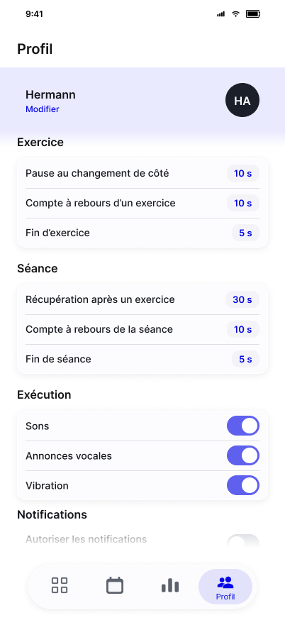

Valeur initiale fonctionnelle de la préférence `Vibration`

#### Profil — Modifier le profil — MVP

[Source Figma — `1992:778`](https://www.figma.com/design/G6RY5Ebhgwb4AHIOYDwwvg?node-id=1992-778)

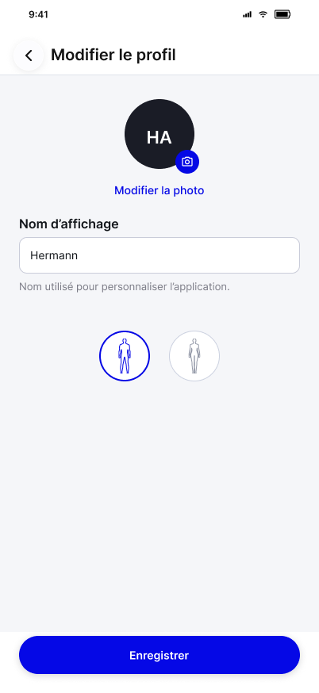

#### Profil — Vue d'ensemble — Parcours vide

[Source Figma — `2139:86`](https://www.figma.com/design/G6RY5Ebhgwb4AHIOYDwwvg?node-id=2139-86)

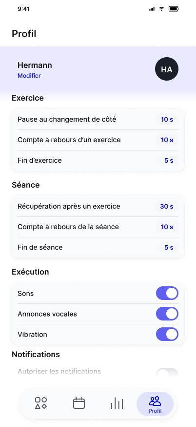

Présentation du Profil avant que l’utilisateur ait créé du contenu

## Catalogue des séances

### Objectif

Permettre à l’utilisateur de consulter son Catalogue de Séances, de le filtrer et le trier selon les fonctions disponibles, de créer une nouvelle Séance et d’accéder rapidement à la modification, à l’Exécution, à la consultation détaillée ou aux actions de gestion.

Cet écran constitue l’accueil de l’application.

### Filtres

Le Catalogue présente le sélecteur `Exercices / Séances / Parcours`, avec `Séances` sélectionné par défaut, `Exercices` actif en T03 et `Parcours` visible mais désactivé. Sous ce sélecteur, la rangée commune `Créer / Filtrer / Trier` utilise les boutons contextuels de `34 pt`, pictogrammes `20 pt`, gaps `12 pt`, cibles ≥ `44 × 44 pt` sans chevauchement. Les panneaux ouverts de `Filtrer` sont définis dans Figma et contextuels au Catalogue. `Trier` reste visible mais désactivé en T03.

Les Catalogues du MVP ne comportent aucune recherche globale ni recherche locale. Les filtres restent contextuels au Catalogue et suivent les règles décrites ci-dessous.

Les Séances archivées restent exclues de la liste active et ne sont accessibles que par le mécanisme de filtrage prévu. T03 n’invente aucune option de filtre supplémentaire propre aux Séances au-delà de ce qui est explicitement arbitré.

### Carte de Séance — vue condensée

Carte standard 354 × 90 px à largeur de référence 402, rayon 8, titre 15 Semi Bold, sans barre verticale ni cercle de nature. Ligne de classement : Étiquette puis catégories issues des exercices ; en l’absence d’Étiquette, afficher les catégories. Pastilles 20 ; pictogramme blanc sur couleur. Ligne des valeurs : `N exercices` et `N tours`, icônes nues 16. Badge durée en haut à droite ; la durée exclut Compte à rebours initial et Fin de séance.

Aucune prochaine planification ni ligne de pause/récupération sur la carte. Les séances restent sans vignette, définitivement (D-260). Les listes de catégories utilisent ` · ` puis `…` si nécessaire ; la donnée complète est conservée. Les cartes archivées utilisent fond #F6F6F6 et bord #D9D9D9 ; Restaurer remplace Lecture.

Ces règles s’appliquent aux listes, filtres actifs/inactifs, recherches, états restaurés, actions glissées et arrière-plans de modales. Les actions révélées suivent la hauteur réelle de la carte. Les séances restent triées par dernière modification décroissante ; exécuter ne change pas cet ordre.

### Actions sur une carte

La carte distingue trois zones d’action :

- **zone principale de la carte** : ouvre la Séance en mode modification ;
- **chevron** : déploie ou replie la carte sans ouvrir l’Exécution ;
- **zone `Démarrer`** : ouvre l’écran initial d’Exécution.

La zone principale constitue une cible tactile large. Il n’est pas nécessaire d’afficher un bouton ou une icône `Ouvrir`.

### Carte de Séance — vue déployée

Le déploiement est facultatif et permet de consulter les Exercices de la Séance sans changer d’écran.

La zone principale de la carte conserve la même action que dans la vue condensée : elle ouvre la Séance en mode modification. Le chevron sert uniquement à déployer ou replier la carte et la zone `Démarrer` ouvre l’écran initial d’Exécution.

Aucun bouton `Ouvrir` n’est affiché dans la vue déployée.

Chaque ligne d’Exercice présente :

- le nom de l’Exercice à gauche ;
- un groupe compact aligné à droite sous la forme `durée/reps · xN`.

`xN` n’est affiché que lorsque le nombre de Séries est supérieur à 1. En mode Répétition, l’abréviation `reps` est utilisée.

Exemples : `12 reps · x3`, `45 s · x2` ou simplement `30 s` lorsque le nombre de Séries vaut 1.

### Création d’une Séance

Toucher l’action de création ouvre `Composition d’une séance`, qui réunit le nom, l’Étiquette/couleur et la Composition.

La création suit ensuite le parcours défini dans la section de navigation générale. `Continuer` valide la Séance ; l’ancien écran autonome de classification de la Séance n’est plus utilisé en sortie de Composition.

### Actions secondaires

Sur une Séance active, un glissement gauche déplace visiblement la carte et révèle progressivement `Planifier`, `Dupliquer` et `Archiver` placés derrière. Au seuil d’ouverture, la carte se stabilise. Une seule carte peut exposer ses actions à la fois ; un glissement droit ne referme le contexte que s’il commence sur la carte ouverte.

Depuis le résultat du filtre `Archivées`, `Restaurer` affiche un snackbar `Séance restaurée` avec l’action `Annuler`.

### Suppression d’une Séance

Une Séance non archivée ne peut pas être supprimée. Elle doit d’abord être archivée.

Depuis le résultat du filtre `Archivées`, un glissement gauche déplace la carte et révèle l’action `Supprimer` placée derrière. L’action ouvre une modale de confirmation sur le fond de la liste archivée.

La suppression demande toujours une confirmation explicite. Si des Routines utilisent la Séance, le message précise qu’elles seront également supprimées.

Après confirmation :

- la Séance est supprimée ;
- toutes les Routines qui la référencent sont supprimées ;
- les occurrences futures cessent d’être calculées ;
- les Exécutions déjà enregistrées restent conservées dans le Suivi grâce à leur Instantané.

### Archivage

L’archivage retire la Séance de la liste principale.

Si aucune Routine n’est associée, l’archivage est immédiat et ne demande pas de confirmation. Un snackbar `Séance archivée` est affiché avec l’action `Annuler`. `Annuler` restaure immédiatement la Séance dans la liste active.

Si la Séance est utilisée par une ou plusieurs Routines, une confirmation explicite est demandée avant l’archivage ; après confirmation, toutes les Routines associées sont supprimées. Dans ce cas, aucun snackbar `Séance archivée` avec `Annuler` n’est affiché.

La restauration d’une Séance archivée ne restaure aucune ancienne Routine.

Une Séance archivée est consultable mais ne peut être ni modifiée, ni exécutée, ni planifiée. Elle peut être restaurée ou supprimée depuis le résultat du filtre `Archivées`.

### Séance vide

Le MVP ne comporte pas de statut `Brouillon`.

Une Séance existe dès validation de son nom et de sa couleur.

Tant qu’elle ne contient aucun Exercice :

- elle peut être modifiée, archivée ou supprimée ;
- elle ne peut pas être exécutée.

### État vide

Si aucune Séance n’a encore été créée, l’écran affiche : `Vous verrez ici la liste de vos séances dès que vous aurez commencé à les créer.` Il présente également l’action permettant de créer la première Séance.

Le filtre `Archivées` possède également un état vide lorsque aucune Séance n’est archivée. Il conserve l’en-tête et les commandes du Catalogue, remplace la liste par un message d’absence de Séance archivée et ne propose pas d’action de suppression ou de restauration.

Ces deux états sont fonctionnellement requis mais ne possèdent pas de frame dédiée dans le `Prototype MVP`. Ils réutilisent le composant d’état vide et la structure de leurs écrans parents ; aucune capture non issue de Figma n’est créée.

### Confirmation — Confirmer la suppression d’une Séance archivée

L’action `Supprimer` est révélée par glissement gauche : la carte se déplace avec le geste et révèle l’action placée derrière.

Le dialogue flottant centré demande une confirmation explicite. `Annuler` ferme le dialogue et revient au résultat du filtre `Archivées`.

Le bouton destructif porte le libellé `Confirmer`. Dans l’application, sa confirmation supprime la Séance archivée tout en conservant les Exécutions historiques.

### Confirmation — Confirmer l’archivage d’une Séance planifiée

Référence Figma : `4593:6285 — Modal — Confirmer l’archivage d’une séance planifiée`.

Cette modale est utilisée lorsqu’une Séance active possède des planifications associées. Elle indique que les planifications seront supprimées tandis que les Séances déjà effectuées restent dans l’historique. Les actions sont `Archiver` et `Annuler`.

### Vues principales et états intégrés

#### Catalogue des séances — Liste par défaut

[Source Figma — `1992:9910`](https://www.figma.com/design/G6RY5Ebhgwb4AHIOYDwwvg?node-id=1992-9910)

#### Catalogue des séances — Séance déployée

[Source Figma — `1992:10014`](https://www.figma.com/design/G6RY5Ebhgwb4AHIOYDwwvg?node-id=1992-10014)

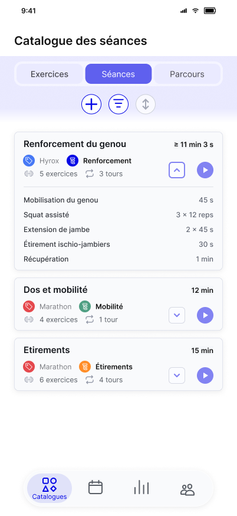

Consultation de la Composition sans quitter le Catalogue

#### Catalogue des séances — Liste condensée — actions glissées

[Source Figma — `1992:10518`](https://www.figma.com/design/G6RY5Ebhgwb4AHIOYDwwvg?node-id=1992-10518)

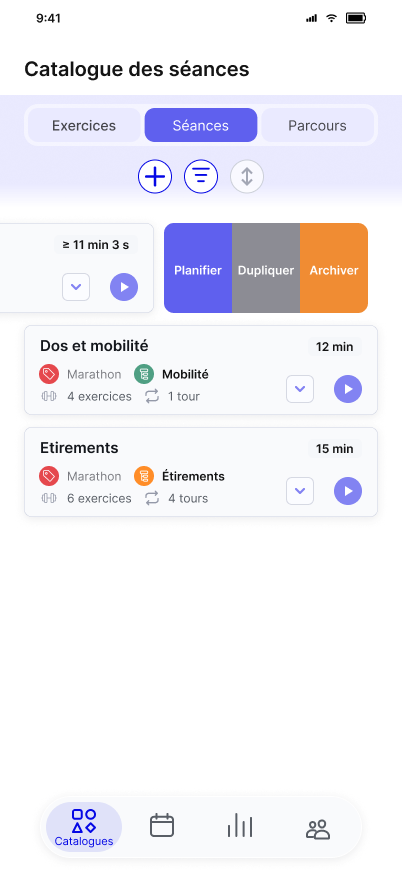

La carte se déplace avec le glissement et révèle `Planifier`, `Dupliquer` et `Archiver` derrière

#### Catalogue des séances — Séance déployée — actions glissées

[Source Figma — `1992:10628`](https://www.figma.com/design/G6RY5Ebhgwb4AHIOYDwwvg?node-id=1992-10628)

Même convention de glissement avec déplacement réel de la carte

#### Catalogue des séances — Archivées — Séance restaurée

[Source Figma — `1992:10848`](https://www.figma.com/design/G6RY5Ebhgwb4AHIOYDwwvg?node-id=1992-10848)

Snackbar de restauration et action `Annuler`

#### Catalogue des séances — Liste sans Renforcement du genou

[Source Figma — `1992:10937`](https://www.figma.com/design/G6RY5Ebhgwb4AHIOYDwwvg?node-id=1992-10937)

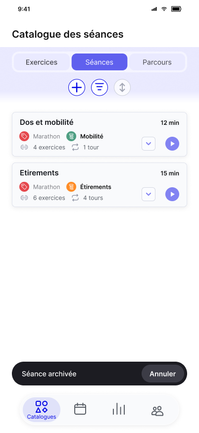

Résultat attendu après retrait de `Renforcement du genou` de la liste active

#### Catalogue des séances — État vide

[Source Figma — `2117:86`](https://www.figma.com/design/G6RY5Ebhgwb4AHIOYDwwvg?node-id=2117-86)

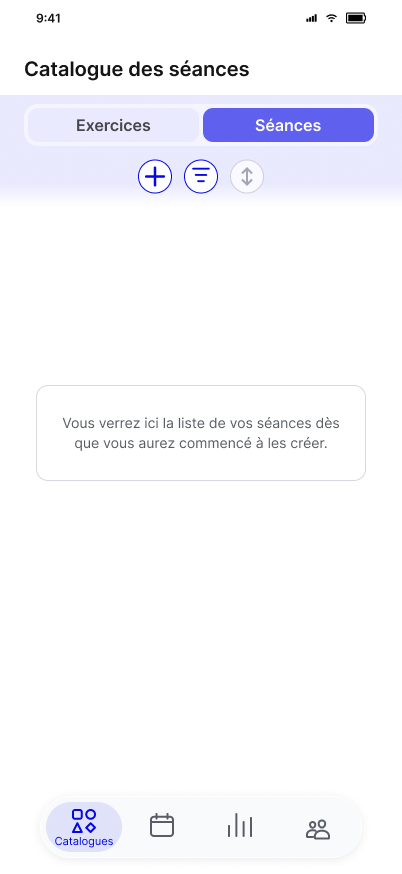

#### Catalogue des séances — Archivées — actions glissées

[Source Figma — `2234:88`](https://www.figma.com/design/G6RY5Ebhgwb4AHIOYDwwvg?node-id=2234-88)

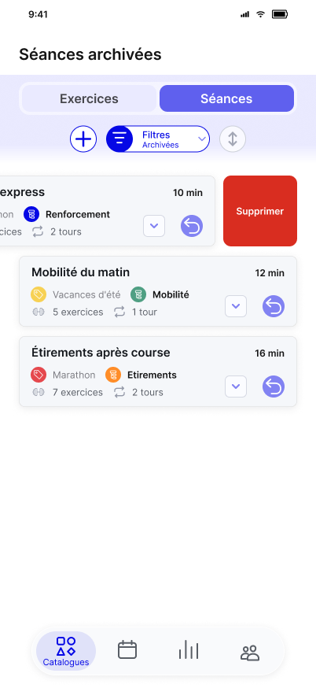

#### Catalogue des séances — Liste — Filtre inactif étendu

[Source Figma — `4549:6382`](https://www.figma.com/design/G6RY5Ebhgwb4AHIOYDwwvg?node-id=4549-6382)

État `Filtres / Aucun`, liste inchangée

#### Catalogue des séances — Filtre actif Archivé

[Source Figma — `4549:6742`](https://www.figma.com/design/G6RY5Ebhgwb4AHIOYDwwvg?node-id=4549-6742)

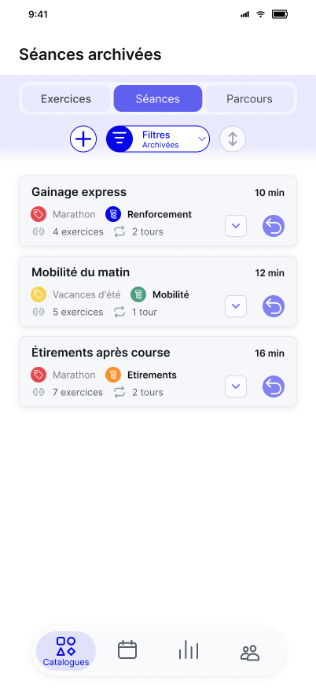

État actif du contrôle et liste filtrée

#### Catalogue des séances — Liste condensée — actions glissées — Dos et mobilité

[Source Figma — `4592:6217`](https://www.figma.com/design/G6RY5Ebhgwb4AHIOYDwwvg?node-id=4592-6217)

### Modales, panneaux et confirmations

#### Modal — Confirmer la suppression d’une séance archivée

[Source Figma — `2234:189`](https://www.figma.com/design/G6RY5Ebhgwb4AHIOYDwwvg?node-id=2234-189)

Fenêtre restaurée et réexportée le01/10/2026. Titre « Supprimer cette séance ? » ; message « Cette séance archivée sera définitivement supprimée. Cette action est irréversible. » ; Annuler gris#F3F4F6 / Confirmer#B1503C. Les deux actions ne sont pas recâblées dans le prototype ; leur comportement produit reste annuler sans mutation / supprimer définitivement après confirmation.

#### Catalogue des séances — Filtrer — Panneau ouvert

[Source Figma — `4168:11149`](https://www.figma.com/design/G6RY5Ebhgwb4AHIOYDwwvg?node-id=4168-11149)

Modale de filtres contextuels Séances : statut et Étiquettes

#### Modal — Confirmer l’archivage d’une séance planifiée

[Source Figma — `4593:6285`](https://www.figma.com/design/G6RY5Ebhgwb4AHIOYDwwvg?node-id=4593-6285)

## Catalogue des exercices

La frame `3786:5093` utilise le même Screen Shell et le même contrôle de type que le Catalogue des Séances, avec `Exercices` sélectionné. La liste contient les Exercices persistants et conserve filtres, tri implicite et position de défilement dans l’état de navigation du parcours courant.

La rangée `Créer / Filtrer / Trier` est identique au Catalogue des Séances : boutons contextuels `34 pt`, pictogrammes `20 pt`, gap `12 pt`, cibles tactiles ≥ `44 × 44 pt` sans chevauchement. `Filtrer` propose les critères contextuels validés et ses panneaux ouverts sont définis dans Figma ; `Trier` reste visible disabled.

Chaque carte utilise la nouvelle grammaire DSF : aucune barre verticale ; la couleur de Catégorie est portée par sa pastille dans le Catalogue. Sa surface principale ouvre la consultation ou la modification ; le bouton Lecture, dans une cible séparée, lance uniquement l’Exécution directe. La carte d’Exercice possède un seul format à gouttière permanente de64 px dans le Catalogue : photo associée ou icône de nature sans média. Aucun Déployer avec ou sans média ; Lecture reste indépendante. Chargement/erreur conservent la place réservée, texte alternatif = nom de l’exercice. Un glissement gauche expose `Planifier / Dupliquer / Archiver` sur les Exercices actifs et `Supprimer` dans les archives. Aucune poignée de déplacement n’est affichée.

Titre15 Semi Bold, badge durée en haut à droite, classement Catégorie puis Zones, valeurs16 et synthèse `N séries de X` / `N séries de N rép.` / `N séries à l’échec`. Bilatéralité par miroir16 à12 après la synthèse. Aucune pause/récupération ni prochaine planification affichée. Format unique : carte354 × 91, gouttière64 à12, texte x88/largeur207, catégorie conservée et pictogramme de zone conservé. Variante archivée : fond #F6F6F6, bord #D9D9D9, Restaurer ; l’absence d’écran d’archive dédié est acceptée. Ces règles valent aussi derrière les panneaux de filtres et dans les états glissés ; les actions suivent la hauteur de la carte.

États Figma complémentaires de la famille Catalogue des Exercices :

- `4521:6220 — Catalogue des exercices — État vide` ;
- `4168:11262 — Catalogue des Exercices — Filtrer — Panneau ouvert` ;
- `4544:6344 — Catalogue des Exercices — Liste — Filtre inactif étendu` ;
- `4544:6651 — Catalogue des Exercices — Liste — Filtre actif étendu` ;
- `4738:6209 — Catalogue des Exercices — Liste — actions glissées` ;
- `4738:6355 — Catalogue des Exercices — Liste — Première carte déployée — Média` : référence historique hors MVP (D-261).

La frame `4534:6339 — Catalogue des Exercices — Filtre — États du contrôle` est une planche de référence du contrôle, pas un écran utilisateur autonome.

L’ancienne référence Figma `3787:5209 — Catalogue — action contextuelle directe` n’existe plus dans l’état courant et n’est plus une preuve active. Aucun état de remplacement n’est inventé.

### Vues principales et états intégrés

#### Catalogue des Exercices — Liste

[Source Figma — `3786:5093`](https://www.figma.com/design/G6RY5Ebhgwb4AHIOYDwwvg?node-id=3786-5093)

#### Catalogue des exercices — État vide

[Source Figma — `4521:6220`](https://www.figma.com/design/G6RY5Ebhgwb4AHIOYDwwvg?node-id=4521-6220)

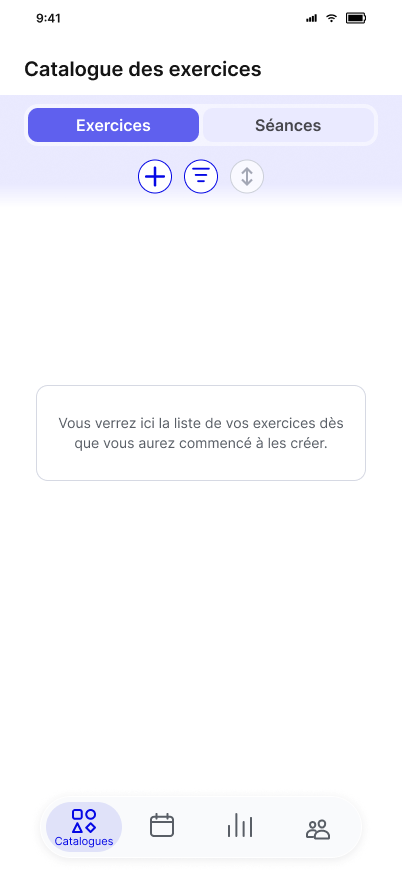

#### Catalogue des Exercices — Liste — Filtre inactif étendu

[Source Figma — `4544:6344`](https://www.figma.com/design/G6RY5Ebhgwb4AHIOYDwwvg?node-id=4544-6344)

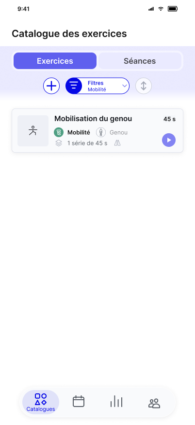

#### Catalogue des Exercices — Liste — Filtre actif étendu

[Source Figma — `4544:6651`](https://www.figma.com/design/G6RY5Ebhgwb4AHIOYDwwvg?node-id=4544-6651)

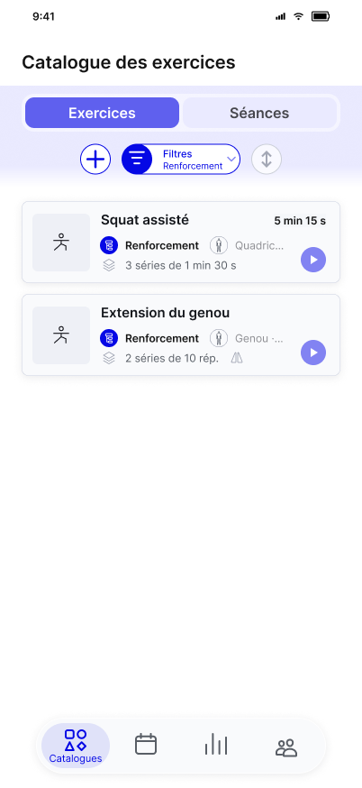

#### Catalogue des Exercices — Liste — actions glissées

[Source Figma — `4738:6209`](https://www.figma.com/design/G6RY5Ebhgwb4AHIOYDwwvg?node-id=4738-6209)

#### Référence historique hors MVP — Catalogue des Exercices — Liste — Première carte déployée — Média

[Source Figma — `4738:6355`](https://www.figma.com/design/G6RY5Ebhgwb4AHIOYDwwvg?node-id=4738-6355)

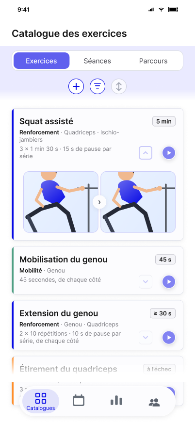

### Modales, panneaux et confirmations

#### Catalogue des Exercices — Filtrer — Panneau ouvert

[Source Figma — `4168:11262`](https://www.figma.com/design/G6RY5Ebhgwb4AHIOYDwwvg?node-id=4168-11262)

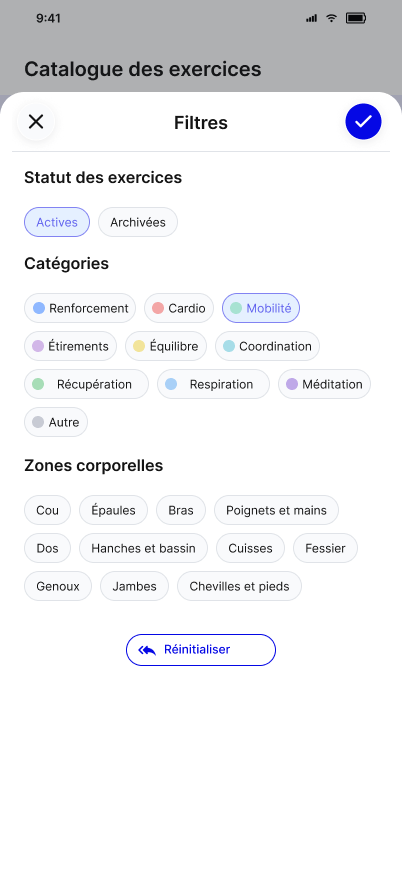

### Catalogue — Séries variables — référence historique du03/10

La frame6665:24120 n’est plus présente dans Prototype MVP au06/10 ; le témoin ci-dessous reste historique. La règle d’indication N séries variables demeure applicable.

#### Catalogue des exercices — Liste — Séries variables

[Source Figma — `6665:24120`](https://www.figma.com/design/G6RY5Ebhgwb4AHIOYDwwvg?node-id=6665-24120)

## Composition d’une séance

### Objectif

Permettre à l’utilisateur de définir la structure et l’ordre d’Exécution d’une Séance.

L’écran de Composition ne lance pas directement l’Exécution.

### Structure affichée

La Composition est présentée comme une structure hiérarchique ordonnée et non comme un parcours de type niveaux.

Elle comprend dans le MVP :

- un `Compte à rebours initial` ;
- zéro, un ou plusieurs Exercices placés avant le Circuit ;
- un `Circuit` unique, qui peut lui-même contenir des Exercices ;
- zéro, un ou plusieurs Exercices placés après le Circuit ;
- une `Fin de séance`.

Le Compte à rebours initial et la Fin de séance sont des éléments structurels obligatoires et ne constituent pas des Exercices. Ils sont non déplaçables : aucun appui long ni aucune poignée de déplacement ne leur est associé.

Le modèle conserve un Cycle technique unique dont le nombre de répétitions vaut toujours 1. Il n’est jamais affiché ni modifiable dans le MVP.

### En-tête

L’écran affiche notamment :

- le champ `Nom de la séance` ;
- l’accès à la modale `Étiquettes` ;
- l’Étiquette sélectionnée, lorsqu’elle existe, affichée sous le nom de la Séance ;
- le résumé `N exercice(s) · durée des Exercices`, intégré sous `Nombre de tours` dans le conteneur Circuit.

Le champ `Nom de la séance` mesure `354 × 42`. Son fond reste transparent. Lorsqu’une Étiquette est sélectionnée, sa couleur devient la couleur affichée de la Séance ; il n’existe pas de palette de couleur indépendante de l’Étiquette dans le parcours courant.

L’ouverture de la modale Étiquettes conserve la Composition en arrière-plan et ne modifie aucune autre valeur tant qu’une sélection ou création n’est pas validée.

### Paramètres du Circuit

L’icône affichée à gauche de `Nombre de tours` est exclusivement une instance de `Icon / Tour` (`3066:4685`). Son dessin canonique est celui validé dans `Composition séance — Nom saisi` (`2028:12003`) ; l’ancienne sous-référence graphique supprimée n’est plus utilisée comme preuve active : cadre visuel `18 × 18`, quatre tracés, trait `1,35`, couleur `color.textPrimary` (`#141414`). Les copies vectorielles locales et l’ancien pictogramme Tour ne sont pas autorisés. L’actif exportable correspondant est uniquement `assets/icons/icon-tour.svg`, clé de registre `icon.tour`.

Le Circuit possède un nombre de Tours compris entre **1 et 99**, avec **1** comme valeur par défaut.

Dans l’interface courante, le nombre apparaît dans un stepper permanent à droite de l’en-tête du Circuit. Le libellé « Parcours » encore présent dans les captures est un écart de terminologie à corriger dans Figma (D-209). La référence `2028:11700` montre `− / 3 tours / +`, sur 137 × 36 px. La valeur provient du brouillon, jamais de l’exemple Figma. La synthèse des exercices et de leur durée reste associée au conteneur ; Compte à rebours et Fin en sont exclus. Les anciennes dimensions 66 × 34 et l’ancien déclencheur violet de roulette ne sont plus une prescription visuelle active.

La synthèse n’est plus affichée isolément au bas de l’écran. Elle est recalculée uniquement après une modification validée qui affecte les Exercices ou le nombre de Tours. La confirmation du `Compte à rebours initial` ou de la `Fin de séance` actualise seulement le jalon structurel concerné et ne modifie jamais cette synthèse. Celle-ci reste attachée au conteneur Circuit dans ses états applicables.

Le nombre de tours se règle directement avec le stepper permanent `− / valeur / +` (`4913:7432`, dans `2028:11700`). Aucune ouverture de roulette ni confirmation modale distincte n’est requise. Les modifications appartiennent au brouillon de Composition jusqu’à son enregistrement ; bornes 1–99 et valeur initiale 1 inchangées.

### Retour haptique des roulettes

Toute roulette numérique de l’application produit un retour haptique léger et bref à chaque franchissement effectif d’un cran, c’est-à-dire à chaque changement de la valeur sélectionnée. Un seul retour haptique est déclenché par changement de valeur. Ce retour est systématique et indépendant du réglage `Vibration` du Profil, qui ne pilote que les vibrations fonctionnelles de séance.

### Ajout d’un Exercice

Un seul bouton secondaire `+ Ajouter un exercice` est affiché en haut de l’écran de Composition.

Aucun bouton `＋` intermédiaire n’est affiché dans le Circuit ou entre les Exercices.

Un appui sur `Ajouter un exercice` ouvre directement la sélection multiple des références persistantes du Catalogue. La validation est désactivée lorsque la sélection est vide et les Exercices validés sont insérés dans l’ordre courant de la liste filtrée, non dans l’ordre des touchers. Le mécanisme de création directe d’un Exercice local à la Séance est conservé dans le produit mais n’est pas proposé par l’enchaînement d’écrans courant.

Le premier Exercice créé est inséré immédiatement après le Compte à rebours initial et avant le Circuit. Les Exercices suivants sont insérés après le dernier Exercice ajouté, dans la même zone. L’utilisateur peut ensuite les déplacer manuellement avant le Circuit, dans le Circuit ou après le Circuit. La réorganisation est déclenchée par un appui long sur l’ensemble de la carte ; la poignée reste un indicateur visuel et ne constitue pas la seule zone de déclenchement.

La poignée de chaque carte d’Exercice est exclusivement une instance du composant DSF `Icon / Structure / Movable` (`3066:4676`) : dessin `20 × 20` centré dans un slot `28 × 28`, opacité `50 %`, couleur `color.iconNeutral`. Le dessin local historique `icon/réorganiser` en `16 × 16` et l’application du token `icon.compact` à cette poignée sont interdits.

Le MVP ne propose pas de menu d’ajout rapide `Pause 15 s / 30 s / 45 s`.

Chaque occurrence possède explicitement `postActivityRecoverySeconds`, initialisé depuis le défaut global. La valeur `0 s` reste affichée dans la Composition ; une phase `POST_ACTIVITY_RECOVERY` chronométrée n’est créée que si cette valeur est positive.

Si deux Exercices s’enchaînent sans Pause après chaque série et avec une récupération après exercice à `0 s`, un avertissement discret et non bloquant peut être affiché selon la règle existante.

### Composition — ligne de Série variable — références du03/10

#### Composition séance — Standard — Séries variables

[Source Figma — `6665:23973`](https://www.figma.com/design/G6RY5Ebhgwb4AHIOYDwwvg?node-id=6665-23973)

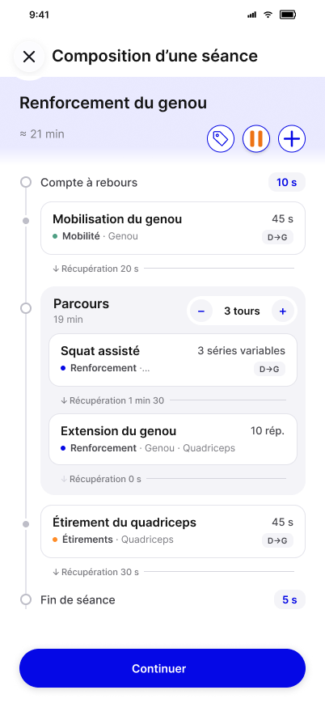

### Résumé de la ligne d’un Exercice (D-095 révisée par D-238)

La ligne présente le nom, la Catégorie puis les Zones corporelles sur une ligne de classement, puis la synthèse :

- Durée : `N séries de X` (ex. `3 séries de 1 min 30 s`) ;
- Répétitions : `N séries de N rép.` ;
- À l’échec : `N séries à l’échec`.

Le nom n’est pas répété, le mode n’est pas nommé. Aucun texte de pause/récupération, aucune ligne attachée `Récupération {durée}` : cette ancienne exigence d’affichage est supprimée. Les valeurs et phases D-208 restent conservées, solidaires de l’occurrence lors des opérations et utilisées dans les calculs. Aucun nouvel accès de réglage n’est inventé ici.

La bilatéralité est indiquée par le miroir dans les variantes concernées ; le paramètre de direction et `Indicator / Sides` ne sont pas supprimés du modèle. Le texte développé « à droite, puis à gauche » reste propre à l’éditeur. La Description est absente des cartes. Texte complet conservé derrière la troncature.

Les commandes contextuelles de Composition font 34 px, dessins 20, gaps 10, cibles 44 sans chevauchement. La bande Durée + actions reste à 32 px : durée immobile, actions à droite et 6 px plus bas. Les états initial, nom saisi, étiquette sélectionnée, modale ouverte, déplacement et actions glissées héritent de cette règle.

### Consultation et modification d’un Exercice

Un appui court sur une carte Exercice ouvre directement son parcours de modification. Un appui long sur l’ensemble du bloc Exercice–Récupération déclenche sa réorganisation sans ouvrir la modification. Un glissement gauche déplace le bloc avec le geste et révèle progressivement les actions `Dupliquer` et `Supprimer` placées derrière. `Dupliquer` crée un Exercice de Séance indépendant avec un nouvel identifiant, reprend tous les paramètres de la source, y compris Pause et Récupération, la nomme `{nom} (copie)` puis `{nom} (copie 2)`, etc., sans collision, et l’insère immédiatement après la source dans la même zone structurelle. Cette action ne crée aucun Exercice dans le catalogue. `Supprimer` retire le bloc du brouillon ; la suppression n’est persistée qu’avec l’enregistrement final de la Séance et l’abandon restitue la version persistée.

Dans l’état Figma `Composition d’une séance — actions glissées` (`2028:11808`), la carte/bloc suit le geste. L’action `Dupliquer` reprend son rayon DSF et un espace visuel sépare son bord gauche de la portion encore visible de la carte, laissant apparaître le fond du conteneur Circuit. Aucun overlay immobile ne remplace ce mouvement réel.

### Réorganisation

Les Exercices peuvent être réorganisés dans leur zone ou déplacés par glisser-déposer avant le Circuit, dans le Circuit ou après le Circuit. Le geste commence par un appui long sur le bloc complet ; la carte de l’occurrence passe dans l’état soulevé puis suit le glissement ; sa donnée de récupération après exercice reste attachée sans ligne visible jusqu’à une position de dépose valide. Un toucher court conserve son comportement d’ouverture de l’Exercice en modification. Le déplacement conserve l’identifiant et tous les paramètres, met à jour la position structurelle et renumérote continûment les positions de chaque zone. Il ne persiste rien avant l’enregistrement final.

L’état Figma `Composition d'une séance — Appui long — carte soulevée` (`3518:4576`) matérialise ce retour visuel. Avec Récupération, le bloc actif passe de `354 × 93` à `362 × 97`, reste centré dans la section (`x = 6`, contre `x = 10` au repos), utilise le fond bleu très clair `#F7F7FF`, un contenu atténué, un contour `1` point `#D1D1D6`, un rayon `12` et une ombre périphérique `#14171F` à `22 %`, décalage `0 / 0`, flou `10`, étalement `2`. L’ombre et le contour entourent l’Exercice et sa Récupération. Les autres cartes et éléments structurels restent inchangés.

La poignée `Icon / Structure / Movable` reste l’indice visuel du caractère déplaçable, mais le geste d’activation porte sur la carte. L’état soulevé est uniquement transitoire : il ne modifie ni l’ordre ni la position structurelle avant la dépose.

Le Circuit reste structurel. Le Compte à rebours initial et la Fin de séance sont explicitement non déplaçables, sans appui long ni poignée de déplacement.

### Validation de la Composition

L’écran ne comporte pas de bouton `Démarrer`.

L’action `Continuer` valide la Composition. Elle reste désactivée tant que le nom n’est pas renseigné ou que la Composition ne contient pas au moins un Exercice valide. L’Étiquette est facultative ; lorsqu’elle est sélectionnée, sa couleur devient celle de la Séance.

En création comme en modification, l’Étiquette de la Séance est gérée depuis la Composition par la modale `Étiquettes`. L’Étiquette sélectionnée est affichée sous le nom de la Séance et porte sa couleur.

La Séance n’est exécutable que si elle contient au moins un Exercice valide.

### Enregistrement

Les modifications internes sont conservées au fur et à mesure, sous réserve des validations explicites prévues par les écrans d’édition.

### Composition — Récupération après exercice — D-208 révisée sur l’affichage

Les cartes ne présentent plus la ligne `Récupération {durée}`, y compris pour une valeur non nulle. La donnée reste solidaire de chaque occurrence lors du déplacement, de la duplication et de la suppression. Son exécution après l’occurrence (y compris fin de Tour/Séance) et les calculs restent ceux de D-208. La disparition de l’affichage ne supprime ni phase ni valeur.

L’éditeur conserve `Récupération entre côtés`, exposée uniquement en D→G/G→D ; aucune récupération post-exercice n’est ajoutée à la synthèse intrinsèque.

### Sélection des exercices — modale

Depuis `Ajouter un exercice`, la frame `3789:5349` ouvre directement la sélection des Exercices du Catalogue au-dessus de la Composition grisée. La liste seule défile. Les boutons fixes sont `Annuler` à gauche et `Ajouter N exercice(s)` à droite.

Les Exercices sont insérés selon leur ordre courant de présentation dans la liste filtrée au moment de la validation, indépendamment de l’ordre des touchers. L’état sélectionné de la sélection multiple utilise le composant DSF dédié ; aucun glyphe texte ne peut le remplacer.

Chaque carte de choix Composition mesure354 × 91, rayon8, titre15, case arrondie20 ; aucun badge durée ni Lecture/Déployer. Cadre des zones corporelles arrêté à8 px de la case, troncature finale par points de suspension (D-263). Catégorie/Zones en classement, synthèse et miroir selon bilatéralité. Gouttière permanente64 : photo associée centrée/recadrée, icône de nature sans média/pendant chargement/erreur, texte alternatif nom ; aucune hausse de hauteur. États sélectionné/non sélectionné/inactif suivent la palette #0508E5/#5C636E/#C2C4D1, sans remplacer le composant vectoriel par un glyphe. Les règles d’insertion et de validation à0 restent inchangées. Contrat CE-T03-07.

### Étiquettes — sélection et création en modale

La gestion des Étiquettes n’est plus un écran autonome de fin de parcours : elle est intégrée à la Composition de séance.

Références Figma courantes :
- `2028:11204 — Composition séance — Étiquettes` ;
- `4640:6308 — Composition séance — Nouvelle étiquette` ;
- `4581:6404 — Composition séance — Étiquette sélectionnée`.

### Objectif

Permettre de sélectionner ou créer l’Étiquette de la Séance. L’Étiquette porte la couleur affichée de la Séance ; il n’existe pas de couleur de Séance indépendante de l’Étiquette.

### Contenu et comportement

- l’action Étiquette ouvre une modale basse sur la Composition ;
- la modale affiche les Étiquettes disponibles et l’action `Nouvelle étiquette` ;
- sélectionner une Étiquette ferme le choix et affiche son libellé sous le nom de la Séance ; sa couleur devient la couleur de la Séance ;
- `Nouvelle étiquette` ouvre la saisie `Nom de l’étiquette` dans la modale ; l’action d’envoi ajoute la nouvelle valeur aux choix ;
- les libellés visibles dans Figma (`Marathon`, `Hyrox`, `Vacances d'été`, `Challenge groupe`) sont des données de démonstration, pas des valeurs codées en dur ;
- la navigation et les autres valeurs déjà saisies dans la Composition sont conservées pendant l’ouverture/fermeture de la modale.

La validation de la Séance reste portée par l’action `Continuer` de la Composition ; l’Étiquette est enregistrée avec la Séance dans le même flux de validation.

### Placement et retrait d’un point d’arrêt

Le placement est un état de la Composition, représenté par `4893:6675`, avec les emplacements `Placer ici` et l’action `Annuler`. Ce n’est pas une nouvelle page applicative. Le point inséré est visible dans `3722:5061`. Le retrait utilise la bulle contextuelle `Retirer le point d’arrêt` de `5301:5443`, rattachée au point concerné ; ce n’est pas une modale de confirmation. Les emplacements autorisés et le comportement à l’exécution restent ceux des règles du Point d’arrêt.

### Confirmation — Abandonner la création d’une séance

#### Objectif

Éviter la perte accidentelle des informations saisies dans la nouvelle `Composition d’une séance`.

#### Ouverture

La modale s’affiche depuis `Composition d’une séance` lorsque l’utilisateur appuie sur Retour pendant une création en cours.

La Composition reste visible en arrière-plan, assombrie et non interactive.

#### Contenu

**Titre**

> Abandonner la création ?

**Message**

> Les informations saisies seront perdues et la séance ne sera pas créée.

**Actions**

- `Annuler`, action neutre grise
- `Confirmer`, action destructive rouge

#### Comportement

`Annuler` ferme le dialogue et conserve intégralement la création en cours.

`Confirmer` supprime la nouvelle Séance et tout son contenu déjà saisi, puis revient au `Catalogue des séances`.

Ce comportement concerne uniquement le parcours de création. Pour une Séance existante ouverte en modification, Retour ne supprime jamais la Séance.

### Vues principales et états intégrés

#### Composition séance — Initial

[Source Figma — `2028:11137`](https://www.figma.com/design/G6RY5Ebhgwb4AHIOYDwwvg?node-id=2028-11137)

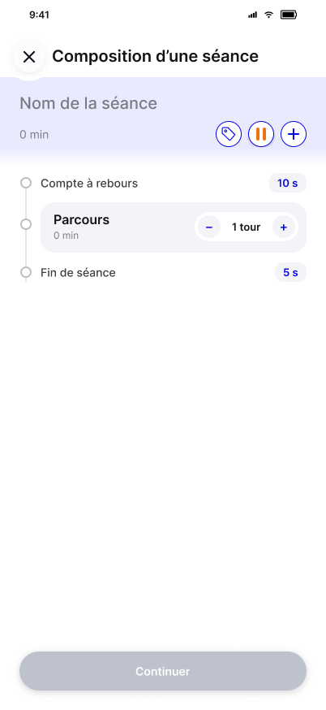

Nom vide, Circuit initial avec synthèse intégrée et action principale désactivée

#### Composition séance — Standard

[Source Figma — `2028:11700`](https://www.figma.com/design/G6RY5Ebhgwb4AHIOYDwwvg?node-id=2028-11700)

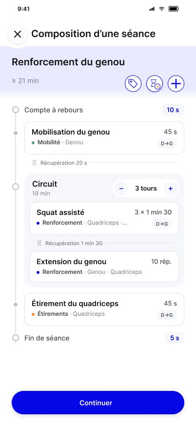

#### Composition séance — Actions glissées

[Source Figma — `2028:11808`](https://www.figma.com/design/G6RY5Ebhgwb4AHIOYDwwvg?node-id=2028-11808)

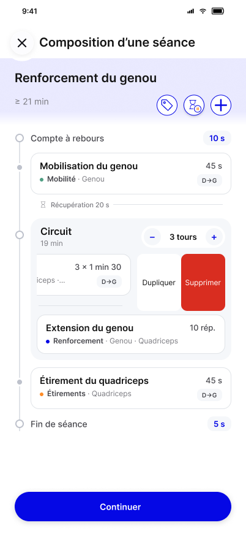

#### Composition séance — Nom saisi

[Source Figma — `2028:12003`](https://www.figma.com/design/G6RY5Ebhgwb4AHIOYDwwvg?node-id=2028-12003)

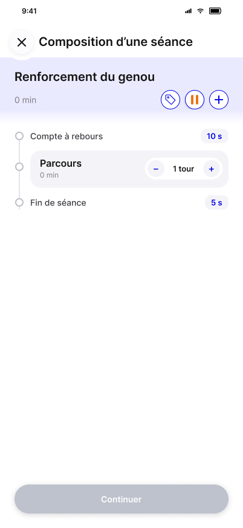

Le nom seul ne suffit pas à activer `Continuer`

#### Composition séance — Déplacement

[Source Figma — `3518:4576`](https://www.figma.com/design/G6RY5Ebhgwb4AHIOYDwwvg?node-id=3518-4576)

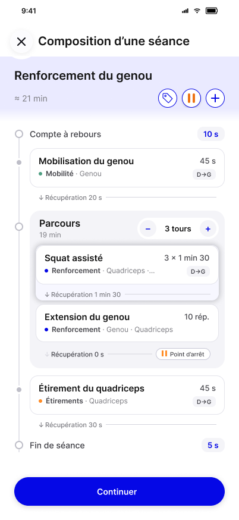

État transitoire précédant et accompagnant le déplacement d’un Exercice

#### Composition séance — Point d’arrêt

[Source Figma — `3722:5061`](https://www.figma.com/design/G6RY5Ebhgwb4AHIOYDwwvg?node-id=3722-5061)

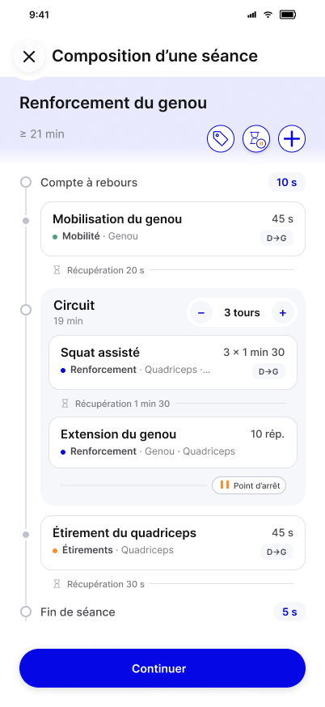

Point d’arrêt inséré dans la Composition, sans écran dédié ; élément déplaçable

#### Composition séance — Étiquette sélectionnée

[Source Figma — `4581:6404`](https://www.figma.com/design/G6RY5Ebhgwb4AHIOYDwwvg?node-id=4581-6404)

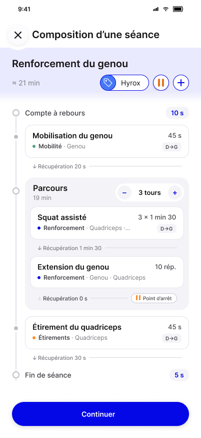

Étiquette et couleur visibles dans la Composition

#### Modification d'une séance

[Source Figma — `5271:5455`](https://www.figma.com/design/G6RY5Ebhgwb4AHIOYDwwvg?node-id=5271-5455)

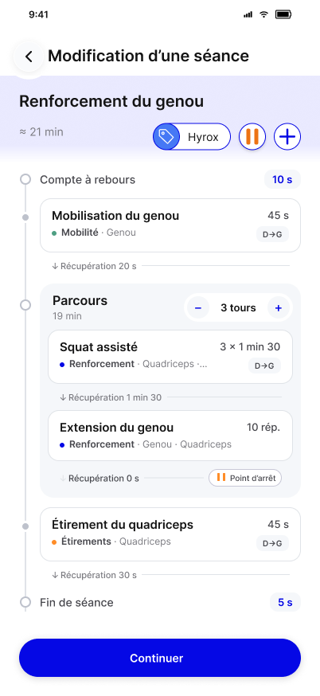

#### Composition d’une séance — Placement d’un point d’arrêt

[Source Figma — `4893:6675`](https://www.figma.com/design/G6RY5Ebhgwb4AHIOYDwwvg?node-id=4893-6675)

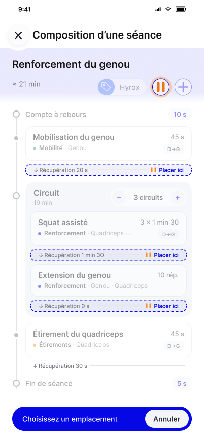

### Modales, panneaux et confirmations

#### Composition séance — Étiquettes

[Source Figma — `2028:11204`](https://www.figma.com/design/G6RY5Ebhgwb4AHIOYDwwvg?node-id=2028-11204)

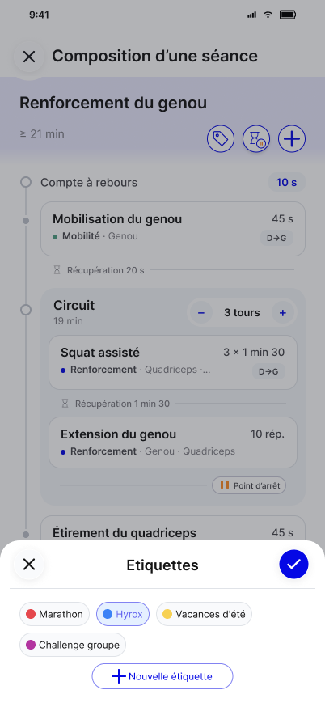

Sélection de l’Étiquette ; la couleur de la Séance est celle de l’Étiquette

#### Composition séance — Abandon

[Source Figma — `2028:11298`](https://www.figma.com/design/G6RY5Ebhgwb4AHIOYDwwvg?node-id=2028-11298)

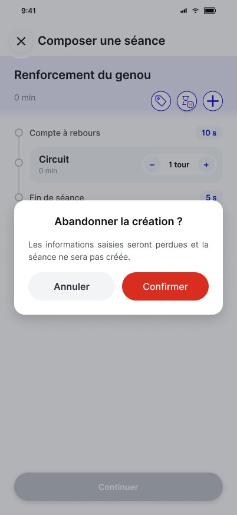

#### Composition séance — Compte à rebours

[Source Figma — `2028:11375`](https://www.figma.com/design/G6RY5Ebhgwb4AHIOYDwwvg?node-id=2028-11375)

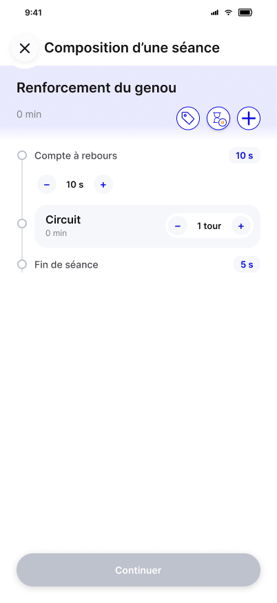

Réglage minutes/secondes avec Annuler et Confirmer circulaires

#### Composition séance — Fin

[Source Figma — `2028:11457`](https://www.figma.com/design/G6RY5Ebhgwb4AHIOYDwwvg?node-id=2028-11457)

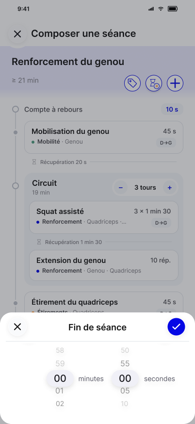

Réglage indépendant avec Annuler et Confirmer circulaires

#### Composition séance — Sélection exercices

[Source Figma — `3789:5349`](https://www.figma.com/design/G6RY5Ebhgwb4AHIOYDwwvg?node-id=3789-5349)

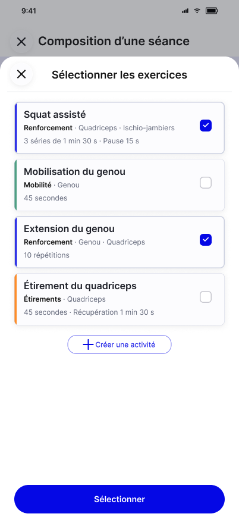

#### Composition séance — Nouvelle étiquette

[Source Figma — `4640:6308`](https://www.figma.com/design/G6RY5Ebhgwb4AHIOYDwwvg?node-id=4640-6308)

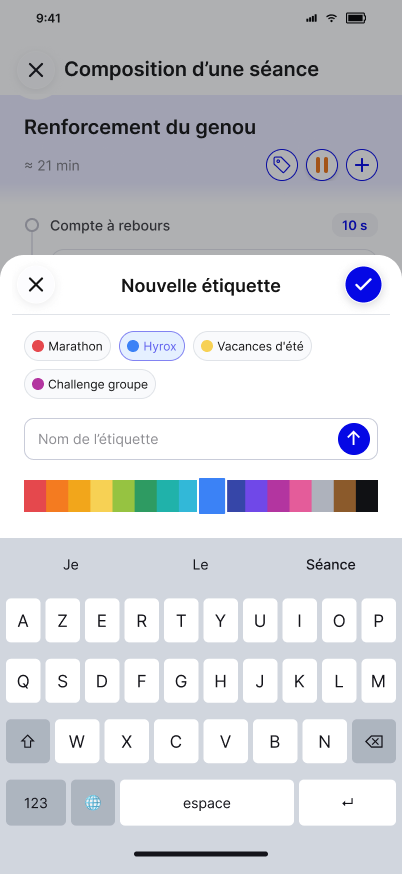

Création d’une Étiquette depuis la modale

#### Composition séance — Étiquettes — Appui long — Confirmation suppression

[Source Figma — `4861:6145`](https://www.figma.com/design/G6RY5Ebhgwb4AHIOYDwwvg?node-id=4861-6145)

Appui long sur une Étiquette ; confirmation destructive `Annuler / Supprimer`

### Bulle contextuelle

#### Composition séance — Retirer un point d’arrêt

[Source Figma — `5301:5443`](https://www.figma.com/design/G6RY5Ebhgwb4AHIOYDwwvg?node-id=5301-5443)

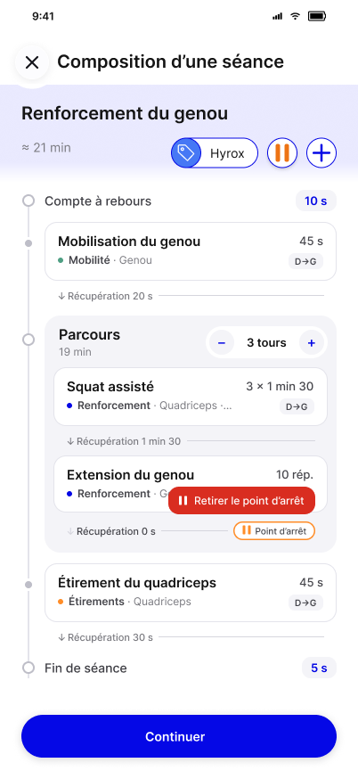

## Créer ou modifier un exercice

Inventaire initial du03/10 :37frames pour cette famille ;5frames supplémentaires sont intégrées au06/10 (cadence13/14, copies9b/10b et phrase longue). Le détail courant et les captures figurent dans la matrice06/10. Les titres suffisent ; les numéros contenus dans les noms Figma sont des identifiants de travail, pas une numérotation documentaire.

Contrats : CE-T03-04 (formulaire et abandon), CE-UI-10 (une feuille, plusieurs états), CE-UI-09 (Catégorie/Zones et confirmations). [État des lieux et vérification par frame](../ETAT-DES-LIEUX-CREATION-EXERCICE-2026-10-03.md). Les anciens exports Copie6603/6611/6612/6623 ne définissent plus ce parcours courant. Leurs fichiers sont conservés comme historique.

### Parcours, données et validation

Créer depuis Catalogue ouvre le formulaire ; Modifier reprend les données existantes. Nom, une Catégorie et au moins une Zone sont requis pour un nouvel Exercice. Carte Paramètres → feuille transactionnelle ; ✕/retour annule son brouillon, ✓ applique au parent ; Terminer seul persiste. Abandon du formulaire modifié ouvre la confirmation existante. Ouvrir un référentiel conserve les paramètres, même variables.

Spécification [v13](SPECIFICATION-PARAMETRES-MODALE-v13.md) : mode unique, N séries par côté, cibles/Pauses propres à chaque ligne en variable, direction et Ordre des côtés indépendants. N=1 effectif uniforme/Un côté après l’autre ; restauration temporaire avant✓. Déplacement cible/Pause conjoint ; nouvelle première reprise à désactivation, nouvelle dernière Pause terminale. Total variable readonly et — si incomplet ; Répétitions : sans symbole avec cadence,≈ sans cadence ; À l’échec aucun total.

### Placement et contrôles

Formulaire : en-tête → nom/référentiels → carte Paramètres → Description → Média → Terminer. Feuille : en-tête fixe ✕/titre/✓ ; corps défilant Mode → Séries → Séries variables → cible commune → Cadence si Répétitions → Pause commune (ou tableau puis Cadence commune en variable) → Changement de côté → Ordre des côtés/PC si bilatéral → Total applicable → Compte à rebours → Fin.

Tableau rattaché à l’interrupteur : poignée, numéro aligné à droite, cible et Pause par steppers ; À l’échec cible textuelle. Chevron replie seulement le tableau. Les modes/directions/ordre utilisent les segmentés ; Durée/Total uniformes utilisent les roulettes ; aucune sous-modale variable. Détails géométriques : [DSF](../DSF-SERIES-VARIABLES-2026-10-02.md). Le contrôle devient accessible par défilement, sans tableau à scroll indépendant.

Figma définit le layout. Les valeurs, calculs, validations et comportements restent ceux des spécifications. La présence d’un ✓ bleu dans un exemple incomplet ne le rend pas validable.

### Formulaire — vues principales et résumés

#### Ajouter un exercice — Initial

[Source Figma — `3943:6064`](https://www.figma.com/design/G6RY5Ebhgwb4AHIOYDwwvg?node-id=3943-6064)

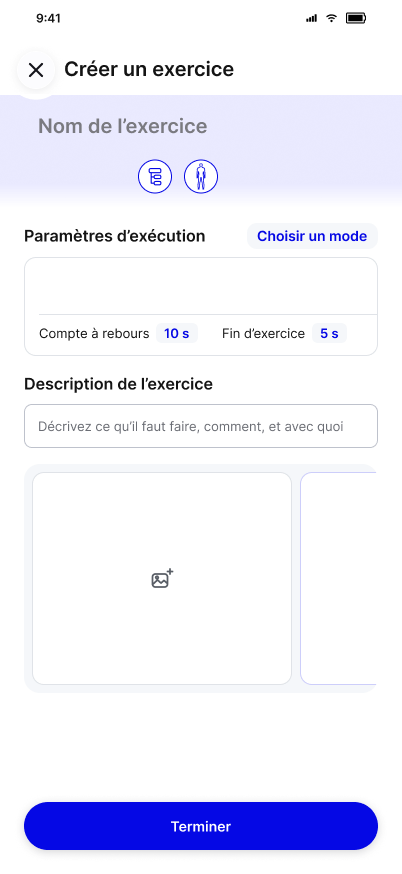

#### Ajouter un exercice — Nom Description Media

[Source Figma — `4217:6980`](https://www.figma.com/design/G6RY5Ebhgwb4AHIOYDwwvg?node-id=4217-6980)

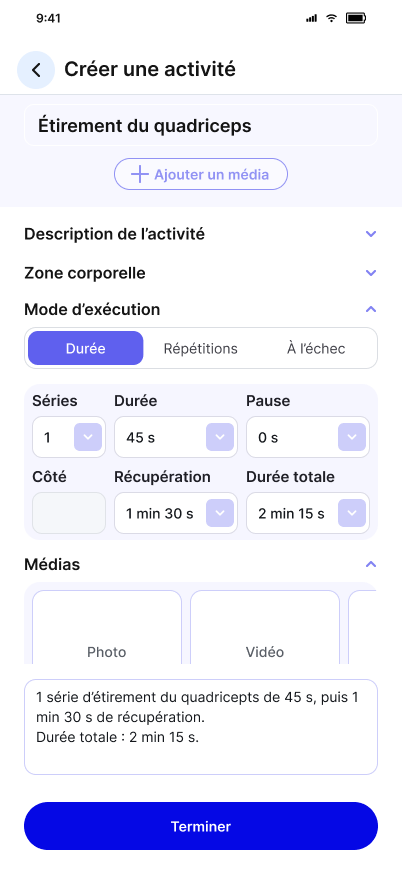

#### Ajouter un exercice — Catégorie renseignée

[Source Figma — `5088:6398`](https://www.figma.com/design/G6RY5Ebhgwb4AHIOYDwwvg?node-id=5088-6398)

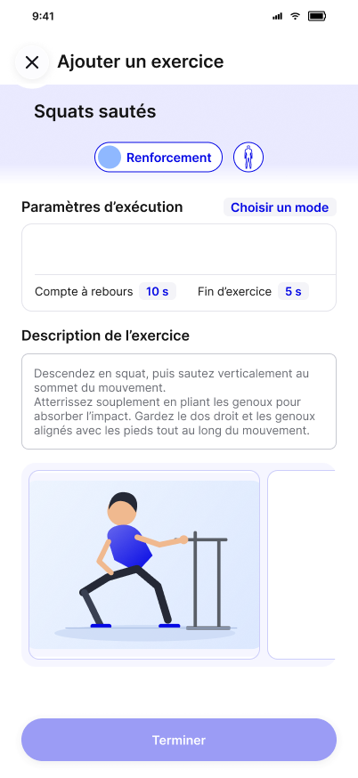

#### Création exercice — Avant Paramètres d'exécution

[Source Figma — `3542:4656`](https://www.figma.com/design/G6RY5Ebhgwb4AHIOYDwwvg?node-id=3542-4656)

#### Modifier un exercice

[Source Figma — `4734:6342`](https://www.figma.com/design/G6RY5Ebhgwb4AHIOYDwwvg?node-id=4734-6342)

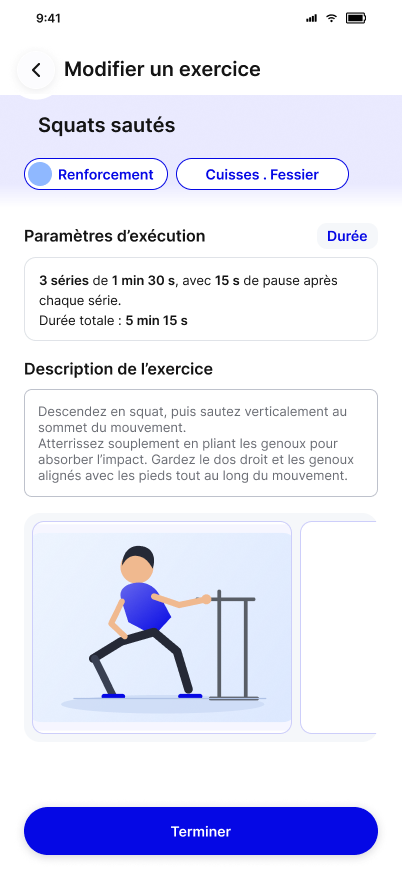

#### Création exercice — Paramètres en modale — Champ vide

[Source Figma — `6407:9458`](https://www.figma.com/design/G6RY5Ebhgwb4AHIOYDwwvg?node-id=6407-9458)

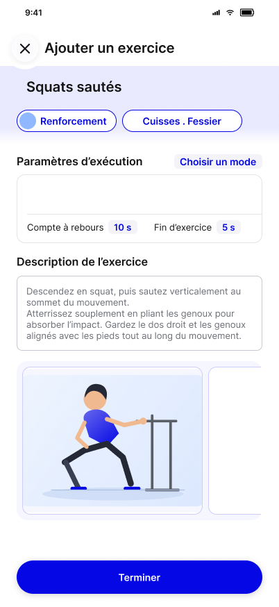

#### Création exercice — Paramètres en modale — Texte affiché

[Source Figma — `6407:9702`](https://www.figma.com/design/G6RY5Ebhgwb4AHIOYDwwvg?node-id=6407-9702)

#### Résumé — Durée variable bilatérale Les deux côtés à chaque série

[Source Figma — `6665:27862`](https://www.figma.com/design/G6RY5Ebhgwb4AHIOYDwwvg?node-id=6665-27862)

#### Résumé — À l’échec variable

[Source Figma — `6665:28050`](https://www.figma.com/design/G6RY5Ebhgwb4AHIOYDwwvg?node-id=6665-28050)

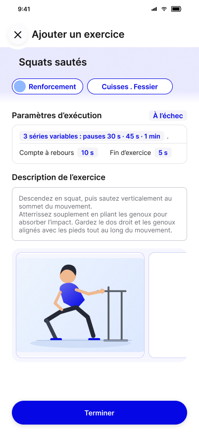

### Feuille Paramètres — états intégrés

Les21frames suivantes décrivent CE-UI-10 ; elles ne constituent pas21écrans indépendants.

#### Création exercice — Paramètres en modale — Modale ouverte (champs vides)

[Source Figma — `6407:9551`](https://www.figma.com/design/G6RY5Ebhgwb4AHIOYDwwvg?node-id=6407-9551)

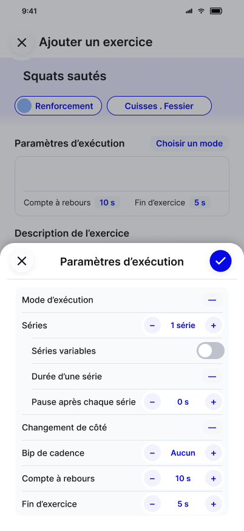

#### Création exercice — Paramètres en modale — Modale complète — mode activé

[Source Figma — `6407:9805`](https://www.figma.com/design/G6RY5Ebhgwb4AHIOYDwwvg?node-id=6407-9805)

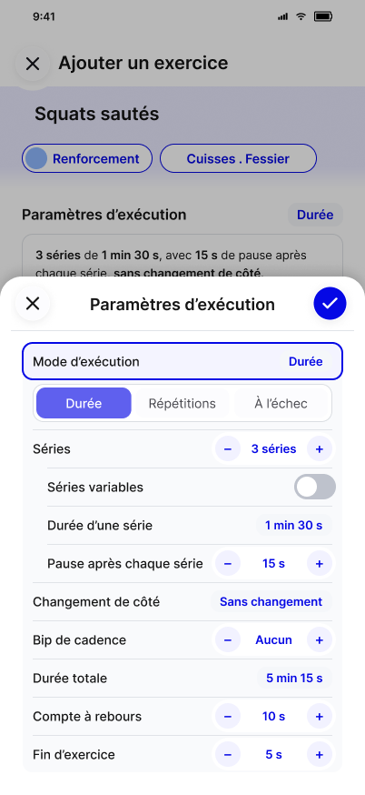

#### Création exercice — Paramètres en modale — Modale complète — steppers (séries, pauses)

[Source Figma — `6407:9966`](https://www.figma.com/design/G6RY5Ebhgwb4AHIOYDwwvg?node-id=6407-9966)

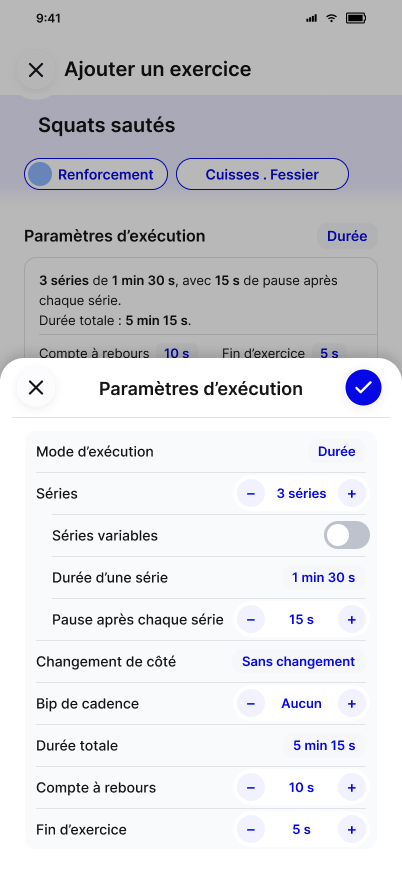

#### Création exercice — Paramètres en modale — Durée activée (roulette ouverte)

[Source Figma — `6407:10127`](https://www.figma.com/design/G6RY5Ebhgwb4AHIOYDwwvg?node-id=6407-10127)

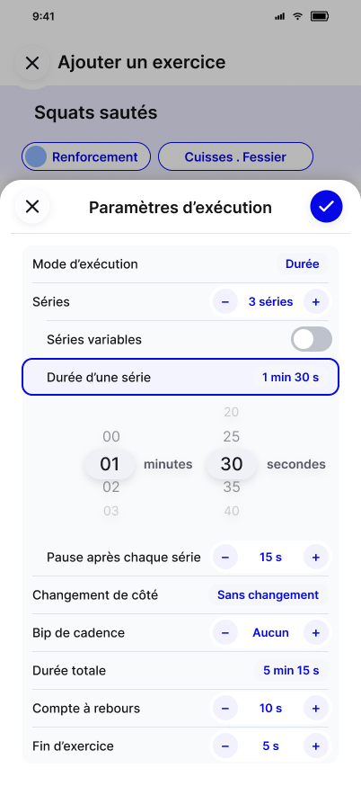

#### Création exercice — Paramètres en modale — Changement de côté activé (contrôle segmenté)

[Source Figma — `6407:10481`](https://www.figma.com/design/G6RY5Ebhgwb4AHIOYDwwvg?node-id=6407-10481)

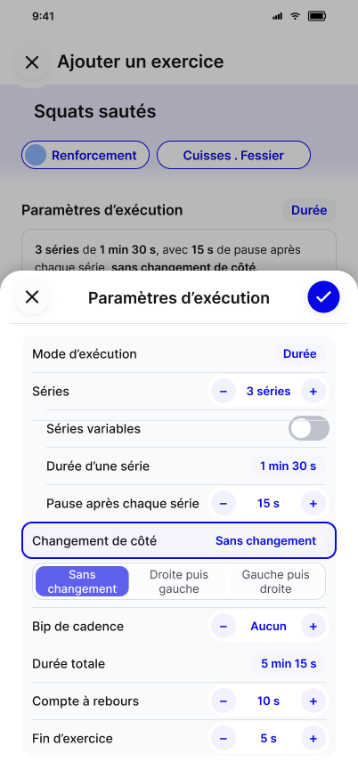

#### Création exercice — Paramètres en modale — Durée totale activée (roulette ouverte)

[Source Figma — `6411:9546`](https://www.figma.com/design/G6RY5Ebhgwb4AHIOYDwwvg?node-id=6411-9546)

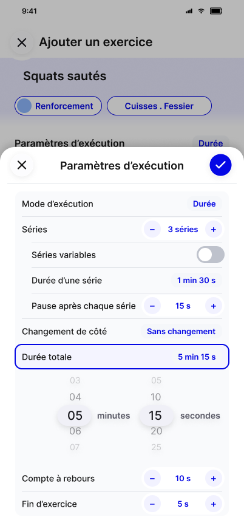

#### Création exercice — Paramètres en modale — Avec changement de côté (pause au changement de côté)

[Source Figma — `6411:9649`](https://www.figma.com/design/G6RY5Ebhgwb4AHIOYDwwvg?node-id=6411-9649)

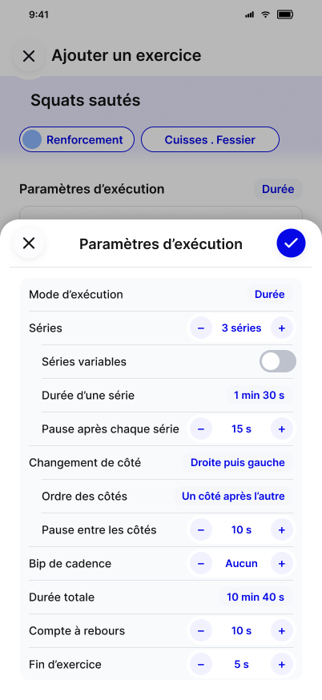

#### Création exercice — Paramètres en modale — Répétitions (mode activé)

[Source Figma — `6419:9847`](https://www.figma.com/design/G6RY5Ebhgwb4AHIOYDwwvg?node-id=6419-9847)

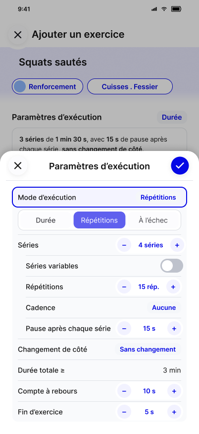

#### Création exercice — Paramètres en modale — À l’échec (mode activé)

[Source Figma — `6419:10028`](https://www.figma.com/design/G6RY5Ebhgwb4AHIOYDwwvg?node-id=6419-10028)

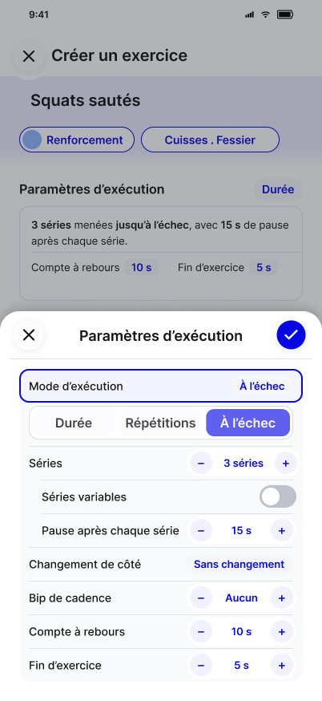

#### Création exercice — Paramètres en modale — Modale complète — steppers (séries, pauses) avec message de durée totale ajustée

[Source Figma — `6423:9953`](https://www.figma.com/design/G6RY5Ebhgwb4AHIOYDwwvg?node-id=6423-9953)

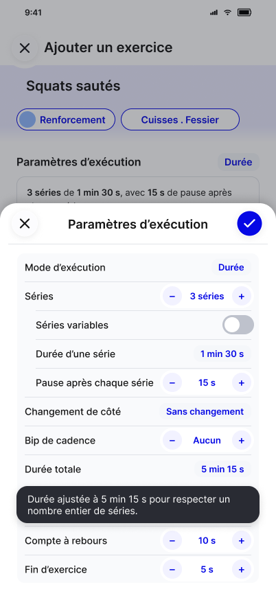

#### Séries variables — Durée variable (scénario A)

[Source Figma — `6665:24616`](https://www.figma.com/design/G6RY5Ebhgwb4AHIOYDwwvg?node-id=6665-24616)

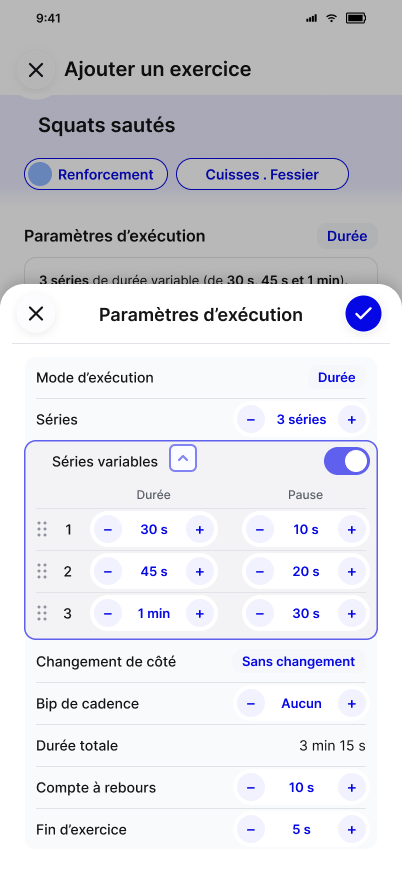

#### Séries variables — Répétitions variables (scénario E)

[Source Figma — `6665:24844`](https://www.figma.com/design/G6RY5Ebhgwb4AHIOYDwwvg?node-id=6665-24844)

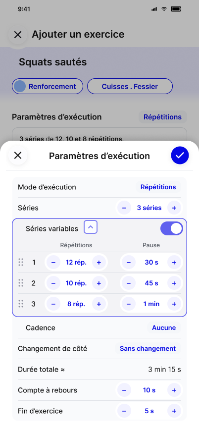

#### Séries variables — À l’échec variable (scénario F)

[Source Figma — `6665:25072`](https://www.figma.com/design/G6RY5Ebhgwb4AHIOYDwwvg?node-id=6665-25072)

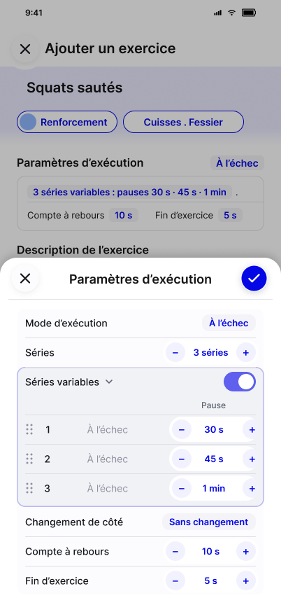

#### Séries variables — Douze séries (défilement — haut)

[Source Figma — `6665:25277`](https://www.figma.com/design/G6RY5Ebhgwb4AHIOYDwwvg?node-id=6665-25277)

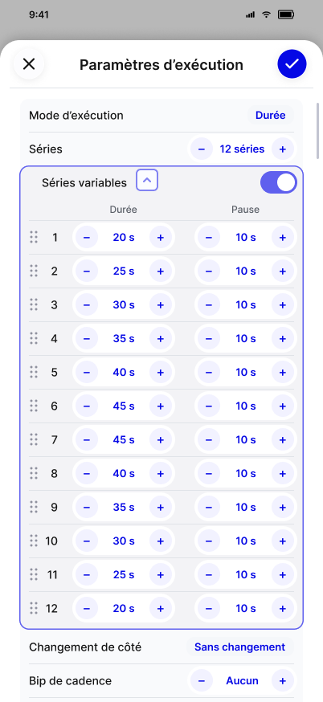

#### Ordre des côtés — Sélection : Un côté après l’autre

[Source Figma — `6665:26185`](https://www.figma.com/design/G6RY5Ebhgwb4AHIOYDwwvg?node-id=6665-26185)

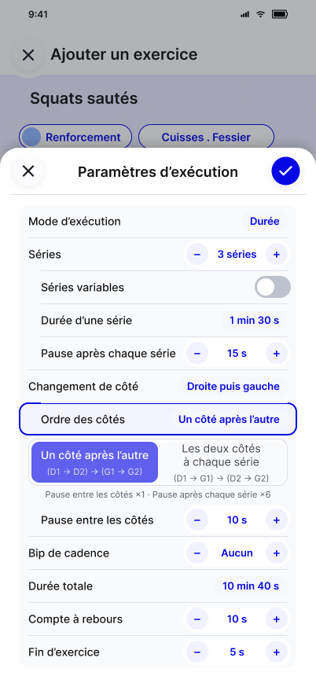

#### Séries variables + Les deux côtés à chaque série — (scénario D)

[Source Figma — `6665:26575`](https://www.figma.com/design/G6RY5Ebhgwb4AHIOYDwwvg?node-id=6665-26575)

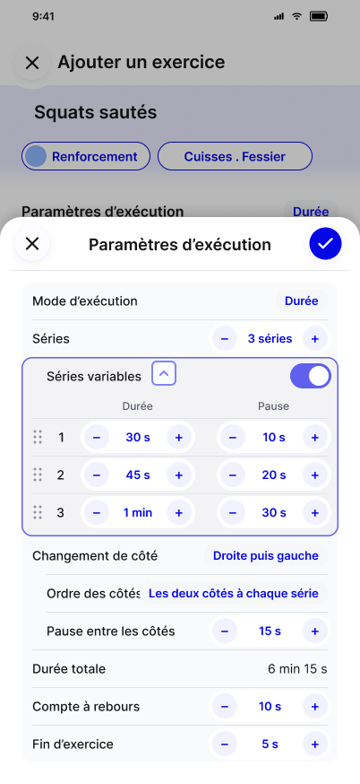

#### Une seule série — Options sans effet

[Source Figma — `6665:26822`](https://www.figma.com/design/G6RY5Ebhgwb4AHIOYDwwvg?node-id=6665-26822)

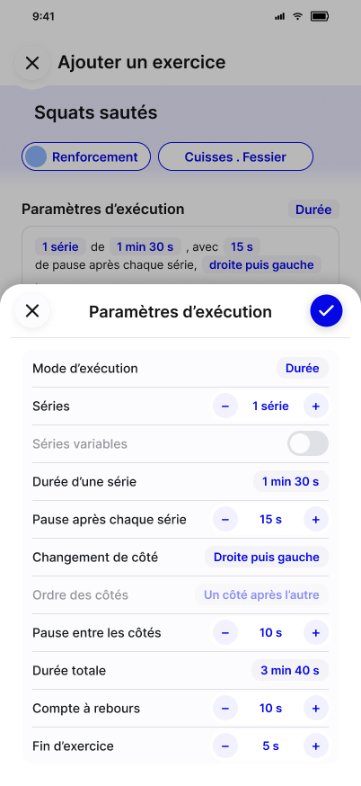

#### Changement de mode — Cibles à renseigner

[Source Figma — `6665:27008`](https://www.figma.com/design/G6RY5Ebhgwb4AHIOYDwwvg?node-id=6665-27008)

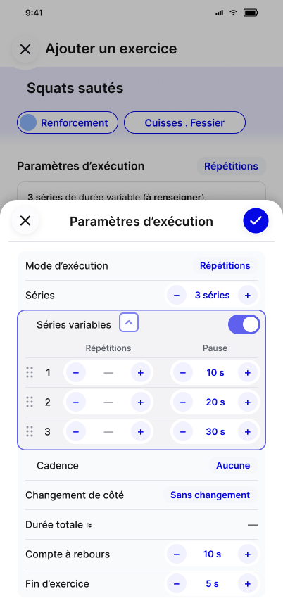

#### Validation impossible — Série incomplète

[Source Figma — `6665:27232`](https://www.figma.com/design/G6RY5Ebhgwb4AHIOYDwwvg?node-id=6665-27232)

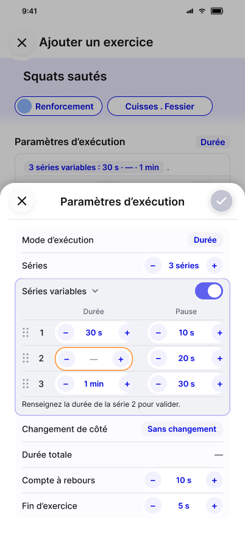

#### Séries variables — Tableau masqué

[Source Figma — `6665:27458`](https://www.figma.com/design/G6RY5Ebhgwb4AHIOYDwwvg?node-id=6665-27458)

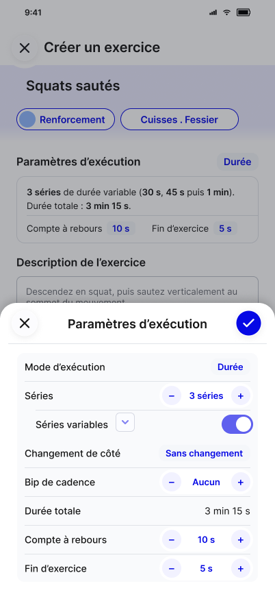

#### Séries variables — Déplacement d’une série

[Source Figma — `6665:27608`](https://www.figma.com/design/G6RY5Ebhgwb4AHIOYDwwvg?node-id=6665-27608)

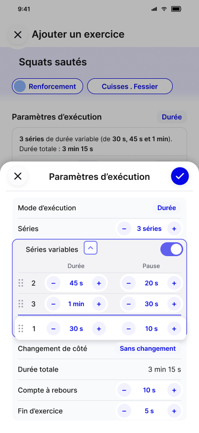

### Sélections, créations de référentiels et confirmations

Sélection simple Catégorie validée au toucher selon D-222 ; Zones multiples avec✓. Une coche de validation encore visible dans la maquette Catégorie est un écart de rendu, pas une nouvelle règle. Création avec clavier et suppression avec confirmation préservent le brouillon d’Exercice. Abandon Annuler conserve le formulaire ; Confirmer le quitte sans sauvegarder.

#### Ajouter un exercice — Catégories

[Source Figma — `4332:7095`](https://www.figma.com/design/G6RY5Ebhgwb4AHIOYDwwvg?node-id=4332-7095)

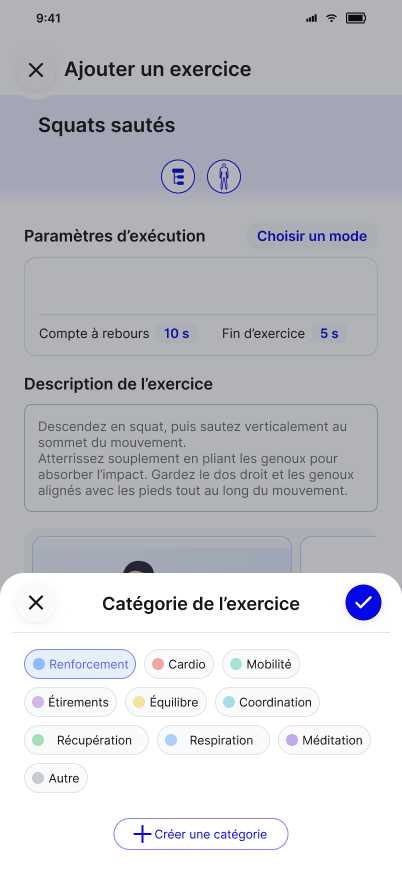

#### Ajouter un exercice — Nouvelle catégorie

[Source Figma — `4474:7157`](https://www.figma.com/design/G6RY5Ebhgwb4AHIOYDwwvg?node-id=4474-7157)

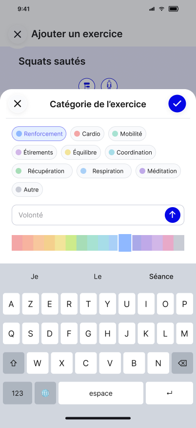

#### Ajouter un exercice — Zones corporelles

[Source Figma — `4478:7209`](https://www.figma.com/design/G6RY5Ebhgwb4AHIOYDwwvg?node-id=4478-7209)

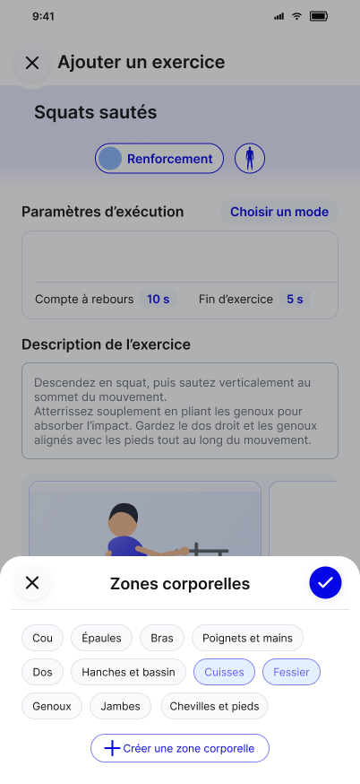

#### Ajouter un exercice — Nouvelle zone corporelle

[Source Figma — `4683:6336`](https://www.figma.com/design/G6RY5Ebhgwb4AHIOYDwwvg?node-id=4683-6336)

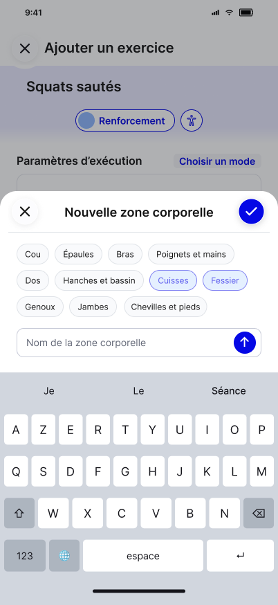

#### Ajouter un exercice — Catégorie — Appui long — Confirmation suppression

[Source Figma — `4861:6259`](https://www.figma.com/design/G6RY5Ebhgwb4AHIOYDwwvg?node-id=4861-6259)

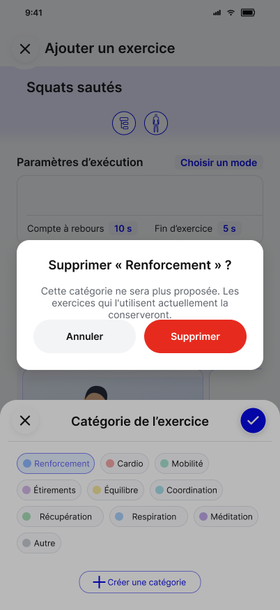

#### Ajouter un exercice — Zones corporelles — Appui long — Confirmation suppression

[Source Figma — `4861:6348`](https://www.figma.com/design/G6RY5Ebhgwb4AHIOYDwwvg?node-id=4861-6348)

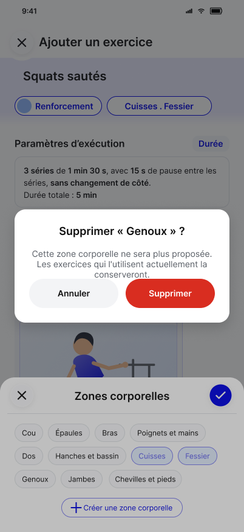

#### Modal — Abandonner la création de l’exercice

[Source Figma — `4714:6241`](https://www.figma.com/design/G6RY5Ebhgwb4AHIOYDwwvg?node-id=4714-6241)

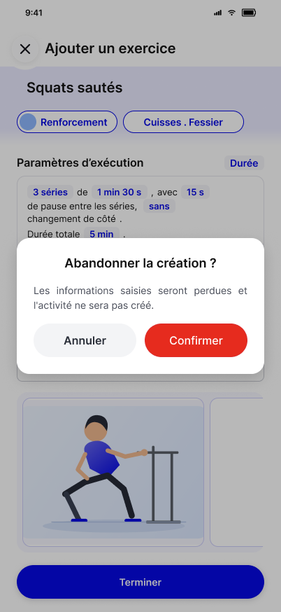

### Couverture et écarts de preuve

Le bas des12séries, le segmenté avec l’option alternée sélectionnée, le résumé Répétitions seul, le résumé uniforme alterné, l’activation par copie et G→D n’ont pas de frame dédiée dans le lot actuel. Leurs règles et recettes restent définies dans CE-UI-10/v13 ; aucune capture ancienne n’est présentée comme leur état actuel. Les captures des modales Répétitions et de l’état alterné montrent une partie de cette couverture. Voir l’état des lieux pour la liste exacte.

Les chiffres derrière le voile appartiennent au parent et ne prouvent pas un calcul du brouillon. Les anciens textes « pause entre les séries » et les5min visibles sur Modifier/confirmations restent des écarts connus : ne pas modifier les règles pour les reproduire. Les médias déjà associés sont consultables ; leur présence ne crée pas de capacité d’import supplémentaire.

### Cadence et phrase — états complémentaires du06/10

Contrats hôtes CE-T03-04 et CE-UI-10, sans nouvelle page fonctionnelle. Cadence commune facultative en Répétitions, Aucune initialement,1..60s ; sous la cible uniforme et avant Pause, hors lignes en variable. La roulette avec unité se place immédiatement sous la ligne ouverte. ✓ applique au parent et régénère une phrase unique ; toute la zone de phrase ouvre la feuille. Valeurs en gras, Inter13/20, largeur324 sur402, hauteur auto.

Les textes des frames13/14/phrase longue ne suivent pas tous la grammaire finale (par exemple «sans changement de côté» ou «à raison de…»). Ils servent de témoins de layout ; appliquer Phrase v1 sans reprendre ces textes ni leurs nombres comme règles. Suppression de cadence : fonction définie, contrôle exact non trouvé ; réserve CAD-V01. Aucune question sur l’existence de cette fonction n’est rouverte.

#### Répétitions avec cadence renseignée

[Figma7059:13302](https://www.figma.com/design/G6RY5Ebhgwb4AHIOYDwwvg?node-id=7059-13302) — nouvelle frame ; feuille sur formulaire, CE-UI-10.

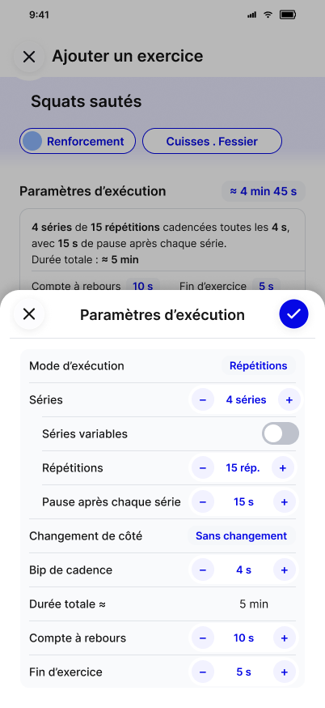

#### Cadence — roulette ouverte

[Figma7061:13383](https://www.figma.com/design/G6RY5Ebhgwb4AHIOYDwwvg?node-id=7061-13383) — nouvelle frame ; variante Secondes avec unité7130:13496.

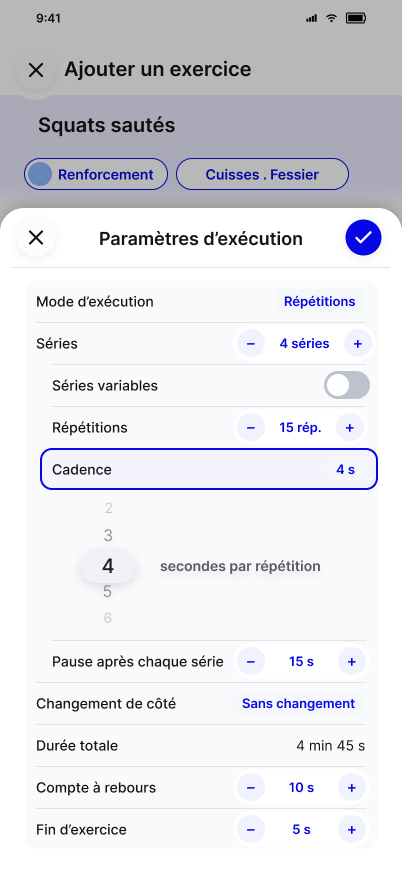

#### Changement de côté — état9b

[Figma7069:13464](https://www.figma.com/design/G6RY5Ebhgwb4AHIOYDwwvg?node-id=7069-13464) — copie supplémentaire présente ; même contrat CE-UI-10, pas nouvelle règle.

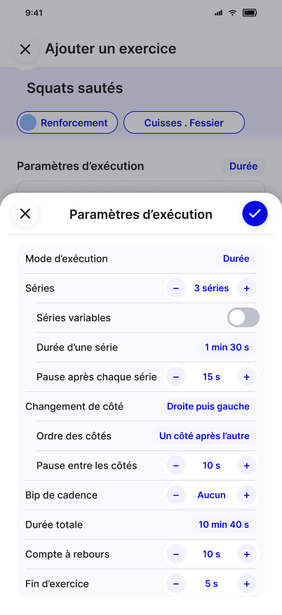

#### Répétitions sans cadence — état10b

[Figma7069:13573](https://www.figma.com/design/G6RY5Ebhgwb4AHIOYDwwvg?node-id=7069-13573) — copie supplémentaire présente ; Aucune est valide.

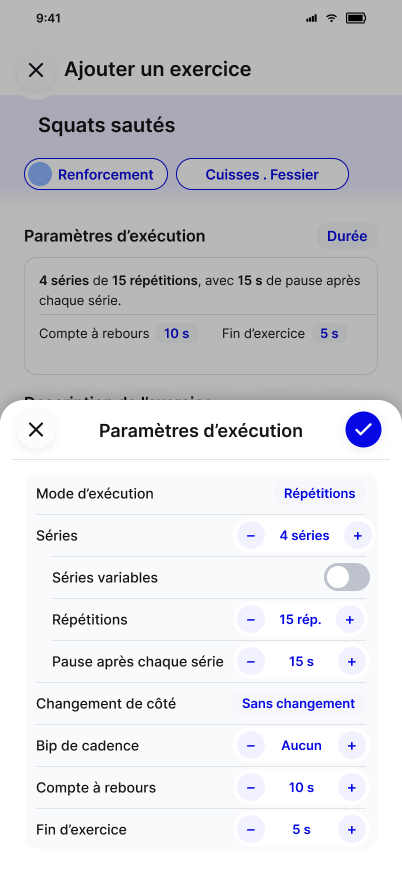

#### Phrase longue — parent de la feuille

[Figma7119:27855](https://www.figma.com/design/G6RY5Ebhgwb4AHIOYDwwvg?node-id=7119-27855) — nouvelle frame, CE-T03-04. Le nombre de caractères du nom est une annotation, pas une limite produit.

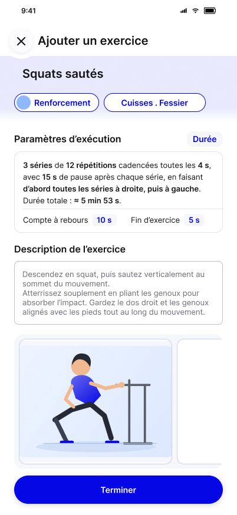

## Calendrier

### Objectif

Permettre à l’utilisateur de visualiser les Routines planifiées, de naviguer dans le calendrier et d’accéder rapidement à leur gestion.

### Ouverture

L’écran est accessible depuis l’onglet `Calendrier`.

### Contenu

L’écran comporte les vues `Jour`, `Semaine` et `Mois`. L’onglet `Calendrier` ouvre la vue `Jour`.

L’écran affiche :

- un calendrier ;
- uniquement les occurrences futures calculées à partir des Routines ;
- pour chaque occurrence : la Séance, sa couleur et la date / heure ;
- le bouton secondaire `+ Planifier`.

En vue Jour, un glissement horizontal de la grille vers la gauche affiche le jour suivant et un glissement vers la droite le jour précédent. Les chevrons restent disponibles. Un appui long sur une plage horaire prépare une nouvelle planification ; le texte `créneau libre` n’est pas utilisé.

### Cartes et commandes — vues Jour, Semaine et Mois

| Vue / état | Présentation et règle locale | Contrat |
|---|---|---|
| Jour : initial, appui long, après planification, créneau, jour suivant | Carte à x=80 ; séance 298 × 46, exercice 298 × 48 ; hauteur ajustable selon événement ; barre couleur de l’événement 4 ; nature26 ; titre13 gras ; heure/durée11 (`08 h · 13 min`) ; Lecture26 ; aucun Déployer | CE-UI-02 |
| Semaine : liste, mardi sélectionné, suppression et actions glissées | Carte354 × 95,5, sans barre ; nature26 liste/tai-chi ; badge heure `08:00` ; classement catégorie puis étiquette (séance) ou zones (exercice) ; durée et sablier sur ligne des valeurs | CE-UI-03 |
| Semaine : séance déployée | Hauteur de référence254,5 ; détail des exercices et ligne de récurrence avec calendrier ; badge heure et durée conservés | CE-UI-03 |
| Choisir séance/exercice depuis Calendrier | Cartes de choix354 × 91, radio, sans durée ni Déployer/Lecture ; zones d’Exercice : cadre de coupe à8 px du radio ; Séance : minimum20 conservé | CE-UI-04 |
| Mois et état vide | Conserver leur structure fonctionnelle ; appliquer segmenté/navigation communs ; ne pas ajouter une carte Jour à une cellule Mois | CE-UI-03 |

Les séances restent sans photo. En Semaine comme en Jour, les cartes d’Exercice restent sans photo et conservent leur icône de nature, même si un média est associé (D-260). Les deux modales de suppression conservent les cartes Semaine actualisées en arrière-plan.

Le segmenté Jour/Semaine/Mois mesure354 sur référence402 : padding4, gaps4, options112,67. Aujourd’hui et Planifier restent à32 sans cible44 ajoutée : exception acceptée, à revoir et développer après T04. La navigation utilise les quatre nouveaux dessins DSF. Ces règles ne déplacent pas les jalons fonctionnels existants.

### Comportement

En vue Jour, toucher une carte ouvre sa planification ; aucune action glissée n’est proposée. En vue Semaine, toucher la zone principale d’une occurrence ouvre la modification de sa Routine dans l’écran de planification prérempli. La carte possède également une zone distincte pour la déployer ou la replier, une zone `Démarrer`, et révèle uniquement `Dupliquer` et `Supprimer` par glissement gauche. `Dupliquer` identifie la Routine source à partir de l’occurrence, crée un brouillon reprenant la même source (`SESSION` ou `ACTIVITY`) et tous ses paramètres de planification, puis ouvre ce brouillon en modification. Aucune nouvelle Routine n’est persistée avant validation explicite de l’utilisateur.

L’état obtenu par glissement ne remplace pas la liste : il décale la carte concernée pour révéler ses actions. Les autres jours et occurrences restent rendus à leur position chronologique.

En vue Semaine, la liste est organisée chronologiquement en sections journalières. Lorsque le défilement place un nouveau jour en tête de la liste, le curseur coloré de la barre de semaine sélectionne ce jour. Inversement, sélectionner un jour dans la barre positionne sa section comme première section visible de la liste.

La barre de semaine occupe toute la largeur utile. Les sept jours forment sept colonnes flexibles de même largeur ; aucune largeur de cellule ni position horizontale issue du gabarit `402` n’est conservée en dur. Les espacements s’adaptent afin que les sept jours restent entièrement visibles dès `360` points et utilisent l’espace supplémentaire sur un grand téléphone. La grille de la vue Mois applique la même répartition en sept colonnes égales.

`+ Planifier` ouvre le bottom sheet `Choisir une séance`. La liste y défile si nécessaire ; toucher une Séance valide le choix et ferme la modale sans CTA bas (D-222).

Lorsqu’une occurrence future est exécutée en avance, elle est considérée exécutée pour cette occurrence et n’est plus proposée à son horaire initial.

Lorsqu’une occurrence planifiée arrive à échéance sans avoir été exécutée, elle disparaît de l’interface. Elle n’est pas affichée dans le Suivi du MVP.

La suppression ou modification d’une Routine agit sur les occurrences futures conformément aux règles de planification.

### Confirmation — Suppression d’une planification

Pour une planification unique, `Supprimer` ouvre un dialogue centré comportant `Annuler` et `Confirmer`. Après confirmation, la planification est supprimée ; la source associée et les Exécutions historiques sont conservées.

Pour une planification périodique, le dialogue à trois choix présente sur sa première ligne les deux actions destructives `Seulement cette occurrence` et `Toutes les occurrences à venir`, puis `Annuler` en pleine largeur sur une seconde ligne. Les deux choix peuvent mener au même écran de résultat dans le prototype ; la vue Semaine montre ensuite l’occurrence retirée. Les Exécutions historiques restent conservées.

### Vues principales et états intégrés

#### Calendrier — Semaine

[Source Figma — `1992:5101`](https://www.figma.com/design/G6RY5Ebhgwb4AHIOYDwwvg?node-id=1992-5101)

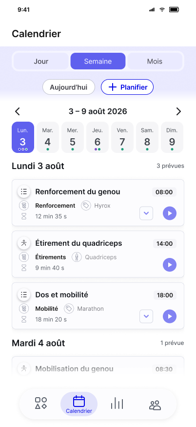

#### Calendrier — Mois

[Source Figma — `1992:5237`](https://www.figma.com/design/G6RY5Ebhgwb4AHIOYDwwvg?node-id=1992-5237)

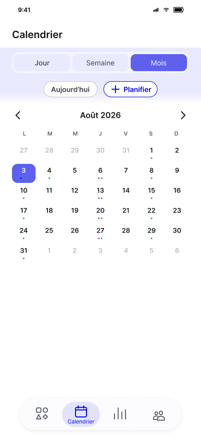

#### Calendrier — Jour — MVP

[Source Figma — `1992:5510`](https://www.figma.com/design/G6RY5Ebhgwb4AHIOYDwwvg?node-id=1992-5510)

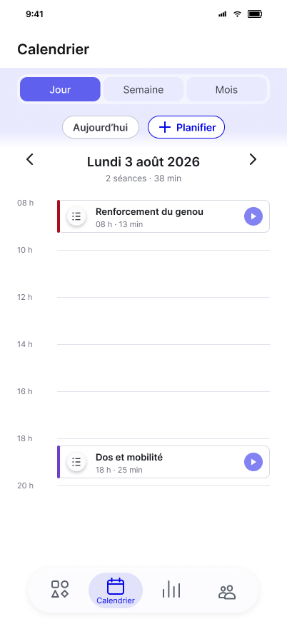

#### Calendrier — Jour — Appui long — MVP

[Source Figma — `1992:5602`](https://www.figma.com/design/G6RY5Ebhgwb4AHIOYDwwvg?node-id=1992-5602)

Sélection d’une plage horaire avant planification

#### Calendrier — Jour — MAJ — MVP

[Source Figma — `1992:5697`](https://www.figma.com/design/G6RY5Ebhgwb4AHIOYDwwvg?node-id=1992-5697)

Résultat attendu après enregistrement

#### Calendrier — Jour — Créneau à planifier — MVP

[Source Figma — `1992:5794`](https://www.figma.com/design/G6RY5Ebhgwb4AHIOYDwwvg?node-id=1992-5794)

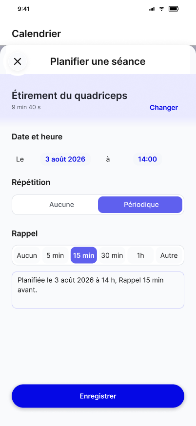

Étape intermédiaire issue de la plage sélectionnée

#### Calendrier — Semaine — Actions glissées

[Source Figma — `1992:5962`](https://www.figma.com/design/G6RY5Ebhgwb4AHIOYDwwvg?node-id=1992-5962)

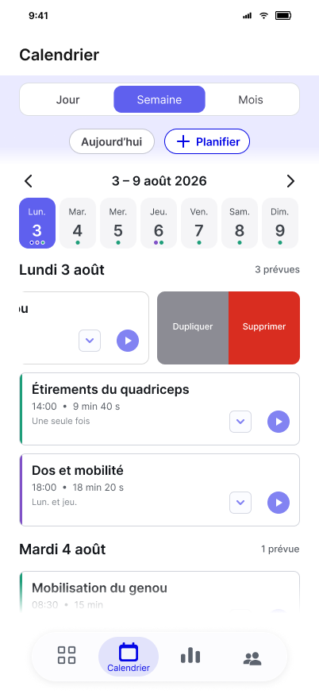

`Dupliquer` et `Supprimer` sur une occurrence hebdomadaire

#### Calendrier — Semaine — Séance déployée

[Source Figma — `1992:6389`](https://www.figma.com/design/G6RY5Ebhgwb4AHIOYDwwvg?node-id=1992-6389)

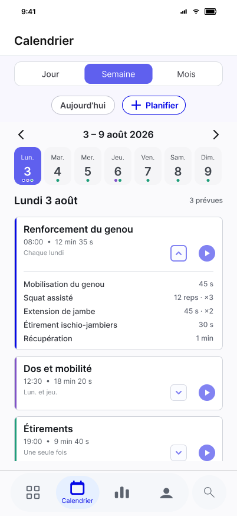

Détail d’une occurrence et zone `Démarrer`

#### Calendrier — Jour suivant — Glissement gauche — MVP

[Source Figma — `2059:267`](https://www.figma.com/design/G6RY5Ebhgwb4AHIOYDwwvg?node-id=2059-267)

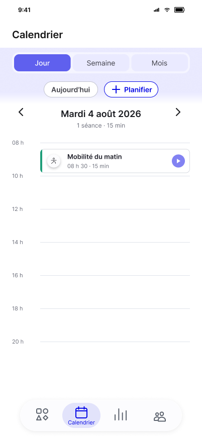

Résultat d’un glissement gauche ou du chevron suivant

#### Calendrier — Semaine — Après suppression d’une planification

[Source Figma — `2074:86`](https://www.figma.com/design/G6RY5Ebhgwb4AHIOYDwwvg?node-id=2074-86)

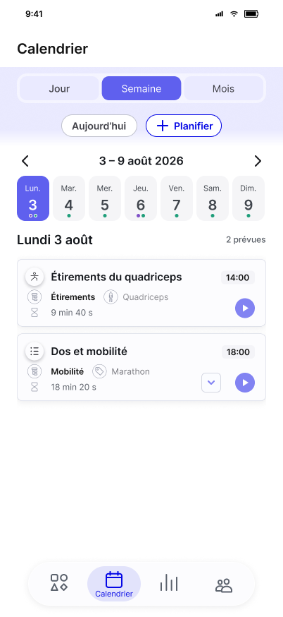

Liste hebdomadaire actualisée après suppression

#### Calendrier — Semaine — Étirements — Actions glissées

[Source Figma — `2094:86`](https://www.figma.com/design/G6RY5Ebhgwb4AHIOYDwwvg?node-id=2094-86)

Même interaction appliquée à une autre occurrence représentée

#### Calendrier — Jour — État vide

[Source Figma — `2128:86`](https://www.figma.com/design/G6RY5Ebhgwb4AHIOYDwwvg?node-id=2128-86)

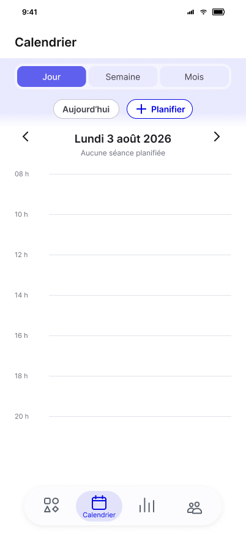

État sans occurrence planifiée

#### Calendrier — Semaine — Mardi sélectionné

[Source Figma — `2252:86`](https://www.figma.com/design/G6RY5Ebhgwb4AHIOYDwwvg?node-id=2252-86)

Mardi placé en tête ; lundi se trouve au-dessus et n’est plus visible

### Modales, panneaux et confirmations

#### Modal — Supprimer une planification unique — Calendrier

[Source Figma — `1992:5365`](https://www.figma.com/design/G6RY5Ebhgwb4AHIOYDwwvg?node-id=1992-5365)

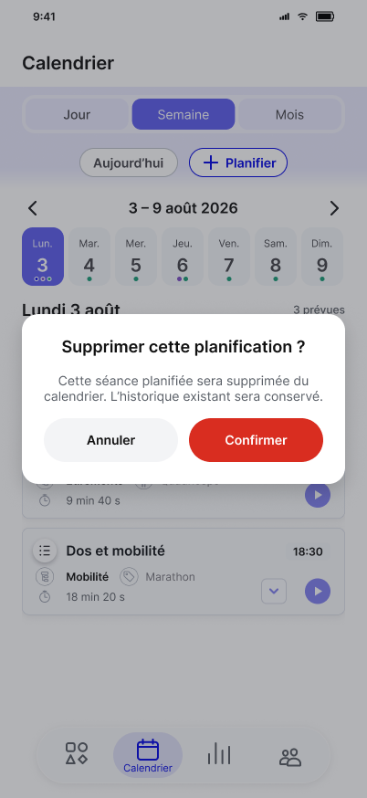

#### Modal — Supprimer des occurrences — Calendrier

[Source Figma — `1992:6102`](https://www.figma.com/design/G6RY5Ebhgwb4AHIOYDwwvg?node-id=1992-6102)

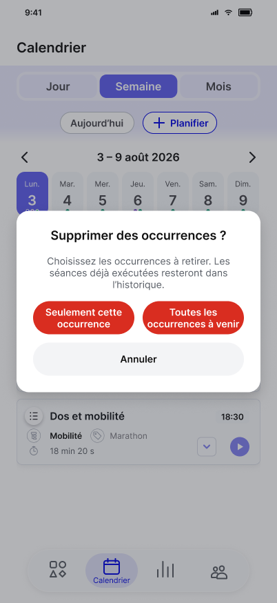

## Planifier une séance ou un exercice

### Choix et remplacement de la source

La sélection de Séance ou d’Exercice réutilise exactement les variantes `Choix calendrier ou planification` (CE-UI-04), sans variante spécifique Planification. Largeur354, marges24 sur402 ; titre15 Semi Bold, classement en pastilles20, valeurs16 ; radio à droite, sans badge durée ni Lecture/Déployer. Exercice : cadre des zones arrêté à8 px du radio (D-263) ; Séance : minimum20 conservé. Séance sans vignette ; Exercice à gouttière permanente : photo associée ou icône de nature, règles RG-11 à RG-13 révisées par D-260. Aucun visuel en liste mixte. La source `SESSION`/`ACTIVITY` vient de la donnée, jamais du titre.

Tous les états du formulaire (création, date, heure, rappel, semaines, aucune répétition) utilisent les icônes communes, l’animation Discret sur champs/steppers et la navigation DSF lorsqu’elle est présente. Ils conservent leurs contrôles, validation et persistance existants. La correction des segmentés354 concerne les contrôles à trois choix de ce gabarit, pas les roulettes ou le sélecteur de rappel à deux extrémités fixes. Contrat CE-UI-05.

### Objectif

Créer ou modifier une Routine, c’est-à-dire la planification d’une **Séance ou d’un Exercice persistant**.

### Ouverture

L’écran est accessible :

- depuis `Calendrier > + Planifier` ;
- depuis `Modifier la planification` sur une Routine existante ;
- depuis l’action glissée `Planifier` d’une Séance active ou d’un Exercice actif dans son Catalogue.

### Paramètres

La planification comporte :

- la source associée, de type `SESSION` ou `ACTIVITY` ;
- la date de début ;
- l’heure ;
- le mode de répétition ;
- les paramètres de périodicité lorsque nécessaire ;
- une date de fin lorsque nécessaire ;
- le rappel ;
- le bouton `Enregistrer`.

### Modes de planification

Le MVP propose :

- `Aucune` : une seule occurrence ;
- `Périodique` : répétition selon une périodicité hebdomadaire définie par une fréquence en semaines et un ou plusieurs jours de la semaine. Dans le MVP, seule cette périodicité hebdomadaire est disponible.

Il n’existe pas de mode `Quotidien` distinct. Une planification périodique sélectionnant les sept jours toutes les semaines équivaut à une exécution quotidienne.

En mode périodique :

- la fréquence est un entier supérieur ou égal à 1 ;
- un ou plusieurs jours sont sélectionnés ;
- la date de fin est obligatoire.

Dans l’interface, la répétition est présentée de manière compacte avec `Toutes les`, puis `X semaine(s) jusqu’au <date>`, et les jours sélectionnés en dessous. Aucun niveau de titre `Quand ?` n’est affiché ; `Date de début` et `Heure` sont des libellés de blocs au même niveau visuel.

Le contrôle de rappel comporte deux options fixes : `Aucun` à gauche et `Autre` à droite. Les choix rapides intermédiaires (`5 min`, `15 min`, `30 min`, `1 h` dans le MVP) sont placés dans une zone horizontale défilante. Cette zone peut recevoir de nouveaux choix rapides sans déplacer les deux options fixes ni réduire la taille des libellés. Le récapitulatif de planification est multi-ligne et reste intégralement contenu dans son cadre.

La flèche ouvrant le détail du `Rappel` est alignée sur la marge droite du contenu, comme les autres commandes de section. Son pictogramme reste centré dans une boîte visuelle de `24 × 24` et dans une cible tactile d’au moins `48 × 48`.

Une Routine ne possède qu’une seule heure d’Exécution. Si l’utilisateur souhaite plusieurs horaires pour une même source, il crée plusieurs Routines distinctes.

### Validation

`Enregistrer` crée ou met à jour la Routine.

Les occurrences futures sont recalculées à partir de la nouvelle planification. Les occurrences déjà historisées ne sont pas modifiées.

### Planification depuis les Catalogues — D-206

Une Séance et un Exercice persistant sont tous deux planifiables directement. L’action `Planifier` d’une carte ouvre le même parcours de planification avec la source préremplie. Le parcours depuis le Calendrier permet de choisir une source planifiable parmi les Séances et les Exercices persistants. La famille d’écran historiquement nommée `Planifier une séance` est donc un gabarit de planification générique ; les frames Figma actuellement nommées avec `séance` constituent l’évidence visuelle de cette variante, mais ne limitent plus le comportement fonctionnel aux seules Séances.

### Prochaine planification dans les Catalogues — D-206 révisée par D-238

Les cartes des deux Catalogues n’affichent aucune prochaine planification et ne réservent aucun espace à cette information, même si une occurrence future existe. La source SESSION/ACTIVITY reste directement planifiable et le calcul des occurrences reste disponible.

### Extension future du parcours de planification — Parcours

Le parcours générique de planification est conçu pour accepter à terme un Parcours comme troisième source. Dans le MVP, les sources actives sont Séance et Exercice ; l’option Parcours reste désactivée tant que la version correspondante n’est pas livrée. Lorsqu’elle le sera, aucune nouvelle famille d’écran de planification ne devra être créée : le même gabarit est réutilisé avec la source Parcours.

### Modales, panneaux et confirmations

#### Modal — Choisir une séance — Planification — Liste longue

[Source Figma — `1992:6249`](https://www.figma.com/design/G6RY5Ebhgwb4AHIOYDwwvg?node-id=1992-6249)

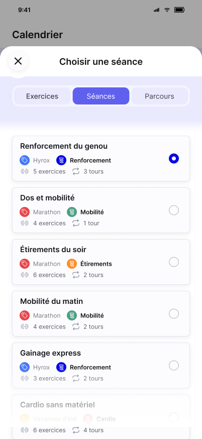

Bottom sheet défilant ouvert par `+ Planifier`

#### Planifier une séance — Test picker date ouvert

[Source Figma — `1992:6622`](https://www.figma.com/design/G6RY5Ebhgwb4AHIOYDwwvg?node-id=1992-6622)

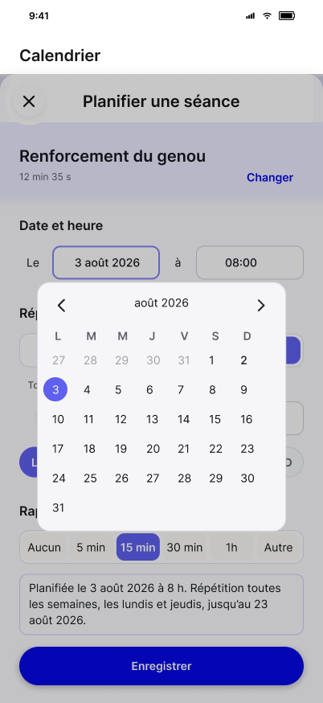

Sélecteur de date compact

#### Planifier une séance — Test picker rappel personnalisé ouvert

[Source Figma — `1992:7187`](https://www.figma.com/design/G6RY5Ebhgwb4AHIOYDwwvg?node-id=1992-7187)

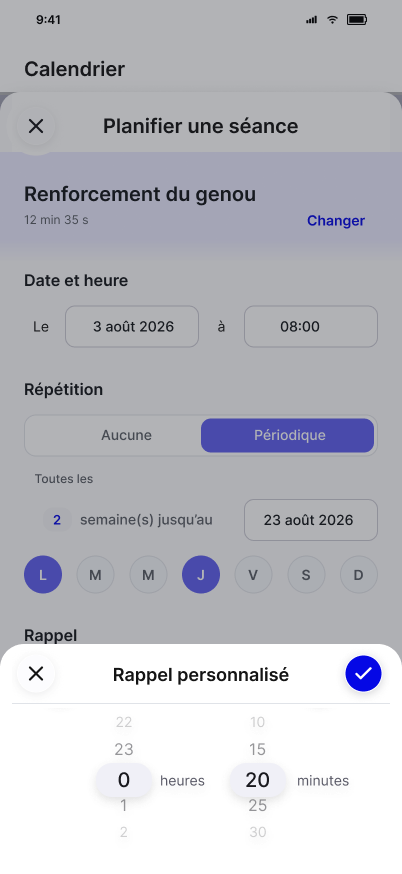

Réglage compact du délai de rappel avec validation explicite

#### Planifier une séance — Chioisir la séance

[Source Figma — `1992:7861`](https://www.figma.com/design/G6RY5Ebhgwb4AHIOYDwwvg?node-id=1992-7861)

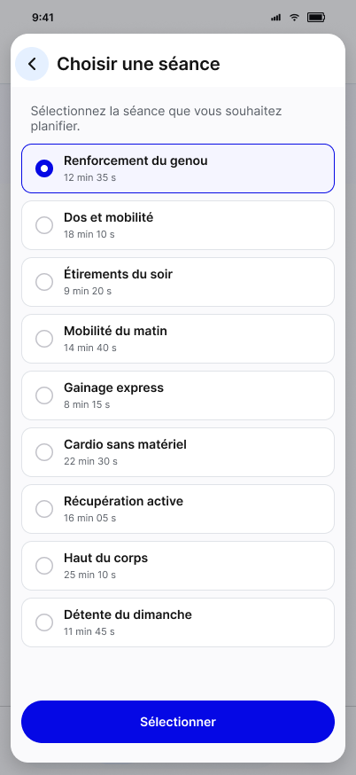

Liste de remplacement de la Séance associée

#### Modal — Choisir un exercice — Planification — Liste longue

[Source Figma — `5451:4272`](https://www.figma.com/design/G6RY5Ebhgwb4AHIOYDwwvg?node-id=5451-4272)

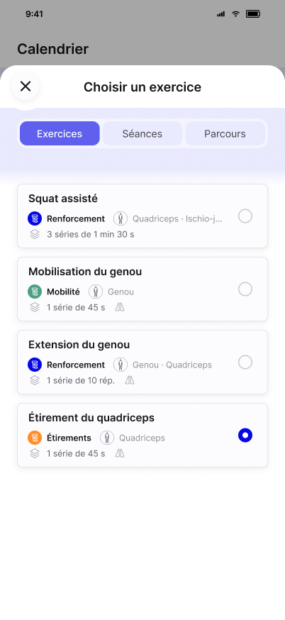

### Vues principales et états intégrés

#### Planifier une séance — Création

[Source Figma — `1992:6838`](https://www.figma.com/design/G6RY5Ebhgwb4AHIOYDwwvg?node-id=1992-6838)

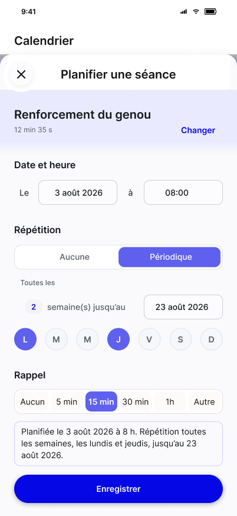

#### Planifier une séance — Test rappel personnalisé sélectionné

[Source Figma — `1992:7369`](https://www.figma.com/design/G6RY5Ebhgwb4AHIOYDwwvg?node-id=1992-7369)

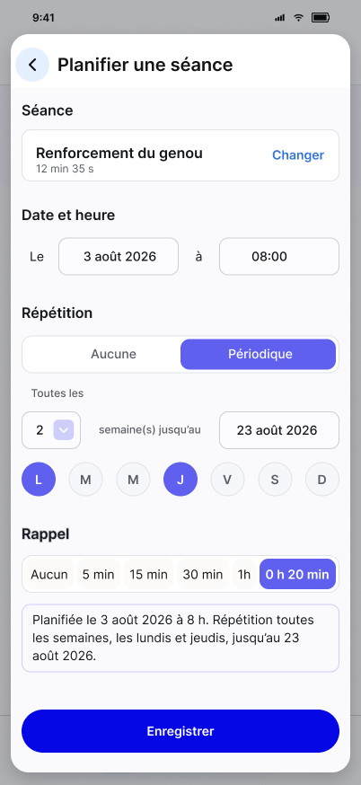

Valeur répercutée dans le formulaire avant enregistrement

#### Planifier une séance — Stepper Nombre de semaines

[Source Figma — `1992:7537`](https://www.figma.com/design/G6RY5Ebhgwb4AHIOYDwwvg?node-id=1992-7537)

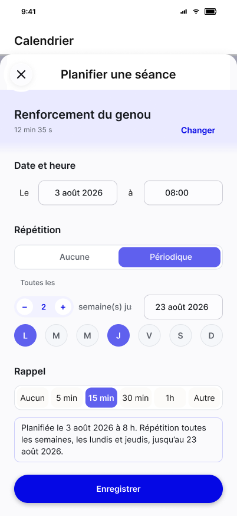

Stepper intégré − / valeur / +, sans modale de roulette

#### Planifier une séance — Aucune répétition

[Source Figma — `1992:7716`](https://www.figma.com/design/G6RY5Ebhgwb4AHIOYDwwvg?node-id=1992-7716)

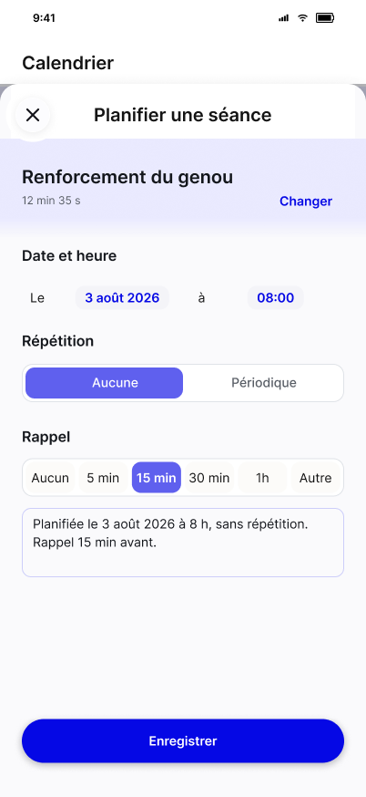

Variante de planification unique

## Exécution — séance ou exercice

### Écarts de terminologie constatés

Le vocabulaire d’interface attendu est **Exercice** (glossaire : anciennement Activité). Les captures Figma sont conservées sans retouche : les confirmations `1992:8224` et `1992:8326`, ainsi que certains contrôles de sélection, affichent encore « activité ». Leur rendu n’est donc pas une preuve de conformité terminologique. Les identifiants techniques `ActivityDefinition`, `SessionActivity` et `ACTIVITY` ne sont pas renommés.

**Circuit et Tour — D-209** : le Circuit est le conteneur ordonné d’exercices ; un Tour est une exécution de ce Circuit. Le nombre de Tours règle ses répétitions. Le Parcours reste autonome. Les captures peuvent encore porter les anciens libellés ; elles ne remettent pas en cause cette décision.

### Objectif

Guider l’utilisateur pendant l’Exécution avec une hiérarchie visuelle adaptée à une lecture rapide et à distance.

Un seul layout standard est utilisé pour les Exercices en Durée, en Répétitions et À l’échec ainsi que pour leur phase de Récupération. Le comportement temporel s’adapte à la phase du Plan d’Exécution sans changer la structure générale de l’écran.

### Entrée dans l’écran et démarrage

L’écran peut être ouvert :

- depuis la zone principale d’une carte du Catalogue ;
- depuis l’action `Démarrer` d’une occurrence planifiée, y compris lorsqu’une occurrence future est exécutée en avance.

L’ouverture de l’écran ne démarre pas immédiatement l’Exercice.

Avant le démarrage, l’utilisateur déclenche la Séance depuis la commande centrale.

Avant le démarrage, Retour renvoie dans l’application à l’écran depuis lequel l’Exécution a été lancée. Dans le prototype MVP, toutes les zones du bouton Retour renvoient explicitement au `Catalogue des séances — Séance déployée` (`1992:10014`) ; aucune ne pointe vers l’état vide du Catalogue.

Le Compte à rebours initial est alors exécuté s’il est configuré avec une durée supérieure à zéro, puis le premier Exercice commence.

### Hiérarchie des informations affichées

L’écran affiche, de haut en bas :

- le nom de la Séance ;
- l’état des sons / annonces vocales ;
- le nom de l’Exercice en cours ;
- le compteur de Série lorsque l’élément exécuté est un Exercice ;
- l’indicateur temporel principal ;
- la Série sous l’indicateur principal, à gauche, et le Tour à droite. À partir de `360` points et avec le texte à `100 %` ou `135 %`, les deux valeurs restent sur une même ligne dans deux zones flexibles symétriques, séparées par un repère central de largeur fixe ;
- une progression discrète du Tour ;
- la zone `À suivre` avec le nom et la durée ou le nombre de reps de l’Exercice suivant ;
- les commandes `Réinitialiser`, `Pause` et `Exercice suivant` ;
- le temps total écoulé et la durée estimée d’exécution de la Séance ; le temps écoulé inclut toutes les phases effectivement exécutées, Compte à rebours initial et Fin de séance compris, mais exclut les Pauses manuelles ; durée prévisionnelle déterminable sans symbole avec cadence, approximative≈ sans cadence et borne≥ en présence de composante non estimable ;
- une barre de progression globale structurée en segments correspondant aux Tours, conformément au prototype Figma. Elle occupe exactement la largeur utile sans débordement. Les segments se répartissent dans cette largeur après déduction des espacements et ne conservent jamais la largeur fixe du gabarit `402`. Le remplissage représente l’avancement dans le Plan d’Exécution complet, Compte à rebours initial et `SESSION_END` compris, selon la pondération définie dans les chapitres 08 et 10 ; il n’est pas le simple rapport `temps écoulé / durée estimée d’exécution`. Il atteint `100 %` uniquement à l’achèvement de `SESSION_END`. Dans T04, les étapes chronométrées sont pondérées par leur durée planifiée ; les Séries Répétitions sans cadence et À l’échec acquièrent leur part avec `Suivant`. Les Séries cadencées suivent une progression temporelle continue, plafonnée à la fin nominale sans terminer la Série ; `Suivant` acquiert le reste éventuel. La Pause abandonne la fraction d’intervalle pour la progression et la reprise lance un intervalle complet, sans effacer le temps actif réel. Les Pauses manuelles n’augmentent pas le remplissage.

Le Cycle n’est jamais affiché. Le nombre total d’étapes et la position sous la forme `x sur y` ne sont pas affichés dans le MVP.

Le moteur d’Exécution peut néanmoins conserver ces informations pour son fonctionnement interne.

### Exercice défini par une durée

Pour un Exercice en mode Durée ou une phase de Récupération, le temps est présenté sous forme de compte à rebours.

Lorsque le compte à rebours atteint zéro, l’Exercice se termine normalement et l’Exécution passe à la suite.

Si l’utilisateur appuie sur `Exercice suivant` avant zéro, une confirmation est demandée. Après confirmation, l’Exercice est enregistré avec le statut métier `Partielle` et l’Exécution continue.

### Exercice défini par un nombre de répétitions

Pour un Exercice défini par un nombre de répétitions, l’écran conserve le même layout que pour un Exercice chronométré.

Le temps actif est affiché par un chronomètre croissant à partir de00:00. Sans cadence, aucune durée prescrite ; avec cadence, Ri×Ci définit une fin nominale, sans fin automatique de Série.

Sans cadence, le cercle du minuteur effectue une rotation complète par minute :

- une rotation complète représente 60 secondes ;
- à `01:00`, il recommence une nouvelle rotation ;
- le chronomètre continue à croître (`01:01`, `01:02`, etc.).

Sans cadence, un bip minute est émis. Avec cadence : première répétition immédiate, signal à chaque intervalle, dernier distinct à la fin nominale puis plus de bip de cadence. Suivant reste la fin normale avant/après nominal ; aucun bip minute ajouté. Les états avant/après nominal et Pause/Reprise sont à matérialiser graphiquement (matrice CAD-V02–04), sans nouvelle règle métier.

`Pause` suspend le chronomètre et la rotation du cercle. `Reprendre` les relance depuis l’état exact où ils ont été suspendus.

L’utilisateur termine normalement chaque Série avec `Suivant`. Cette action ne crée pas un Exercice au statut Partielle : elle valide la fin normale de la Série en mode Répétitions ou À l’échec.

### Séries

Lorsqu’un Exercice possède plusieurs Séries :

- `Série x/y` indique la Série en cours ;
- chaque Série exécute la durée cible, les répétitions cibles ou se poursuit jusqu’à l’échec selon le mode ;
- Chaque Série possède une Pause, y compris la dernière. En unilatéral, chaque Pi est exécutée une fois ; en bilatéral Un côté après l’autre, chaque Pi deux fois et PC une fois ; en Les deux côtés à chaque série, chaque Pi une fois et PC une fois par paire. Seule PN terminale est remplacée par R si R>0 dans une occurrence de Séance ; aucune Récupération en direct. N=1 est normalisé en uniforme/Un côté après l’autre dès le brouillon. Référence normative : v13 §§3–5, D-247 à D-250.
- si l’Exercice est bilatéral, la Pause entre les côtés éventuelle est exécutée selon l’Ordre des côtés.

T04 développe toutes les Séries, les répétitions de Tour et les passages de côté dans le Plan d’Exécution avant le démarrage.

### Récupérations

Deux phases distinctes peuvent exister. `SIDE_RECOVERY` matérialise la Pause entre les côtés d’un Exercice bilatéral et intervient entre le premier et le second côté. `POST_ACTIVITY_RECOVERY` matérialise la Récupération après exercice portée par l’occurrence de Séance ; elle intervient après l’occurrence, y compris après le dernier Exercice avant `SESSION_END` et après chaque passage dans le Circuit à chaque Tour.

La valeur `postActivityRecoverySeconds = 0` ne crée pas de phase chronométrée positive. Les récupérations ne sont plus affichées sur les cartes de Composition (D-238), quelle que soit leur valeur. La zone `À suivre` prépare l’élément qui succède à la phase courante. Les données de résultat distinguent la Pause entre les côtés de la récupération après occurrence.

### Commandes principales

Les trois emplacements de commande restent identiques. Pendant un Exercice, ils affichent :

- `Réinitialiser l’exercice` ;
- `Pause` ;
- `Exercice suivant`.

Pendant la Récupération, la première commande devient `Réinitialiser la récupération`.

Leur position et leur rôle visuel ne changent pas entre Durée et Répétition.

### Réinitialiser l’Exercice

L’action ouvre la modale de confirmation.

Après confirmation :

- la Série / Exercice courant recommence depuis son état initial ;
- pour un Exercice chronométré, le compte à rebours retrouve sa durée initiale ;
- pour un Exercice en Répétitions ou À l’échec, le chronomètre d’Exercice revient à `00:00` ;
- la cible de répétitions n’est pas modifiée ;
- le temps total déjà écoulé dans la Séance reste conservé ;
- la position dans la séance et la répétition en cours restent inchangées.

Pendant `SIDE_RECOVERY` ou `POST_ACTIVITY_RECOVERY`, la confirmation réinitialise uniquement le compte à rebours de la phase de récupération courante. Elle ne rejoue aucune Série déjà acquise et ne modifie pas les résultats antérieurs.

### Mise en pause

Toucher `Pause` suspend immédiatement l’Exécution et ouvre la modale `Séance en pause`.

La pause suspend :

- le compte à rebours ou le chronomètre d’Exercice ;
- l’enchaînement automatique ;
- le temps actif ;
- les bips et annonces liés à la progression ;
- les animations de progression.

La modale propose :

- `Reprendre la séance` ;
- `Arrêter la séance`.

`Reprendre la séance` restaure l’état exact de l’Exercice.

`Arrêter la séance` termine l’Exécution avec le statut `Interrompue`. Dans T04, il ouvre l’écran de fin minimale ; l’ouverture de la Synthèse appartient à la tranche qui livre cette dernière.

Il n’existe pas de commande directe d’arrêt depuis l’écran principal d’Exécution.

### Exercice suivant

Le comportement dépend de la phase courante :

- **Exercice en Répétitions ou À l’échec** : termine normalement la Série courante et passe à la pause, à la Série suivante ou à l’Exercice suivant selon le plan ;
- **Exercice chronométré avant zéro** : ouvre la modale de confirmation ; après confirmation, l’Exercice est enregistré avec le statut `Partielle`, puis l’Exécution continue ;
- **Phase de récupération avant zéro** : ouvre la même confirmation ; après confirmation, la durée partielle de la phase courante (`SIDE_RECOVERY` ou `POST_ACTIVITY_RECOVERY`) est conservée et le Plan poursuit vers son étape suivante ;
- **Exercice chronométré arrivé à zéro** : la transition est automatique.

### Navigation pendant l’Exécution

L’ordre d’Exécution est déterminé par le Plan d’Exécution.

L’utilisateur ne peut pas sélectionner librement un autre Exercice ni revenir à un Exercice déjà terminé.

### Guidage sonore

Dans T04, Sons et Annonces vocales sont activés par défaut au début de chaque Exécution. Leur état peut être changé pendant l’Exécution, mais cette tranche ne lit ni n’enregistre encore de préférence utilisateur correspondante ; leur configuration depuis le Profil appartient à une tranche ultérieure.

Au début d’un Exercice, son nom peut être annoncé vocalement lorsque les Annonces vocales sont actives. Au début d’une phase de récupération chronométrée (`SIDE_RECOVERY` ou `POST_ACTIVITY_RECOVERY`), l’annonce est `Récupération`.

Pour les Exercices chronométrés, les signaux sonores de fin de compte à rebours sont appliqués conformément aux règles métier définies pour le MVP.

Répétitions sans cadence/À l’échec : aucun signal de fin de compte à rebours et bip minute. Répétitions cadencées : signal nominal final distinct, sans transition automatique ni bip minute ; chronomètre toujours croissant.

### Arrière-plan et verrouillage

Si l’application passe en arrière-plan ou si l’écran se verrouille :

- le Plan d’Exécution continue selon ses horodatages de référence ;
- l’Exercice chronométré ne se fige pas ;
- au retour, l’application reconstitue l’Exercice et la position temporelle qui auraient dû être atteintes, plutôt que de reprendre le compteur à l’endroit où l’interface a été suspendue ;
- les sons et annonces sont maintenus dans la mesure permise par iOS et Android.

Une mise en pause de sécurité est appliquée en cas d’inexercice prolongée :

- pour un Exercice chronométré, si aucune interaction n’a eu lieu 30 minutes après sa fin théorique ;
- pour une Série Répétitions cadencée,30min après la fin nominale recalculée sans interaction ;
- pour un Exercice en Répétitions sans cadence ou À l’échec,2h sans interaction depuis son démarrage.

Le comportement précis fait l’objet du spike technique prévu avant le développement complet du moteur d’Exécution.

### Fin de l’Exécution

Lorsque le Plan d’Exécution arrive à son terme, l’Exécution est enregistrée et l’écran `Synthèse de séance` est affiché.

La Séance source et la Routine éventuelle ne sont jamais modifiées par l’Exécution.

### Exercice lancé directement depuis le catalogue

L’Exécution directe conserve une préparation système fixe de `5 s`. Cette durée n’est pas un attribut de l’Exercice. Les anciennes captures dédiées sont retirées de ce parcours ; les variantes actuelles sont présentées ci-dessous.

L’écran réutilise le moteur et le Shell d’Exécution. Il développe Séries, Pauses, côtés et Récupération, sans structure de Séance artificielle ni phase `SESSION_END`. Après la dernière phase, un signal ouvre immédiatement la Synthèse.

### Confirmation — Réinitialisation de l’Exercice

Référence Figma : `1992:8224`, `Modal — Réinitialiser l’exercice`. Le dialogue flottant centré utilise `Overlay / Decision Dialog`, variante `PrimaryTone=Primary,SecondaryTone=Neutral,Actions=2` (`2590:2926`), instance `2591:3047`. Il mesure `354 × 215`.

#### Objectif

Permettre de recommencer l’Exercice / Série en cours depuis son état initial sans revenir en arrière dans la Séance.

#### Ouverture

La modale s’affiche après appui sur `Réinitialiser l’exercice`.

L’Exécution est suspendue pendant l’affichage de la modale.

#### Contenu

**Titre**

> Réinitialiser l’exercice ?

**Message**

> L’exercice en cours recommencera depuis le début. La progression de la séance sera conservée.

**Actions**

- `Annuler`, action neutre grise ;
- `Confirmer`, action primaire bleue.

#### Comportement

Après confirmation :

- l’Exercice / Série courante reste l’Exercice courant ;
- un Exercice chronométré retrouve sa durée initiale ;
- un Exercice en Répétitions ou À l’échec retrouve un chronomètre d’Exercice à `00:00` ;
- la cible de répétitions reste inchangée ;
- le temps global déjà écoulé dans la Séance est conservé ;
- le Circuit, le Tour courant et le Cycle technique restent inchangés ;
- l’Exercice redémarre selon son comportement normal.

`Annuler` ferme la modale et reprend l’Exercice à son état précédent.

Les deux boutons `147 × 48` sont alignés sur une ligne avec un écart de `12`. Les libellés sont centrés horizontalement et verticalement. La dernière ligne du message et les actions sont séparées par `spacing/16`.

### Confirmation — Passage à l’Exercice suivant

Référence Figma : `1992:8326`, `Modal — Passer à l’exercice suivante`. Le dialogue flottant centré utilise `Overlay / Decision Dialog`, variante `PrimaryTone=Primary,SecondaryTone=Neutral,Actions=2` (`2590:2926`), instance `2591:3058`. Il mesure `354 × 215`.

#### Objectif

Confirmer l’interruption anticipée d’un Exercice chronométré.

#### Ouverture

Cette modale s’affiche lorsque l’utilisateur appuie sur `Exercice suivant` avant la fin d’un Exercice chronométré.

Elle ne s’affiche pas pour un Exercice en mode Répétitions ou À l’échec : dans ce cas, `Suivant` constitue la validation normale de la Série courante.

#### Contenu

**Titre**

> Passer à l’exercice suivante ?

**Message**

> La séance continuera avec l’exercice suivante, elle sera enregistrée comme partiellement exécutée.

**Actions**

- `Annuler`, action neutre grise ;
- `Confirmer`, action primaire bleue.

#### Comportement

Après confirmation :

- l’Exercice chronométré est arrêté avant son terme ;
- sa durée réellement exécutée est conservée ;
- son statut métier devient `Partielle` ;
- la progression est mise à jour ;
- l’Exercice suivant démarre selon les règles normales du Plan d’Exécution.

`Annuler` ferme la modale et reprend l’Exercice en cours.

Les deux boutons `147 × 48` sont alignés sur une ligne avec un écart de `12`. Les libellés sont centrés horizontalement et verticalement. La dernière ligne du message et les actions sont séparées par `spacing/16`. Le terme visuel `partiellement exécutée` décrit le résultat à l’utilisateur ; le statut métier enregistré reste `Partielle`.

### Confirmation — Pause / arrêt de l’Exécution

Référence Figma : `1992:8428`, `Modal — Séance en pause`. Le dialogue flottant centré utilise `Overlay / Decision Dialog`, variante `PrimaryTone=Primary,SecondaryTone=Danger,Actions=2` (`2590:2960`), instance `2591:3070`. Il mesure `354 × 194`.

#### Objectif

Suspendre temporairement une Exécution puis permettre soit de la reprendre, soit de l’arrêter.

#### Ouverture

La modale est affichée après appui sur `Pause`.

L’Exécution est immédiatement suspendue.

#### Contenu

**Titre**

> Séance en pause

**Message**

> L’exercice « Squats assistés » est suspendue.  
> Le chronomètre reprendra là où il s’est arrêté.

Ce texte décrit le temps actif. En cadence, l’intervalle sonore reprend entier et la progression reste au dernier intervalle complet, selon la spécification Cadence ; la fraction déjà dépensée reste comptée au réel.

Le nom d’Exercice est dynamique ; `Squats assistés` est uniquement la donnée d’illustration de la frame.

**Actions**

- `Reprendre la séance`, action primaire bleue
- `Arrêter la séance`, action destructive rouge

Les deux boutons `147 × 48` sont alignés sur une ligne avec un écart de `12`. Les libellés sont centrés horizontalement et verticalement. La dernière ligne du message et les actions sont séparées par `spacing/16`.

#### Reprendre la séance

Ferme la modale et reprend le plan conservé. En cadence, la fraction d’intervalle abandonnée pour la progression n’est pas reprise : nouvel intervalle complet, temps actif cumulé conservé.

Pour un Exercice chronométré, le compte à rebours reprend.  
Pour un Exercice en Répétitions ou À l’échec, le chronomètre croissant reprend.

#### Arrêter la séance

Met fin à l’Exécution :

- la progression réellement effectuée est enregistrée ;
- le statut de l’Exécution devient `Interrompue` ;
- l’écran `Synthèse de séance` est affiché.

La modale ne peut être fermée que par l’une des deux actions prévues.

### Lecture des variantes avec média

Les vues avec cercle et texte, bascule basse avec média, bascule haute avec texte ou média, et média plein écran appartiennent à cette même famille. Les règles de bascule, de lecture et de continuité de l’exécution sont définies dans [Médias pendant l’Exécution](../CONCEPTION-EXECUTION-MEDIA.md), décision D-203. **Périmètre MVP : les états média représentés sont inclus (D-203 corrigée dans #247), sans ajout implicite de parcours d’import.**

### Vues principales et états intégrés

#### Exécution d'une séance — Démarrée

[Source Figma — `1992:8132`](https://www.figma.com/design/G6RY5Ebhgwb4AHIOYDwwvg?node-id=1992-8132)

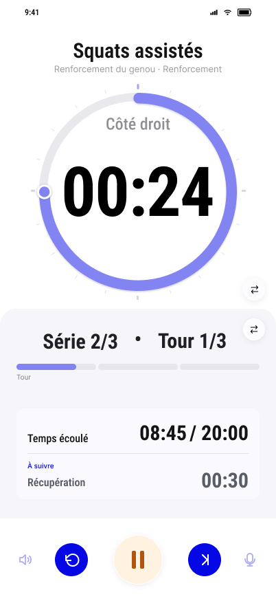

#### Exécution d'un exercice — Démarrée

[Source Figma — `4968:8188`](https://www.figma.com/design/G6RY5Ebhgwb4AHIOYDwwvg?node-id=4968-8188)

#### Exécution d'une séance — Démarrée — Bips et vocal désactivés

[Source Figma — `1992:8530`](https://www.figma.com/design/G6RY5Ebhgwb4AHIOYDwwvg?node-id=1992-8530)

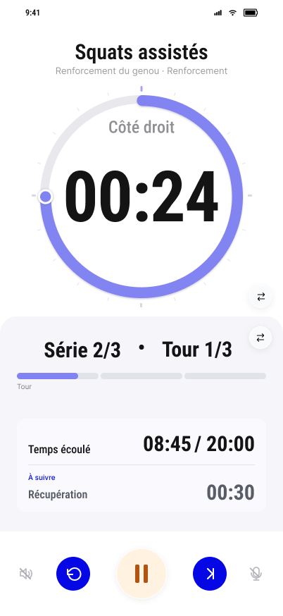

État alternatif des deux commandes de guidage sonore

#### Exécution d'une séance — Initial

[Source Figma — `1992:8626`](https://www.figma.com/design/G6RY5Ebhgwb4AHIOYDwwvg?node-id=1992-8626)

La Séance ne démarre pas automatiquement ; Retour mène au Catalogue renseigné dans le prototype

### Modales, panneaux et confirmations

#### Modal — Réinitialiser l’activité

[Source Figma — `1992:8224`](https://www.figma.com/design/G6RY5Ebhgwb4AHIOYDwwvg?node-id=1992-8224)

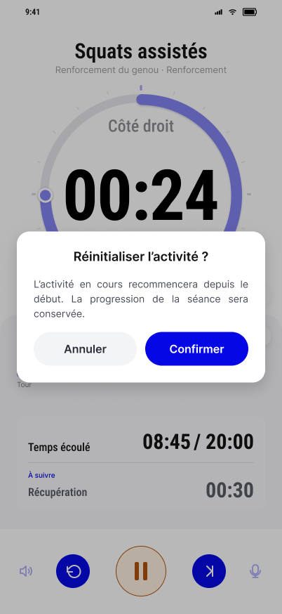

#### Modal — Passer à l’activité suivante

[Source Figma — `1992:8326`](https://www.figma.com/design/G6RY5Ebhgwb4AHIOYDwwvg?node-id=1992-8326)

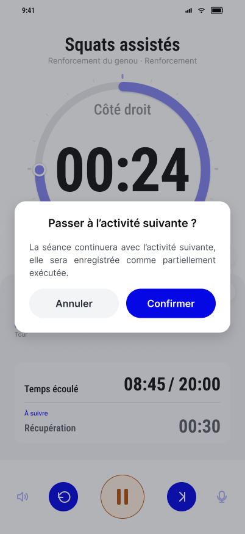

#### Modal — Séance en pause

[Source Figma — `1992:8428`](https://www.figma.com/design/G6RY5Ebhgwb4AHIOYDwwvg?node-id=1992-8428)

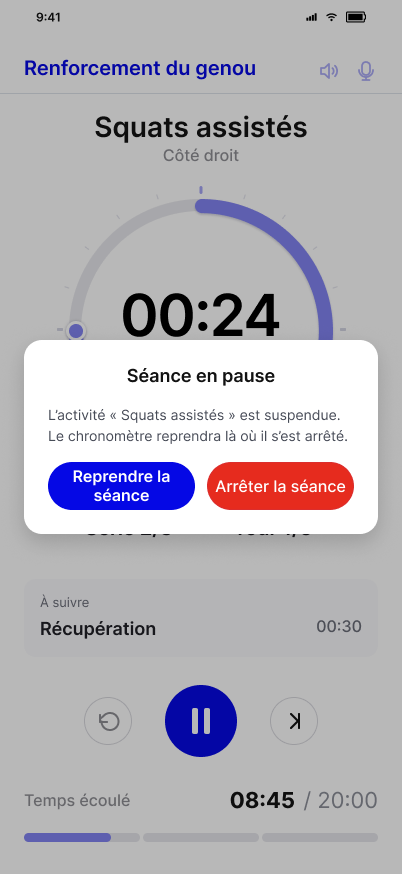

### Variantes Information et Média

#### Exécution d'un exercice — Initial — Bascule basse (média) avec Cercle

[Source Figma — `4997:6113`](https://www.figma.com/design/G6RY5Ebhgwb4AHIOYDwwvg?node-id=4997-6113)

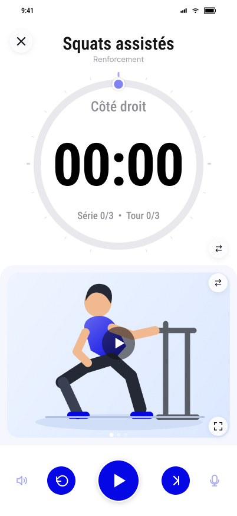

#### Exécution d'un exercice — Initial — Bascule haute avec média

[Source Figma — `5588:4363`](https://www.figma.com/design/G6RY5Ebhgwb4AHIOYDwwvg?node-id=5588-4363)

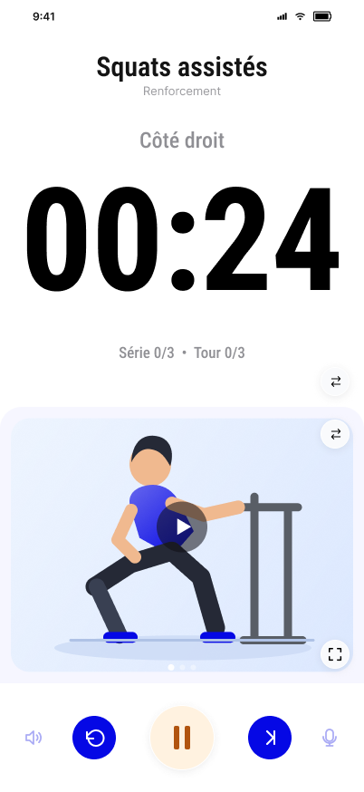

#### Exécution d'un exercice — Média plein écran

[Source Figma — `5009:6069`](https://www.figma.com/design/G6RY5Ebhgwb4AHIOYDwwvg?node-id=5009-6069)

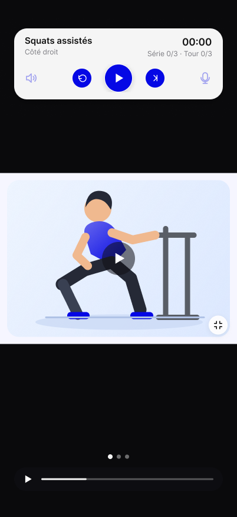

#### Exécution d'un exercice — Initial - Cercle avec Texte

[Source Figma — `5021:5994`](https://www.figma.com/design/G6RY5Ebhgwb4AHIOYDwwvg?node-id=5021-5994)

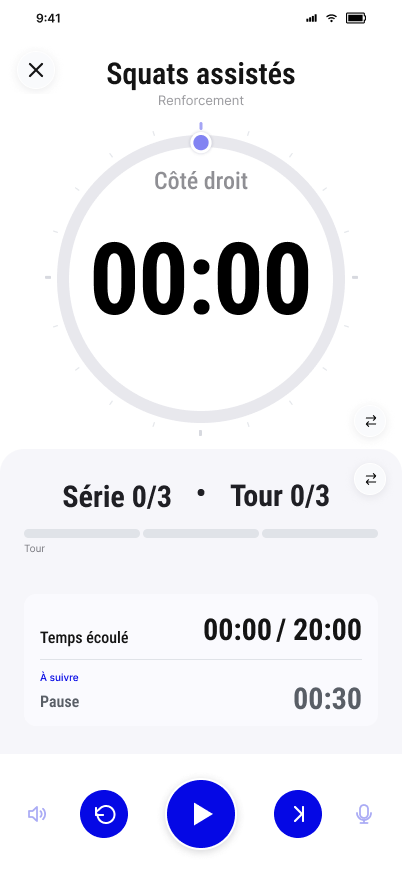

#### Exécution d'un exercice — Démarré —  Bascule haute avec texte

[Source Figma — `5581:4257`](https://www.figma.com/design/G6RY5Ebhgwb4AHIOYDwwvg?node-id=5581-4257)

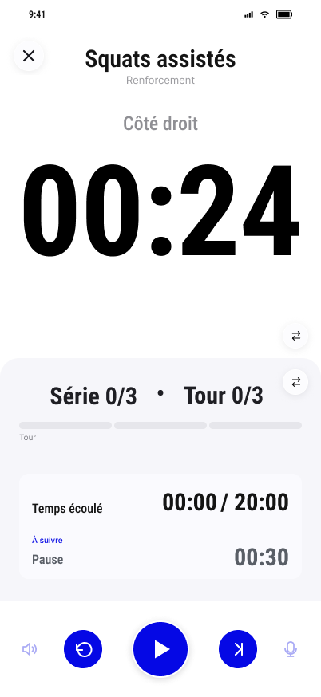

## Synthèse — séance ou exercice

Variantes partielles illustrées ci-dessous, couvertes par CE-UI-08 :

- `4760:6448 — Synthèse de séance — Partielle — Évaluation initiale` ;
- `4760:6500 — Synthèse de séance — Partielle — Ressenti sélectionné`.

### Objectif

Présenter un bilan immédiatement compréhensible et recueillir le ressenti obligatoire avant de quitter l’écran.

### Contenu

L’écran affiche notamment :

- le nom de la Séance ;
- le statut de l’Exécution ;
- la durée réellement exécutée ;
- le nombre d’Exercices réalisés ;
- le nombre d’Exercices partielles, uniquement s’il est supérieur à zéro ;
- le choix du ressenti ;
- un champ `Commentaire` facultatif ;
- le bouton `Enregistrer`.

Les Tours et Cycles ne sont pas affichés dans la Synthèse du MVP.

Aucun parcours détaillé des Exercices n’est affiché sur cet écran dans le MVP.

### Statut

Une Exécution terminant normalement son Plan peut être `Terminée` ou `Partielle` selon les Exercices réellement réalisés.

Une Exécution arrêtée volontairement depuis la modale de pause est enregistrée avec le statut `Interrompue`.

### Ressenti

Le ressenti est obligatoire.

Le MVP propose trois niveaux, conformément au wireframe.

Le libellé `Comment s’est passée la séance ?` utilise `type.cardTitle` (`16/20`, Semi Bold). À la taille système standard, son conteneur occupe la largeur utile et maintient le libellé sur une ligne sur les largeurs prises en charge de `360` à `440` points ; la référence Figma `402` utilise une largeur de `322` points. Avec l’agrandissement d’accessibilité, le conteneur grandit verticalement et autorise le retour à la ligne sans chevaucher les choix de ressenti.

Le bouton `Enregistrer` reste désactivé tant qu’aucun ressenti n’a été sélectionné.

### Commentaire

Le `Commentaire` est facultatif et limité à **200 caractères maximum**.

Le Ressenti est obligatoire dès lors que cet écran de Synthèse est présenté, y compris pour une Exécution `Interrompue`. Il peut être absent uniquement lorsqu’une interruption technique n’a pas permis de présenter la Synthèse.

Il est enregistré avec l’Exécution.

### Navigation

`Enregistrer` enregistre le ressenti et le Commentaire puis ouvre le `Suivi`.

Aucune action `Relancer la séance` n’est prévue dans le MVP.

### Résultat d’un exercice lancé directement

Le Ressenti est obligatoire pour activer `Enregistrer`; le Commentaire reste facultatif. La finalisation enregistre l’origine `ACTIVITY`, alimente les statistiques compatibles sans compter une Séance et restaure le contexte appelant : Catalogue des Exercices dans son état précédent, ou Calendrier avec date/vue conservées (CE-T03-14).

### Vues principales et états intégrés

#### Synthèse de séance — Terminée —  Évaluation initiale

[Source Figma — `1992:8718`](https://www.figma.com/design/G6RY5Ebhgwb4AHIOYDwwvg?node-id=1992-8718)

#### Synthèse de séance — Terminée — Ressenti sélectionné

[Source Figma — `1992:8780`](https://www.figma.com/design/G6RY5Ebhgwb4AHIOYDwwvg?node-id=1992-8780)

#### Synthèse d'exécution — Exercice Terminé —  Évaluation initiale

[Source Figma — `4968:8055`](https://www.figma.com/design/G6RY5Ebhgwb4AHIOYDwwvg?node-id=4968-8055)

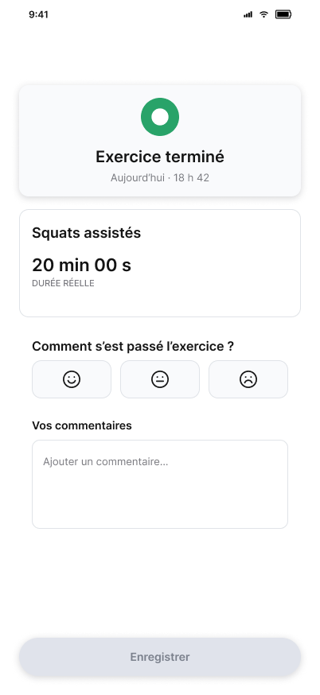

#### Synthèse d'exécution — Exercice Terminé —  Ressenti sélectionné

[Source Figma — `4968:8105`](https://www.figma.com/design/G6RY5Ebhgwb4AHIOYDwwvg?node-id=4968-8105)

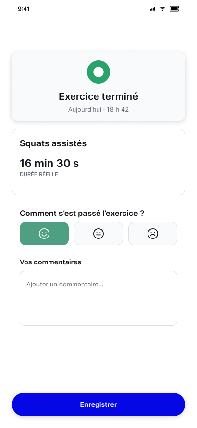

#### Synthèse de séance — Partielle — Évaluation initiale

[Source Figma — `4760:6448`](https://www.figma.com/design/G6RY5Ebhgwb4AHIOYDwwvg?node-id=4760-6448)

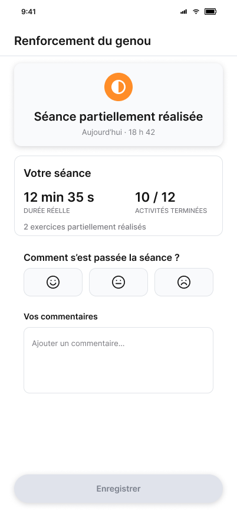

#### Synthèse de séance — Partielle — Ressenti sélectionné

[Source Figma — `4760:6500`](https://www.figma.com/design/G6RY5Ebhgwb4AHIOYDwwvg?node-id=4760-6500)

## Suivi — Séances

### Objectif

Permettre à l’utilisateur de consulter les Exécutions enregistrées sur des cartes à deux lignes, sans déploiement (D-262).

Les occurrences planifiées non exécutées ne sont pas affichées dans le Suivi du MVP.

### Contenu

L’écran comporte :

- la destination active `Séances` ;
- les commandes `Filtrer` et `Trier`, visibles mais désactivées dans ce contexte ;
- une liste chronologique des Exécutions.

Chaque carte présente deux lignes sans déploiement ; les détails restent conservés dans l’instantané et les résultats, sans carte déployée accessible au MVP.

La Vue d’ensemble est hors MVP ; l’ancien contrôle partagé ne constitue plus une exigence de cette version. Les commandes `Filtrer` et `Trier` conservent leur écart et sont centrées comme un groupe. Dans chaque carte, le Ressenti est un indicateur informatif20 × 20 ancré au bord droit intérieur, sans zone tactile ni action ; il reste lisible sur écran compact et ne s’éloigne pas du bord sur grand téléphone. La liste est la seule zone défilante et s’arrête visuellement au moins `16` points avant la navigation basse fixe.

### Carte d’Exécution

Chaque carte affiche au minimum :

- le nom de la Séance exécutée ;
- sa couleur issue de l’Instantané ;
- la date portée par le groupe chronologique, sans heure dans la carte ;
- la durée réelle ;
- le statut `Terminée`, `Partielle` ou `Interrompue` ;
- le ressenti lorsqu’il a été renseigné.

Présentation commune aux cartes Séance/Exercice : largeur354, hauteur67 à taille standard, titre15, aucune barre verticale ni photo. Ligne1 : nature26, titre, statut76 à droite (x262/y9). Ligne2 : durée réelle, catégorie, indicateur Ressenti20 × 20 à droite (x318/y39). Pas de chevron, heure, zones corporelles ni étiquettes. Les instantanés et résultats complets restent conservés même si la source a disparu. Aucun miroir Catalogue/choix ajouté au Suivi. Filtrer/Trier : boutons34, dessins20, gap12, cibles44 ; état vide et navigation conservés. Contrat CE-T03-15, D-262.

### Filtres avancés

Dans le Suivi, les filtres avancés restent hors du MVP. Cette règle est distincte des filtres fonctionnels des Catalogues, qui sont actifs et contextuels.

### Tri

La fonction de tri est reportée à une version ultérieure. La commande `Trier` reste visible mais désactivée. L’ordre d’affichage initial reste chronologique, du plus récent au plus ancien.

### État vide

Si aucune Exécution ne correspond à la recherche, l’écran affiche un message indiquant qu’aucun résultat ne correspond.

Si aucune Exécution n’existe encore, l’écran affiche : `Vous verrez ici vos séances exécutées dès que vous aurez terminé votre première séance.`

### Vues principales et états intégrés

#### Suivi — Séances — Liste condensée

[Source Figma — `1992:8843`](https://www.figma.com/design/G6RY5Ebhgwb4AHIOYDwwvg?node-id=1992-8843)

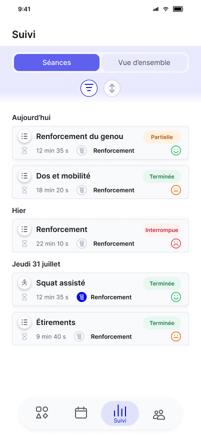

`Terminée`, `Partielle`, `Interrompue`

#### Référence historique hors MVP — Suivi — Séances — Vue déployée

[Source Figma — `1992:8996`](https://www.figma.com/design/G6RY5Ebhgwb4AHIOYDwwvg?node-id=1992-8996)

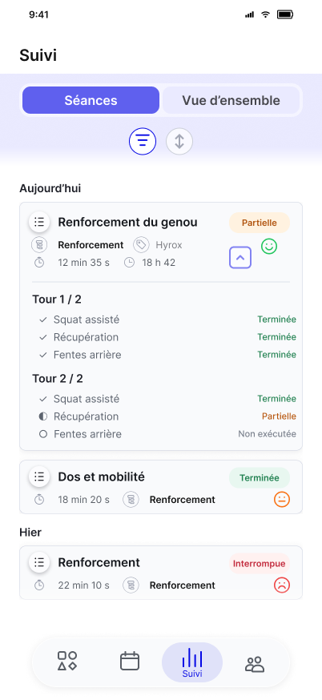

État conservé pour traçabilité ; aucun chemin d’accès dans le MVP depuis D-262.

`Terminée`, `Partielle`, `Interrompue`

#### Suivi — Séances — État vide

[Source Figma — `2117:190`](https://www.figma.com/design/G6RY5Ebhgwb4AHIOYDwwvg?node-id=2117-190)

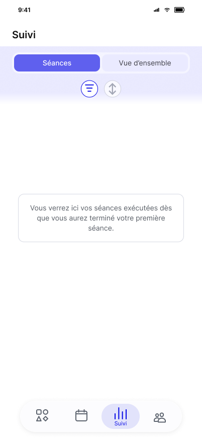

## Règles communes aux sélections et réglages

### Supprimer une valeur de référentiel
Cette famille de modales est ouverte par appui long sur une option dans les sélecteurs `Étiquettes`, `Catégorie` ou `Zones corporelles`.

Références Figma :
- Étiquette : `4861:6145 — Composition séance — Étiquettes — Appui long — Confirmation suppression` ;
- Catégorie : `4861:6259 — Ajouter un exercice — Catégorie — Appui long — Confirmation suppression` ;
- Zone corporelle : `4861:6348 — Ajouter un exercice — Zones corporelles — Appui long — Confirmation suppression`.

Le dialogue utilise la variante destructive à deux actions de `Overlay / Decision Dialog`. Le titre reprend la valeur concernée sous la forme `Supprimer « {nom} » ?`. Le message précise, lorsque la valeur est utilisée, qu’elle disparaît des nouveaux choix mais reste attachée aux objets existants, avec son nom et sa dernière couleur éventuelle ; l’historique reste inchangé.

Actions :
- `Annuler` : ferme la confirmation sans modifier le référentiel ni la sélection ;
- `Supprimer` : retire la valeur des nouveaux choix et conserve ses affectations existantes, son nom et sa dernière couleur, puis restitue la modale de sélection actualisée.

Cette règle s’applique aux valeurs initiales comme aux valeurs créées ensuite par l’utilisateur.

### Contrôles à roulette – Compte à rebours et fins
Les anciennes modales basses de durée restent des références historiques. Dans la feuille v13, les roulettes s’ouvrent inline sous la ligne active ; dans le Profil, les durées utilisent les steppers validés. Les autres contextes suivent leur contrat propre. Les entiers simples `Nombre de Séries`, `Nombre de répétitions` et `Nombre de Tours` utilisent des steppers inline conformément à D-219. Les sélections d’objets utilisent leurs modales dédiées.

Dans le Profil, les contrôles `Compte à rebours initial`, `Fin de séance`, `Compte à rebours d’exercice` (`4179:9550`) et `Fin d’exercice` (`4179:9556`) servent de préférences proposées à la création de nouveaux contenus. Ces valeurs suivent la validation des contrôles du Profil (CE-UI-07), sans importer la confirmation des anciennes roulettes.

Les valeurs initiales de l’application sont `10 s` pour le Compte à rebours initial et `5 s` pour la Fin de séance. Une durée de `0 s`, lorsqu’elle est choisie par l’utilisateur, rend la phase instantanée sans supprimer l’élément structurel.

## Règles transverses de l’éditeur d’Exercice
Les écrans Exercice placent le champ Nom en premier dans la zone bleue et suppriment le contexte de Séance. Aucun type d’Exercice n’est affiché. Le segment Mode contient trois options égales : `Durée`, `Répétitions`, `À l’échec`. Dans le MVP, la zone Média suit les frames courantes et la carte d’Exercice du Catalogue conserve sa gouttière permanente avec premier média ou icône de nature, sans déploiement (D-260/D-261/D-264). Les capacités d’import/capture restent régies par leur périmètre propre. Les accès `Catégorie` et `Zones corporelles` utilisent une icône `+` séparée de leur libellé.

La frame historique `3561:7802` illustrait l’état À l’échec : ordre `Séries` → cadre informatif `à l’échec` → `Pause`, seconde rangée `Changement de côté / Récupération / Durée totale >=`, sans cible chiffrée. Cette ancienne disposition ne définit plus l’éditeur actif : la feuille v13 utilise les contrôles de CE-UI-10 et aucun total d’Exercice en À l’échec. Les roulettes de cette feuille restent inline ; les contrôles de durée du Profil sont des steppers. Dans les états renseignés, `Renforcement du genou` est une donnée de démonstration ; seul `3943:6064` conserve `Nom de l’exercice` comme placeholder de l’état vide.

## Composant transverse `Status / Badge`
La référence historique du composant est le node `3959:5970`, `Status / Badge — Source exact`. Les références courantes et archivées suivent l’inventaire DSF-CADENCE-2026-10-06 ; l’ancienne référence ne doit pas remplacer le mapping courant. Elle porte les sept variantes de la propriété `Status` dans un composant unique.

*Composant — `Status / Badge — Source exact` — Figma `3959:5970` — export PNG ×2*

Les sept variantes se répartissent en deux familles sémantiques, sans que cette répartition scinde le composant :

| Famille | Variantes | Node de variante |
| --- | --- | --- |
| Statuts d’exécution | `Terminée`, `Partielle`, `Interrompue` | `3959:5966`, `3959:5963`, `3959:5969` |
| Statuts d’élément / provenance | `Catalogue`, `Planifiée`, `Exécutée`, `Archivée` | `3959:5951`, `3959:5954`, `3959:5957`, `3959:5960` |

Les preuves d’usage sont distinctes de la preuve du composant et ne s’y substituent pas :

| N° | Écran | Capture | Variantes visibles | Node Figma |
| --- | --- | --- | --- | --- |
| Suivi — Séances | Suivi : Séances — Liste condensée | Voir les captures dans **Suivi — Séances** ci-dessus | `Terminée`, `Partielle`, `Interrompue` | `1992:8843` |
| Suivi — Séances — historique hors MVP | Suivi : Séances — Vue déployée | Voir les captures dans **Suivi — Séances** ci-dessus | `Terminée`, `Partielle`, `Interrompue` | `1992:8996` |

## Couverture du Prototype MVP et exclusions justifiées
### Périmètre intégré

Les tableaux d’états d’écran contiennent une capture lorsqu’une copie courante existe. Les tableaux de traçabilité plus bas répertorient les node-id et leur traitement documentaire ; ils ne sont pas une galerie. Les références sans copie sont explicitement historiques, absentes de Figma ou des composants sans écran autonome.

La page Figma `Prototype MVP` (`510:101`) constitue la source visuelle des frames de production. Une capture ne remplace pas la règle écrite : le présent chapitre définit les comportements, tandis que les captures et le chapitre 13 définissent les références visuelles et critères déterministes.

### Éléments non intégrés comme écrans distincts

Les calques internes, zones tactiles transparentes, cibles de défilement et duplications de liens de prototypage ne constituent pas des écrans distincts. Les états fonctionnels sans frame dédiée réutilisent les composants de leurs écrans parents ; aucune fausse capture Figma ne doit être inventée.

### Règle de maintenance

Lorsqu’une nouvelle frame de premier niveau est ajoutée au `Prototype MVP`, elle doit être soit intégrée dans ce chapitre avec sa règle fonctionnelle, soit explicitement classée hors périmètre avec justification. Une variante ne peut plus être omise silencieusement.

## Traçabilité documentaire et contrôles historiques

Les constats datés ci-dessous décrivent leurs contrôles d’origine. L’inventaire courant est la matrice de couverture et les captures classées par famille.
### Audit historique Figma ↔ chapitre 06 — 24 septembre 2026

Ce relevé conserve la réconciliation effectuée le 24 septembre 2026 : ses décomptes `122 / 109` et `77 / 30` sont historiques et ne décrivent plus l’inventaire courant. Au contrôle du 28 septembre, la matrice dédiée recense **113 frames de premier niveau** et constitue la référence pour leur classification et leur couverture. Le Splash `1992:469` reste la référence active unique conformément à D-218.

| Node Figma | Frame | Traitement documentaire |
| --- | --- | --- |
| `4760:6448` | Synthèse partielle — Évaluation initiale | Référencée dans Synthèse — séance ou exercice |
| `4760:6500` | Synthèse partielle — Ressenti sélectionné | Référencée dans Synthèse — séance ou exercice |
| `3722:5061` | Composition séance — Point d’arrêt | Référencée dans Composition d’une séance |
| `4168:11149` | Catalogue Séances — Filtrer — Panneau ouvert | Référencée dans Catalogue des séances |
| `4168:11262` | Catalogue Exercices — Filtrer — Panneau ouvert | Référencée dans Catalogue des exercices |
| `4593:6285` | Confirmer l’archivage d’une séance planifiée | Référencée dans les modales |
| `4217:6980` | Ajouter un exercice — paramètres repliés | Référencée dans Créer ou modifier un exercice |
| `4279:7044` | Ajouter un exercice — paramètres dépliés | Référencée dans Créer ou modifier un exercice |
| `4734:6342` | Modifier un exercice — Squats sautés | Référencée dans Créer ou modifier un exercice |
| `4332:7095` | Catégories — sélection ouverte | Copie intégrée dans Créer ou modifier un exercice |
| `4474:7157` | Catégorie — Nouvelle catégorie — clavier | Référencée dans Créer ou modifier un exercice |
| `4478:7209` | Zones corporelles | Référencée dans Créer ou modifier un exercice |
| `4683:6336` | Nouvelle zone corporelle — clavier | Référencée dans Créer ou modifier un exercice ; création inline conforme au référentiel administrable |
| `4861:6145` | Étiquette — confirmation suppression | Référencée dans Composition d’une séance et confirmation « Supprimer une valeur de référentiel » |
| `4861:6259` | Catégorie — confirmation suppression | Référencée dans Créer ou modifier un exercice et confirmation « Supprimer une valeur de référentiel » |
| `4861:6348` | Zone corporelle — confirmation suppression | Référencée dans Créer ou modifier un exercice et confirmation « Supprimer une valeur de référentiel » |
| `4521:6220` | Catalogue Exercices — État vide | Référencée dans Catalogue des exercices |
| `4544:6344` | Exercices — Filtre inactif étendu | Référencée dans Catalogue des exercices |
| `4544:6651` | Exercices — Filtre actif étendu | Référencée dans Catalogue des exercices |
| `4549:6382` | Séances — Filtre inactif étendu | Référencée dans Catalogue des séances |
| `4549:6742` | Séances — Filtre actif Archivées | Référencée dans Catalogue des séances |
| `4592:6217` | Séances — actions glissées — Dos et mobilité | Variante illustrée ci-dessus ; même contrat d’actions que l’Catalogue des séances, pas un nouvel écran fonctionnel |
| `4738:6209` | Exercices — actions glissées | Référencée dans Catalogue des exercices |
| `4738:6355` | Exercices — carte déployée — Média | Référencée dans Catalogue des exercices |
| `4367:7128` | Modèle paramètre — Mode Durée | **Pas un écran utilisateur** : planche de référence |
| `4367:7276` | Modèle paramètre — Compte à rebours | **Pas un écran utilisateur** : planche de référence |
| `4367:7906` | Modèle paramètre — Côté | **Pas un écran utilisateur** : planche historique/référence, le libellé actif est `Changement de côté` |
| `4367:8052` | Modèle paramètre — Récupération | **Pas un écran utilisateur** : planche de référence |
| `4367:8193` | Modèle paramètre — Durée totale | **Pas un écran utilisateur** : planche de référence |
| `4490:6757` | Modèle paramètre — À l’échec | **Pas un écran utilisateur** : planche de référence |
| `4490:6903` | Modèle paramètre — Répétitions | **Pas un écran utilisateur** : planche de référence |
| `4534:6339` | Filtre — États du contrôle | **Pas un écran utilisateur** : planche de référence du composant |

Cette distinction est normative pour la documentation : une frame Figma de référence de composant ne doit pas être promue artificiellement au rang d’écran ou de modale. Les **copies d’écrans** restent centralisées exclusivement dans ce chapitre 06 ; la mise à jour physique des captures est une étape séparée.

Le contrôle a également identifié des références documentaires devenues inexistantes dans Figma : `1992:10749`, `2028:11921`, `3879:5947`, `3879:6079`, `3835:5385`, `3835:5465`, `3836:5437`, `3836:5503` et `3787:5209`. Elles ne doivent plus être présentées comme références courantes. Elles ont été soit remplacées par une frame active, soit conservées uniquement comme traces historiques lorsque la fonctionnalité réutilise désormais une autre famille d’écrans.

### Mise à jour Bilatéralité — rectifiée le 13 septembre 2026

Le contrôle Exercice porte le libellé `Changement de côté` et propose `Aucun`, `D→G`, `G→D`. Sa géométrie suit le Figma courant et le DSF actif. Aucun contrôle de changement de côté n’est exposé au niveau du Circuit.

Dans la Composition actuelle, aucun contrôle de changement de côté n’est affiché dans l’en-tête du Circuit. Le stepper `Nombre de tours` reste la seule commande numérique de ce groupe ; les anciennes références Figma de direction Tour sont historiques et ne constituent plus la cible active.

Aucune confirmation d’activation bilatérale du Tour n’est exposée dans la version actuelle. Le support technique historique du côté Tour reste conservé pour non-régression, fixé à `UNILATERAL` et non modifiable.

Dans une carte d’Exercice, l’indicateur propre affiche `D→G` ou `G→D` lorsque l’Exercice est bilatéral ; il est absent avec `Aucun`. La synthèse place `à droite, puis à gauche` ou `à gauche, puis à droite` après la cible du mode — après `jusqu’à l’échec` — et avant la Pause. Les références géométriques suivent le Figma courant.

Dans la famille Exécution — séance ou exercice, un Exercice effectivement bilatéral affiche `Côté droit` ou `Côté gauche` sous son nom. Les indicateurs de progression gardent leur sémantique ; aucun compteur de côté n’est ajouté. Les frames d’Exécution existantes restent inchangées.

### Évidences Figma T03 — état courant du 16 septembre 2026

Les contrôles d’entrée `Créer / Filtrer / Trier` restent conçus et vérifiables dans Figma pour leur rendu. Les références courantes principales sont `3786:5093` (Catalogue Exercices), `1992:9910` (Catalogue Séances), `1992:10129` (Recherche globale — Champ déployé), `3561:4695`, `3561:7673`, `3561:7802`, `3943:6064` (éditeur Exercice), `2537:1033` (Déployer) et `6298:12462` (Navigation Bottom). Les anciennes frames d’arbre `3787:5148` et `3841:8375` sont supersédées fonctionnellement par D-187.

L’ancienne référence `3787:5209 — Catalogue — action contextuelle directe` n’existe plus dans le Figma courant et ne constitue plus une évidence active. Les panneaux ouverts de `Filtrer` sont désormais conçus et vérifiables dans Figma ; `Trier` reste disabled T03.

### Résolutions postérieures au contrôle visuel du 16 septembre 2026

Les points suivants ont été résolus depuis ce contrôle : la modale d’abandon de création d’Exercice est représentée par `4714:6241`; les panneaux ouverts de `Filtrer` sont conçus ; l’affichage média en gouttière permanente du Catalogue des Exercices appartient au MVP, sans déploiement (D-260/D-261) ; l’ancien arbre `Créer` reste historique ; la création inline d’une Zone corporelle dans `4683:6336` est désormais cohérente avec D-199. Le contrôle de l’état `2139:86` a confirmé qu’il est redondant avec `1992:684` (`Vibration activée`) ; il n’est plus présenté comme un état d’écran distinct dans le chapitre 06.

## Références transverses des cartes et appuis — 30 septembre 2026
Décisions finales du propriétaire : les 17 points du 30/09 sont clos. Révision des cartes du 03/10/2026 (D-260 à D-264) : un seul format de carte d’Exercice, avec une gouttière permanente de 64 px dans le Catalogue et les listes de sélection d’exercices ; photo si média associé, icône de nature sinon. La vignette utilise le premier média dans l’ordre de la galerie ; si ce média est une vidéo, elle utilise son image de couverture (D-264). Les Séances ne portent jamais de visuel. Aucune photo dans les listes mixtes, le Calendrier ou le Suivi. Aucun déploiement d’Exercice ni de carte du Suivi ; le déploiement des Séances reste accessible dans le Catalogue et le Calendrier Semaine. Le Suivi présente deux lignes : nature/titre/statut, puis durée/catégorie/ressenti ; sans heure, zones corporelles ni étiquettes. Le Ressenti y est un indicateur sans action, distinct de sa saisie obligatoire en Synthèse. Les variantes déployées d’Exercice et du Suivi sont historiques, hors MVP. Pauses/récupérations et prochaine planification restent absentes des cartes concernées. Les données, instantanés, calculs et fonctions de planification sont conservés.

Synthèses : « N séries de X », « N séries de N rép. », « N séries à l’échec » ; bilatéralité par miroir dans les variantes concernées. Heure Semaine « 08:00 » ; aucune heure dans la carte du Suivi. Séance sans étiquette : catégories de ses exercices ; listes de catégories/zones séparées par un point médian et tronquées avec « … ». Choix sans badge durée ; récurrence du Calendrier Semaine dans la carte déployée seulement.

RG-10 : le Profil porte une préférence silhouette facultative, homme/femme ; absence = homme affiché. Elle ne pilote que l’icône de zone corporelle, sans filtre, recherche ou effet métier. RG-11 à RG-13 : vignette 64 centrée et recadrée sans déformation (couverture pour une vidéo), place réservée pendant chargement/erreur, texte alternatif égal au nom de l’exercice.

D-239 : Calendrier Jour est une exception compacte (séance 298 × 46, exercice 298 × 48, x=80, hauteur d’instance adaptée à l’événement), avec barre colorée 4, nature 26, titre 13 gras, heure/durée 11, lecture 26 et aucun Déployer. Les deux sets comportent 10 variantes chacun. Suivi — Vue d’ensemble est hors MVP. Les boutons Calendrier Aujourd’hui/Planifier restent à 32, sans cible 44 ajoutée : situation acceptée, à revoir et développer après T04. Les nouvelles icônes sont nommées icon/<nom>, les anciennes ne sont pas renommées ; target est réservé au Programme, pulse aux rapports/Suivi.

Référence normative ciblée : [DSF — Cartes, icônes et appuis](../DSF-CARTES-ICONES-APPUIS-2026-09-30.md). Ces règles finales prévalent sur les anciennes formulations d’affichage du présent chapitre dans ce périmètre uniquement.

Appuis — D-237 : la spécification figée v2 du 29 septembre impose une dilatation au contact, un retour au relâchement et une action immédiate au relâchement, sans attendre le ressort. Annulation hors cible : retour sans action ; nouvel appui : reprise depuis l’état courant. Stepper indépendant (450 ms puis 150 ms pour la répétition) et réduction des animations par opacité seule. Paramètres et preuves dans le complément DSF.

La règle vaut également :
- après le dernier Exercice d’un Tour ;
- à chaque Tour du Circuit ;
- après le dernier Exercice de la Séance, avant la Fin de séance.

Dans l’éditeur d’Exercice, le contrôle générique `Récupération` est remplacé par `Pause entre les côtés` et n’est exposé que lorsque `Changement de côté` vaut `D→G` ou `G→D`. La récupération après exercice ne figure ni dans l’éditeur ni dans la synthèse intrinsèque de l’Exercice.

**Interaction Point d’arrêt (D-217).** L’action dédiée d’ajout affiche les positions autorisées dans la Composition ; l’utilisateur choisit la position et peut quitter ce mode via le snackbar d’annulation. Un appui long sur un Point d’arrêt existant ouvre une bulle de retrait ; un appui ailleurs referme la bulle sans modification. La Récupération après exercice reste exécutée mais n’est plus affichée sur la carte (D-238) ; le Point d’arrêt reste une action distincte.

**Contexte d’Exécution (D-220).** La ligne immédiatement sous le nom de l’Exercice est toujours renseignée : nom de Séance et Catégorie de l’Exercice lors d’une Exécution de Séance, Catégorie de l’Exercice seule en Exécution directe. L’indication du côté courant, lorsqu’elle existe, reste distincte.

## Clôture Figma / DSF — 28 septembre 2026
- **Navigation** : quatre destinations actives seulement — `Catalogues`, `Calendrier`, `Suivi`, `Profil`. Les écrans de Recherche globale sont archivés ; aucune recherche locale de Catalogue n’est active (D-221/D-225).
- **Sélection en modale** : sélection simple = radio exclusif, validation au toucher et fermeture immédiate, sans CTA bas ; sélection multiple de Composition = cases à cocher + `Sélectionner` ; filtres = validation explicite + `Réinitialiser` (D-222/D-228).
- **Planifier** : titre `Planifier` avant connaissance du type, puis `Planifier une séance` ou `Planifier un exercice`. La modale suit le gabarit D-229.
- **Fondations DSF** : fond `#FFFFFF` sauf Splash `#0006F1` et média plein écran `#0A0A0C`; zone de contexte `#EAEAFF`→transparent sur les familles couvertes ; navigation, halo, boutons circulaires, steppers et badges selon D-224 à D-227.
- **Listes/modales** : listes scrollables avec rognage ; feuilles longues alignées en haut sur la zone de contexte ; comportements et dégradés bas selon D-228.
- **Composants spécialisés** : Point d’arrêt, Profil et Exécution suivent D-230 ; les cartes et l’indicateur Ressenti suivent la révision D-260 à D-264 ; les cartes média déployées sont historiques hors MVP.

### Référence DSF V2 détaillée — clôture 28 septembre 2026

- **Navigation basse** : pilule `322 × 62 px`, `#FCFCFE`, stroke blanc 1 px, ombre `rgba(26,26,38,0.08)` blur/rayon 10 offset `0,2`; token `color/navigation/pill`. Icône Profil selon D-233/D-236, dans une boîte de navigation 32×32 ; actif `#0508E5`, inactif `#5C636E`. Cadre actif `76 × 50 px`, bleu `#0508E5` à 10 %. Boîtes d’icônes aux abscisses 68/146/224/302 dans la référence 402 px, soit 28 px entre bord de pilule et boîte extrême et 78 px entre centres. Intégration écran : 16 px sous la pilule, bande opaque 16 px puis dégradé transparent→fond sur 40 px ; ces bandes appartiennent à l’écran.
- **Fond / contexte** : écran ordinaire `#FFFFFF`; Splash `#0006F1`; média plein écran `#0A0A0C`. Zone de contexte `#EAEAFF`→transparent sur les 20 % inférieurs pour Catalogues, Composition, Calendrier, Suivi, Profil et Ajout d’exercice. Le séparateur 1 px n’est retiré que si ce dégradé assure la séparation.
- **Halo et action circulaire** : halo Annuler/Retour blanc opaque `59,28 px`, placé devant la zone de contexte et hors du conteneur clippé ; bouton circulaire clair `32 × 32`, `#FCFCFE`, stroke blanc 1 px, ombre `rgba(26,26,38,0.08)` blur 10 offset `0,2`.
- **Stepper / valeur** : variante lavande `#F2F2FF` pour Profil/paramètres, variante blanche pour Tours de Composition ; `−/+` ronds bleus, 12 px autour de la valeur centrale. Le stepper remplace la valeur sur la même ligne sans étirer le groupe ; un seul stepper actif à la fois. Badge replié `#F4F4F8`, texte bleu Semi Bold 13 px, rayon 6, marges 8 px horizontales et 2 px verticales ; contour bleu 1,5 px lorsque le contrôle est ouvert (DSF V2 lot 3, T4). Le nombre de semaines utilise la pilule de stepper rayon 18.
- **Point d’arrêt** : bouton rond blanc opaque, icône Pause, contour 1 px `#0508E5`; l’action complète porte le contour. Les occurrences de Composition utilisent cette référence commune.
- **Ressenti** : ne pas confondre contrôle de choix et pictogramme de résultat. Résultats : vert Bien, orange Neutre, rouge Mal ; rouge source `#EF4444`. Aucun état actif Figma ne prouve un contrôle « Mal sélectionné ».
- **Profil** : titres de section Semi Bold 16 px ; `Modifier` en `#0508E5`; groupes blancs 126 px ; zone de contexte 115 px ; ouverture d’un stepper sans étirement du groupe.
- **Exécution** : sur les cinq écrans portant `Zone — Progression et suite`, début `y=449`, hauteur `305 px`. Dans la variante haute avec texte, conserver 95 px avant la zone. Variante média : `Série X/3 • Tour X/3` en Roboto Condensed Medium 24 px.
- **Photo sur les cartes** : la prescription historique de carte déployée est remplacée par D-261 : aucun Déployer d’Exercice, avec ou sans média ; l’exécution média conserve ses variantes propres.

### Paramètres — référence courante du 02/10/2026

La [spécification v13](SPECIFICATION-PARAMETRES-MODALE-v13.md) remplace le champ éditable v10.2. Les anciennes captures d’éditeur ne constituent plus des écarts à corriger vers la phrase inline. Les limites actuelles sont celles de la feuille (câblage incomplet et données de démonstration), décrites dans la section Créer ou modifier un exercice et CE-UI-10.

## Archives et références hors prototype actif

L’écran/arbre intermédiaire `Une nouvelle exercice / Une séance / Un parcours / Annuler` est supprimé par D-187.

Dans chaque Catalogue, `Créer` ouvre directement la création de l’objet correspondant au Catalogue courant :
- `Catalogue des Exercices` → création d’un Exercice persistant ;
- `Catalogue des Séances` → création d’une Séance ;
- `Catalogue des Parcours` → création d’un Parcours lorsque ce Catalogue devient fonctionnel.

Cette règle n’active pas les Parcours dans T03/MVP. Les anciennes frames Figma `3787:5148` et `3841:8375`, ainsi que leurs captures physiques, sont conservées uniquement pour traçabilité et ne constituent plus des états fonctionnels à implémenter.

### Objectif

Présenter à terme des indicateurs synthétiques de progression et d’exercice.

Cette vue n’est pas fonctionnelle dans le MVP.

### Présence dans le MVP

La vue et ses graphiques sont abandonnés pour le MVP et seront conçus ultérieurement. Les anciennes maquettes de cette vue ne sont pas des écrans à développer ; aucune commande d’accès n’est requise par cette référence.

### Profil — Cible post-MVP

Référence hors prototype actif — Figma `1354:182` ; ne vaut pas activation MVP.

### Référence historique hors MVP — Suivi — Séances — Vue déployée

Référence hors prototype actif — Figma `1842:2` ; ne vaut pas activation MVP.

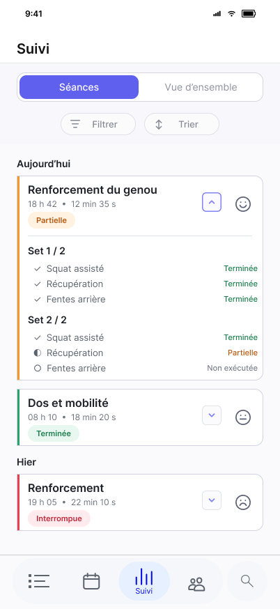

### Suivi — Vue d’ensemble

Référence hors prototype actif — Figma `3401:86` ; ne vaut pas activation MVP.

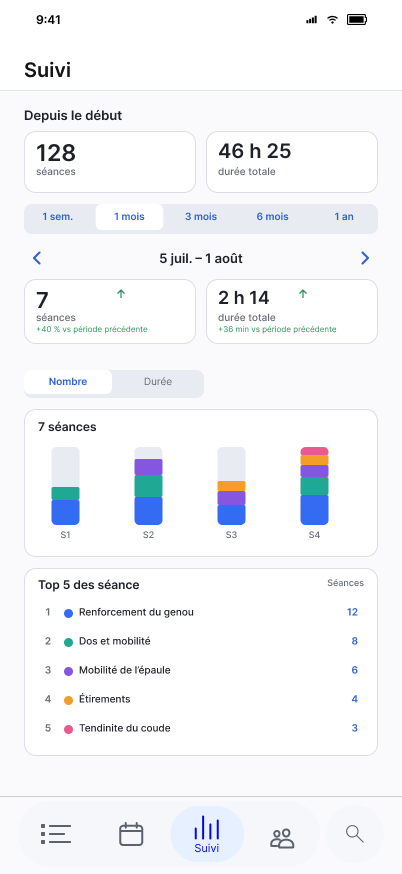

### Recherche globale — Champ déployé

Référence hors prototype actif — Figma `1992:10129` ; ne vaut pas activation MVP.

### Recherche globale — Résultats affichés

Référence hors prototype actif — Figma `1992:10320` ; ne vaut pas activation MVP.

### HISTORIQUE — Catalogue Séances — ancien arbre Créer — supersédé D-187

Référence hors prototype actif — Figma `3841:8375` ; ne vaut pas activation MVP.

> **Clôture des contrats — 01/10/2026.** Les règles consolidées du [chapitre 13, §6](13%20–%20Contrats%20d’écran.md#6-clôture-des-réserves-fonctionnelles-des-contrats) s’appliquent : progression sur le plan complet ; transitions et pauses selon D-248/v13 (ancien repli D-242 retiré) ; fréquence 1..12 semaines ; rappel personnalisé au plus 24 h. En Un côté après l’autre, le reset porte sur le bloc du côté courant ; la même règle s’applique à l’ordre alterné en conservant les résultats de l’autre côté (chapitre13 R-03). Les étapes et calculs ci-dessous se lisent avec ces précisions ; aucune nouvelle disposition d’écran.

### Référence de composant — Stepper — Séries (interactif)

Ensemble6426:10149, export06/10 ; pas un écran autonome.

### Référence de composant — Cadre bas — retournement

Ensemble6446:10103, export06/10 ; pas un écran autonome.

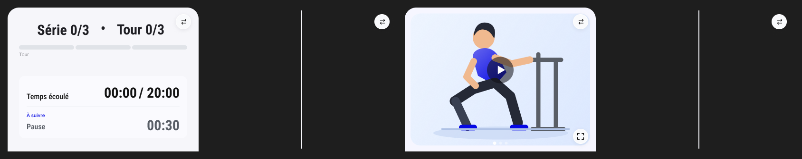

### Référence de composant — Zone d’exécution — retournements

Ensemble6451:10942, export06/10 ; pas un écran autonome.

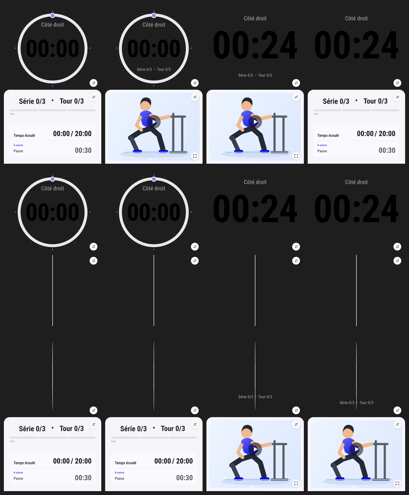
