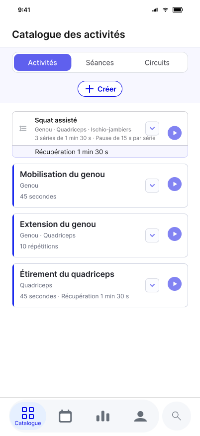
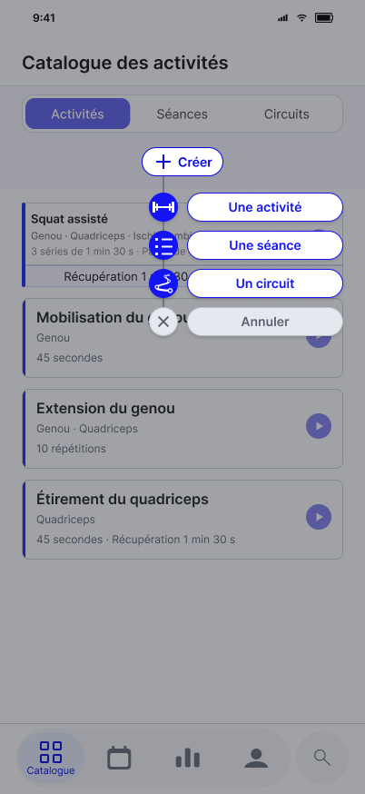
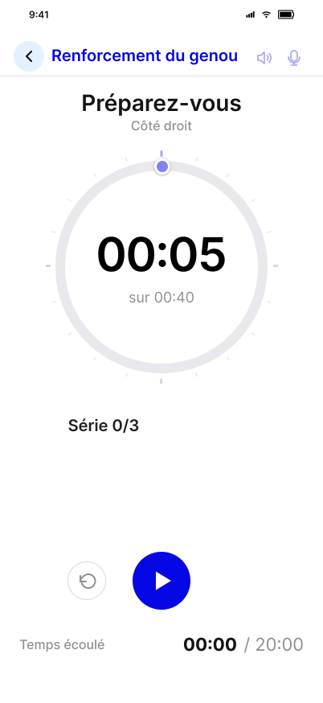
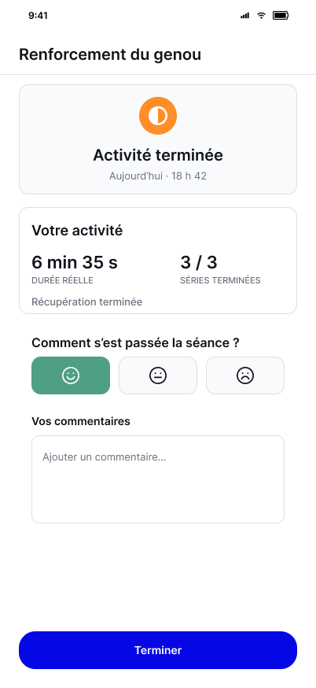

# 13 – Contrats d’écran

## 1. Objet

Ce chapitre transforme les spécifications fonctionnelles, les règles de navigation, le Design System et les frames Figma en critères déterministes de développement et de recette pour chaque écran de production.

Un contrat d’écran ne remplace ni Figma ni les autres chapitres. Il précise, pour une frame donnée, ce que l’implémentation doit afficher, calculer, rendre interactif et vérifier pour être déclarée conforme. Il vise notamment à empêcher :

- l’utilisation d’un logo, d’une icône ou d’un composant de substitution ;
- l’omission d’un texte, d’un contrôle ou d’un cadre obligatoire ;
- les valeurs de démonstration Figma conservées comme valeurs statiques ;
- les contrôles visibles mais inactifs, ou reliés à la mauvaise action ;
- le mauvais positionnement du titre, des commandes ou des zones fixes ;
- les chevauchements, troncatures et contenus masqués ;
- une navigation ou un état de données différent de celui spécifié.

Les contrats sont rédigés et validés progressivement, selon les tranches verticales de la roadmap. La présente version couvre les contrats T01 révisés pour l’écran unifié d’Activité, les deux contrats T02 de Composition complète et de déplacement du bloc Activité–Récupération, les neuf contrats fonctionnels de réouverture et de modification bout en bout de T01-S10, ainsi que les treize contrats `CE-T03-01` à `CE-T03-13` de l’Exécution guidée fondamentale. Ces contrats T03 couvrent l’accès depuis le Catalogue, le contrôle d’éligibilité, les trois modes d’Activité, les phases structurelles dont `RECOVERY`, la progression, les commandes, les interruptions et les sorties minimale normale ou interrompue. Les états T03 réutilisent le Shell d’Exécution et les frames Figma existantes lorsqu’aucune frame spécifique supplémentaire n’est requise.

## 2. Sources et ordre d’application

Pour développer ou valider une frame, les sources suivantes doivent être lues ensemble :

1. les règles métier et fonctionnelles des chapitres 08 à 11 ;
2. les écrans, la navigation et les règles adaptatives du chapitre 06 ;
3. les composants, tokens et règles techniques du chapitre 12 ;
4. le contrat de la frame dans le présent chapitre ;
5. la frame Figma identifiée par son ID, comme référence visuelle standard.

Le contrat rend les exigences contrôlables mais ne peut pas contredire une règle métier. En cas d’écart apparent :

- la donnée et le comportement métier proviennent des spécifications fonctionnelles ;
- la structure adaptative provient des règles communes et des Screen Shells ;
- le composant et ses états proviennent du Design System ;
- la composition visuelle propre à l’écran provient de la frame Figma ;
- le présent contrat précise les éléments obligatoires et les critères de recette.

Une ambiguïté résiduelle ne doit pas être résolue silencieusement par une valeur codée en dur ou un composant improvisé. Elle doit être signalée avant développement.

## 3. Règles communes à tous les contrats

### 3.1 Référence visuelle et données de démonstration

La surface Figma standard mesure `402 × 874` points logiques. Les coordonnées de la frame servent à la comparaison sur cette surface ; elles ne sont pas généralisées comme coordonnées absolues sur tous les appareils.

Les noms de Séance, catégories, dates, heures, durées, nombres d’Activités et nombres de Tours visibles dans Figma sont des données de démonstration. Ils doivent provenir du stockage local ou d’un calcul métier, sauf lorsqu’un contrat les déclare comme texte statique exact.

### 3.2 Présence des éléments obligatoires

Chaque élément déclaré obligatoire doit :

- être présent dans l’arbre rendu ;
- être visible dans son état attendu ;
- utiliser la bonne ressource, le bon composant et le bon libellé ;
- rester dans la zone sûre et ne pas être masqué par un autre élément ;
- conserver sa relation de layout sur les largeurs `360`, `402` et `440`.

Un élément invisible, transparent, placé hors écran ou recouvert est considéré comme absent.

### 3.3 Contrôles et zones tactiles

Un contrôle visible doit posséder une action réelle ou un état explicitement désactivé. Aucun contrôle ne peut seulement imiter visuellement le Figma.

Chaque action doit être testée sur sa cible réelle. Les zones tactiles distinctes ne se recouvrent pas et mesurent au minimum `48 × 48` points logiques, sauf exception documentée. L’icône visible peut être plus petite que sa cible.

### 3.4 Layout

Le contrat décrit prioritairement des relations : alignement, ordre, ancrage, largeur utile, espacement, zone fixe ou défilante. Les valeurs de la frame `402 × 874` sont utilisées lorsqu’elles sont nécessaires pour empêcher une interprétation erronée ou permettre une comparaison visuelle.

Les règles suivantes sont bloquantes :

- aucun élément obligatoire tronqué ou superposé ;
- aucun titre placé dans le contenu défilant lorsqu’il appartient à l’en-tête fixe ;
- aucun contenu interactif masqué par la navigation basse, une action fixe ou une Safe Area ;
- aucune ressource déformée ;
- aucune largeur de contenu calculée à partir d’une coordonnée fixe lorsque le Screen Shell ou le composant prévoit une largeur flexible.

### 3.5 Preuve de conformité

La validation d’un contrat comprend au minimum :

1. des tests fonctionnels des états, données et interactions ;
2. une capture de l’implémentation sur la surface ou l’émulateur de référence ;
3. une comparaison visuelle avec la frame Figma ;
4. un contrôle aux largeurs `360`, `402` et `440` ;
5. un contrôle d’agrandissement du texte sur les écrans qui contiennent des commandes ou des données variables.

Une capture seule ne prouve pas le fonctionnement des contrôles. Un test fonctionnel seul ne prouve pas la conformité visuelle.

## 4. Statuts de conformité

| Statut | Définition |
| --- | --- |
| Conforme | Tous les critères obligatoires sont satisfaits et les preuves sont disponibles. |
| Conforme avec écart accepté | Un écart explicite est documenté et validé ; il ne peut pas être déduit d’une simple différence d’implémentation. |
| Non conforme | Au moins un critère bloquant échoue. |
| Non testé | La réalisation existe mais tout ou partie des preuves manque. |

## 5. Contrats T01

### CE-T01-01 — Splash screen

#### Identification

| Propriété | Valeur |
| --- | --- |
| Frame Figma | `1992:469` — `Splash — Kodjo (proposition métallisée)` |
| Surface de référence | `402 × 874` |
| Screen Shell | Aucun ; exception explicite |
| Ressource logo obligatoire | `images branding/logo_icon_only_transparent_1024.png` |
| Entrée | Lancement ou relancement complet de l’application |
| Sortie | `Catalogue des séances` |
| Interaction utilisateur | Aucune |
| Défilement | Aucun |

#### Éléments obligatoires

| ID | Élément | Type | Valeur ou ressource exacte | Règle |
| --- | --- | --- | --- | --- |
| SPL-01 | Fond | Surface | Bleu KODJO provenant du token du Design System | Couvre toute la surface, sans bande ni écran blanc intermédiaire perceptible. |
| SPL-02 | Logo KODJO | Image | `images branding/logo_icon_only_transparent_1024.png` | Aucune ressource de substitution, aucun logo recréé, aucun étirement. |
| SPL-03 | Nom | Texte statique | `KODJO` | Casse et orthographe exactes. |
| SPL-04 | Signature | Texte statique | `Keep On. Do Just One.` | Ponctuation et casse exactes. |
| SPL-05 | Sous-titre | Texte statique | `Votre assistant du quotidien` | Orthographe et casse exactes. |

L’absence ou la substitution de SPL-02, SPL-03, SPL-04 ou SPL-05 rend l’écran non conforme.

#### Contrat de layout

Le splash utilise deux groupes indépendants afin que l’ancrage du sous-titre ne déplace pas le bloc de marque :

1. un bloc d’identité composé du logo, de `KODJO` et de la signature ;
2. le sous-titre ancré dans la partie basse de la zone sûre.

| Élément ou relation | Référence `402 × 874` | Règle adaptative obligatoire |
| --- | --- | --- |
| Axe horizontal | `x = 201` | Logo et trois textes centrés horizontalement dans la zone sûre. Tolérance de recette : `±2` points. |
| Logo | `200 × 200`, `x = 101`, `y = 278` | Ratio `1:1` conservé. Sur `402`, taille `200 × 200` avec une tolérance de `±2` points. Sur largeur différente, sa taille peut diminuer pour préserver les zones sûres mais ne peut pas être étirée. |
| `KODJO` | Sous le logo, `y = 478` | Appartient au bloc d’identité ; aucune superposition et aucun remplacement par une image contenant du texte. |
| Signature | `y = 531` | Centrée sous `KODJO` ; espacement vertical de référence conservé à `±2` points sur la surface standard. |
| Sous-titre | `y = 831`, hauteur `16`, fin à `27` points du bas de la frame | Ancré au-dessus de l’inset inférieur réel et centré. Il reste indépendant du bloc d’identité. Tolérance verticale de comparaison : `±4` points sur la référence. |

Sur une hauteur plus courte, les espaces flexibles diminuent avant la taille du logo. Aucun élément ne peut sortir de la zone sûre, être tronqué ou se superposer. Le mode paysage est hors périmètre du MVP tant qu’aucune règle spécifique n’est validée.

#### Comportement

1. Le splash devient visible immédiatement au lancement, sans dépendre du chargement de données secondaires.
2. L’application initialise l’accès minimal au stockage local pendant son affichage.
3. La durée nominale d’affichage est de `2,5 s`.
4. Une transition `DISSOLVE` de `0,3 s` ouvre automatiquement le Catalogue.
5. Si aucune Séance non archivée n’existe, le Catalogue affiche l’état vide `2117:86`.
6. Si au moins une Séance non archivée existe, le Catalogue affiche la liste par défaut `1992:9910`, alimentée par les données locales.
7. Une erreur secondaire ne doit pas bloquer indéfiniment le splash. Une erreur empêchant l’accès aux données suit la stratégie technique d’erreur ; elle ne doit pas être masquée par une navigation forcée avec des données fictives.

#### Recette minimale obligatoire

| Test | Précondition et action | Résultat attendu |
| --- | --- | --- |
| SPL-T01 | Lancer l’application | Les cinq éléments SPL-01 à SPL-05 sont visibles. |
| SPL-T02 | Comparer à la frame `1992:469` sur `402 × 874` | Bon logo, ordre, centrage, proportions, couleurs et espacements conformes. |
| SPL-T03 | Inspecter le logo | La ressource imposée est utilisée et son ratio reste `1:1`. |
| SPL-T04 | Lancer avec stockage sans Séance active | Transition vers l’état vide `2117:86`. |
| SPL-T05 | Lancer avec au moins une Séance active | Transition vers la liste `1992:9910` contenant les données réelles. |
| SPL-T06 | Tester sur `360`, `402` et `440` | Aucun élément absent, tronqué, déformé, superposé ou hors zone sûre. |

#### Non-conformités bloquantes spécifiques

- mauvais logo ou logo recréé ;
- absence de `KODJO`, de la signature ou du sous-titre ;
- texte incorporé dans l’image à la place de vrais nœuds de texte ;
- logo déformé ;
- écran blanc perceptible avant le splash ;
- splash bloqué ;
- destination imposée avec une liste statique ou un état vide statique.

---

### CE-T01-02 — Catalogue des séances — État vide

#### Identification

| Propriété | Valeur |
| --- | --- |
| Frame Figma | `2117:86` — `Catalogue des séances — État vide` |
| Surface de référence | `402 × 874` |
| Screen Shell | `Shell / Screen`, `Context=On`, `Bottom=Navigation` |
| Condition | Type `Séances` sélectionné et aucune Séance non archivée |
| Entrées principales | Fin du splash ; retour d’un parcours ; filtre `Toutes` par défaut |
| Sortie principale | `Composition d’une séance — création` |

#### Structure et éléments obligatoires

| Zone | Élément | Valeur ou composant | Visibilité |
| --- | --- | --- | --- |
| Header fixe `0–92` sur la référence | Titre | `Catalogue des séances`, token `type.screenTitle` | Toujours |
| Context `92–207` | Contrôle segmenté | `Activités`, `Séances`, `Circuits` | Toujours ; options latérales désactivées dans le MVP |
| Context | Action contextuelle | Icône `+` et libellé `Créer` | Toujours |
| Body `207–797` | Cadre d’état vide | Composant d’état vide, largeur utile | Lorsque le résultat du filtre est vide |
| Body | Message | `Vous verrez ici la liste de vos séances dès que vous aurez commencé à les créer.` | Type Séances sans résultat non archivé |
| Bottom Navigation fixe `797–874` | Navigation principale | `Séances`, `Calendrier`, `Suivi`, `Profil` et recherche distincte | Toujours |
| Bottom Navigation | Onglet actif | Icône et libellé `Séances` dans la capsule active | Toujours sur cet écran |

Le titre appartient à l’en-tête fixe. Il ne doit pas être ajouté dans le contenu défilant. Les icônes `+`, `Séances`, `Calendrier`, `Suivi`, `Profil` et `Recherche` proviennent des composants du Design System ; elles ne peuvent pas être omises ou remplacées par du texte improvisé.

#### Contrat de layout

| Élément ou relation | Référence Figma | Règle adaptative obligatoire |
| --- | --- | --- |
| Titre | `x = 24`, ligne de base dans le Header | Aligné sur la marge horizontale du Shell ; `16` en compact, `24` à partir de `390`. Header fixe. |
| Contrôle segmenté | `x = 24`, `y = 104`, `354 × 42` | Occupe la largeur utile. Trois segments égaux ; libellés centrés dans leur segment. |
| Action `Créer` | cadre visuel `90 × 32`, centré à `y = 162` | Groupe centré horizontalement. Cible tactile réelle au moins `48` points de haut sans recouvrir le contrôle segmenté. |
| Cadre d’état vide | `x = 36`, `y = 385`, `330 × 96` | Centré dans la largeur utile ; hauteur extensible si le texte grandit. Il ne dépend pas d’une coordonnée absolue sur les autres hauteurs. |
| Message | marge interne horizontale `20`, centré | Centré horizontalement et verticalement dans le cadre, multiligne, jamais tronqué. |
| Navigation basse | `y = 797`, hauteur de région `77` | Fixe au-dessus de l’inset inférieur réel. Le Body s’arrête avant elle. |

Seule la zone Body peut défiler lorsque la hauteur ou l’agrandissement du texte l’exige. Le Header, le Context et la Bottom Navigation restent fixes. Aucun contenu ne passe sous la navigation basse.

#### Données et conditions d’état

- La sélection initiale du type est `Séances` et le filtre implicite est `Toutes`.
- La requête interroge les Séances non archivées.
- L’état vide est produit par un résultat réellement vide du stockage local ; il n’est pas commandé par un booléen de démonstration indépendant des données.
- Une Séance archivée n’empêche pas l’état vide du type Séances avec filtre `Toutes`.
- Au retour d’une création enregistrée, la requête est réexécutée et l’écran devient la liste par défaut.
- Au retour d’une création abandonnée, l’état vide reste affiché.

#### Contrôles et résultats attendus

| Contrôle | État | Action attendue |
| --- | --- | --- |
| `Activités` | Visible, désactivé en MVP | Devient actif avec la bibliothèque V2. |
| `Séances` | Sélectionné | Recharge les Séances non archivées. |
| `Circuits` | Visible, désactivé en MVP | Devient actif avec les Circuits V2. |
| `Créer` | Disponible | Ouvre `Composition d’une séance` en mode création, sans ID de Séance existante. |
| `Séances` | Actif | Conserve le Catalogue et son état courant. |
| `Calendrier` | Présent mais désactivé dans la livraison partielle T01 | Ne produit aucune navigation ; porte l’état désactivé du composant et l’état d’accessibilité correspondant. Devient actif dans la tranche qui livre le Calendrier. |
| `Suivi` | Présent mais désactivé dans la livraison partielle T01 | Ne produit aucune navigation ; porte l’état désactivé du composant et l’état d’accessibilité correspondant. Devient actif dans la tranche qui livre le Suivi. |
| `Profil` | Présent mais désactivé dans la livraison partielle T01 | Ne produit aucune navigation ; porte l’état désactivé du composant et l’état d’accessibilité correspondant. Devient actif dans la tranche qui livre le Profil. |
| Recherche | Présente mais désactivée dans la livraison partielle T01 | Ne produit aucune navigation et ne peut pas afficher de faux résultats ; porte l’état désactivé du composant et l’état d’accessibilité correspondant. Devient active dans la tranche qui livre la recherche globale. |

La désactivation ci-dessus est un état transitoire de recette de T01, pas le comportement du MVP terminé. Un contrôle non livré ne doit pas être rendu comme disponible puis rester silencieusement inactif.

#### Recette minimale obligatoire

| Test | Précondition et action | Résultat attendu |
| --- | --- | --- |
| CAT-V-T01 | Stockage sans Séance non archivée | Titre, trois types, `Créer`, message et navigation complète présents. |
| CAT-V-T02 | Toucher `Créer` | Ouverture du parcours de création ; aucun bouton factice. |
| CAT-V-T03 | Enregistrer la première Séance puis revenir | Disparition du message et affichage d’une carte alimentée par les données enregistrées. |
| CAT-V-T04 | Abandonner la première création | Retour à l’état vide sans carte fictive. |
| CAT-V-T05 | Stockage contenant seulement une Séance archivée | Le résultat par défaut reste vide ; le filtre `Archivées` contient la Séance. |
| CAT-V-T06 | Comparer à `2117:86` sur `402 × 874` | Titre, cadres, contrôles, icônes, alignements et zones fixes conformes. |
| CAT-V-T07 | Tester `360`, `402`, `440` et texte agrandi | Aucun chevauchement ; message complet ; navigation et action atteignables. |

#### Non-conformités bloquantes spécifiques

- titre absent, dupliqué ou placé dans le Body ;
- changement visuel de filtre sans mise à jour de la requête ;
- `Créer` inactif ou sans icône `+` ;
- message différent, tronqué ou remplacé par des cartes de démonstration ;
- navigation basse ou icône de recherche manquante ;
- élément du Body masqué par la navigation fixe ;
- état vide affiché alors que la requête par défaut retourne une Séance active.

---

### CE-T01-03 — Catalogue des séances — Liste par défaut

#### Identification

| Propriété | Valeur |
| --- | --- |
| Frame Figma | `1992:9910` — `Catalogue des séances — Liste par défaut` |
| Surface de référence | `402 × 874` |
| Screen Shell | `Shell / Screen`, `Context=On`, `Bottom=Navigation` |
| Condition | Type `Séances` sélectionné et au moins une Séance non archivée |
| État initial des cartes | Condensé |
| Tri | Dernière modification décroissante ; une exécution ne modifie pas cet ordre |

#### Structure commune obligatoire

Le Header, le Context et la Bottom Navigation sont identiques au contrat CE-T01-02. Le passage entre l’état vide et la liste ne doit modifier ni la position du titre, ni le contrôle segmenté, ni l’action `Créer`, ni la navigation basse. Seul le contenu du Body change.

#### Données d’une carte condensée

| Élément | Source | Condition et format |
| --- | --- | --- |
| Identifiant de carte | `Séance.id` | Utilisé pour toutes les actions ; jamais déduit de l’index visuel. |
| Barre latérale | `Séance.couleur` | Toujours ; couleur réelle enregistrée. |
| Nom | `Séance.nom` | Toujours ; une ou deux lignes, puis ellipse si nécessaire. |
| Métadonnées Catégories/Zones | Associations de Catégories et Zones corporelles des Activités | Une seule ligne sous le nom. Catégories dans la couleur de la Séance ; union dédupliquée des Zones de toutes les Activités ; ` : ` entre les groupes seulement s’ils existent tous les deux ; ellipse si le contenu dépasse. |
| Nombre d’Activités | Composition calculée | Toujours ; accord singulier/pluriel. |
| Durée synthétique des Activités | Calcul métier des seules occurrences d’Activités déterminables | Exclut toujours le Compte à rebours initial et la Fin de séance ; jamais une chaîne statique. |
| Nombre de Tours | Composition calculée | Affiché selon le format défini ; accord singulier/pluriel. |
| Prochaine occurrence | Calcul de planification | Uniquement si elle existe ; date et heure relatives selon le formateur commun. |
| Chevron | Instance de `Controls / Disclosure — Source exact` : `State=Collapsed` (`2537:1033`) ou `State=Expanded` (`2537:1038`) | Toujours ; état condensé au premier affichage de la liste par défaut. |
| Démarrer | Composant d’action | Actif seulement si la Séance contient au moins une Activité valide. |

Les exemples Figma `Renforcement du genou`, `Dos et mobilité`, `Etirements`, leurs catégories, leurs métriques et `Demain à 18 h` ne sont jamais utilisés comme valeurs de production par défaut.

#### Composition et layout d’une carte

| Élément ou relation | Référence Figma | Règle adaptative obligatoire |
| --- | --- | --- |
| Liste | Body à partir de `y = 207` | Défile verticalement dans le Body, entre le Context et la Bottom Navigation. |
| Carte | largeur `354`, marge `24` | Occupe la largeur utile ; marge `16` en compact et `24` à partir de `390`. Hauteur déterminée par son contenu. |
| Écart entre cartes | Le gabarit Figma illustre la composition ; la règle commune du chapitre 06 fixe l’écart à `8` | Utilise le token de liste compacte du Design System ; valeur identique entre toutes les cartes. |
| Barre de couleur | largeur visuelle `4`, bord gauche | Suit la hauteur réelle de la carte et ne recouvre pas son contenu. |
| Contenu textuel | marge gauche interne après la barre | Ne passe jamais sous les actions ancrées à droite. |
| Chevron | instance DSF `Controls / Disclosure — Source exact`, cible `48 × 48`, ancrée à droite avant Démarrer ; cadre visible centré `28 × 28`, rayon `6`, fond `#FBFCFF` ; fermé : bordure `#D6D9E3` sur `1` point et chevron bas `#8282F2` ; ouvert : bordure `#8283F2` sur `2` points et chevron haut `#8283F2` | Zone indépendante de la zone principale et de Démarrer. Aucune copie graphique locale n’est admise. |
| Démarrer | cible `48 × 48`, ancrée au bord droit | Zone indépendante ; icône centrée dans sa cible. |
| Fin de liste | au-dessus de la Bottom Navigation | Espace final d’au moins `16` points, en plus de l’inset applicable. |

Le titre, le Context et la Bottom Navigation restent fixes pendant le défilement. Les cartes ne passent pas sous la navigation. Une augmentation de la hauteur d’une carte décale les cartes suivantes ; elle ne crée ni chevauchement ni position absolue persistante.

#### Zones d’interaction d’une carte active

| Zone | Action | Résultat |
| --- | --- | --- |
| Zone principale | Toucher | Ouvre `Composition d’une séance` en modification avec le bon `Séance.id`. |
| Chevron | Toucher | Déploie uniquement la carte concernée ; un second toucher la replie. |
| Démarrer | Toucher | Ouvre l’état initial d’Exécution avec le bon `Séance.id` ; ne démarre pas automatiquement la première Activité. |
| Carte | Glissement gauche | Révèle les actions disponibles dans la tranche courante conformément aux contrats de leurs états dédiés. |

Les zones sont mutuellement exclusives. Toucher le chevron ne doit pas ouvrir la modification. Toucher Démarrer ne doit ni déployer la carte ni ouvrir la modification. Une action utilise l’identifiant de la carte touchée, même après tri ou rafraîchissement de la liste.

Dans T01, une action secondaire qui n’est pas encore livrée ne doit pas apparaître comme disponible. Les actions `Planifier`, `Dupliquer` et `Archiver` deviennent obligatoires dans les tranches et contrats qui livrent leurs parcours complets.

#### Chargement, rafraîchissement et états

1. À l’ouverture, la liste interroge le stockage local et affiche les Séances non archivées.
2. Le tri est appliqué aux données, pas à l’ordre des exemples Figma.
3. Au retour d’une création ou d’une modification enregistrée, la requête et les calculs de cartes sont réexécutés.
4. Si la dernière Séance active disparaît du résultat par défaut, le Body bascule vers CE-T01-02.
5. Une Séance sans Activité peut être ouverte et modifiée, mais son action Démarrer est désactivée selon le composant prévu ; aucune navigation d’Exécution n’est produite.
6. Le défilement reste utilisable quel que soit le nombre de cartes.
7. Aucune donnée fictive n’est injectée pour remplir visuellement la liste.

#### Recette minimale obligatoire

| Test | Précondition et action | Résultat attendu |
| --- | --- | --- |
| CAT-L-T01 | Créer trois Séances avec des noms, couleurs et compositions différents | Trois cartes reflètent exactement les données et calculs enregistrés. |
| CAT-L-T02 | Modifier le nom, la couleur ou la Composition d’une Séance | La carte correspondante est rafraîchie sans valeur résiduelle. |
| CAT-L-T03 | Toucher successivement la zone principale, le chevron et Démarrer | Chaque zone produit uniquement son action propre avec le bon ID. |
| CAT-L-T04 | Tester une Séance sans Activité valide | Carte visible et modifiable ; Démarrer indisponible et sans navigation. |
| CAT-L-T05 | Ajouter assez de Séances pour dépasser la hauteur | Défilement du Body ; Header, Context et Bottom Navigation fixes ; dernière carte accessible. |
| CAT-L-T06 | Archiver ou retirer la dernière Séance active | Bascule vers l’état vide sans carte de démonstration. |
| CAT-L-T07 | Comparer à `1992:9910` sur `402 × 874` | Structure, cadres, couleurs, titres, métriques, chevrons, icônes Démarrer et alignements conformes. |
| CAT-L-T08 | Tester `360`, `402`, `440`, noms longs et texte agrandi | Aucun chevauchement ni contenu masqué ; cibles tactiles distinctes et atteignables. |
| CAT-L-T09 | Rechercher dans le code ou inspecter les données rendues | Aucun exemple Figma utilisé comme donnée de production statique. |

#### Non-conformités bloquantes spécifiques

- carte alimentée par des valeurs statiques ou par l’index visuel ;
- mauvaise Séance ouverte ou démarrée après un tri ;
- chevron, icône Démarrer ou barre de couleur manquants ;
- contrôle visible mais inactif ;
- Démarrer actif sur une Séance non exécutable ;
- titre ou Context qui défile avec la liste ;
- carte, texte ou action recouvert par une autre zone ;
- dernière carte inaccessible sous la navigation ;
- données archivées visibles dans le résultat par défaut ;
- différences de structure entre l’état vide et la liste hors contenu du Body.

### CE-T01-04 — Nouvelle séance — État initial

#### Identification

| Propriété | Valeur |
| --- | --- |
| Frame Figma | `2028:11137` — `Nouvelle séance — État initial` |
| Screen Shell | `Shell / Screen`, `Bottom=Action` |
| Condition | Ouverture de la création sans brouillon préexistant |
| Sorties | Création d’Activité ; abandon ; Catégories lorsque la Composition devient valide |

#### Structure et données initiales obligatoires

L’écran affiche, dans cet ordre : en-tête fixe avec Retour et `Composition d’une séance` ; champ `Nom de la séance` et sélecteur de couleur ; action vectorielle `Ajouter une activité` ; `Compte à rebours initial` à `10 secondes` ; conteneur `Nombre de tours` à `1`, dont le sous-libellé affiche le résumé calculé `0 activité · 0 min` ; `Fin de séance` à `5 s` ; action finale. Ce résumé compte et totalise exclusivement les Activités : les durées du Compte à rebours initial et de la Fin de séance en sont toujours exclues. Aucun résumé séparé n’est affiché au bas de l’écran.

Dans tous les états de cet écran, l’icône du conteneur Tour est une instance de `Icon / Tour` (`3066:4685`), issue de la référence validée `Nouvelle séance — Nom renseigné` (`2028:12003`, ancien nœud source `2028:12040`). L’actif de développement unique est `assets/icons/icon-tour.svg`, clé `icon.tour` ; aucune copie vectorielle locale n’est admise.

Les valeurs `10 s`, `1` et `5 s` sont les valeurs initiales métier. Le nom est vide. Le champ `Nom de la séance` réutilise `Session / Name Field — Source exact` (`2537:1480`) : `354 × 42`, fond transparent laissant apparaître la couleur de séance et liseré blanc intérieur `1` lié à `color/session-name-border`. La couleur proposée par défaut est une vraie valeur du brouillon et non un simple décor. Le Cycle technique reste invisible.

Sur la référence, l’en-tête occupe `0–92`, le bloc nom/couleur `92–154`, le contexte `154–207`, le corps commence à `207` et l’action finale occupe `790–874`. L’en-tête et l’action finale restent fixes ; le corps défile. Les lignes structurelles ont une hauteur visuelle de `60`, le Tour est contenu dans le cadre prévu par le Design System et le résumé reste intégré sous `Nombre de tours`.

| Contrôle | Résultat |
| --- | --- |
| Retour | Ouvre CE-T01-08 si le brouillon contient une donnée à perdre ; sinon revient directement au Catalogue. |
| Nom | Donne le focus au champ et met à jour le brouillon à chaque changement. |
| Couleur | Ouvre CE-T01-06, sans navigation. |
| `Ajouter une activité` | Ouvre CE-T01-13 avec le mode Durée sélectionné par défaut. |
| Compte à rebours | Ouvre CE-T01-07. |
| Valeur du Tour | Contrôle présent, aligné à droite sur le bord des cartes et affiché sans `x` ni `×`. En T01, le contrôle reste à `1` et sa modification ne doit pas être simulée dans la recette partielle T01. T02-S01 rend sa modification fonctionnelle de `1` à `99` selon CE-T02-01. |
| Fin de séance | Ouvre CE-T01-10. |
| Action finale | Porte toujours le libellé `Continuer`, en création comme en modification. Elle est affichée désactivée tant que le nom et au moins une Activité valide ne sont pas présents ; sa validation ouvre les Catégories. Son libellé ne varie jamais selon la validité de la Composition. |

Tests bloquants : valeurs initiales exactes ; aucune Activité fictive ; aucune mention de Cycle ; bouton Ajouter avec l’icône vectorielle `action-add` ; action finale réellement désactivée ; clavier ne masquant ni le champ ni l’action ; conformité visuelle à `2028:11137` sur `402 × 874`.

---

### CE-T01-05 — Nouvelle séance — Nom renseigné

#### Identification et héritage

| Propriété | Valeur |
| --- | --- |
| Frame Figma | `2028:12003` — `Nouvelle séance — Nom renseigné` |
| Hérite de | CE-T01-04 |
| Condition | Nom non vide, aucune Activité |

Le champ affiche la valeur réellement saisie. `Renforcement du genou` est uniquement l’exemple Figma. Le résumé intégré sous `Nombre de tours` reste `0 activité · 0 min` et l’action finale reste désactivée : renseigner le nom ne suffit jamais à rendre la Composition valide. Effacer ou réduire le nom à des espaces ramène à l’état vide du champ.

La saisie ne doit déplacer ni le sélecteur de couleur ni l’action Ajouter. Un nom long utilise l’espace disponible sans recouvrir la couleur ; il est limité conformément au modèle de données et reste éditable avec le clavier ouvert.

Tests bloquants : persistance exacte de la saisie dans le brouillon ; absence de donnée d’exemple codée en dur ; validation toujours impossible sans Activité ; Retour ouvrant CE-T01-08 ; conformité à `2028:12003`.

---

### CE-T01-06 — Composition — Sélecteur de couleur ouvert

#### Identification

| Propriété | Valeur |
| --- | --- |
| Frame Figma | `2028:11921` — `Composition d’une séance — sélecteur couleur ouvert` |
| Déclencheur | Appui sur le contrôle couleur dans CE-T01-04, 05 ou 09 |
| Composant | `Popover — Choisir une couleur — 12 couleurs` |

La palette de `12` couleurs est une grille `4 × 3`. Sur la référence, elle mesure `174 × 132`, est ancrée au contrôle déclencheur et commence vers `x=204, y=145`. Elle ne grise pas le reste de l’écran, ne crée pas une route et ne modifie pas la disposition du contenu sous-jacent.

Toucher une couleur met à jour immédiatement `Séance.couleur`, ferme la palette et actualise le contrôle. La couleur sélectionnée possède un indicateur distinct de la couleur seule. Toucher hors du popover ou le déclencheur le ferme sans modifier la valeur. Une seule couleur est active. Le popover reste intégralement dans la zone sûre ; sur largeur compacte, il se réaligne plutôt que de déborder.

Tests bloquants : exactement 12 valeurs provenant du Design System ; grille et indicateur visibles ; sélection persistée dans le brouillon ; fermeture sans perte du reste de la Composition ; aucune couleur arbitraire ou saisie libre ; conformité à `2028:11921`.

---

### CE-T01-07 — Compte à rebours initial — Sélecteur ouvert

#### Identification

| Propriété | Valeur |
| --- | --- |
| Frame Figma | `2028:11375` — `Modal — Paramétrer le compte à rebours initial` |
| Nature | Contrôle intégré, malgré le nom historique de la frame |
| Déclencheur | Appui sur la ligne `Compte à rebours initial` |

Le composant `Picker / Popover — Source exact`, variante `Type=Duration` (`2537:1110`), mesure `330 × 203` : barre d’actions `53` et primitive native `150`. Il comporte deux roulettes, les unités `min` et `s`, une valeur centrale sélectionnée et deux valeurs voisines de chaque côté. Les secondes vont de `00` à `59` par pas de `1`. Deux cadres gris distincts `56 × 34`, rayon `17`, couvrent uniquement les chiffres centrés ; les unités restent hors des cadres.

Le reste de la Composition demeure visible et ne reçoit pas d’action tant qu’un geste appartient aux roulettes. Chaque changement effectif de cran déclenche un unique retour haptique léger. La valeur est mise à jour uniquement dans le brouillon local pendant le défilement ; le sous-libellé de la ligne ne change qu’après Confirmer. La confirmation actualise uniquement la carte `Compte à rebours initial` : elle ne modifie ni le nombre ni la durée affichés dans la synthèse sous `Nombre de tours`. `0 s` rend la phase instantanée sans supprimer l’élément structurel.

Toucher un chiffre ou la zone sélectionnée ne ferme pas le sélecteur. Annuler ferme sans enregistrer ; Confirmer enregistre exactement les valeurs centrées puis ferme. L’ouverture d’un autre sélecteur ferme celui-ci sans confirmer son brouillon. Le contrôle est rendu dans un overlay centré dans la zone utile, indépendamment du déclencheur et de la position de défilement. Le voile atténue et bloque le fond, y compris son défilement, et la roulette ne peut pas être masquée par l’action finale.

Tests bloquants : deux roulettes fonctionnelles ; bornes et pas conformes aux règles métier ; retour haptique une fois par cran ; conservation de `0 s` ; fermeture et réouverture sur la dernière valeur ; conformité à `2028:11375`.

---

### CE-T01-08 — Abandonner la création de la séance

#### Identification et contenu exact

| Propriété | Valeur |
| --- | --- |
| Frame Figma | `2028:11298` — `Modal — Abandonner la création de la séance` |
| Composant | `Overlay / Decision Dialog`, variante primaire/destructive à deux actions (`2590:2960`) |
| Déclencheur | Retour depuis une nouvelle Composition contenant des données temporaires |

La Composition reste visible, assombrie et non interactive. Le dialogue flottant mesure `354 × 194`, possède un rayon de `18` et est centré dans l’écran.

| Élément | Texte exact |
| --- | --- |
| Titre | `Abandonner la création ?` |
| Message | `Les informations saisies seront perdues et la séance ne sera pas créée.` |
| Action non destructive | `Annuler` |
| Action destructive | `Confirmer` |

`Annuler` ferme le dialogue et restitue le brouillon à l’identique, focus et défilement inclus lorsque possible. `Confirmer` supprime uniquement la nouvelle Séance et son contenu temporaire, puis revient au Catalogue dont les données sont rechargées. Le geste Retour système est traité comme `Annuler` ; toucher le voile ne valide jamais l’action destructive.

Le dernier paragraphe est séparé des actions par `spacing/16`. Les deux boutons `147 × 48` sont alignés ; `Annuler` est gris neutre et `Confirmer` rouge avec texte blanc. Chaque libellé est centré horizontalement et verticalement.

Tests bloquants : quatre libellés exacts ; fond réellement bloqué ; aucune suppression avant confirmation ; restauration exacte après Annuler ; suppression complète du brouillon après Confirmer ; absence d’effet sur une Séance existante ; conformité à `2028:11298`.

---

### CE-T01-09 — Composition d’une séance — Séance simple renseignée

#### Identification

| Propriété | Valeur |
| --- | --- |
| Frame Figma | `2028:11700` — `Composition d’une séance — sans Cycle` |
| Condition | Nom, couleur et au moins une Activité valide |
| Hérite de | CE-T01-04 à 07 |

La Composition affiche les données réelles dans l’ordre enregistré : Compte à rebours ; Activités avant le Tour ; Tour ; Activités du Tour ; Activités après le Tour ; Fin de séance. Le Cycle technique reste invisible et vaut toujours `1`. Dans T01, le Tour reste `1` dans les données de recette même si la frame illustre `3`. L’interface n’ajoute jamais de préfixe `x` ni de signe `×`.

Chaque ligne d’Activité affiche, dans cet ordre, son nom, ses Zones corporelles, puis le résumé défini par D-095. La ligne des Zones est distincte du résumé, ne contient jamais les Catégories de la Séance, utilise un texte secondaire monochrome et sépare plusieurs valeurs par ` · `. La Description n’y figure pas. Sans Récupération positive, la carte mesure `354 × 69`. Avec Récupération, le composant `Composition / Activity Row with Recovery` (`3572:64`) forme un bloc unique `354 × 93` : une sous-carte attachée immédiatement sous la carte principale affiche `Récupération X min Y s`, dans la taille du nom d’Activité mais en graisse normale et avec une couleur distinctive. Son slot structurel gauche `28 × 28` contient exclusivement une instance de `Icon / Structure / Movable` (`3066:4676`) : actif `assets/icons/composition-reorder.svg`, dessin `20 × 20`, opacité `50 %`, couleur `color.iconNeutral`. Le token `icon.compact = 16 × 16` et toute copie locale historique `icon/réorganiser` sont interdits pour cette poignée. Toucher le corps du bloc ouvre l’Activité en modification.

Un appui long sur la carte amorce sa réorganisation et affiche l’état transitoire `Composition d'une séance — Appui long — carte soulevée` (`3518:4576`). Le bloc actif avec Récupération mesure `362 × 97`, est centré à `x = 6`, utilise le fond du bandeau supérieur visible derrière tout le contenu grâce au fond interne transparent, un contour `1` point `#D1D1D6`, un rayon `12` et une ombre périphérique `#14171F` à `22 %` (`0 / 0`, flou `10`, étalement `2`). Les autres cartes conservent leur taille de repos. Le toucher court continue d’ouvrir la modification ; aucune position n’est persistée avant une dépose valide.

Dans l’état `Composition d’une séance — actions glissées` (`2028:11808`), l’ensemble du contenu commence à `y = 92`, sous l’en-tête fixe. Le glissement gauche ne déplace pas le bloc : il superpose sur sa partie droite un groupe de `144 × 93` lorsqu’une Récupération est présente, composé de `Dupliquer` et `Supprimer`, chacun `72 × 93`. Les deux actions couvrent la carte principale et sa Récupération attachée ; leurs libellés sont centrés horizontalement et verticalement. Sans Récupération, la hauteur reste `69`. Aucun autre élément de la Composition ne change de position.

Le bouton `Ajouter une activité` reste unique et placé au-dessus de la structure. Une nouvelle Activité est insérée après le Compte à rebours, avant le Tour, puis peut être déplacée. Les éléments structurels ne sont ni déplaçables ni supprimables. Deux Activités successives sans Pause ni Récupération produisent l’avertissement non bloquant prévu.

Le résumé intégré au conteneur Tour est calculé exclusivement depuis les Activités ; `5 activités · 19 min` est un exemple. Il exclut toujours la durée du Compte à rebours initial et celle de la Fin de séance, éléments structurels hors Tour. Il est placé sous `Nombre de tours`, au format du sous-libellé des cartes (`11/13`, gris secondaire, écart `4`). Le groupe de textes est centré verticalement avec le sélecteur `66 × 34`, dont le bord droit est aligné avec celui des cartes. Le sélecteur affiche uniquement le nombre, utilise pour son icône la couleur `#CDCEFA` de la référence `2028:12051` et n’affiche aucun chevron de repli. `Continuer` est actif et ouvre CE-T01-11 sans enregistrer de données fictives. La liste centrale défile entre l’en-tête et l’action fixe ; aucun élément ne passe sous l’action.

Tests bloquants : ordre et calculs issus du brouillon ; Tour `1` pour T01, sans `x` ni `×`, contrôle aligné à droite, icône `#CDCEFA` et aucun chevron de repli ; aucune ligne Cycle ; ajout et ouverture avec le bon ID ; carte au repos `354 × 69` sans Récupération ou bloc `354 × 93` avec Récupération ; présence des seules Zones corporelles entre le nom et le résumé, sans Catégorie ni couleur ; chaque carte d’Activité utilise `Icon / Structure / Movable` (`3066:4676`) en `20 × 20` dans un slot `28 × 28`, sans icône locale `16 × 16` ; résumés et accords exacts ; activation conditionnelle de Continuer ; variante glissée à `y = 92` avec deux actions `72 × 93` couvrant le bloc lorsqu’une Récupération est présente ; conformité à `2028:11700` et `2028:11808`. La manipulation complète des Activités relève de CE-T02-01 et l’état d’appui long de CE-T02-02.

---

### CE-T02-01 — Composition complète : réorganisation, duplication, suppression et nombre de Tours

#### Identification et périmètre

| Propriété | Valeur |
| --- | --- |
| Tranche | `T02-S01` |
| Frame principale | `2028:11700` — `Composition d’une séance — sans Cycle` |
| État actions | `2028:11808` — `Composition d’une séance — actions glissées` |
| État déplacement | `3518:4576` — `Composition d'une séance — Appui long — carte soulevée`, détaillé par CE-T02-02 |
| Hérite de | CE-T01-04 à CE-T01-10, dont CE-T01-09 pour la structure, les données et la validation |
| Structure | Compte à rebours ; Activités avant le Tour ; Tour et Activités du Tour ; Activités après le Tour ; Fin de séance |
| Périmètre T02 | Nombre de Tours, calculs, déplacement, duplication et suppression des Activités |

La Composition restitue le brouillon réel dans l’ordre : Compte à rebours initial ; Activités avant le Tour ; Tour et ses Activités ; Activités après le Tour ; Fin de séance. Le Cycle technique reste invisible. Les éléments structurels sont fixes : seuls les objets Activité sont déplaçables, duplicables ou supprimables.

Le Compte à rebours initial, le Tour et la Fin de séance restent fixes : ils ne sont ni déplaçables, ni duplicables, ni supprimables. Le Cycle technique reste fixé à `1`, invisible et non modifiable.

#### Gestes d’une carte Activité

| Geste | Résultat |
| --- | --- |
| Appui court | Ouvre l’Activité touchée en modification. |
| Appui long sur l’ensemble de la carte | Engage la réorganisation sans ouvrir la modification. |
| Déplacement après appui long | Change l’ordre dans une zone ou déplace l’Activité entre `BEFORE_TOUR`, `IN_TOUR` et `AFTER_TOUR`. |
| Glissement gauche | Révèle `Dupliquer` et `Supprimer` conformément à la frame de référence. |

La poignée `Icon / Structure / Movable` reste visible comme affordance de déplacement. Elle ne constitue pas la seule zone tactile autorisée : l’appui long sur tout le corps de la carte est le déclencheur contractuel. Les cibles tactiles, dimensions, couleurs, espacements et actions révélées proviennent exclusivement du DSF.

Un toucher court sur une carte ouvre sa modification. Un appui long amorce son déplacement conformément à CE-T02-02. La dépose peut conserver ou changer la zone `Avant Tour`, `Dans Tour` ou `Après Tour`; elle produit des positions uniques et persiste le nouvel ordre par `API-COM-06`. Une annulation du geste ne modifie pas le brouillon.

Après un déplacement, l’identifiant et tous les paramètres de l’Activité sont conservés, son `structuralPosition` reflète sa nouvelle zone et les positions sont renumérotées continûment dans chaque zone. Aucun déplacement ne crée, ne duplique ou ne perd une Activité. L’ordre du brouillon devient immédiatement l’ordre affiché, sans écriture persistante avant l’enregistrement final.

#### Duplication et suppression

Un glissement gauche révèle `Dupliquer` et `Supprimer` sans déplacer le bloc. Dans `2028:11808`, lorsque l’Activité possède une Récupération, le groupe superposé mesure `144 × 93`; chaque action mesure `72 × 93` et couvre l’ensemble carte principale + sous-carte. Sans Récupération, les hauteurs restent `69`.

`Dupliquer` crée immédiatement après la source, dans la même zone structurelle, une Activité indépendante possédant un nouvel identifiant. Tous les paramètres et associations média de la source sont copiés, notamment Pause et Récupération ; aucune Activité secondaire n’est créée. Le nom est `{nom} (copie)`, puis `{nom} (copie 2)`, `{nom} (copie 3)`, etc., sans collision. La source reste inchangée et aucune entrée n’est créée dans le futur catalogue d’Activités.

`Supprimer` retire l’Activité visée et sa Récupération attachée du brouillon, puis renumérote sa zone. Pour une Séance existante, la suppression n’est persistée qu’avec l’enregistrement final. L’abandon restitue intégralement la version persistée. Les validations existantes continuent d’empêcher l’enregistrement si aucune Activité valide ne subsiste ; supprimer la dernière Activité rend `Continuer` indisponible. Aucun dialogue supplémentaire n’est inventé en l’absence de contrat Figma.

Chaque opération actualise l’ordre, le nombre d’Activités, la durée et la validité de la Composition.

#### Nombre de Tours

Toucher le contrôle `Nombre de tours` ouvre `Picker / Popover — Source exact`, variante `Type=Numeric wheel` (`3210:49`), dans l’overlay centré et bloquant du DSF.

- domaine autorisé : entiers de `1` à `99` ;
- valeur initiale et valeur par défaut historique : `1` ;
- `Annuler` ferme sans modifier le brouillon ;
- `Confirmer` applique exactement la valeur centrée ;
- aucune valeur invalide ne peut être enregistrée ;
- la valeur confirmée est restituée après enregistrement et réouverture.

Le sélecteur du nombre de Tours affiche uniquement le nombre sans `x` ni `×`, mesure `66 × 34` et aligne son bord droit sur celui des cartes. Son icône utilise `#CDCEFA`, conformément au vecteur de référence `2028:12051`; aucun chevron de repli n’est visible. Une valeur n’est appliquée qu’après confirmation explicite de la roulette. Sa modification recalcule immédiatement, après confirmation, les occurrences du Tour et les synthèses concernées.

#### Direction du Tour — anatomie vérifiable

| Propriété | Contrat |
| --- | --- |
| Conteneur parent | En-tête `Contenu principal` `2028:11743`, `354 × 34 pt`, dans `2028:11700`. |
| Ligne et voisinage | Ligne unique. `Nombre de tours` `2028:11752` à `x=237`, `y=0`, `66 × 34 pt`; direction immédiatement à droite, `x=311`, `y=0`. |
| Dimensions et espaces | Direction `42 × 34 pt`; espace horizontal exact `8 pt`; aucun décalage vertical. |
| Alignement | Bords haut/bas et centres verticaux identiques aux deux cadres. |
| États | Aucun titre visible. `UNILATERAL` vide ; `RIGHT_LEFT` `D→G`; `LEFT_RIGHT` `G→D`. |
| Tactile | Toute la cible `42 × 34 pt` cycle vers l’état suivant. |
| Accessibilité | `Direction du Tour : unilatéral`; `Direction du Tour : droite puis gauche`; `Direction du Tour : gauche puis droite`. |
| Confirmation | Au passage depuis `UNILATERAL`, confirmation seulement si une Activité propre bilatérale sera remplacée. Sinon application directe. `Annuler` : aucune mutation. `Confirmer` : direction du Tour et remise atomique des seules Activités concernées à `UNILATERAL`. |
| Figma | Composant `3705:5021`; `2028:11700`; `3722:5061`; `3722:5207`. |

Dans une carte `354 × 69 pt`, l’indicateur propre `3706:5020` appartient aux informations secondaires à droite : `x=311`, `y=24,5`, `42 × 20 pt`. Il est non interactif, affiche uniquement une direction propre bilatérale hors Tour bilatéral et reste absent en `UNILATERAL` ou sous un Tour bilatéral.

#### Calculs

Le nombre et la Durée synthétique des Activités appliquent la structure réelle : une Activité `BEFORE_TOUR` ou `AFTER_TOUR` compte une fois ; une Activité `IN_TOUR` compte `tourRepeatCount` fois. La Pause est développée `C` fois si `R = 0`, y compris après la dernière Série, ou `C − 1` fois si `R > 0`; la Récupération positive remplace la dernière Pause et intervient une fois par occurrence d’Activité, sans augmenter le nombre d’Activités. Les modes Répétitions et À l’échec conservent la borne minimale `≥` sans durée conventionnelle inventée, mais incluent les Pauses et Récupérations connues. Le Compte à rebours initial et la Fin de séance ne contribuent jamais à cette synthèse. Ils contribuent uniquement à la Durée estimée d’exécution du Plan complet.

La synthèse intégrée sous `Nombre de tours` affiche `N activité(s) · durée`. Elle compte exclusivement les Activités de la Composition et exclut toujours le Compte à rebours initial et la Fin de séance. La durée développe les Séries, les pauses et les répétitions du Tour ; en présence d’un mode Répétitions ou À l’échec, elle reste une borne minimale préfixée par `≥`. L’accord singulier/pluriel et l’arrondi à la minute supérieure suivent D-081, D-090, D-091, D-100 et D-112.

#### Persistance et garde d’abandon

L’enregistrement final est atomique et conserve le nombre de Tours, les trois zones structurelles, l’ordre, les identifiants et tous les paramètres. En cas d’échec, aucune structure partielle n’est persistée et le brouillon reste récupérable. Les Séances T01 restent lisibles et modifiables ; en l’absence de valeur historique explicite, le Tour vaut `1`.

Tests bloquants : chargement de l’ordre réel ; distinction appui court, appui long et glissement gauche ; déclenchement du déplacement depuis toute la carte ; aucune activation du déplacement sur les éléments structurels ; déplacements intra-zone et inter-zones sans perte, duplication ni changement d’identifiant ; dépôt entre les trois zones ; annulation sans écriture ; duplication indépendante, complète, suffixée sans collision et adjacente ; suppression ciblée et abandon réversible ; recalcul et validité après chaque opération ; valeur Tour `1–99` confirmée explicitement, bornes `1` et `99`, rejet de `0`, `100` et des non-entiers ; contrôle aligné et sans préfixe ; Annuler/Confirmer et voile DSF ; calculs structurels exacts et exclusion des deux éléments structurels ; enregistrement atomique ; réouverture fidèle ; compatibilité T01 ; conformité à `2028:11700` et `2028:11808`, renvoi à CE-T02-02 pour `3518:4576` ; validation des gestes sur appareil réel.

---

### CE-T02-02 — Activité en cours de déplacement

#### Identification

| Propriété | Valeur |
| --- | --- |
| Frame Figma | `3518:4576` — `Composition d'une séance — Appui long — carte soulevée` |
| Hérite de | CE-T02-01 |
| Déclencheur | Appui long sur une carte d’Activité déplaçable |
| Nature | État transitoire avant et pendant le déplacement |

L’Activité active conserve son contenu, sa Récupération attachée et son identifiant. Le bloc avec Récupération passe de `354 × 93` à `362 × 97`, reste centré dans la section à `x = 6`, reçoit le bleu du bandeau supérieur, un contour `1` point `#D1D1D6`, un rayon `12` et une ombre périphérique `#14171F` à `22 %` avec décalage `0 / 0`, flou `10` et étalement `2`. Le fond interne `Informations` est transparent : le bleu reste donc visible derrière le nom, les Zones corporelles et la synthèse, ce qui atténue visuellement le contenu sans réduire séparément l’opacité de ses textes. Sans Récupération, la carte conserve son comportement historique. Les autres cartes, le Tour et les éléments structurels ne changent ni de taille ni de position au déclenchement.

La poignée `Icon / Structure / Movable` reste visible, mais l’appui long porte sur tout le bloc Activité + Récupération. Un toucher court ouvre toujours la modification. L’entrée dans cet état ne persiste rien ; seule une dépose dans une destination valide appelle `API-COM-06`. Une annulation du geste restitue le bloc à son format de repos sans modifier l’ordre.

Dans le même écran, le sélecteur du nombre de Tours reste `66 × 34`, aligné sur le bord droit des cartes. Il affiche seulement `3`, sans `x` ni `×`, reprend la couleur d’icône `#CDCEFA` de `2028:12051` et ne montre aucun chevron de repli.

Tests bloquants : distinction toucher court/appui long ; état visuel exact `362 × 97` avec Récupération ; bleu du bandeau visible derrière l’intégralité du contenu ; fond interne transparent sans opacité textuelle locale ; contour, rayon `12` et ombre conformes ; Récupération déplacée avec l’Activité ; éléments structurels fixes ; aucun changement de données avant dépose ; retour au repos après annulation ; appel de réordonnancement uniquement après dépose valide ; sélecteur de Tours aligné et affichant `3` sans préfixe ; conformité visuelle à `3518:4576` sur `402 × 874`.

---

## Contrats T03-S01 — Exécution guidée fondamentale

### Périmètre commun T03

T03 exécute les Séances actives comportant des Activités en mode Durée, Répétitions ou À l’échec, avec leurs Séries, Tours et passages bilatéraux. Une Récupération positive produit une phase `RECOVERY` après tous les côtés d’une Activité autonome, ou après chaque passage de côté d’un Tour bilatéral. La navigation vers une étape précédente reste hors périmètre.

Les écrans réutilisent `Shell / Execution` et les captures `execution-etat-initial.png`, `execution-seance.png`, `execution-bips-vocal-desactives.png`, `execution-reinitialiser.png`, `execution-activite-suivante.png` et `execution-pause.png`. L’absence d’une frame propre à un état purement temporel n’autorise aucune invention visuelle : cet état hérite du Shell et des composants documentés au chapitre 06.

### CE-T03-01 — Accès et contrôle d’éligibilité

| Propriété | Valeur |
| --- | --- |
| Tranche | `T03-S01` |
| Point d’entrée | Action `Démarrer` d’une carte de Séance enregistrée dans `1992:9910` |
| Destination | CE-T03-02 |
| Condition | Séance active et compatible T03 |

La zone principale de la carte ouvre la Composition. `Déployer` ouvre ou ferme le détail de la carte et `Démarrer` ouvre l’Exécution avec l’identifiant exact de la Séance. Ces trois cibles sont indépendantes : la zone tactile principale s’arrête avant les boutons `Déployer` et `Démarrer`, sans chevauchement. Une Séance sans Activité valide ne peut normalement pas être enregistrée ; `Démarrer` désactivé constitue uniquement une protection défensive contre des données anciennes, importées ou corrompues et ne produit aucune navigation.

Avant toute création d’Exécution, l’application développe atomiquement toutes les Séries, répétitions de Tour et passages de côté. Elle refuse uniquement une structure invalide ou impossible à développer. Le refus ne crée ni Exécution, ni Instantané, ni Résultat partiel et ne modifie jamais la Séance. L’archivage, la restauration et la suppression ne font pas partie de T03 ; la garde contre une Séance archivée demeure une protection d’intégrité si une telle donnée préexiste.

Tests bloquants : routage distinct Composition/Déployer/Démarrer ; bon identifiant ; cibles sans chevauchement ; aucune navigation si `Démarrer` est désactivé ; refus avant toute écriture ; absence de mutation de la Séance ; message explicite ; aucun contournement des fonctions d’édition T01/T02.

### CE-T03-02 — Exécution prête avant démarrage

| Propriété | Valeur |
| --- | --- |
| Référence | `execution-etat-initial.png` ; `Shell / Execution` |
| Entrée | Séance éligible issue de CE-T03-01 |
| Persistance | Aucune Exécution avant l’action explicite de lancement |

L’écran charge la Séance mais ne la démarre pas automatiquement. Il affiche son nom, les commandes Sons et Annonces vocales activées par défaut et l’action centrale de lancement. Dans T03, ces deux états ne proviennent d’aucune préférence utilisateur persistée ; leur configuration depuis le Profil reste hors périmètre. Retour rejoint la carte déployée du Catalogue (`1992:10014`) sans écriture. L’action de lancement crée atomiquement l’Exécution et son Instantané immuable, puis active CE-T03-03.

Tests bloquants : aucun enregistrement à la simple ouverture ; Retour sans effet ; verrou contre le double lancement ; Instantané créé une seule fois au démarrage effectif ; navigation principale masquée pendant le parcours d’Exécution.

### CE-T03-03 — Compte à rebours initial

L’étape `INITIAL_COUNTDOWN` utilise le Shell d’Exécution et un décompte visible. Elle est structurellement présente, ne constitue pas une Activité, signale les trois dernières secondes et passe automatiquement à la première étape d’Activité. Une durée de `0 s` produit cette transition immédiatement sans supprimer l’étape du Plan.

Son temps effectivement exécuté est inclus dans le temps total écoulé et la Durée réelle ; sa durée planifiée est incluse dans la Durée estimée d’exécution et dans la barre de progression globale. Il reste exclu de la Durée synthétique des Activités du Catalogue et de la Composition.

Tests bloquants : valeurs non nulles et `0 s` ; signaux exactement une fois ; transition unique ; inclusion dans les trois mesures d’Exécution ; exclusion de la synthèse des Activités ; recalcul après arrière-plan ou verrouillage.

### CE-T03-04 — Activité chronométrée active

| Propriété | Valeur |
| --- | --- |
| Référence | `execution-seance.png` ; `Shell / Execution` |
| Modes T03 | Activité `DURATION` et phase attachée `RECOVERY` |

L’écran affiche le nom de la Séance, le nom et le mode de l’Activité courante, le temps restant, `Série 1/1`, l’indicateur de Tour `1/1` lorsque le Shell le présente, la progression discrète du Tour, l’étape suivante réelle, les commandes son/annonces, `Réinitialiser`, `Pause` et `Activité suivante`, le temps total écoulé, la Durée estimée d’exécution et la barre globale. Pendant `RECOVERY`, le libellé principal est `Récupération`, le décompte part de la durée configurée et l’étape suivante reste celle du Plan réel.

Le décompte est calculé depuis des horodatages de référence et non depuis le nombre de rafraîchissements de l’interface. À zéro, la transition vers l’étape suivante est automatique et idempotente. Les Pauses manuelles ne contribuent ni au temps total écoulé ni à la Durée réelle.

La barre représente l’avancement du Plan complet T03, `INITIAL_COUNTDOWN` et `SESSION_END` compris. Les étapes chronométrées progressent proportionnellement à leur durée planifiée ; la pondération des occurrences en Répétitions ou À l’échec suit RM-077 et leur part n’est acquise qu’avec `Suivant`. La barre n’atteint `100 %` qu’à l’achèvement de `SESSION_END`.

Tests bloquants : hiérarchie complète des informations ; valeurs issues du Plan ; distinction Pause manuelle/Pause entre Séries/Récupération ; annonce `Récupération` et sons standards ; exactitude temporelle ; transition automatique unique à zéro ; comportement à différentes largeurs et avec texte agrandi ; progression incluant les deux phases structurelles et `RECOVERY`.

### CE-T03-05 — Activité en Répétitions ou À l’échec

L’écran conserve le Shell commun. Il affiche un chronomètre croissant depuis `00:00` et, pour le mode Répétitions, la cible configurée ; le mode À l’échec n’invente aucune cible chiffrée. Dans les deux modes, l’utilisateur signale lui-même la fin de l’unique Série avec `Suivant`. Cette action constitue une fin normale, sans confirmation et sans statut `Partielle`, puis active la prochaine étape du Plan. La durée effectivement passée est conservée dans le Résultat ; aucune durée cible n’est inventée.

Tests bloquants : cible visible uniquement en Répétitions ; chronomètre croissant ; `Suivant` sans confirmation ; Résultat normal et non partiel ; durée réelle conservée ; prochaine étape exacte ; absence de transition automatique ; garde de sécurité après deux heures sans interaction.

### CE-T03-06 — Réinitialiser l’Activité

La commande ouvre `1992:8224`, `Modal — Réinitialiser l’activité`, instance `2591:3047` de `Overlay / Decision Dialog`, variante `2590:2926`, `354 × 215`. Pendant `RECOVERY`, le libellé et le dialogue deviennent `Réinitialiser la récupération`. Confirmer recommence uniquement la phase courante :

- en mode Durée, le décompte de l’Activité repart de sa durée cible complète ;
- pendant `RECOVERY`, seul le décompte de Récupération repart de sa durée complète ; l’Activité terminée et son Résultat restent inchangés ;
- en mode Répétitions, le chronomètre croissant revient à `00:00`, la cible de répétitions reste inchangée et toute progression non validée de la Série courante est abandonnée ;
- en mode À l’échec, le chronomètre croissant revient à `00:00` et toute progression non validée de la Série courante est abandonnée, sans créer de cible chiffrée.

Aucun Résultat d’Activité n’est créé par la réinitialisation. Les étapes antérieures, leurs Résultats, le temps total déjà écoulé, l’Instantané et le rang courant restent inchangés. Annuler ferme la modale et reprend l’Activité courante exactement à son état antérieur.

Tests bloquants : dialogue et textes adaptés à Activité/Récupération ; contexte sous-jacent suspendu et grisé ; annulation sans mutation ; nouveau décompte complet en mode chronométré ; récupération seule réinitialisée ; retour à `00:00` en Répétitions et À l’échec ; cible de répétitions inchangée ; aucune cible inventée pour À l’échec ; aucun Résultat antérieur modifié ; aucun son ou changement d’étape dupliqué.

### CE-T03-07 — Passer une Activité chronométrée avant zéro

La commande `Activité suivante` ouvre `1992:8326`, `Modal — Passer à l’activité suivante`, instance `2591:3058` de la variante `2590:2926`, `354 × 215`. Depuis une Activité chronométrée, Confirmer conserve la durée active réellement effectuée et crée une seule fois un Résultat `Partielle`. Depuis `RECOVERY`, Confirmer conserve l’Activité comme terminée, écrit la durée prévue et la durée écoulée de Récupération, puis poursuit sans nouvel enum de Résultat. Annuler ferme le dialogue et reprend le décompte courant.

Tests bloquants : aucune transition avant confirmation ; statut `Partielle` uniquement pour l’Activité quittée ; Activité terminée et `recoveryElapsedSeconds` partiel pendant `RECOVERY` ; durée exacte ; idempotence ; reprise après Annuler ; aucune navigation libre ou retour vers une étape antérieure.

### CE-T03-08 — Pause manuelle, reprise et arrêt

Toucher `Pause` suspend immédiatement le temps actif, les transitions, les animations et les signaux de progression, puis ouvre `1992:8428`, `Modal — Séance en pause`. Le dialogue est l’instance `2591:3070` de `Overlay / Decision Dialog`, variante `2590:2960`, et mesure `354 × 194`. Le voile est bloquant ; ni le voile ni une navigation implicite ne ferment le dialogue.

`Reprendre la séance` repart de la phase et du temps restant ou écoulé persisté sans rejouer les signaux déjà traités. `Arrêter la séance` est l’unique chemin d’arrêt volontaire de T03 ; il clôt l’Exécution au statut `Interrompue`, conserve les Résultats obtenus et ouvre CE-T03-12. Le temps de Pause manuelle reste exclu du temps total écoulé et de la Durée réelle.

Tests bloquants : suspension immédiate ; libellés exacts ; arrêt absent de l’écran actif ; reprise exacte ; arrêt `Interrompue` ; voile, géométrie, cibles tactiles et Safe Areas conformes.

### CE-T03-09 — Restauration après interruption technique

Lorsqu’une Exécution non finalisée est détectée au retour dans l’application, toute nouvelle Exécution est bloquée. L’interface propose explicitement de reprendre ou d’arrêter. Reprendre restaure la phase, son rang, le temps restant ou écoulé, l’état En cours/En pause, les résultats antérieurs et l’étape suivante, puis recalcule l’état depuis les horodatages persistés. Arrêter applique le statut `Interrompue` et ouvre CE-T03-12.

Tests bloquants : aucune seconde Exécution ; restauration en premier plan, arrière-plan, verrouillage et après fermeture ; aucune transition ni aucun signal dupliqué ; comportement documenté lorsque l’OS ne garantit pas l’exécution en arrière-plan.

### CE-T03-10 — Phase `SESSION_END`

La fin de la dernière Activité active d’abord sa phase `RECOVERY` lorsqu’elle est configurée, puis la phase structurelle et visible `SESSION_END`. Celle-ci utilise le Shell commun, affiche son propre décompte et joue le signal de fin exactement une fois. Elle n’est pas une Activité et ne crée aucun Résultat d’Activité.

Son temps exécuté contribue au temps total écoulé et à la Durée réelle ; sa durée planifiée contribue à la Durée estimée d’exécution et à la barre globale. Une valeur de `0 s` l’achève immédiatement. La barre atteint `100 %` à son achèvement. Un arrêt antérieur, y compris pendant cette phase, produit le statut `Interrompue`.

Tests bloquants : déclenchement après la dernière Activité ; durées non nulles et `0 s` ; inclusion dans les métriques et la progression ; aucun enregistrement final avant achèvement ; signal et finalisation idempotents.

### CE-T03-11 — Fin normale minimale

Après l’achèvement de `SESSION_END`, l’Exécution est clôturée une seule fois et un écran de fin minimal est affiché. T03 n’affiche ni Synthèse détaillée, ni Ressenti, ni Commentaire, ni fonction de Suivi. L’action principale revient au Catalogue et recharge la carte de la Séance. Le résultat technique conservé reste disponible pour les tranches ultérieures.

Tests bloquants : accès uniquement après `SESSION_END` ; absence des fonctions hors T03 ; retour au Catalogue ; aucune double finalisation ; navigation principale restaurée après la sortie.

### CE-T03-12 — Fin interrompue minimale

Après un arrêt volontaire confirmé ou l’arrêt d’une Exécution irrécupérable, le même écran minimal indique que la Séance a été interrompue. Il ne simule pas une Synthèse MVP et propose le retour au Catalogue. Les Résultats déjà produits et la Durée réelle sont conservés ; les étapes jamais atteintes ne créent aucun Résultat.

Tests bloquants : statut `Interrompue` ; conservation des données acquises ; absence de résultats fictifs ; retour au Catalogue ; distinction claire avec CE-T03-11.

### CE-T03-13 — Erreur de chargement ou de persistance

Une erreur avant démarrage ne crée aucune Exécution et permet de revenir au Catalogue. Une erreur après démarrage conserve le dernier état cohérent persisté, présente un message compréhensible sans détail technique et interdit toute confirmation mensongère de fin. Une nouvelle tentative ou la reprise utilise le même identifiant d’Exécution et les protections d’idempotence.

Tests bloquants : absence d’écriture partielle ; état récupérable ; message accessible ; aucune fausse fin ; reprise sans duplication.

### Matrice de couverture T03-S01

| Contrat | Référence visuelle | État ou action | Périmètre T03 |
| --- | --- | --- | --- |
| CE-T03-01 | `1992:9910` | Démarrer et contrôler l’éligibilité | Obligatoire |
| CE-T03-02 | `execution-etat-initial.png` | Prêt avant démarrage | Obligatoire |
| CE-T03-03 | Shell commun | `INITIAL_COUNTDOWN` | Obligatoire |
| CE-T03-04 | `execution-seance.png` | Activité chronométrée | Obligatoire |
| CE-T03-05 | Shell commun | Répétitions ou À l’échec | Obligatoire |
| CE-T03-06 | `1992:8224` | Réinitialiser | Obligatoire |
| CE-T03-07 | `1992:8326` | Activité suivante avant zéro | Obligatoire |
| CE-T03-08 | `1992:8428` | Pause, reprise et arrêt | Obligatoire |
| CE-T03-09 | Shell et dialogue de reprise | Interruption technique | Obligatoire |
| CE-T03-10 | Shell commun | `SESSION_END` | Obligatoire |
| CE-T03-11 | Écran minimal T03 | Fin normale | Obligatoire, sans Synthèse |
| CE-T03-12 | Écran minimal T03 | Fin interrompue | Obligatoire, sans Synthèse |
| CE-T03-13 | Règles communes d’erreur | Erreur technique | Obligatoire |
| CE-T01-03 | `1992:9910`, `1992:10014` | Zones tactiles Catalogue et lancement | Dépendance T03 |
| CE-T02-01 | `2028:11700`, `2028:11808` | Durée synthétique des Activités dans la Composition | Dépendance T03 |

---

### CE-T01-10 — Fin de séance — Sélecteur ouvert

#### Identification

| Propriété | Valeur |
| --- | --- |
| Frame Figma | `2028:11457` — `Modal — Paramétrer la fin de séance` |
| Nature | Contrôle intégré, malgré le nom historique de la frame |
| Déclencheur | Appui sur `Fin de séance` |

Le composant et les règles sont identiques à CE-T01-07. La variante `Type=Duration` mesure `330 × 203` et sélectionne initialement `00 min 05 s`. Elle est rendue dans le même overlay centré et bloquant que CE-T01-07, indépendamment de la ligne Fin de séance et du défilement.

La valeur est stockée séparément du Compte à rebours initial. `0 s` rend la phase instantanée mais ne supprime ni la ligne ni l’élément du Plan d’Exécution. Une modification de ce contrôle ne change aucune Activité et ne modifie ni le nombre ni la durée affichés dans la synthèse sous `Nombre de tours` ; seule la carte `Fin de séance` est actualisée.

Tests bloquants : valeur initiale `5 s` ; indépendance avec le Compte à rebours ; deux roulettes et haptique conformes ; dernière valeur conservée ; aucune superposition avec l’action finale ; conformité à `2028:11457`.

---

### CE-T01-11 — Catégories de la séance

#### Identification

| Propriété | Valeur |
| --- | --- |
| Frame Figma | `2028:11204` — `Nouvelle séance — Catégories` |
| Entrée | `Continuer` depuis une Composition valide |
| Sortie | Catalogue après enregistrement |
| Screen Shell | `Shell / Screen`, `Bottom=Action` |

L’en-tête fixe affiche Retour et `Catégories de la séance`. Le corps affiche directement le libellé `Catégories`, les Catégories réelles sous forme de tags multisélection, l’action `+ Créer une catégorie` et l’action fixe `Enregistrer la séance`. Aucun texte introductif supplémentaire n’est affiché.

Les libellés visibles dans la frame sont des données du référentiel, pas une liste codée dans l’écran. Les Catégories prédéfinies suivent leur `displayOrder`, puis les Catégories personnalisées sont affichées par date de création croissante. Une sélection ne change pas leur position et aucune réorganisation manuelle n’est disponible dans le MVP. Chaque tag est une instance du composant DSF `Selection / Category Tag` (`3302:4166`), variante `State=Unselected` ou `State=Selected`. Les tags passent automatiquement à la ligne dans la largeur utile avec `8` points d’écart horizontal. Leur pilule visuelle mesure `30` points de haut et est centrée dans une cible tactile de hauteur minimale `48`; deux rangées utilisent donc un pas vertical minimal de `48` et leurs cibles ne se chevauchent pas. L’état sélectionné combine le style du composant et un indicateur accessible ; il ne repose pas uniquement sur la couleur.

Toucher un tag inverse uniquement son association temporaire. Zéro, une ou plusieurs Catégories sont autorisées. Une Catégorie `NEW` est sélectionnée automatiquement à sa création ; la désélection ne la supprime pas du brouillon, elle reste visible et peut être resélectionnée sans doublon. Retour ramène à la Composition en conservant séparément les Catégories temporaires existantes et les identifiants sélectionnés. `Créer une catégorie` ouvre CE-T01-12. `Enregistrer la séance` réalise une transaction unique comprenant la Séance, sa Composition, les nouvelles Catégories sélectionnées du brouillon et leurs associations, puis recharge CE-T01-03. Un double appui ne peut créer aucun doublon.

Dans le MVP, une Catégorie personnalisée créée par CE-T01-12 reçoit automatiquement l’icône officielle KODJO et la couleur blanche via le token sémantique `color.background` (`#FFFFFF`) du Design System. Aucun contrôle de choix d’icône ou de couleur n’est affiché ; ces valeurs ne sont pas modifiables par l’utilisateur.

En cas d’échec, aucune donnée partielle n’est conservée : l’écran reste affiché, le brouillon complet est conservé, l’action est réactivée et le message `La séance n’a pas pu être enregistrée. Réessayez.` est affiché. Une nouvelle tentative réutilise exactement le même brouillon.

Tests bloquants : multisélection réelle ; ordre prédéfini puis personnalisé stable ; aucune réorganisation manuelle ; enregistrement sans Catégorie autorisé ; référentiel chargé depuis les données ; Retour non destructif ; transaction unique et retour sur la bonne carte ; échec sans donnée partielle, avec brouillon conservé, action réactivée et message exact ; action finale toujours atteignable avec défilement, clavier et texte agrandi ; conformité à `2028:11204`.

---

### CE-T01-12 — Catégories — Nouvelle catégorie inline

#### Identification

| Propriété | Valeur |
| --- | --- |
| Frame Figma | `2028:11248` — `Catégories de la séance — nouvelle catégorie inline` |
| Déclencheur | `+ Créer une catégorie` dans CE-T01-11 |
| Nature | État intégré ; aucune nouvelle route ni modale |

L’action de création est remplacée à son emplacement par une ligne contenant le champ `Nom de la catégorie`, `Annuler` et `Ajouter`. Le champ reçoit immédiatement le focus et le clavier ne masque ni la ligne ni `Enregistrer la séance`.

`Annuler` ferme la ligne sans créer de donnée ni modifier les sélections. `Ajouter` reste désactivé pour une valeur vide ou composée d’espaces et la saisie est limitée à `40` caractères après trim. Après normalisation canonique de comparaison, un nom déjà existant ne crée pas de doublon : la Catégorie existante est sélectionnée et la ligne se ferme. Un nom valide et nouveau ajoute une Catégorie personnalisée `NEW` au brouillon, la place après les Catégories prédéfinies et après les personnalisées plus anciennes, la sélectionne pour la Séance et ferme la ligne. Sa désélection ultérieure ne la supprime pas : elle reste visible et resélectionnable. Aucune Catégorie nouvelle n’est persistée avant `Enregistrer la séance` ; seules les nouvelles Catégories sélectionnées participent à la transaction finale.

Retour système avec le clavier ouvert ferme d’abord le clavier ; un second Retour suit CE-T01-11. Les erreurs restent attachées au champ et ne déplacent pas les tags par position absolue.

Tests bloquants : focus initial ; Annuler sans écriture ; Ajouter désactivé à vide ; limite de `40` caractères après trim ; ajout au brouillon et sélection d’un nom valide ; ordre stable ; sélection automatique de l’existante en cas de doublon normalisé ; aucune persistance avant l’enregistrement final ; aucun doublon ni Catégorie orpheline après abandon ou échec ; conservation de la Composition ; action Enregistrer atteignable ; conformité à `2028:11248`.

---

### CE-T01-13 — Création ou modification d’une Activité — Écran unifié

#### Identification

| Propriété | Valeur |
| --- | --- |
| Frame Figma principale | `3542:4656` — `Création activité — Durée / Pause / Séries — avec mode` |
| Variantes de mode | `3561:4695` — Répétitions ; `3561:7802` — À l’échec |
| Entrée | `Ajouter une activité` depuis la Composition |
| Mode initial T01 | `Durée` |

L’en-tête fixe utilise le titre fonctionnel `Ajouter une activité` et un contrôle Retour. En modification, le même écran utilise `Modifier une activité`. Un bandeau bleu `402 × 115`, accolé sans intervalle au séparateur de l’en-tête, place le champ `Nom de l’activité` en premier, à `12` points du haut, avec la même hauteur et le même alignement que le champ `Nom de la séance` de la Composition. Aucun contexte ni nom de Séance n’est affiché. Le bouton centré `Ajouter un média` réutilise l’instance `Action / Add Media — Source exact` (`3382:60`) : le signe plus est le vecteur DSF `icon/ajouter` (`3382:61`) en `16 × 16`, jamais le caractère typographique `+`. Le bouton est visible mais désactivé dans le MVP. La section Médias est masquée dans le MVP.

Le corps ne contient plus de titre ni de contrôle `Type d’activité`. Il affiche successivement les sections repliables `Description de l’activité`, `Zone corporelle d’exécution`, `Mode d’exécution` et, dans la cible post-T04, `Médias`. Les titres utilisent la même typographie que `Mode d’exécution` et le chevron DSF. Description et Zone corporelle sont repliées par défaut ; Mode est déployé par défaut. La synthèse est immuable : le déploiement d’une section fait défiler le contenu sans déplacer sa zone ni l’action finale `Terminer`.

Dans Mode, le cadre bleu `354 × 156 pt` possède deux lignes séparées de `10 pt`, trois colonnes de `74 / 124 / 124 pt` et des gouttières de `8 pt`. Ligne 1 : `Séries` (`74 × 42 pt`), cible (`124 × 42 pt`), `Pause` (`124 × 42 pt`). Ligne 2 : `Côté` (`74 × 42 pt`) déjà placé sous `Séries`, `Récupération` (`124 × 42 pt`), `Durée totale` (`124 × 42 pt`). En Répétitions et À l’échec, `Durée totale` est masquée et sa cellule reste réservée. `Côté` cycle sur toute sa cible : vide en `UNILATERAL`, `D→G`, `G→D`. Sous un Tour bilatéral, il reste visible, propre `UNILATERAL` et désactivé. Libellés accessibles : `Côté : unilatéral`, `Côté : bilatéral, droite puis gauche`, `Côté : bilatéral, gauche puis droite`; l’état désactivé précise `défini par le Tour, indisponible`.

Le contrôle de Mode divise strictement sa largeur intérieure en trois parts égales. La rangée des trois paramètres conserve son ordre dans tous les modes et états de roulette. Le récapitulatif occupe la largeur utile et reste à `spacing/24` au-dessus de l’action finale.

Le parcours accepte Durée, Répétitions et À l’échec. `Séries` vaut de `1` à `99`; le nom est obligatoire, ainsi que la durée ou les répétitions uniquement lorsque le mode l’exige. Pause et Récupération peuvent valoir `0 s`. Une Récupération positive est exécutée après tous les côtés d’une Activité autonome, ou après chaque passage de côté d’un Tour bilatéral.

Les contrôles `Séries`, `Durée`, `Répétitions`, `Pause`, `Récupération` et `Durée totale` ouvrent les variantes définies par CE-T01-14. `Terminer` reste désactivé tant que l’Activité est invalide ; lorsqu’elle est valide, il l’enregistre atomiquement puis revient à la Composition. Il n’existe plus de second écran d’informations complémentaires.

En mode Durée, la Durée totale globale d’une Activité autonome est calculée par `D = L × [C × A + P(C,R) × B] + R`, avec `P(C,R) = C` si `R = 0`, sinon `C − 1`, et `L = 1` ou `2`. Séries est le pilote implicite initial, sans contour. Après confirmation d’un contrôle pilote, le pilote actif reçoit le contour `color/selection`. Si l’utilisateur confirme une Durée totale cible, `Cth = D / [L × (A + B)]` si `R = 0`, sinon `Cth = ((D − R) / L + B) / (A + B)` est arrondi au plus proche, `.5` vers le haut, puis borné à `1`; le nombre de Séries canonique et la Durée totale réalisable sont réévalués. Le pilote est un état local non persisté. Les références Figma sont `3580:4733`, `3580:4845` et `3580:4957`.

Le récapitulatif est calculé et suit les valeurs confirmées. Bases : Durée `{N} série(s) [par côté] de {activité} de {durée}` ; Répétitions `{N} série(s) [par côté] de {X} {activité}` ; À l’échec `{N} série(s) [par côté] de {activité}, jusqu’à l’échec`. Pour une direction propre `RIGHT_LEFT`, ajouter immédiatement après la cible `, à droite, puis à gauche`; pour `LEFT_RIGHT`, `, à gauche, puis à droite`. En À l’échec, la clause suit `jusqu’à l’échec`; elle précède toujours la Pause. Elle est absente en `UNILATERAL` et pour une direction seulement héritée du Tour. Ajouter ensuite la Pause si positive et `N > 1`, puis la Récupération si positive. Le libellé est `Durée totale : {durée}` en Durée et `Durée totale : ≥ {durée connue}` en Répétitions et À l’échec, où `≥` conserve la borne basse. Retour avec modifications non enregistrées ouvre CE-T01-16.

Tests bloquants : absence du type d’Activité ; sections repliables et valeurs conservées ; bouton Média conforme au périmètre de version ; trois segments égaux ; deux rangées de paramètres ; ordre invariant ; masquage de Durée totale sans déplacement ; formules, arrondi `.5` supérieur, borne `1`, pilote unique et non persistant ; message d’ajustement ; synthèse immuable ; Récupération comptée une seule fois ; validation conditionnelle ; action `Terminer` idempotente ; conformité à `3542:4656`, `3561:4695`, `3561:7802`, `3580:4733`, `3580:4845` et `3580:4957`.

---

### CE-T01-14 — Activité — Sélecteurs de paramètres ouverts

#### Identification

| Propriété | Valeur |
| --- | --- |
| Frame Durée | `3556:7645` — Durée ouverte |
| Frame Pause | `3556:7712` — Pause ouverte |
| Frame Séries | `3556:7801` — Séries ouverte |
| Frame Répétitions | `3561:7673` — Répétitions ouverte |
| Déclencheur | Appui sur `Séries`, `Durée`, `Répétitions`, `Pause`, `Récupération` ou `Durée totale` dans CE-T01-13 |
| Composants | `Picker / Popover — Source exact` : `Type=Duration` (`2537:1110`, `330 × 203`) ou `Type=Numeric wheel` (`3210:49`, `144 × 203`) |

Le sélecteur est rendu dans un overlay centré et bloquant, indépendant du contrôle déclencheur et du défilement, et présente une seule instance canonique. `Durée`, `Pause`, `Récupération` et `Durée totale` héritent du même contrat minutes/secondes ; aucun écran supplémentaire n’est requis pour les deux derniers. `Séries` et `Répétitions` utilisent la roulette numérique compacte. Aucune seconde barre Annuler/Confirmer, seconde roulette ou bordure locale ne peut être superposée.

Pendant l’ouverture, la rangée visible derrière l’overlay conserve strictement l’ordre `Séries` à gauche, cible `Durée` ou `Répétitions` au centre, puis `Pause` à droite. L’ouverture d’une roulette ne déplace, ne permute et ne redimensionne aucun de ces trois contrôles. Les autres paramètres et segments utilisent l’état visuel non prioritaire prévu par Figma et ne déclenchent aucune action concurrente. Chaque cran effectif produit un retour haptique léger unique. La valeur sélectionnée reste locale pendant le défilement ; le contrôle et le récapitulatif ne sont actualisés qu’après Confirmer. Une Durée cible totale de `0 s` laisse la validation de l’Activité désactivée après application ; une Pause de `0 s` reste valide.

Toucher une valeur ou le cadre sélectionné ne ferme pas le sélecteur. Annuler ferme sans enregistrer ; Confirmer applique la valeur puis ferme. Le clavier est fermé avant l’ouverture. Le sélecteur reste dans les zones sûres et au-dessus de l’action finale.

Tests bloquants : six déclencheurs couverts par quatre frames canoniques ; ordre sous-jacent invariant ; overlay centré et fond bloqué ; héritage Durée pour Récupération/Durée totale ; variante numérique pour Séries/Répétitions ; bornes conformes ; mise à jour seulement après confirmation ; recalcul du pilote et de la synthèse ; Pause et Récupération valides à `0 s` ; haptique une fois par cran ; conformité aux quatre références Figma.

### Contrat transverse — Sélections numériques compactes

Tout contrôle scalaire auparavant décrit comme `pull-up`, `pull-down`, menu numérique ou pop-up numérique utilise désormais `Picker / Popover — Source exact` (`2537:1174`), variante `Type=Numeric wheel` (`3210:49`). Le contrôle fermé reste le déclencheur compact `Controls / Numeric Selector Trigger — Source exact` (`2745:2`) et affiche la dernière valeur confirmée.

La roulette ouverte mesure `144 × 203` : barre supérieure de `53`, contenu natif de `150`, une seule colonne numérique et une zone sélectionnée de `56 × 34`. Elle apparaît dans un overlay centré dans la zone utile, indépendant du déclencheur et du défilement, avec un voile bloquant les interactions et le défilement du fond. Chaque action possède une cible `48 × 48`, un cercle `38 × 38` et un cadre d’icône `24 × 24`. Son conteneur Figma mesure `48 × 53` afin de conserver `7,5` points de marge verticale autour du cercle ; seuls `48 × 48` sont interactifs. Annuler détruit le brouillon et ferme ; Confirmer enregistre la valeur centrée et ferme. Toucher la roulette, la zone sélectionnée ou arrêter le défilement ne ferme jamais le sélecteur.

| Usage | Frame Figma ouverte | Valeurs/bornes | Composant et variante |
| --- | --- | --- | --- |
| Profil — Compte à rebours initial | `1992:474` — `Profil — Roulette compte à rebours initial ouverte` | Secondes selon le contrat Profil ; exemple centré `10` | `Picker / Popover`, `Type=Numeric wheel` |
| Profil — Fin de séance | `1992:579` — `Profil — Roulette fin de séance ouverte` | Secondes selon le contrat Profil ; exemple centré `5` | `Picker / Popover`, `Type=Numeric wheel` |
| Nombre de Séries | `3556:7801` — `Création activité — Séries — roulette compacte ouverte` | `1–99`, défaut `1` | `Picker / Popover`, `Type=Numeric wheel` |
| Nombre de Répétitions | `3561:7673` — `Création activité — Répétitions — roulette compacte ouverte` | `1–99`, défaut `1` | `Picker / Popover`, `Type=Numeric wheel` |
| Nombre de Tours | `2028:11580` — `Composition — Nombre de tours — roulette compacte ouverte` | `1–99`, défaut `1` | `Picker / Popover`, `Type=Numeric wheel` |
| Nombre de semaines | `1992:7537` — `Planifier une séance — Roulette nombre de semaines ouverte` | entier `≥ 1`; exemple centré `2` | `Picker / Popover`, `Type=Numeric wheel` |

Tests bloquants communs : une seule instance de roulette ; source native OS ; brouillon distinct de la valeur confirmée ; aucune fermeture au simple défilement ; confirmation explicite ; dernière valeur confirmée restituée ; cibles tactiles conformes ; aucun menu numérique historique restant.

---

### CE-T01-15 — Activité — Description ou Zone corporelle déployée

#### Identification

| Propriété | Valeur |
| --- | --- |
| Frame Description | `3553:4704` — `Création activité — Description déployée` |
| Frame Zone corporelle | `3553:4768` — `Création activité — Zone corporelle d’exécution déployée` |
| Hérite de | CE-T01-13 |

Le titre ou le chevron d’une section ouvre et referme uniquement cette section. `Description de l’activité` affiche le champ multiligne facultatif ; `Zone corporelle d’exécution` affiche les valeurs du référentiel sous forme de tags multisélection. Les valeurs saisies ou sélectionnées restent conservées après repli.

La Description et les Zones corporelles sont facultatives. Les zones sont chargées depuis le service de référentiel ; l’utilisateur ne peut ni les créer, ni les renommer, ni les supprimer. Le champ et les tags suivent les règles adaptatives existantes. Le contenu défile sans déplacer la synthèse immuable ni masquer l’action finale.

`Terminer` suit CE-T01-13 et enregistre toutes les sections dans la même opération. L’omission des deux sections est valide. Un double appui ne crée pas deux Activités. Une sortie avec modifications non enregistrées ouvre CE-T01-16.

Tests bloquants : déploiement indépendant ; valeurs conservées au repli ; Terminer possible sans Description ni zone ; multisélection réelle ; aucune création de Zone corporelle ; synthèse et action fixes ; une seule Activité insérée au bon emplacement ; conformité à `3553:4704` et `3553:4768`.

---

### CE-T01-16 — Abandonner les modifications d’une Activité

#### Identification et contenu exact

| Propriété | Valeur |
| --- | --- |
| Frame Figma | `3224:4082` — `Modal — Abandonner les modifications d’une activité` |
| Instance | `3224:4140` — `Overlay / Decision Dialog — Abandon activité` |
| Composant | `Overlay / Decision Dialog` (`2590:2961`), variante `PrimaryTone=Danger,SecondaryTone=Neutral,Actions=2` (`2590:2934`) |
| Déclencheur | Tentative de sortie d’un écran Activité contenant des modifications locales non enregistrées |

L’écran Activité reste visible, assombri et non interactif. Le dialogue flottant mesure `354 × 186`, possède un rayon de `18` et est centré dans l’écran.

| Élément | Texte exact |
| --- | --- |
| Titre | `Abandonner les modifications ?` |
| Message | `Les modifications apportées à cette activité seront perdues.` |
| Action non destructive | `Annuler` |
| Action destructive | `Confirmer` |

Les deux boutons `147 × 48` sont disposés sur une ligne avec un écart de `12`. `Annuler` utilise le gris neutre ; `Confirmer` utilise le rouge destructif avec texte blanc. Les libellés sont centrés horizontalement et verticalement. La dernière ligne du message et les actions sont séparées par `spacing/16`.

`Annuler` ferme le dialogue et conserve intégralement la copie de travail locale. `Confirmer` détruit uniquement les modifications locales non enregistrées de l’Activité et revient à la Composition ; aucune autre donnée de la Séance n’est modifiée. Le geste Retour système est traité comme `Annuler`. Toucher le voile ne déclenche jamais `Confirmer`.

Tests bloquants : ouverture uniquement en présence d’un brouillon modifié ; conservation exacte après Annuler ; abandon limité à l’Activité après Confirmer ; voile bloquant ; Retour système non destructif ; textes et géométrie conformes à `3224:4082`.

## 6. Matrice complète de couverture T01

| Contrat | Frame | Fonctionnel | Données réelles | Contrôles | Layout | Ressources | Comparaison visuelle |
| --- | --- | --- | --- | --- | --- | --- | --- |
| CE-T01-01 | `1992:469` | Oui | Routage | Aucun | Oui | Logo et textes | Obligatoire |
| CE-T01-02 | `2117:86` | Oui | État vide | Filtres, Créer, navigation | Oui | Icônes DS | Obligatoire |
| CE-T01-03 | `1992:9910` | Oui | Liste et calculs | Cartes, chevrons, Démarrer | Oui | Icônes DS et couleurs | Obligatoire |
| CE-T01-04 | `2028:11137` | Oui | Brouillon initial | Retour, nom, couleur, ajouter, réglages | Oui | Icônes et composants DS | Obligatoire |
| CE-T01-05 | `2028:12003` | Oui | Nom saisi | Champ, Retour | Oui | Composants DS | Obligatoire |
| CE-T01-06 | `2028:11921` | Oui | Couleur du brouillon | Palette 12 couleurs | Oui | Popover DS | Obligatoire |
| CE-T01-07 | `2028:11375` | Oui | Compte à rebours | Roulettes min/s | Oui | Icône et picker DS | Obligatoire |
| CE-T01-08 | `2028:11298` | Oui | Brouillon à supprimer/conserver | Deux actions de confirmation | Oui | Confirmation Sheet DS | Obligatoire |
| CE-T01-09 | `2028:11700` | Oui | Composition calculée | Ajouter, ouvrir, déplacer, Continuer | Oui | Icônes de structure DS | Obligatoire |
| CE-T01-10 | `2028:11457` | Oui | Fin de séance | Roulettes min/s | Oui | Icône et picker DS | Obligatoire |
| CE-T01-11 | `2028:11204` | Oui | Catégories et associations | Tags, créer, enregistrer | Oui | Tags et Retour DS | Obligatoire |
| CE-T01-12 | `2028:11248` | Oui | Nouvelle catégorie | Champ, Annuler, Ajouter | Oui | Champs et boutons DS | Obligatoire |
| CE-T01-13 | `3542:4656`, `3561:4695`, `3561:7802`, `3580:4733`, `3580:4845`, `3580:4957` | Oui | Brouillon Activité unifié | Sections, modes, paramètres, pilote, Terminer | Oui | Contrôles DS | Obligatoire |
| CE-T01-14 | `3556:7645`, `3556:7712`, `3556:7801`, `3561:7673` | Oui | Paramètre d’Activité en cours d’édition | Roulettes canoniques et héritage Récupération/Durée totale | Oui | Pickers DS | Obligatoire |
| CE-T01-15 | `3553:4704`, `3553:4768` | Oui | Description ou Zones déployées | Champ, tags, repli, Terminer | Oui | Tags et contrôles DS | Obligatoire |
| CE-T01-16 | `3224:4082` | Oui | Brouillon local d’Activité | Annuler, Confirmer | Oui | Decision Dialog DS | Obligatoire |

Les seize frames dont la construction principale est affectée à T01 possèdent désormais un contrat. Les états repris ultérieurement restent soumis à une revalidation fonctionnelle, technique ou de layout dans leur tranche d’affectation.

## 6 bis. Matrice de couverture T02 — Composition

| Contrat | Frames | Périmètre fonctionnel | Données et calculs | Gestes et contrôles | Comparaison visuelle |
| --- | --- | --- | --- | --- | --- |
| CE-T02-01 | `2028:11700`, `2028:11808`, composant `3572:64` | Composition complète et bloc Activité + Récupération | Ordre réel, positions, Pause/Récupération, synthèse et validité recalculées | Toucher court, appui long, glissement gauche couvrant tout le bloc, sélecteur de Tours | Obligatoire |
| CE-T02-02 | `3518:4576` | État transitoire du bloc Activité + Récupération soulevé | Aucune persistance avant une dépose valide | Bloc `362 × 97`, ombre, fond bleu, dépôt ou annulation | Obligatoire |

## 7. Contrats T01-S10 — Réouverture et modification bout en bout

### 7.1 Règle de réutilisation Figma

T01-S10 ne crée aucune nouvelle structure visuelle. La modification d’une Séance réutilise les frames, composants et variantes du parcours de création T01. Une différence limitée aux données préchargées, au texte d’instance, à l’identifiant persistant ou à l’action métier relève du présent contrat et ne justifie pas une copie de frame.

Le dialogue d’abandon réutilise `Overlay / Decision Dialog` (`2590:2961`), variante `PrimaryTone=Danger,SecondaryTone=Neutral,Actions=2` (`2590:2934`). La frame `2028:11298` reste la référence de production pour sa géométrie dans le contexte Séance ; les textes sont des propriétés d’instance définies par CE-T01-S10-06.

### CE-T01-S10-01 — Ouvrir une Séance existante en modification

#### Identification

| Propriété | Valeur |
| --- | --- |
| Point d’entrée | Carte d’une Séance existante dans `1992:9910` — `Catalogue des séances — Liste par défaut` |
| Écran cible | Réutilisation de CE-T01-04 à CE-T01-10 et de la frame `2028:11700` |
| Précondition | La Séance possède un identifiant persistant valide |

L’action de modification d’une carte ouvre `Composition d’une séance` en mode modification. Elle transmet exclusivement l’identifiant de la Séance sélectionnée ; elle ne crée pas de nouvelle Séance et ne réutilise pas un brouillon appartenant à une autre navigation.

Pendant le chargement, aucune valeur par défaut de création ne doit remplacer une valeur persistée. Si l’identifiant est absent ou inconnu, l’écran de modification n’est pas affiché comme s’il contenait une Séance vide : l’erreur est traitée conformément à la gestion technique des erreurs et le Catalogue reste la destination sûre.

Tests bloquants : bon identifiant transmis ; aucune création anticipée ; aucune donnée d’une autre Séance ; titre fonctionnel `Composition d’une séance` inchangé ; structure visuelle conforme aux frames T01 réutilisées.

### CE-T01-S10-02 — Réhydrater intégralement le brouillon de modification

#### Identification

| Propriété | Valeur |
| --- | --- |
| Déclencheur | Ouverture valide issue de CE-T01-S10-01 |
| Source de données | Agrégat persistant de la Séance identifiée |
| Écran de référence | `2028:11700` — `Composition d’une séance — sans Cycle` |

Avant toute interaction de modification, le brouillon local reçoit une copie complète de la Séance persistée : identifiant, nom, couleur, compte à rebours initial, Activités ordonnées, paramètres de chaque Activité, Description, Zones corporelles, appartenance au Tour, nombre de Tours, fin de séance et associations de Catégories.

La réhydratation ne doit ni remplacer les données persistées par des valeurs par défaut, ni perdre les champs non visibles dans la frame courante. Les résumés affichés sont recalculés depuis le brouillon réhydraté selon les règles actives ; les valeurs de démonstration Figma ne sont jamais injectées.

Tests bloquants : égalité fonctionnelle entre agrégat persistant et brouillon initial ; ordre exact des Activités ; Catégories, Description, Zones corporelles, Pause et Récupération conservées ; aucune valeur fictive ; aucune écriture en base pendant la réhydratation.

### CE-T01-S10-03 — Modifier les propriétés générales de la Séance

#### Identification

| Propriété | Valeur |
| --- | --- |
| Écran principal | `2028:11700` — Composition |
| États réutilisés | `2028:11921` — couleur ; `2028:11375` — compte à rebours ; `2028:11457` — fin de séance |
| Brouillon | Copie locale issue de CE-T01-S10-02 |

Le nom, la couleur, le compte à rebours initial, le nombre de Tours, la structure et la fin de séance se modifient avec les mêmes composants, bornes, roulettes et validations que pendant la création. Chaque sélecteur modifie uniquement son brouillon local jusqu’à son action explicite `Confirmer`.

La modification d’un compte à rebours ou d’une fin de séance actualise uniquement la carte structurelle concernée. Elle ne modifie jamais la synthèse placée sous `Nombre de tours`, calculée exclusivement depuis les Activités. Aucune modification locale n’est persistée avant l’enregistrement final défini par CE-T01-S10-07.

Tests bloquants : reprise exacte des composants T01 ; brouillons locaux des sélecteurs ; Annuler sans effet ; Confirmer appliqué au brouillon de Séance seulement ; synthèse du Tour conforme ; aucune persistance intermédiaire.

### CE-T01-S10-04 — Modifier une Activité existante sans la dupliquer

#### Identification

| Propriété | Valeur |
| --- | --- |
| Déclencheur | Appui sur une ligne d’Activité existante dans la Composition |
| Écrans | Réutilisation de CE-T01-13 à CE-T01-16 et des frames Activité correspondantes |
| Titre d’instance | `Modifier une activité` |

L’écran d’Activité reçoit l’identifiant stable de l’Activité sélectionnée et initialise une copie de travail avec toutes ses valeurs. La structure visuelle reste identique à celle de l’ajout ; seul le titre d’instance et le contexte métier changent.

`Terminer` remplace dans le brouillon de Séance l’Activité portant le même identifiant, à la même position et dans le même conteneur. Il ne crée jamais une deuxième Activité. Un retour avec modifications locales ouvre CE-T01-16 ; après `Confirmer`, la version présente dans le brouillon de Séance avant l’ouverture de l’Activité reste intacte.

Tests bloquants : bon identifiant ; valeurs préchargées ; absence de duplication ; position et appartenance au Tour conservées sauf déplacement explicite ; abandon limité à la copie locale ; aucune persistance de Séance à cette étape.

### CE-T01-S10-05 — Modifier les Catégories associées

#### Identification

| Propriété | Valeur |
| --- | --- |
| Écran | Réutilisation de `2028:11204` — `Nouvelle séance — Catégories` |
| État inline | Réutilisation de `2028:11248` |
| Composant | `Selection / Category Tag` (`3302:4166`) |

À l’ouverture, les tags reflètent exactement les associations persistées de la Séance. L’utilisateur peut désélectionner, sélectionner ou créer une Catégorie selon CE-T01-11 et CE-T01-12. Les changements restent dans le brouillon de modification jusqu’à l’enregistrement final.

Une Catégorie créée avec un nom distinct est ajoutée au brouillon selon les règles actives puis sélectionnée pour la Séance. Elle reste non persistée jusqu’à l’enregistrement final. Un nom égal, après normalisation canonique, à une Catégorie existante sélectionne cette Catégorie et ferme la création inline ; aucun doublon n’est créé. Le nom personnalisé est limité à `40` caractères après trim.

Tests bloquants : associations initiales exactes ; multisélection ; zéro Catégorie autorisée ; règle de doublon ; limite de longueur ; aucune modification prématurée des associations persistées de la Séance.

### CE-T01-S10-06 — Abandonner les modifications de la Séance

#### Identification et contenu exact

| Propriété | Valeur |
| --- | --- |
| Référence de géométrie | `2028:11298` — dialogue de décision appliqué à une Séance |
| Composant | `Overlay / Decision Dialog` (`2590:2961`) |
| Variante | `PrimaryTone=Danger,SecondaryTone=Neutral,Actions=2` (`2590:2934`) |
| Déclencheur | Tentative de sortie de la Composition avec un brouillon différent de l’état réhydraté |

| Élément | Texte exact |
| --- | --- |
| Titre | `Abandonner les modifications ?` |
| Message | `Les modifications apportées à cette séance seront perdues.` |
| Action non destructive | `Annuler` |
| Action destructive | `Confirmer` |

La géométrie, les couleurs, les alignements, les espacements et les cibles tactiles sont ceux du composant existant ; aucune nouvelle frame ni nouveau composant ne sont créés. `Annuler` ferme le dialogue et conserve intégralement le brouillon. `Confirmer` détruit le brouillon de modification, conserve la version persistée inchangée et revient au Catalogue. Le Retour système est non destructif et équivaut à `Annuler`. Toucher le voile ne confirme jamais.

Si aucune valeur n’a changé, la sortie revient directement au Catalogue sans afficher le dialogue.

Tests bloquants : dialogue uniquement si le brouillon est modifié ; textes exacts ; conservation après Annuler ; version persistée inchangée après Confirmer ; aucune suppression de la Séance ; Retour système et voile non destructifs.

### CE-T01-S10-07 — Enregistrer atomiquement la Séance modifiée

#### Identification

| Propriété | Valeur |
| --- | --- |
| Action finale | `Enregistrer la séance` dans l’étape Catégories |
| Entrée | Brouillon complet issu de CE-T01-S10-02 à CE-T01-S10-05 |
| Sortie | CE-T01-S10-08 après succès ; CE-T01-S10-09 après échec |

L’enregistrement exécute une mise à jour de la Séance portant l’identifiant d’origine. Il persiste en une transaction cohérente les propriétés générales, Activités et leur ordre, structure du Tour, Description, Zones corporelles, Pause, Récupération, nouvelles Catégories sélectionnées du brouillon et associations de Catégories. Il ne crée aucune seconde Séance et aucun échec ne laisse de Catégorie orpheline.

Le bouton est protégé contre le double appui pendant l’opération. Le brouillon n’est réinitialisé qu’après confirmation du succès de la transaction. Toute erreur provoque l’annulation complète de l’écriture : aucune propriété, Activité ou association partielle ne devient visible comme version enregistrée.

Tests bloquants : opération `update` sur l’identifiant d’origine ; transaction atomique ; absence de duplication ; tous les champs supportés conservés ; double appui sans double écriture ; brouillon réinitialisé uniquement après succès.

### CE-T01-S10-08 — Revenir au Catalogue actualisé

#### Identification

| Propriété | Valeur |
| --- | --- |
| Précondition | Succès confirmé de CE-T01-S10-07 |
| Destination | `1992:9910` — `Catalogue des séances — Liste par défaut` |
| Données | Nouvelle lecture depuis la source persistante |

Après succès, l’application revient au Catalogue et recharge les données persistées. La carte portant l’identifiant de la Séance modifiée reste unique et affiche immédiatement son nom, sa couleur, sa Durée synthétique des Activités, son nombre d’Activités et ses autres informations calculées actualisées. Cette durée exclut toujours le Compte à rebours initial et la Fin de séance.

L’ordre du Catalogue suit la règle métier existante ; T01-S10 ne crée aucune nouvelle règle de tri. Le retour ne repose pas sur une carte construite uniquement depuis l’ancien brouillon en mémoire. Une nouvelle ouverture de la même Séance doit réhydrater les valeurs qui viennent d’être enregistrées.

Tests bloquants : une seule carte pour l’identifiant ; valeurs actualisées ; rechargement observable ; aucun résidu de l’ancienne version ; réouverture conforme à la dernière version persistée.

### CE-T01-S10-09 — Échec de chargement ou d’enregistrement

#### Identification

| Propriété | Valeur |
| --- | --- |
| Cas | Échec de lecture initiale ou échec de la transaction de mise à jour |
| Référence | Règles communes du présent chapitre et gestion technique des erreurs du chapitre 12 |

Un échec de chargement ne présente jamais les valeurs par défaut d’une nouvelle Séance comme si elles provenaient de la Séance demandée. L’utilisateur peut revenir au Catalogue sans mutation de données.

Un échec d’enregistrement maintient l’utilisateur dans le parcours de modification, conserve exactement le brouillon et réactive l’action après la fin de la tentative. Un message utilisateur compréhensible indique que les modifications n’ont pas été enregistrées ; aucun détail technique interne n’est exposé. Une nouvelle tentative réutilise le même brouillon et le même identifiant.

La transaction échouée ne produit aucune modification partielle. Le verrou contre le double appui est toujours libéré après l’échec. Aucun reset, retour automatique au Catalogue ou message de succès n’est autorisé.

Tests bloquants : aucune fausse donnée après échec de lecture ; brouillon conservé après échec d’écriture ; action réactivée ; nouvelle tentative possible ; aucune écriture partielle ; aucune navigation ou confirmation mensongère.

### 7.2 Matrice de couverture T01-S10

| Contrat | Frame ou composant réutilisé | Différence propre à S10 | Nouvelle frame requise |
| --- | --- | --- | --- |
| CE-T01-S10-01 | `1992:9910` | Transmission de l’identifiant et mode modification | Non |
| CE-T01-S10-02 | `2028:11700` | Réhydratation de l’agrégat persistant | Non |
| CE-T01-S10-03 | Frames Composition T01 | Brouillon préchargé, aucune persistance intermédiaire | Non |
| CE-T01-S10-04 | Frames Activité T01 + `3224:4082` | Remplacement par identifiant, titre `Modifier une activité` | Non |
| CE-T01-S10-05 | `2028:11204`, `2028:11248` | Associations existantes présélectionnées | Non |
| CE-T01-S10-06 | `Overlay / Decision Dialog` + géométrie `2028:11298` | Textes et effets métier de l’abandon des modifications | Non |
| CE-T01-S10-07 | Action existante `Enregistrer la séance` | Mise à jour atomique au lieu d’une création | Non |
| CE-T01-S10-08 | `1992:9910` | Carte existante actualisée, sans duplication | Non |
| CE-T01-S10-09 | Règles communes d’erreur | Conservation du brouillon et nouvelle tentative | Non |

## 8. Contrats révisés — Catalogue et Activité

### Catalogue des Séances

Les frames Catalogue conservent leurs identifiants. Leur segment affiche `Activités / Séances / Circuits`, avec `Séances` sélectionné. Dans le MVP, les options latérales sont visibles mais désactivées. Les anciens libellés `Toutes / Planifiées / Archivées` sont interdits dans ce composant.

La requête par défaut retourne les Séances non archivées, triées par `updatedAt DESC`. Les futurs boutons dédiés exposent les filtres `Toutes`, `Planifiées`, `Non planifiées`, `Archivées` et les tris dernière modification ou nom ; leur absence graphique actuelle n’autorise pas le retour aux anciens segments.

### Activité — Durée, Répétitions et À l’échec

Le bandeau commence par `Nom de l’activité`, sans contexte de Séance. Aucun type d’Activité n’est affiché. Les trois options du Mode ont la même largeur. Le mode À l’échec (`3561:7802`) remplace la cible chiffrée par le cadre informatif `à l’échec`, conserve l’ordre `Séries` → cible → `Pause` et affiche Récupération dans la seconde rangée, avec l’emplacement Durée totale vide. Il utilise `Suivant` pendant l’Exécution. Sa synthèse suit : `{N} série(s) de {nom}, jusqu’à l’échec[, avec {pause} de pause entre les séries][, puis {récupération} de récupération]`.

Dans le MVP, `Ajouter un média` est visible mais désactivé et la section Médias est masquée dans toutes les frames Activité. L’action utilise le composant `3382:60` et son icône vectorielle `3382:61`, jamais un caractère `+`. Le composant `Media / Gallery` du DSF documente la cible V2 : médias ordonnés et défilement horizontal signalé par l’aperçu suivant tronqué.

### Captures et références

Les captures `catalogue-*.png`, `composition-*.png` et `creation-activite-*.png` affectées ont été réexportées depuis les frames Figma courantes. `creation-activite-a-l-echec.png` correspond à `3561:7802`. Les variantes de roulette ouverte doivent présenter le voile grisé couvrant intégralement le fond.

## 9. Contrat fonctionnel futur — Circuit V2

Le Circuit requiert nom, couleur et au moins deux étapes référençant des Séances. L’écran de transition apparaît entre toutes les étapes, attend l’utilisateur en manuel ou décompte la durée globale en automatique (`30 s` par défaut), puis laisse s’exécuter le compte à rebours initial de la Séance suivante. Aucun contrat de planification de Circuit n’est actif avant la V3.

## 10. Contrats Bilatéralité

### CE-BIL-01 — Contrôle Activité

| Propriété | Contrat |
| --- | --- |
| Parent | Cadre bleu des paramètres `354 × 156 pt` de CE-T01-13. |
| Grille | Ligne 2, colonne 1, directement sous `Séries`; colonnes `74 / 124 / 124 pt`, gouttières `8 pt`, espace vertical `10 pt`. |
| Dimensions | `74 × 42 pt`, identiques à `Séries`. |
| États | `UNILATERAL` sans texte court ; `RIGHT_LEFT` = `D→G`; `LEFT_RIGHT` = `G→D`. |
| Tactile | Toute la cible cycle `UNILATERAL → RIGHT_LEFT → LEFT_RIGHT → UNILATERAL`. |
| Accessibilité | `Côté : unilatéral`; `Côté : bilatéral, droite puis gauche`; `Côté : bilatéral, gauche puis droite`. |
| Désactivation | Sous un Tour bilatéral : visible, propre `UNILATERAL`, sans texte court et désactivé ; annonce `défini par le Tour, indisponible`. |
| Figma | `3704:5021`, `3542:4656`, `3679:4880`, `3724:5428`. |

Le réglage existe dans les trois modes. Une Activité persistante le transmet à son insertion ; duplication et réouverture le conservent.

### CE-BIL-02 — Contrôle Tour et confirmation conditionnelle

| Propriété | Contrat |
| --- | --- |
| Parent | En-tête `2028:11743`, `354 × 34 pt`. |
| Ligne et voisinage | Ligne unique avec `Nombre de tours`; cadre numérique à `x=237`, `66 × 34 pt`; direction à `x=311`, `42 × 34 pt`; espace `8 pt`. |
| Alignement | `y=0` pour les deux ; bords haut/bas et centres verticaux identiques. |
| États | Aucun titre visible. `UNILATERAL` vide ; `RIGHT_LEFT` = `D→G`; `LEFT_RIGHT` = `G→D`. |
| Tactile | Toute la cible `42 × 34 pt` cycle vers l’état suivant. |
| Accessibilité | `Direction du Tour : unilatéral`; `Direction du Tour : droite puis gauche`; `Direction du Tour : gauche puis droite`. |
| Confirmation | Recherche préalable des Activités propres bilatérales. Aucune : application directe. Au moins une : dialogue ; `Annuler` sans mutation ; `Confirmer` atomique et limité aux Activités concernées. |
| Figma | `3705:5021`, `2028:11700`, `3722:5061`, `3722:5207`. |

Le dialogue conserve son titre, son texte explicatif et les actions `Annuler` / `Confirmer`. Aucun dialogue pour un Tour vide ou des Activités toutes propres `UNILATERAL`. Aucune propriété « latéralisable ».

### CE-BIL-02A — Direction propre sur carte et synthèse

| Propriété | Contrat |
| --- | --- |
| Parent carte | Informations secondaires d’une carte `354 × 69 pt`. |
| Position | À droite, `x=311`, `y=24,5`, `42 × 20 pt`. |
| Visibilité | `D→G` ou `G→D` pour une direction propre bilatérale hors Tour bilatéral ; absent en `UNILATERAL` et sous un Tour bilatéral. |
| Tactile | Aucun : indicateur informatif. |
| Accessibilité | Direction propre développée ; aucun doublon lorsque le Tour porte la direction. |
| Synthèse | Clause développée après la cible du mode — après `jusqu’à l’échec` — et avant la Pause ; omission en unilatéral et en héritage Tour. |
| Figma | `3706:5020`, `2028:11700`, `3679:4880`, `3724:5428`. |

### CE-BIL-03 — Exécution

Quand la direction effective est bilatérale, afficher `Côté droit` ou `Côté gauche` immédiatement sous le nom de l’Activité. Ne pas afficher `1/2` ou `2/2`. Sur une Activité unilatérale, masquer le sous-titre. Dans un Tour bilatéral, le sous-titre suit le côté courant du Tour pour chaque Activité du passage. Les références Figma sont `1992:8626`, `1992:8132`, `1992:8530`, `1992:8428`, `1992:8224` et `1992:8326`.

### CE-BIL-04 — Commandes et résultats

La modale générique `Passer à l’activité suivante ?` est inchangée. Après confirmation sur le premier côté, elle conserve un résultat partiel pour ce côté et ouvre le second ; après le second, elle ouvre la prochaine étape effective. `Réinitialiser l’activité` ne touche que le côté courant. Les résultats droit et gauche sont indépendants ; l’agrégation globale reflète tout passage partiel ou manquant.

## Contrats V2 — Exécution directe d’une Activité

### Règles normatives de lecture Figma

Les contrats `CE-ACT-EXE-*` s’appliquent au fichier Figma `G6RY5Ebhgwb4AHIOYDwwvg`, page `Prototype MVP`. La surface de comparaison est `402 × 874 pt`.

Les coordonnées ci-dessous sont des mesures de recette sur cette surface. L’implémentation doit préserver les relations de layout — marges, alignements, ordre, ancrages et zones fixes — sur les largeurs `360`, `402` et `440`. Elle ne doit pas recopier des coordonnées absolues lorsque le Screen Shell ou un composant prévoit une largeur flexible.

Règles bloquantes communes :

- utiliser les composants Figma nommés et leurs variantes lorsqu’ils existent ; ne pas redessiner localement une approximation ;
- appliquer les tokens du Design System associés au composant ; une couleur RGB relevée dans une frame sert à la comparaison, pas à créer un nouveau token ;
- utiliser l’icône vectorielle Figma exacte ou l’asset DSF exporté depuis elle ; les caractères Unicode, emojis, glyphes de police et icônes système de substitution sont interdits ;
- distinguer le cadre visuel de l’icône et sa zone tactile : toute action possède une cible d’au moins `48 × 48 pt` ;
- conserver l’ordre de superposition, les zones fixes et le défilement indiqués ;
- traiter tous les noms, temps et résultats visibles dans les captures comme des données de démonstration, sauf libellé statique explicitement indiqué.

### CE-ACT-EXE-01 — Catalogue des Activités

#### Identification et états

| Sous-contrat | Frame Figma | État |
|---|---|---|
| `CE-ACT-EXE-01a` | `3786:5093` — `Catalogue des Activités — Liste` | Liste et actions de carte |
| `CE-ACT-EXE-01b` | `3787:5148` — `Catalogue des Activités — Catalogue — Créer — Arbre d’actions` | Arbre de création sur Catalogue des Activités grisé |
| `CE-ACT-EXE-01c` | `3787:5209` — `Catalogue des Activités — Action contextuelle directe` | Action directe contextualisée |
| `CE-ACT-EXE-01d` | `3841:8375` — `Catalogue des Séances — Catalogue — Créer — Arbre d’actions` | Même arbre sur Catalogue des Séances grisé |

#### Shell, contexte et liste — `CE-ACT-EXE-01a`

| Élément | Nœud/composant Figma | Référence `402 × 874` | Règle obligatoire |
|---|---|---|---|
| Shell | instance `3786:5094`, composant `2718:37` `Context=On,Bottom=Navigation` | `0,0`, `402 × 874` | Le Header, le Context et la navigation basse restent fixes ; seule la liste défile. |
| En-tête | instance `3786:5119`, composant `2581:2668` `Mode=Standard,Back=Off` | `0,0`, `402 × 95` | Titre `Catalogue des activités`, axe `x=24`, `y=57`, style de titre d’écran DSF. Le token de hauteur lié est `VariableID:2612:8`. |
| Contrôle segmenté | instance `3786:5124`, composant `2586:2741` `Items=3,Selected=1` | `x=24`, `y=104`, `354 × 42` | Trois segments égaux. `Activités` sélectionné ; `Séances` et `Circuits` selon le périmètre produit. Rayon issu du token lié `VariableID:2290:78`. |
| Créer | frame `3786:5120` | `x=156`, `y=162`, `90 × 32` | Groupe centré. La cible tactile réelle fait au moins `48 pt` de haut et ne recouvre pas le contrôle segmenté. Icône `+` du DSF, jamais un caractère texte. |
| Première carte | `3832:5346` | `x=24`, `y=223`, `354 × 93` | Variante avec Récupération attachée. Le bloc de texte commence à `x=40` écran, soit `16 pt` après le bord de carte, exactement comme les autres cartes. |
| Cartes suivantes | `3786:5223`, `3786:5229`, `3786:5235` | `x=24`, `y=328/428/528`, `354 × 88` | Espacement vertical `12 pt`. Hauteur extensible si le texte agrandi l’exige. |
| Repère Activité | `3840:5487` puis repères des cartes | `4 pt` de large, hauteur de la carte, rayon `2` | Collé au bord gauche de chaque carte ; bleu DSF. Ne décale pas différemment le texte de la première carte. |
| Navigation basse | instance `3786:5104`, composant `2537:86` `Active=Catalogue` | `x=0`, `y=797`, `402 × 77` | Fixe au-dessus de l’inset inférieur ; icônes DSF centrées dans leurs boîtes. La liste s’arrête avant elle. |

La première carte affiche, dans cet ordre vertical : nom, zones corporelles, synthèse, puis bande de Récupération attachée. Sur la référence : nom `13 pt` à `y=232,5`, zones `11 pt` à `y=252,5`, synthèse `11 pt` à `y=269,5`, libellé de Récupération `13 pt` à `y=296`. Ces valeurs décrivent la hiérarchie de la frame ; les styles typographiques DSF prévalent sur un codage local des tailles.

#### Actions et séparation des cibles

| Zone | Position de référence | Action | Exigence |
|---|---|---|---|
| Surface principale de carte | toute la carte sauf la cible Lecture | Ouvrir l’Activité en consultation/modification | La cible utilise l’ID de l’Activité. Elle ne lance jamais l’Exécution. |
| Lecture | cible `48 × 48`, alignée à droite ; sur les cartes `354 pt`, `x=306` relatif à la carte | Démarrer l’Exécution directe | Icône Lecture vectorielle centrée dans son cadre interne ; cible indépendante et non superposée à la surface principale. Libellé d’accessibilité : `Exécuter l’activité <nom>`. |
| Déployer | absent | Aucune | Le contrôle est invisible, non focusable, non accessible et ne réserve aucun espace. Les anciens nœuds `3832:5361`, `3806:5449`, `3806:5455`, `3806:5461` sont masqués dans Figma et ne doivent pas être implémentés. |
| Déplacement | absent | Aucune | L’instance `Icon / Structure / Movable` de la première carte est masquée ; aucune poignée ni marge réservée. |

La réintroduction d’un contrôle destiné aux médias relève d’une évolution V2 distincte. Elle ne peut pas être anticipée par une zone vide, un chevron inactif ou un geste non documenté.

#### Arbre d’actions — `CE-ACT-EXE-01b` et `01d`

L’arbre est identique sur le Catalogue des Activités et sur le Catalogue des Séances. Seul le contenu d’arrière-plan change. Le fond reste visible mais est neutralisé par un voile modal couvrant `402 × 874`.

| Élément | Référence | Règle |
|---|---|---|
| Voile modal | `x=0`, `y=0`, `402 × 874` | Au-dessus du catalogue, sous l’arbre ; bloque toutes les actions du fond. Utiliser le token de scrim/voile DSF, pas une opacité improvisée. |
| Action `Créer` ouverte | `x=156`, `y=162`, `90 × 32` | Reste à son emplacement ; point d’ancrage de l’arbre. |
| Ligne verticale | `x=179`, `y=194`, `2 × 176` | Relie visuellement les quatre icônes ; derrière les icônes et boutons. |
| Icônes | `x=164`, `y=212/254/296/338`, `32 × 32` | Une icône par ligne, pas de déplacement autonome. |
| Boutons libellés | `x=206`, mêmes `y`, `172 × 32` | Ordre exact : `Une nouvelle activité`, `Une séance`, `Un circuit`, `Annuler`. Intervalle vertical `10 pt`. |
| Annuler | dernière ligne | Ferme l’arbre et restaure exactement l’état antérieur du catalogue | Icône `+` DSF tournée de `45°`, couleur/état gris DSF ; ne pas utiliser une lettre `X`. |

Contrat des icônes : `Une nouvelle activité` utilise l’icône `+` DSF validée ; `Une séance` utilise l’icône de liste/séance Figma ; `Un circuit` utilise le chemin en perspective Figma avec trait et quatre cercles progressifs ; `Annuler` réutilise l’icône `+` avec rotation de `45°`. Les proportions internes, épaisseurs, rayons, liserés et courbes proviennent des vecteurs de la frame. Il est interdit de les remplacer par des symboles de police. Le chemin Circuit conserve un départ court descendant, une fin légèrement descendante et raccourcie, un dernier cercle présent, ainsi qu’une progression d’échelle et d’épaisseur du premier au quatrième cercle et du début à la fin du trait.

#### Action contextuelle — `CE-ACT-EXE-01c`

La frame `3787:5209` réutilise exactement le Shell, le contrôle segmenté, les cartes et la navigation de `01a`. L’action contextuelle directe se superpose à la carte ciblée sans déplacer la liste. Le fond et les autres cibles non concernées suivent l’état modal représenté dans Figma. Le libellé, l’icône, la position, le rayon, les couleurs et l’ombre proviennent de cette frame ; aucune action supplémentaire ne doit être déduite.

### CE-ACT-EXE-02 — Préparation fixe de 5 s

| Élément | Nœud/composant Figma | Référence `402 × 874` | Règle |
|---|---|---|---|
| Shell | `3835:5386`, composant `2700:82` `Mode=Run` | plein écran | Réutiliser le Shell d’Exécution. |
| Header | `3835:5407`, composant `2581:2727` `Mode=Execution,Back=On` | `0,0`, `402 × 95` | Retour `48 × 48` via composant `2624:3105`; bips `2579:2577` et annonces `2579:2587`, icônes `24 × 24`. |
| Titre de phase | `3835:5409` | `x=24`, `y=111`, `354 × 34` | Texte statique exact `Préparez-vous`. |
| Direction effective | `3835:5464` | `x=24`, `y=147`, `354 × 19` | Visible uniquement si bilatérale ; valeur calculée `Côté droit` ou `Côté gauche`. |
| Chronomètre | centre écran, cadran de la frame | valeur `00:05` à `x=76`, `y=281`, `250 × 72` | Décompte réel `5 → 0`, même signaux que la préparation d’une Séance. |
| Durée cible | `x=101`, `y=358`, `200 × 24` | `sur <durée>` | Donnée calculée ; omise/adaptée pour Répétitions et À l’échec selon le moteur commun. |
| Progression | zone basse de la frame | Série calculée | Aucun compteur de Tour ou Cycle ne doit être affiché pour une Activité directe, même si les libellés de démonstration de la frame en contiennent encore. |
| Temps écoulé | `x=24`, `y=787`, valeur alignée à droite | `00:00` au départ | N’inclut pas la préparation. |

À `0`, la première Série démarre automatiquement. Il n’existe aucun paramètre de compte à rebours propre à l’Activité : `5 s` est la règle standard de l’Exécution directe.

### CE-ACT-EXE-03 — Exécution en cours

| Élément | Référence `402 × 874` | Règle |
|---|---|---|
| Header | composant `2581:2704` `Mode=Execution,Back=Off`, `402 × 95` | Titre = nom de l’Activité. Bips et annonces conservent les composants DSF du contrat précédent. |
| Nom de l’étape | `x=24`, `y=111`, `354 × 34` | Nom réel de l’Activité ou libellé `Récupération` pendant cette phase. |
| Direction | immédiatement sous le nom | Seulement lorsque la direction effective est bilatérale. |
| Chronomètre central | valeur à `x=76`, `y=281`, `250 × 72` | Durée, Répétitions ou À l’échec selon le moteur commun ; aucune conversion en durée fictive. |
| Série | `x=69`, `y=517`, `120 × 30` | `Série i/n`; aucune mention de Tour. |
| Carte `À suivre` | `x=24`, `y=580`, `354 × 78` | Prochaine phase effective, par exemple `Récupération`, et valeur associée. Masquée si aucune phase suivante. |
| Pause | `x=165`, `y=686`, `72 × 72` | Cible circulaire et icône DSF ; met en pause le moteur sans modifier le temps actif. |
| Temps écoulé | ligne `y=787` | Valeur calculée, hors Pause utilisateur. |
| Barre de progression | `x=24`, `y=834`, largeur utile | Progression de l’Activité seule ; aucune segmentation de Séance artificielle. |

Après la dernière phase, l’application signale la fin, ne crée pas de phase `SESSION_END`, puis ouvre immédiatement `CE-ACT-EXE-04`.

### CE-ACT-EXE-04 et CE-ACT-EXE-05 — Synthèse et Ressenti obligatoire

Les deux frames ont la même géométrie. Seuls l’état du Ressenti et celui de `Terminer` changent.

| Élément | Nœud/référence | Position et dimensions |
|---|---|---|
| Shell | composant `2700:89` `Mode=Summary` | `402 × 874` |
| Header | composant `2581:2668` `Mode=Standard,Back=Off` | `0,0`, `402 × 95`; titre = nom de l’Activité |
| Carte statut | `3836:5448` / `3836:5514` | `x=24`, `y=107`, `354 × 140` |
| Icône de fin | fond `48 × 48` à `x=177`, `y=123`; pictogramme `32 × 32` à `x=185`, `y=131` | Utiliser le vecteur Figma exact ; ne pas substituer une coche Unicode. |
| Statut | axe `x=40`, `y=185` | Texte exact `Activité terminée`, centré dans la carte. |
| Date/heure | `x=40`, `y=215`, `322 × 16` | Valeur locale calculée. |
| Carte résultats | `x=24`, `y=263`, `354 × 136` | Deux colonnes alignées. |
| Durée réelle | `x=40`, valeur `y=319`, libellé `y=349` | Valeur calculée ; libellé statique `DURÉE RÉELLE`. |
| Séries terminées | `x=229`, mêmes axes verticaux | Valeur `réalisées / prévues`; libellé `SÉRIES TERMINÉES`. |
| Résumé de fin | `x=40`, `y=375`, `322 × 18` | Calculé selon l’achèvement réel ; ne pas figer `Récupération terminée`. |
| Titre Ressenti | `x=40`, `y=425`, `322 × 20` | Employer la terminologie Activité : `Comment s’est passée l’activité ?`; l’ancien texte `…la séance ?` de la frame est une incohérence textuelle à corriger et ne doit pas être repris. |
| Choix Ressenti | `x=40`, `y=453`, `322 × 48` | Contrôle DSF de Ressenti ; options et état sélectionné accessibles. |
| Commentaire | titre `x=40`, `y=525`; champ `x=40`, `y=553`, `322 × 112` | Facultatif ; placeholder `Ajouter un commentaire…`. |
| Terminer | `x=24`, `y=802`, `354 × 48` | Fixe au-dessus de l’inset inférieur ; ne recouvre pas le contenu. |

Dans `CE-ACT-EXE-04` (`3836:5437`), aucun Ressenti n’est sélectionné : `Terminer` est visuellement désactivé, non activable et annoncé désactivé. Dans `CE-ACT-EXE-05` (`3836:5503`), un Ressenti est sélectionné : `Terminer` est actif, enregistre l’Exécution d’origine `ACTIVITY`, puis restaure le Catalogue des Activités dans son état précédent.

Sur hauteur réduite ou texte agrandi, le contenu entre le Header et `Terminer` devient défilant ; le bouton reste fixe. Le dernier champ doit pouvoir défiler entièrement au-dessus du bouton.

### Critères de recette bloquants `CE-ACT-EXE-*`

1. Comparaison aux huit frames identifiées sur `402 × 874`, tolérance `±2 pt` sur alignements structurants et `±4 pt` sur zones verticales flexibles.
2. Contrôle sur `360`, `402`, `440` et texte agrandi : aucun chevauchement, rognage ni cible inaccessible.
3. Inspection des instances : composants et variantes indiqués utilisés lorsque disponibles ; aucun glyph/emoji à la place d’une icône.
4. Deux cibles distinctes sur la carte : ouverture par la surface, Exécution uniquement par Lecture.
5. Aucun `Déployer`, aucune poignée de déplacement, aucun espace réservé à ces contrôles dans le Catalogue des Activités.
6. Arbre de création dans l’ordre exact, fond grisé bloqué et Annuler obligatoire.
7. Préparation exactement `5 s`, sans compteur Tour/Cycle.
8. Fin signalée, absence de `SESSION_END`, affichage immédiat de la Synthèse.
9. Ressenti obligatoire pour activer `Terminer`; commentaire facultatif.
10. Enregistrement dans le Suivi général comme `Activité`, statistiques compatibles sans compter une Séance, puis restauration de l’état précédent du Catalogue.

## Captures de référence — Exécution directe d’une Activité

Ces captures matérialisent les états Figma associés aux contrats `CE-ACT-EXE-01` à `CE-ACT-EXE-05`. Elles constituent des références visuelles ; les comportements et règles restent définis par les contrats et les spécifications fonctionnelles.

### CE-ACT-EXE-01 — Catalogue des Activités

**Liste**

**Création — Arbre d’actions**

**Action contextuelle directe**

### CE-ACT-EXE-02 — Préparation fixe de 5 s

### CE-ACT-EXE-03 — Exécution en cours

### CE-ACT-EXE-04 — Synthèse avec Ressenti requis

### CE-ACT-EXE-05 — Synthèse avec Ressenti sélectionné

### Révision du Catalogue des Activités — D-164

Pour les frames `3786:5093`, `3787:5148` et `3787:5209` :

- la surface de carte ouvre l’Activité en consultation ou modification ;
- le bouton Lecture déclenche uniquement l’Exécution directe ;
- aucun contrôle `Déployer` ni icône de déplacement n’est visible ;
- chaque carte porte une barre verticale bleue ;
- les informations de la première carte commencent au même axe horizontal que celles des autres cartes.

Le frame `3841:8375` affiche l’arbre d’actions de création au-dessus du Catalogue des Séances grisé. La réintroduction d’un contrôle destiné à afficher les médias est hors de ce contrat courant et reste une évolution V2 à détailler.
