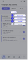

# Évidences Figma — T03 Catalogue des activités

Les captures de référence de cette tranche sont stockées physiquement dans ce répertoire afin de rester visibles après export/import de la documentation. Les liens Markdown utilisent exclusivement des chemins relatifs vers ces fichiers ; aucune URL temporaire Figma n’est requise pour afficher les images.

| Évidence | Node Figma | Fichier documentaire |
|---|---:|---|
| Catalogue des activités — liste | `3786:5093` | `CE-ACT-EXE-01a-catalogue-activites-liste-t03.jpg` |
| Catalogue — Créer — arbre d’actions | `3787:5148` | `CE-ACT-EXE-01b-catalogue-creer-arbre-actions-t03.jpg` |
| Catalogue — action contextuelle directe | `3787:5209` | `CE-ACT-EXE-01c-catalogue-action-contextuelle-t03.jpg` |

## Catalogue des activités — liste

## Catalogue — Créer — arbre d’actions

## Catalogue — action contextuelle directe

État Figma contrôlé le 15 septembre 2026 : le contrôle `Déployer` des cartes Activité réutilise le composant DSF canonique `2537:1033 — State=Collapsed`, identique au Catalogue des séances ; il est visible mais fonctionnellement désactivé en T03. Les captures ci-dessus ont été exportées après cette correction. Figma reste la source du rendu visuel courant ; ces fichiers sont les copies documentaires pérennes destinées à l’export/import.
